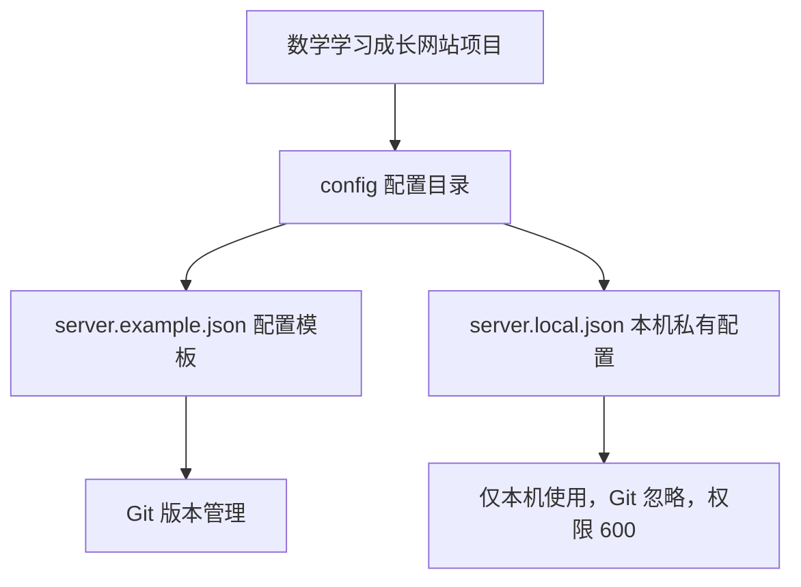

# 数学学习成长网站

本项目旨在搭建一个全面的数学学习成长网站，以内容正确性、内容覆盖与数量和丰富的学习路径为核心，逐步覆盖零基础学习到学术研究与知识分享。

P1 内容基础层已于 2026-10-01 通过 [PR #5](https://github.com/yyl1212/math_master/pull/5) 合并到 master，已完成独立审查及回归；提供 Go 服务、正式目录、严格校验、PostgreSQL 版本存储及草稿导入导出。P2 英文只读前端已实现五页面与安全数学阅读，本机回归通过，独立代码审查与远程 CI 待验证；账户、审核发布、学习记录和部署继续按后续阶段开发。技术方案采用 Go 业务后端、Next.js / TypeScript 前端和 PostgreSQL；首版先建立 16 个学习板块的方向地图，做扎实初等数学学习路线。

## 设计文档

[总体方向与首版设计](docs/superpowers/specs/2026-09-30-math-learning-platform-design.md)包含知识点、解锁与回顾、内容和题库审核、反馈纠错、架构、文件范围与验收标准。

[开发路线图](docs/superpowers/plans/2026-09-30-development-roadmap.md)按可信内容底座、英文页面、账户审核、学习检测、反馈纠错、首批数据验收、部署试运行推进。[P1 执行计划](docs/superpowers/plans/2026-09-30-content-foundation.md)给出首阶段的文件、接口、验证和提交步骤，记录首阶段实现与验收。[P2 英文只读网站执行计划](docs/superpowers/plans/2026-10-01-english-readonly-frontend.md)包含五页面、素材接口、文件安排、架构及六项实施任务，已按用户确认的计划实现六项任务，正在进行整分支验收。2026-10-01 较早批次已读取用户提供的本地 `Knowledge_JSON` 目录，包含 31 个资料包、8,722 条数学候选记录及 104 条软件能力记录；[检查报告](docs/content/2026-10-01-knowledge-json-inspection.md)记录文件校验、结构差异与重复内容。[资料来源清单](docs/content/source-inventory.md)保留本地路径、Library 入口与 ZIP 整理流程，后续本次快照已增至 35 个资料包、905 个文件；正式数学内容仍需分批编写、去重并独立复核。

[英文页面设计与预览说明](design/README.md)包含 16 板块数据、页面层级、样例路线及预览启动方式。后续直接在项目中设计与开发，已取消 Figma 同步。

```bash
python3 -m http.server 8897 --bind 127.0.0.1 --directory design
```

打开 <http://127.0.0.1:8897/preview/#map>。只提供 `design` 目录，页面中的讲解和学习记录均为演示数据。


## P1 开发入口

详见 [内容基础层操作说明](docs/operations/content-foundation.md) 和 [OpenAPI](api/openapi.yaml)。目录为 16 板块、56 主题；10 个初等数学知识点均为草稿，其中 9 个仍是正文骨架。零结构错误不代表独立数学审核通过，P1 尚无公开数学内容。

从项目根操作，先按 `.env.example` 创建本机 `.env` 并填写开发数据库凭据：

```sh
set -a
source .env
set +a
docker compose -p math-master-p1 -f compose.dev.yaml up -d --wait db
node tools/verify/run.mjs --cwd backend -- env CGO_ENABLED=0 GOTOOLCHAIN=go1.27.1 go build -o bin/ ./cmd/...
./backend/bin/migrate --dir db/migrations up
./backend/bin/content-check --catalogue content/catalogue/domains.json --package content/packages/elementary-fractions.v1.json --assets content/assets
./backend/bin/content-import --catalogue content/catalogue/domains.json --package content/packages/elementary-fractions.v1.json --assets content/assets
./backend/bin/server
```

浏览 `http://127.0.0.1:8080/api/v1/domains`。草稿知识与路线返回 404，建设状态由有效发布快照派生；数据接口不读取 `design/data`。P2 已接入英文页面，P3 才提供独立审核和发布。

```sh
node --test tools/verify/run.test.mjs tools/content-ingest/snapshot.test.mjs
node tools/verify/run.mjs --cwd backend -- env CGO_ENABLED=0 GOTOOLCHAIN=go1.27.1 go vet ./...
node tools/verify/run.mjs --cwd backend -- env CGO_ENABLED=0 GOTOOLCHAIN=go1.27.1 go test ./internal/content ./internal/config ./internal/httpapi -timeout 5m -count=1
node tools/verify/run.mjs --cwd backend -- env CGO_ENABLED=0 GOTOOLCHAIN=go1.27.1 go test ./internal/store ./internal/cli -timeout 5m -count=1
```

测试必须设置专用 `TEST_DATABASE_URL`；每次创建并清理自己的随机 `math_master_test_*` 库。每条验证命令最多 540 秒，超时终止宽限 5 秒。

## P2 英文网站入口

详见 [英文只读网站操作说明](docs/operations/english-readonly-frontend.md)。生产构建接入 Go API，提供首页、知识地图、板块详情、路线与知识阅读；支持英文/中文目录搜索、真实建设状态、精确版本前置图、受限 Markdown/KaTeX 和有效发布素材。实际公开数学内容仍为 0，测试发布只发生在随机隔离数据库。

```sh
node tools/verify/run.mjs --cwd frontend -- npm ci
node tools/verify/run.mjs --cwd frontend -- npm run build
cd frontend
npm run start -- --hostname 127.0.0.1 --port 3000
```

启动前按操作说明设置仅供服务端使用的 `GO_API_INTERNAL_URL` 并启动 Go 服务。匿名阅读不创建学习记录，个人解锁与进度属于 P4。

## 目录结构

```text
math_master/
├── .gitignore                 # 排除私有配置和本机文件
├── README.md                  # 项目说明
├── config/
│   ├── server.example.json    # 可提交的服务器配置模板
│   └── server.local.json      # 本机私有服务器配置，不提交 Git
├── backend/                   # Go 服务、命令与业务校验
├── frontend/                  # Next.js / TypeScript 英文只读网站
├── tests/e2e/                 # 真实 Go / PostgreSQL 浏览器回归
├── schemas/                   # 唯一正式 JSON 契约及嵌入模块
├── content/                   # 正式目录、未审核草稿及原创素材
├── db/migrations/             # 显式数据库迁移
├── api/openapi.yaml           # 公开只读接口契约
├── tools/                     # 资料快照与验证时限
├── compose.dev.yaml           # 本机 PostgreSQL 17.11
├── design/                    # 英文设计预览、16 板块数据与历史设计脚本
└── docs/
    ├── content/               # 资料入口、来源清单与知识点映射
    └── superpowers/
        ├── specs/             # 中文设计文档
        └── plans/             # 分阶段路线图与执行计划
```

## 配置结构



`config/server.local.json` 已保存本次提供的服务器地址、用户名与密码。SSH 端口暂按默认值 `22` 配置，后续可按实际服务器设置调整。本次未连接服务器或验证 SSH 服务。

| 字段 | 含义 |
| --- | --- |
| `host` | 服务器地址 |
| `port` | SSH 端口 |
| `username` | 登录用户名 |
| `password` | 登录密码，仅存于本机私有配置 |

在其他开发环境中，可从模板创建自己的私有配置：

```bash
install -m 600 config/server.example.json config/server.local.json
```

随后填写实际配置。私有配置包含明文密码，权限 `600` 仅允许文件所有者读写；请勿强制添加到 Git。模板中不保存密码。

## Git 工作流程

远程仓库为 `git@github.com:yyl1212/math_master.git`，本地远程名称为 `origin`。仓库初始分支为 `master`，本次配置工作在 `chore/project-init` 分支进行。首次同步时远程仓库为空，因此先建立 `master` 基线，再推送开发分支并创建面向 `master` 的 PR（即 MR）。

后续开发可按以下步骤更新基线并创建分支：

```bash
git switch master
git pull --ff-only origin master
git switch -c codex/your-feature
```

远程访问优先使用本机已配置的 SSH 密钥，GitHub CLI 用于创建 PR。令牌不写入项目文件或远程地址。

后续开发遵循项目约定：先更新远程 `master`，再新建开发分支；按审查过的方案与计划实施，完成代码审查、回归验证后，通过 Git 托管平台创建 MR。每次测试不超过 10 分钟，项目文档使用中文。
