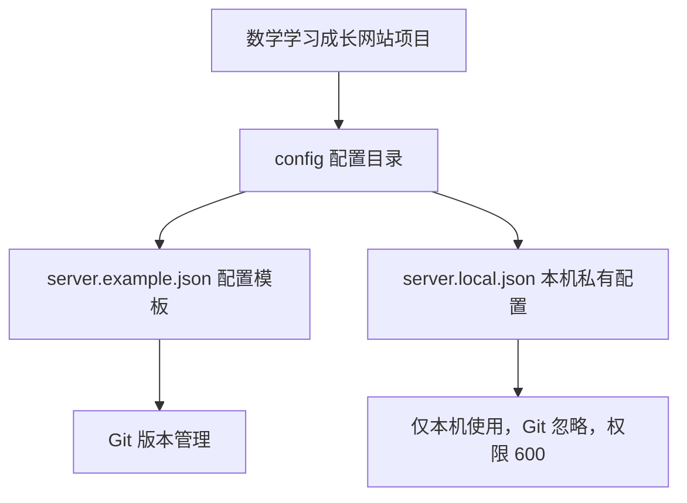

# 数学学习成长网站

本项目旨在搭建一个全面的数学学习成长网站，以内容正确性、内容覆盖与数量和丰富的学习路径为核心，逐步覆盖零基础学习到学术研究与知识分享。

当前完成 Git 仓库与服务器配置初始化，已形成首版设计文档，网站代码尚未实现。技术方案采用 Go 业务后端、Next.js / TypeScript 前端和 PostgreSQL；首版先建立全层次方向地图，做扎实初等数学学习路线。

## 设计文档

[总体方向与首版设计](docs/superpowers/specs/2026-09-30-math-learning-platform-design.md)包含知识点、解锁与回顾、内容和题库审核、反馈纠错、架构、文件范围与验收标准。书面设计审阅通过后，再制定实现计划并开发。

## 目录结构

```text
math_master/
├── .gitignore                 # 排除私有配置和本机文件
├── README.md                  # 项目说明
├── config/
│   ├── server.example.json    # 可提交的服务器配置模板
│   └── server.local.json      # 本机私有服务器配置，不提交 Git
└── docs/superpowers/specs/     # 中文设计文档
```

## 配置结构



`config/server.local.json` 已保存本次提供的服务器地址、用户名与密码。SSH 端口暂按默认值 `22` 配置，后续可按实际服务器设置调整。本次未连接服务器或验证 SSH 服务。

| 字段 | 含义 |
| --- | --- |
| `host` | 服务器地址 |
| `port` | SSH 端口 |
| `username` | 登录用户名 |
| `password` | 登录密码，仅存于本机私有配置 |

在其他开发环境中，可从模板创建自己的私有配置：

```bash
install -m 600 config/server.example.json config/server.local.json
```

随后填写实际配置。私有配置包含明文密码，权限 `600` 仅允许文件所有者读写；请勿强制添加到 Git。模板中不保存密码。

## Git 工作流程

远程仓库为 `git@github.com:yyl1212/math_master.git`，本地远程名称为 `origin`。仓库初始分支为 `master`，本次配置工作在 `chore/project-init` 分支进行。首次同步时远程仓库为空，因此先建立 `master` 基线，再推送开发分支并创建面向 `master` 的 PR（即 MR）。

后续开发可按以下步骤更新基线并创建分支：

```bash
git switch master
git pull --ff-only origin master
git switch -c feat/your-feature
```

远程访问优先使用本机已配置的 SSH 密钥，GitHub CLI 用于创建 PR。令牌不写入项目文件或远程地址。

后续开发遵循项目约定：先更新远程 `master`，再新建开发分支；按审查过的方案与计划实施，完成代码审查、回归验证后，通过 Git 托管平台创建 MR。每次测试不超过 10 分钟，项目文档使用中文。
