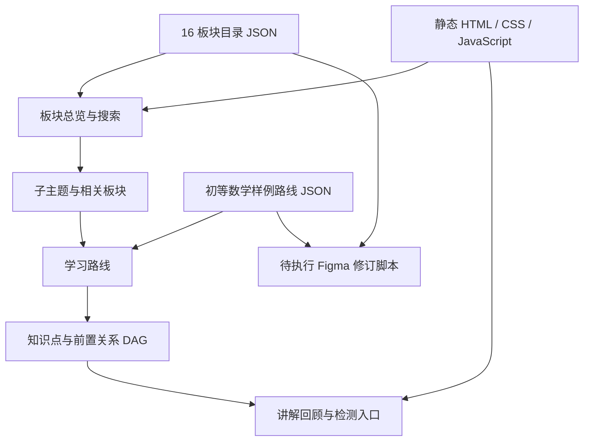

# 英文页面与 16 板块知识地图

本目录用于审阅前端页面设计。页面以英文为主，板块和子主题保留中文对照；采用暖白背景、深绿色文本、清楚的状态标识。字体使用本机可用字体，图形由 SVG 与 CSS 原创绘制，没有外部图片或字体请求。

## 本次范围

- 六个响应式页面：Learning Hub、Knowledge Map、Knowledge Detail、Practice、My Progress、Feedback。
- 完整展示用户指定的 16 个板块及各自子主题，支持英文、中文与子主题搜索。
- 从板块进入主题目录，再进入初等数学样例路线，点击知识点查看前置要求并回顾。
- 手机端用板块选择框替代侧栏，长名称换行；路线按层级排列，关系线由节点真实位置绘制。
- 独立展示内容建设状态、个人解锁状态、学习状态。15 个板块为规划目录，初等数学包含预览路线；这些状态不表示内容已经发布。

当前路线只有 10 个样例节点，其中 Equivalent fractions 提供完整样例讲解。学习中心中的 `12 / 30` 等记录演示更大范围的初等路线，不由这 10 个节点计算。练习不判分、不保存；反馈不发送、不保存。生产账户、题库、审核、Go API 和 PostgreSQL 尚未实现。

## 数据与页面关系



板块关系用于内容发现；知识点前置关系用于学习路线。两类关系不互相推导。16 是学习分组数量，不是官方数学领域数量。一个知识点可被多个板块和路线引用，不复制成不同知识点。

## 文件范围

| 文件 | 作用 |
| --- | --- |
| `data/knowledge-domains.json` | 16 板块的稳定标识、顺序、英中名称、子主题与相关板块 |
| `data/elementary-route.json` | 初等数学 10 节点样例及前置关系、个人双状态 |
| `preview/index.html` | 英文页面框架与主导航 |
| `preview/styles.css` | 桌面与手机布局、状态样式与原创图形 |
| `preview/preview.js` | 目录搜索、路线选择、回顾与演示交互 |
| `figma/build-revision.mjs` | 把相同 JSON 嵌入 Figma 待执行脚本 |
| `figma/english-revision.template.js` | 英文修订版的原生可编辑页面构建代码 |

## 本地预览

在项目根目录运行：

```bash
python3 -m http.server 8897 --bind 127.0.0.1 --directory design
```

访问 <http://127.0.0.1:8897/preview/#map>。其他页面入口为 `#hub`、`#lesson`、`#practice`、`#progress`、`#feedback`。直接双击 HTML 无法加载 JSON；需要通过 HTTP 预览。

## Figma 同步状态

现有文件：[数学成长 · 首版前端页面](https://www.figma.com/design/UDwHVfKZYNDTdvDx8V3dLH)。原有 8 个页面仍是上一版中文设计。

Figma Starter 的 MCP 调用额度已用尽，本次英文与 16 板块改动尚未写入 Figma。以下脚本仅完成本地语法审查；没有在 Figma 运行，也没有完成画布截图验证，不能作为已同步结果。

```bash
node design/figma/build-revision.mjs /tmp/math-master-english-revision.js
```

额度恢复后，通过 `use_figma` 执行生成代码，目标文件为上述文件、页面 `0:1`。脚本先检查目标文件、字体与变量，在原版右侧添加独立英文修订版，保留原稿以便对照；重复执行时报告已存在修订版，不重复创建。同步后仍须检查返回节点、桌面和手机截图、长名称及原型跳转；通过检查后才能以新稿作为实现依据。

## 可行性与兼容性审查

预览不增加依赖或远程服务，使用浏览器原生模块、Fetch、ResizeObserver 和 CSS Grid，供现代浏览器审阅。生产技术方案保持 Go / Next.js / PostgreSQL。

此次只调整设计目录和界面语言，不迁移生产数据或改变生产 API。板块采用稳定标识，相关关系与路线前置关系分别保存；生产落地时应明确板块多对多归属和翻译字段，不能用展示名称作为数据主键。分类不会更改已有学习证据或解锁记录。

数据审查检查 16 个唯一板块、顺序连续、中英子主题对齐、关系引用存在，以及样例路线无环。页面回归检查目录搜索、板块和路线切换、课内锚点与后退、键盘焦点、演示提交提示，以及桌面和手机布局。实际验证结果记录在 PR 中。
