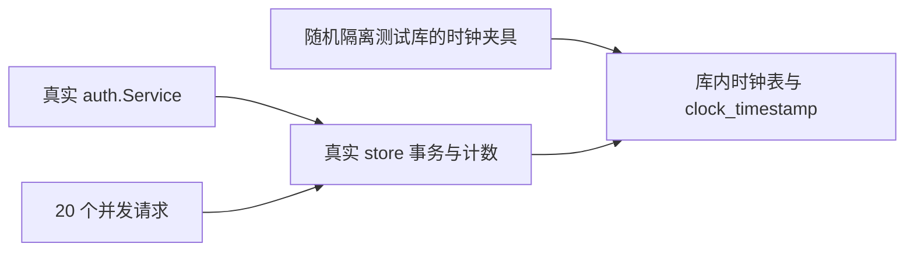

# 账户限流 CI 不稳定修复记录

日期：2026-10-01。依据：已确认 P3a 的 UTC 固定窗口设计及 P3b 执行计划的限流测试修正要求。修复分支从最新 master 9181a3f 建立；本次仅修改测试和本文。

## 失败与原因

PR #12 的 Go PostgreSQL 集成检查先后在 loginUsernameAndPreauth、sharedPasswordReauth 的第 11 次尝试断言失败：[首次失败](https://github.com/yyl1212/math_master/actions/runs/36844957611)、[后续失败](https://github.com/yyl1212/math_master/actions/runs/36845873989)。同提交的推送检查及前端检查通过。

生产规则是按 UTC 对齐的固定窗口，不是滚动的最近 60 秒。原测试使用真实时间，却默认一组尝试不会跨窗口。在临时源码副本和随机隔离库中，主动跨越分钟边界复现了相同错误断言：11 次尝试分布在两个窗口，单窗最多 10 次，最后返回 ErrInvalidCredentials。原 CI 日志汇总整包输出，缺少逐次窗口计数，不能逐次还原该次失败；复现明确证明了原测试假设不稳定。

## 修复范围与架构

- 修改 backend/internal/store/auth_rate_limit_test.go：固定仓储额度测试及全部 ServicePolicies 顺序测试的数据库时钟；新增重连后时钟保持及固定分钟边界测试。
- 新增本文：记录原因、兼容性、验证证据及计划顺序调整。

fixedRateFixture 先确认数据库名称严格符合随机测试库格式，再创建库内时钟表与 public.clock_timestamp()。search_path 只在该随机数据库设置，回收旧物理连接后，新连接都读取相同测试时钟。数据库仍允许多连接，保留并发恰好放行 10 次的真实 PostgreSQL 竞争验证；测试结束由既有 testutil 删除整个随机库。

新边界用例从 UTC 分钟结束前一毫秒开始：前 10 次未知用户登录返回无效凭据，第 11 次被阻断且 Retry-After=1；只推进一毫秒进入下一分钟后重新允许凭据验证，并检查两个窗口独立保留 11 和 1 的计数。时钟夹具另验证物理连接重建后仍保持指定时刻。

兼容性：生产 Go 源码、迁移、额度、固定窗口语义、会话期限及公开接口均无改动。没有放宽限流、跳过断言或增加自动重试；真实开发库不安装测试时钟。

## 验证证据

所有 Go 命令均经 tools/verify/run.mjs，使用 CGO_ENABLED=0、GOTOOLCHAIN=go1.27.1、-timeout 5m；每次验证低于十分钟。

| 验证 | 结果 |
| --- | --- |
| RED：时钟夹具与边界测试 | 按预期失败：时钟未固定、剩余窗口时间不符合固定时刻 |
| GREEN：全部限流测试，-count=5 | 通过，16.072 秒 |
| 完整 store/cli 回归 | 通过，11.352 / 2.260 秒 |
| auth/content/config/httpapi/e2etest/testutil | 全部通过，最长包 4.175 秒 |
| Go vet 与 cmd 构建 | 通过 |
| 验证入口与资料快照工具测试 | 9/9 通过 |

独立审查及远程检查结果以修复 PR 为准；本地验证不替代远程 CI。

## 执行顺序调整

用户确认 P3b 计划后，先单独修复已失败的基线 CI，再推进内容功能。计划原拟用单连接固定时钟；本次改用随机测试库默认 search_path，使仓储测试也能固定时钟而保留真实并发。这是测试实现调整，不改变产品兼容性；若数据库配置失效，时钟重连测试会直接失败。
