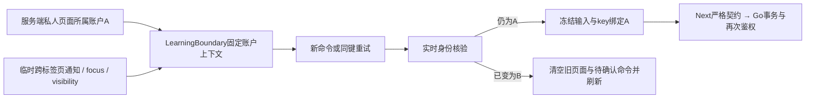

# P4b 整分支独立审查与修复记录

审查范围：`1b002b8608aa87f0dfb73a442a75d14f24302400..227f49288700cc2863ae476acb3f1160bd69aef6`。一次独立全分支审查，fresh上下文，gpt-6-astra/xhigh；修复由原实现者完成，不追加审查轮次。13项实施已通过本机完整矩阵。

## 重要问题

1. P1：Go把single_choice题面输出为choice，既定OpenAPI/Node严格契约要求single_choice，实际创建成功却导致题面/结果503。调整projection.go及覆盖断言，补充真实Go→Next→浏览器单选练习、混合五题和结果验证；answer.kind仍为choice。
2. P1：旧A账户页面的新命令使用最新B账户作为所属者，跨标签页无本地通知时可能写到B。新增learning-account.tsx提供页面固定actor，pending-command.ts每次新命令及重试核对新身份；learning-status.tsx核验跨标签页通知、focus/visibility，错配立即清空旧记录/草稿并刷新；auth/client.ts增加不携带私密数据的临时BroadcastChannel通知。补充真实跨标签页和无通知防线测试。
3. P2：knowledge-controls.tsx把普通检测错误绑定阅读完成，排除了设计允许的先检测后阅读。只以canEnter和已有蓝图ready控制普通检测；通过前阅读未完成时不得授予资格，后续明确完成阅读才解锁直接后继。

以上变更校准现有已确认行为，不变更公开DTO、题目摘要、旧迁移或生产配置。最终修复验证已通过，证据见下表和[结构化验证记录](evidence/p4b/review-regression.json)。

## 暂缓小项

P3：等待期间缺少保留冻结命令的取消等待按钮。十秒截止及主动同键重试已经存在；该交互留待后续定义，不计作已修复。

## 审查排除项的判断

| 排除项 | 当前范围与理由 | 判断错误的代价 |
| --- | --- | --- |
| 生产吞吐、部署与灾备 | 本机容量为隔离证据；P7执行生产验收 | 错误容量预期与恢复能力不足 |
| 正式数学质量和课程批准 | 夹具为技术测试，P6人工审查正式课程 | 测试内容误作可信课程 |
| 自动重判、通知、意见服务 | 原答案/分数保持，当前限制生效；P5另做 | 用户误认为历史成绩已重判或已通知 |
| 可信CLI曝光记账 | 设计排除可信CLI；学习HTTP及管理HTTP完整记账 | 线下可信工具接触题目未计入冷却，运营须控制权限 |
| 旧跨包1000节点编写 | R15已审核的生产上限为单包100；20条100节点路线 | 错误承诺1000节点正式路线 |

## 最终修复验证

| 重要问题 | 实际RED→GREEN与整体回归 |
| --- | --- |
| 单选题契约 | TestLearningProjectionWhitelistAndOwnedSlices、TestLearningChoiceFixtureUsesActualPublishedQuestions先失败后通过；两视口真实单选练习、混合五题及重新载入结果通过 |
| 旧页面账户归属 | 新命令、同键retry、focus草稿清除三项单元先失败后通过；真实跨tab旧草稿未清RED→两视口清除且零自动写入GREEN；同账户focus保留原输入 |
| 未阅读普通检测 | node模式与按钮可用性先RED后GREEN；实际普通通过未授予资格，后续明确开始/完成才授予资格和解锁直接后继，两视口均通过 |

全前端45文件135项通过；原94及审查新增6项，共50场景×两视口100项真实浏览器通过，14批、零跳过/重试/假成功响应。Go全部纯逻辑、原账户/题库/HTTP和共享harness通过（HTTP35.005秒、harness95.207秒，含当前完整最大容量场景）；新store80.770秒、原store140.258秒、CLI1.408秒通过。gofmt、vet、构建、旧契约13项、API两次生成一致、类型检查和生产依赖审计0漏洞均通过。

容量SQL、限制和迁移本次修复均未修改，此前真实两类209.473秒及提交后独立容量复验保留；最新共享harness再次验证全部最大计数。本次只修复三项Important，Minor未扩大到修复范围，不重复独立审查。实现PR和最新SHA CI为后续交付门槛；生产部署及迁移另属P7。
