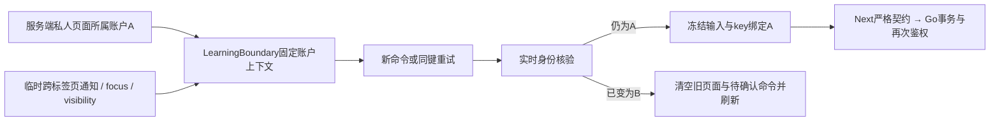
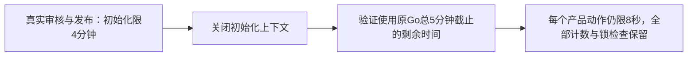

# P4b 整分支独立审查与修复记录

审查范围：`1b002b8608aa87f0dfb73a442a75d14f24302400..227f49288700cc2863ae476acb3f1160bd69aef6`。一次独立全分支审查，fresh上下文，gpt-6-astra/xhigh；修复由原实现者完成，不追加审查轮次。13项实施已通过本机完整矩阵。

## 重要问题

1. P1：Go把single_choice题面输出为choice，既定OpenAPI/Node严格契约要求single_choice，实际创建成功却导致题面/结果503。调整projection.go及覆盖断言，补充真实Go→Next→浏览器单选练习、混合五题和结果验证；answer.kind仍为choice。
2. P1：旧A账户页面的新命令使用最新B账户作为所属者，跨标签页无本地通知时可能写到B。新增learning-account.tsx提供页面固定actor，pending-command.ts每次新命令及重试核对新身份；learning-status.tsx核验跨标签页通知、focus/visibility，错配立即清空旧记录/草稿并刷新；auth/client.ts增加不携带私密数据的临时BroadcastChannel通知。补充真实跨标签页和无通知防线测试。
3. P2：knowledge-controls.tsx把普通检测错误绑定阅读完成，排除了设计允许的先检测后阅读。只以canEnter和已有蓝图ready控制普通检测；通过前阅读未完成时不得授予资格，后续明确完成阅读才解锁直接后继。

以上变更校准现有已确认行为，不变更公开DTO、题目摘要、旧迁移或生产配置。最终修复验证已通过，证据见下表和[结构化验证记录](evidence/p4b/review-regression.json)。

## 暂缓小项

P3：等待期间缺少保留冻结命令的取消等待按钮。十秒截止及主动同键重试已经存在；该交互留待后续定义，不计作已修复。

## 审查排除项的判断

| 排除项 | 当前范围与理由 | 判断错误的代价 |
| --- | --- | --- |
| 生产吞吐、部署与灾备 | 本机容量为隔离证据；P7执行生产验收 | 错误容量预期与恢复能力不足 |
| 正式数学质量和课程批准 | 夹具为技术测试，P6人工审查正式课程 | 测试内容误作可信课程 |
| 自动重判、通知、意见服务 | 原答案/分数保持，当前限制生效；P5另做 | 用户误认为历史成绩已重判或已通知 |
| 可信CLI曝光记账 | 设计排除可信CLI；学习HTTP及管理HTTP完整记账 | 线下可信工具接触题目未计入冷却，运营须控制权限 |
| 旧跨包1000节点编写 | R15已审核的生产上限为单包100；20条100节点路线 | 错误承诺1000节点正式路线 |

## 最终修复验证

| 重要问题 | 实际RED→GREEN与整体回归 |
| --- | --- |
| 单选题契约 | TestLearningProjectionWhitelistAndOwnedSlices、TestLearningChoiceFixtureUsesActualPublishedQuestions先失败后通过；两视口真实单选练习、混合五题及重新载入结果通过 |
| 旧页面账户归属 | 新命令、同键retry、focus草稿清除三项单元先失败后通过；真实跨tab旧草稿未清RED→两视口清除且零自动写入GREEN；同账户focus保留原输入 |
| 未阅读普通检测 | node模式与按钮可用性先RED后GREEN；实际普通通过未授予资格，后续明确开始/完成才授予资格和解锁直接后继，两视口均通过 |

全前端45文件135项通过；原94及审查新增6项，共50场景×两视口100项真实浏览器通过，14批、零跳过/重试/假成功响应。Go全部纯逻辑、原账户/题库/HTTP和共享harness通过（HTTP35.005秒、harness95.207秒，含当前完整最大容量场景）；新store80.770秒、原store140.258秒、CLI1.408秒通过。gofmt、vet、构建、旧契约13项、API两次生成一致、类型检查和生产依赖审计0漏洞均通过。

容量SQL、限制和迁移在三项独立审查重要修复中均未修改，此前真实两类209.473秒及提交后独立容量复验保留；最新共享harness再次验证全部最大计数。本次只修复三项Important，Minor未扩大到修复范围，不重复独立审查。实现PR和最新SHA CI为后续交付门槛；生产部署及迁移另属P7。

## CI时间精度修正

初次实现提交53fb3bf的前端push/PR两项均通过，Go两项在学习数据库回归失败；push失败日志指向TestLearningSchemaEventsAndRoutesImmutable的learning_events_check1（SQLSTATE23514）。夹具time.Now有纳秒尾数，pgx v5.11.0二进制写入按微秒截断，而JSON时间转timestamptz会舍入，二者可能相差一微秒。以固定789纳秒尾数在本机确定性复现相同RED。

只修正learning_schema_test.go夹具，取数据库clock_timestamp作为封存与字段的同一依据，另加一微秒错配必须被精确CHECK拒绝的断言。产品managedIdentity/learningAction原本就使用数据库时钟，产品代码、约束、迁移和数学摘要均保持。该测试连续10次8.949秒GREEN，全部非容量学习store73.216秒GREEN；没有跳过测试或靠重跑消除失败。最新交付以[PR #19](https://github.com/yyl1212/math_master/pull/19)当前完整head的四项Go/前端push/PR检查均通过为准。

## CI容量上下文修正

112df875的前端push/PR及Go push三项通过；Go PR run 37014940539在最大合法固定路线容量的末尾锁验证失败，总用时240.909秒。真实内容初始化约124秒，后续100条真实路线加入、101条历史及锁验证继续共享同一初始化四分钟上下文。111个已测产品动作均低于八秒，普通通过并解锁999后继7.740590563秒，失败发生于共享初始化上下文过期后的账户核验。

本次只修改backend/internal/store/learning_capacity_test.go：容量初始化结束后关闭其四分钟上下文，再为后续验证绑定Go原有五分钟总截止。该截止从整组Go测试开始计时，验证仅使用剩余时间。没有新增五分钟、放宽八秒产品预算、减少真实计数或跳过末尾锁组合。新增TestLearningFixturePhaseDeadlines断言初始化上下文已关闭、验证仍有效且Deadline严格等于Go总截止，连续10次0.892秒通过；两类实际容量分别116.271秒（路线）及85.635秒（题源）通过，非容量学习store全组76.377秒通过。两类末尾真实共享双槽及管理排他锁组合均通过；111个路线和10个题源单动作全部满足原八秒门槛，全部七类最大发布计数保持。兼容13项、vet及构建通过；产品代码、迁移、约束及CI工作流保持。

## CI真实后继解锁性能修正

43973da的两项前端及Go PR通过，前端PR日志实际确认135项单元及14批100项浏览器回归。Go PR路线254.61秒完整通过，说明初始化与验证上下文修正已生效；Go push run 37020233272在999个直接后继提交8.00295366秒触及原八秒截止，同SHA Go PR该动作7.708545929秒。此项为真实产品动作性能失败，保留RED记录。

临时分段测量已移除：本机总2.844312708秒，业务748.165166毫秒、提交约束2.091034166秒；另有逐节点前置关系225.825162毫秒、当前身份238.295333毫秒、INSERT234.296318毫秒。新00006的批准来源查询在PostgreSQL内先筛选候选，再保留原准确版本/SHA/批准决定/提交/冻结摘要全部条件；数组或对象ID仍交给原条件拒绝，版本继续按原文本比较。PostgreSQL依赖仍为已固定17.11，方法依据见[官方JSONPath说明](https://www.postgresql.org/docs/17/functions-json.html)。

learning_paths.go将全部直接后继前置关系一次读取，在同一持内容共享锁和用户行锁的事务中逐项判定该账户当前资格；复用首次读取的准确当前身份和发布头，批量写入后只返回实际新行。每行原延期来源证明、外键、不可变与撤回规则保持，没有新增表、跨事务缓存或自动资格。已有路线加入及公开DTO保持。

冻结优化前SQL后，四类真实批准来源及16组正常/伪造/异常JSON/重复条目逐项一致；两个实际最大场景各比较全部1000个知识点，全部一致且批准有效。多前置必须全部满足、重复不虚报新行、其他账户不能借用资格回归通过；这些正确性用例先在原实现通过，不虚称为性能RED。

最终本机路线118.906秒、题源90.482秒、完整非容量学习store75.578秒通过，全部最大发布计数、末尾双槽与管理排他锁及原八秒门槛保持。路线999提交2.062912208秒、32213次分配、4367280分配字节（macOS）。全部Go纯逻辑/HTTP/完整联调环境通过（HTTP36.832秒、联调99.803秒）；当前重建后端的26项学习浏览器回归2.7分钟通过，零跳过/重试。兼容13项、格式、vet及构建通过。SSH推送后仍以最新完整SHA四项CI均通过为交付条件。

