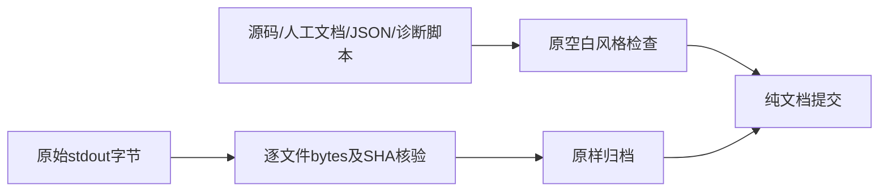

# P5b 本机验收记录

2026-10-04，用户已确认16项/80步 Native 执行。产品基线为文档 [PR #22](https://github.com/yyl1212/math_master/pull/22) 合并后的 master `dad438d13b37d1053e3bf42e7c32e3829e4518a6`，隔离分支 `codex/p5b-correction-workflow`。首轮完整本机受验产品/CI提交为 `d6f8c743a9385aeacf97644b2f5f6d6f1b729f60`；后续证据文档提交没有产品行为变化。一次独立审查已完成并发现两项Important及一项因草稿丢失升级的Important；同一次修复已定向GREEN，修复后完整矩阵及SSH draft产品PR最新四项CI仍为交付门槛，本文不预记最终成功。

## 已实现行为

真实撤回/判分案件即时限制，准确已发布实例方案独立批准，原答案累计重判，六种处置、当前资格统一投影、持久租约/断点/有限补扫和站内通知已落地。英文私有页面提供本人纠错回顾、独立处理和通知，既有结果/知识/历史可进入纠错记录。关闭worker仍限制；永久启用标记和健康核验使损坏数据库拒绝个人学习。Original result、原回执字节和历史解锁保留，不能用新结果覆盖旧分数。

## 首轮完整本机矩阵（审查前）

| 检查 | 实际结果 |
| --- | --- |
| 44条独立包装器命令 | 全部退出码0；精确SHA、参数、时间、日志SHA见结构化记录 |
| 前端单元 | 70文件345项通过，保留原283项 |
| Node/入口/兼容/资料快照/CI保护 | 44项通过，保留原24项；旧88路径/220schema/32响应/3安全方案保护 |
| 桌面与手机浏览器 | 20批144项通过，保留原17批130项，追加三批14项，无跳过或重试 |
| 核心/HTTP/server退出/harness/testutil | 102.65s通过；原11包、两个新包与cmd/server均运行 |
| 原store与CLI | 141.39s通过，原Question等测试未额外skip |
| 学习/检测非容量 | 82.73s通过 |
| 反馈非容量 | 28.45s通过 |
| 纠错/通知/新CLI非容量 | 112.21s通过 |
| 原反馈容量 | 11.21s通过，原数量/锁/断言保留 |
| 原最大题源、原最大路线 | 92.15s、121.73s通过；原测试文件字节未改 |
| 新1000案件/1000批准方案/10000证据容量 | 254.19s通过；200批次、全部expected sets相等 |
| 新10000通知与10000同源重跑 | 43.04s通过；去重、owner分页、首次已读与额度保持 |
| 锁定安装、API生成、类型、生产构建、harness | 全部通过；generated无漂移，无新增依赖 |
| gofmt、vet、Go构建与diff | 全部通过 |
| 生产依赖审计 | 0漏洞 |

[完整命令和日志摘要](evidence/p5b/verification-macos.json)、[证据摘要清单](evidence/p5b/manifest.json)、[逐任务提交与裁定](evidence/p5b/implementation-ledger.md)均可复核。Go每批5m、浏览器8m/一个worker/零retry、包装器9m、每CI job30m保持不变。CI原verify与三项旧容量保留，新增独立correction_verify job，只运行新非容量/两项容量；前端保留原17组完整顺序再追加3组。

## 容量、旧事实和真实失败

历史容量复用真实独立作者、复核及发布事实，全部FK、不可变/独立审核及延迟守卫开启；并非1000次绕过配额的API创建。10000证据由生产方法连续处理，每批50条且断点单调前进，原seal/答案摘要保持不变；无准确映射的撤回诚实返回retake_required，不凭空授予资格。所有案件、方案、结果和两位owner的通知分页直到全部，expected sets完全相等。

审查前影响容量：保留堆增量335768bytes、单批最高分配23577080bytes，均低于该一题技术夹具的32MiB断言；总分配量为4686570664bytes。这不是峰值RSS或所有真实数学正文大小的承诺，单正文和完整响应仍按各自字节上限处理。10000通知生产append后再同源append10000次，最终仍10000条；首次已读时间、同键回执及跨owner拒绝均真实验证。

RED→GREEN包括缺check/FK/unique/function、触发器错表/错函数/禁用、约束同名变弱、FK未验证、资格唯一索引缺失，以及终结outbox的OR优先级扩大范围。真实容量首跑在补扫8秒事务失败，按固定case kind减少无关查询计划、每结果合并依赖INSERT后通过，全部行守卫与末行故障回滚保留。通知容量首跑本来就PASS，虽历史日志名为red，未制造假失败。证据目录保留这些原日志。

旧反馈missing migration场景真实从UpTo(7)建立从未启用库，再Down到6；不清永久标记，原学习成功、反馈未配置、重新Up不改变旧事实。曾启用后空Down仍拒绝个人学习，非空十表Down整体拒绝。真实原failed成绩与提交回执不变，不能冒用旧failed结果插入旧资格事件。

## 脱敏视觉与边界

18张截图来自自有页面和原创技术夹具，其中新增7场景的桌面/手机共14张，原检测/练习各两视口共4张。input/textarea粉红区为Playwright脱敏遮罩，已目视核对手机独立审批、已读通知、重测和旧结果/练习；长版本/摘要及导航未出现横向溢出，实际浏览器也验证宽度。

- [手机独立批准](evidence/p5b/mobile-correction-independent-review.png)、[桌面独立批准](evidence/p5b/desktop-correction-independent-review.png)
- [手机通知已读](evidence/p5b/mobile-correction-notifications.png)、[桌面通知已读](evidence/p5b/desktop-correction-notifications.png)
- [手机诚实重测](evidence/p5b/mobile-correction-retake.png)、[手机owner隔离](evidence/p5b/mobile-notification-owner-isolation.png)
- [手机原3/5失败结果](evidence/p5b/mobile-original-assessment-result.png)、[手机原练习](evidence/p5b/mobile-original-practice-revealed.png)

未改Knowledge_JSON，未批准或发布正式数学内容，未访问生产服务器、运行生产迁移或部署。技术夹具不计P6内容数量。恢复边界见[操作说明](correction-workflow.md)，审查结论将在[一次整分支审查记录](2026-10-03-p5b-final-review.md)保存；产品合并与生产部署需另行授权。

## 审查修复后的完整矩阵

一次独立reviewer完成审查，三项重要问题在同一次修复轮正式RED→GREEN后，前端/浏览器受验提交为 `ddaef8f422a1dfafe8e6bbd426e6e9aa5ee74848`，Go实际执行于 `751f45badc51feebeb3669416aedba19b4566521`（全部Go输入Git对象完全相同）。44条命令、时间、日志SHA、当前20张脱敏截图和裁定见[最终结构化证据](evidence/p5b/verification-macos.json)。首轮记录保存在[审查前证据](evidence/p5b/verification-macos-before-review.json)，不能混作最新产品验证。

| 检查 | 修复后实际结果 |
| --- | --- |
| 全矩阵 | 44/44条独立包装器命令，加2/2新提交Node/diff复核；全部退出0，每条小于10分钟 |
| 前端单元 | 70文件350项通过 |
| Node保护 | 44项通过，旧完整契约及原七迁移/摘要目的保护保持 |
| 双视口浏览器 | 20批146项；原17批130项完整保留，三新增批16项；无skip/retry |
| 纯/HTTP/server退出/harness | 104.98s通过 |
| 原store/CLI | 140.45s通过 |
| 学习/检测 | 81.95s通过 |
| 反馈 | 28.14s通过 |
| 纠错/通知/新CLI | 120.43s通过 |
| 原反馈容量 | 11.15s通过 |
| 原最大题源容量 | 91.81s通过 |
| 原最大路线容量 | 123.96s通过 |
| 1000案件/1000批准方案/10000证据 | 250.44s通过 |
| 10000通知及10000同源重跑 | 41.99s通过 |
| 安装/API生成/类型/构建/harness/gofmt/vet/Go构建 | 全部通过；generated无漂移 |
| 生产依赖审计 | 0漏洞 |

新配图场景真实撤回原模板，独立批准有效等价方案，桌面/手机实际SVG全部加载；替代模板再次撤回后逐URL立即404，原答案/result摘要保持一致。已归档首轮缺陷、契约计数同步及成功回归。一次修复全部完成，零未解决Critical/Important、无deferred minor。首次SSH draft交付及对应完整head四项workflow/all jobs已实际通过，见下方证据；最终文档提交仍按最新head再验。

验证范围按实际SHA记录：配图CSS引用和宽图浏览器断言是Go矩阵后唯一非文档差异；backend、db、api、content、schemas、tools、workflow、依赖锁及Playwright配置Git对象逐个相等。Go不伪写为新SHA执行；Node因读取spec在新SHA额外完整44项PASS，diff复核PASS；前端9命令/浏览器20批全在新SHA执行。等价证明和逐组SHA已归档，最新远端四项CI仍须新完整head全部执行。

历史步骤、基线、失败及中断日志与[历史执行索引](evidence/p5b/verification-history.jsonl)保留以供审计；它们不构成当前PASS结论。最终结论以verification-macos.json中的准确逐组SHA、命令、退出码和日志SHA为准。全部文本日志已检查无token/带密码数据库URL。

已逐张查看20张桌面/手机截图：纠错配图和长依据身份在视口内，原五题结果和练习页面保留。账户/曝光/同键边界截图部分记录安全加载过渡态，未显示私有草稿或答案；功能结论依据该场景的真实浏览器/API断言，不能以过渡截图单独推断。

## CI 容量修复后的完整矩阵

首次SSH draft的bc8561f完整head，两个Go基础job及两个前端job成功，两个纠错job均在5m容量截止失败；d5a3340的PR纠错job通过但push失败，b38828c两项纠错job仍在5m失败；424a6a2的push完整容量198.23s通过而PR worker10000完成285.84s后在原5m的后续核验超时，六job其余五项通过。所有四项workflow最终状态及对应原始脱敏日志均保留。保留[失败run/job证据](evidence/p5b/verification-github-ci-failure.json)与[实际容量日志](evidence/p5b/ci-github-capacity-red.log)，没有重跑失败CI、隐藏跳过、减少数量或放宽预算。

[查询修复方案](2026-10-03-p5b-ci-query-fix.md)及Ruling22—26完成查询与事务往返可行性审查后，所有44条命令在同一产品提交 `177ed57186a662db87b2b0fd0d56384607de3936` 重新实际执行；历史Go输入等价证明仅保存在before-ci-query-fix，不复用于本次后端变化。下面及verification-macos.json才是本轮最新本机结论，远端仍须最新完整head全四run/六job通过。

| 检查 | 本轮实际结果 |
| --- | --- |
| 全矩阵 | 44/44命令，全部退出0，每条小于10分钟 |
| 前端 / Node / 双视口 | 350 / 44 / 146全部通过，原130浏览器用例保留 |
| 核心/HTTP/server/harness | 103.81s PASS |
| 原store/CLI | 139.55s PASS |
| 学习测评 | 80.36s PASS |
| 反馈 | 27.92s PASS |
| 纠错通知/CLI | 123.46s PASS |
| 原反馈容量 | 10.9s PASS |
| 原最大题源 | 89.54s PASS |
| 原最大路线 | 121.71s PASS |
| 1000案件/1000批准方案/10000证据 | 144.11s PASS |
| 10000通知/10000同源重跑 | 41.63s PASS |
| 安装/API/类型/构建/gofmt/vet/生产依赖审计 | 全部通过，0生产漏洞、generated无漂移 |

仅统一隔离测评夹具数据库时钟，并调整查询计划、准确读取往返及原事务语句批次；每事务schema真实性、全部来源/审批/归属、逐条原子结果/断点/通知及完整容量集合均保留。所有失败、诊断、成功日志、准确SHA及20张本轮脱敏截图已归档；本机结果不代替远端结果。

## SSH draft 交付与远端验收

产品草稿：[23](https://github.com/yyl1212/math_master/pull/23)。首次交付受验完整head为 `177ed57186a662db87b2b0fd0d56384607de3936`；按workflow文件、事件、branch、完整head和最新run attempt核验全部jobs，而非仅看PR整体状态。

| Workflow | 事件 | 全部job |
| --- | --- | --- |
| [Go 内容账户与题库验证](https://github.com/yyl1212/math_master/actions/runs/37161982220) | push | verify PASS, correction_verify PASS |
| [Go 内容账户与题库验证](https://github.com/yyl1212/math_master/actions/runs/37161985906) | pull_request | correction_verify PASS, verify PASS |
| [英文网站账户与题库验证](https://github.com/yyl1212/math_master/actions/runs/37161982250) | push | verify PASS |
| [英文网站账户与题库验证](https://github.com/yyl1212/math_master/actions/runs/37161985896) | pull_request | verify PASS |

四项workflow与六个job全部完成且success，最新记录见[结构化远端证据](evidence/p5b/verification-github-first-delivery.json)。本文件和最终账本归档后再次SSH推送文档提交，必须重新核验最新完整head四项workflow及全部jobs；最终核验结果记在PR说明，避免自指提交循环。未合并产品PR、未部署、未运行生产迁移、未更改持续更新的知识点目录。

## 原始证据与文档格式检查

Ruling27：提交前默认`git diff --cached --check`在逐字节原始诊断/CI stdout的尾随空格及空白EOF处实际退出2，输出已保留。为保留准确证据及SHA，仅在提交文档时采用`git diff --cached --check -- . ':(exclude)docs/operations/evidence/p5b/*.log'`，实际退出0；全部源码、人工文档、JSON和诊断生成器均继续检查。所有排除的原始日志仍逐文件验证bytes与SHA，没有清洗、变更Git设置、修改CI或放宽任何测试截止。

仅补充本验收、终审/计划/路线图汇总、实施账本、验证JSON和manifest；产品与177ed57完整受验提交完全相同。当前全部27项裁定无deferred minor。最终文档head仍按PR说明核验四项workflow/六个job。

## 最终归档提交的真实失败与补扫修复

纯文档提交90fd12d的两项纠错job仍在5m补扫阶段失败，另外四job全部成功，四run最终状态与两份原始脱敏日志保留：[完整失败状态](evidence/p5b/verification-github-ci-document-failure.json)。不把上一177ed57的成功用于最终交付，也未重跑失败CI。

按[补扫查询可行性与架构审核](2026-10-04-p5b-backfill-query-fix.md)仅改一条当前案件参数化候选查询，提交结果后的旧计划读取32005 buffers并反复解析无关封存题源，新计划读取2005 buffers；全1000案件补扫从12.950s降至4.868s，原所有集合与时间预算保持。新的产品受验提交 `d14e159bc4fb57d7c1fcfa2b836feb48cb378fbb` 上44条命令全部新鲜重跑，旧报告保留为verification-macos-at177ed57.json，最新结论为verification-macos.json：

| 检查 | 本轮实际结果 |
| --- | --- |
| 全矩阵 | 44/44命令全部退出0，每条小于10分钟 |
| 前端 / Node / 双视口 | 350 / 44 / 146全部通过，原130浏览器用例保留 |
| 核心/HTTP/server/harness | 104.84s PASS |
| 原store/CLI | 144.3s PASS |
| 学习测评 | 84.75s PASS |
| 反馈 | 28.73s PASS |
| 纠错通知/CLI | 128.57s PASS |
| 原反馈容量 | 11.56s PASS |
| 原最大题源 | 92.6s PASS |
| 原最大路线 | 119.79s PASS |
| 1000案件/1000批准方案/10000证据 | 138.48s PASS |
| 10000通知/10000同源重跑 | 42.15s PASS |

全部28项裁定和其错误代价完整归档；没有未解决Important/Critical或minor(deferred)。文档归档提交后只作一次SSH推送，最终完整head四workflow/六job结果在PR说明核验后补记，不再为写入自身SHA创建文档提交。草稿PR保持未合并、未部署。
