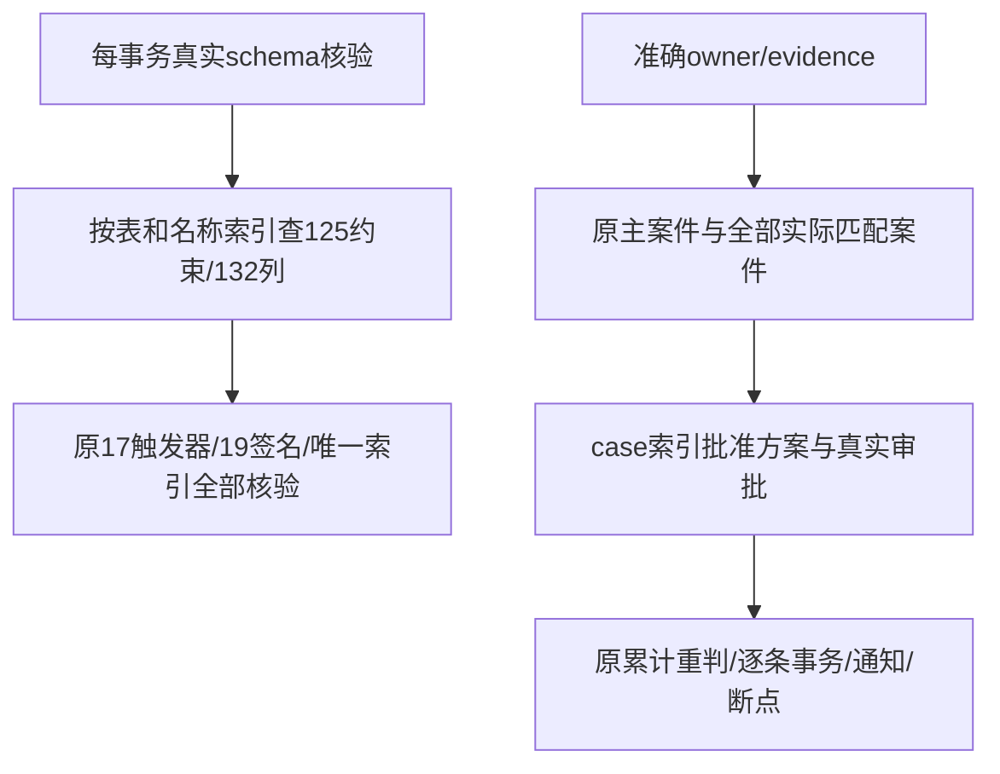
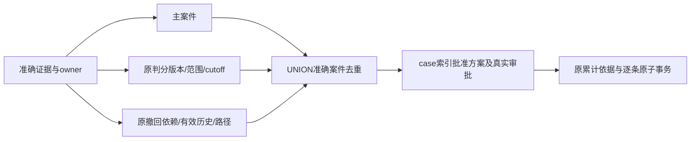
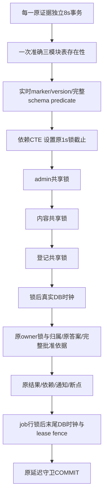

# P5b CI 容量查询修复方案

首次SSH草稿PR #23的完整head bc8561fc73ffe80549fdebca6a8adb0cc32f8c70，push/PR的千案件万证据批次均在原5分钟截止触发失败（约5100条）；没有重跑或放宽门槛。Native同一次交付修复继续执行，尚未完成Task16远端验收。

最大真实夹具诊断保持1000案件/1000独立批准方案/10000原证据。CPU采样大部分为等待数据库；SQL计划显示schema守卫对751约束计算定义而需要125个，对5592列扫描而需要132个；方案筛选先读取1000批准方案及审批事件，再排除999个。本机health十次约42ms，原依据十次约17ms，方案筛选十次约17ms，实际50条约933ms。诊断不是10000条容量PASS的替代。

修改文件：`backend/internal/store/correction_tx.go`只给准确catalog子查询增加不可展开边界，强制按现有表/约束名及表/列名查找后核验，不缓存schema状态；`backend/internal/store/correction_results.go`先物化准确owner/evidence及匹配案件，再按case索引读取批准方案和真实审批。旧predicate、主案件、cutoff、累计来源、排序、101/100上限及全部核验保留。更新本说明、验收与证据；不修改API、原七迁移、第八迁移、数学用途、50批次、8秒事务/30秒批次、5m/8m/9m/30m预算。

可行性审核：`OFFSET 0`只防止PG把准确相关查询展开为全catalog反连接；返回集合和原校验条件相同。物化案件先于方案，保留原OR predicate和主案件，不能遗漏其他撤回或规则案件。无数据或契约兼容性变化，无新增服务/依赖/生产访问。验证真实LinuxRED、最大夹具前后SQL计划、十种schema损坏/累计方案/断点/依赖末尾回滚回归，以及新提交完整Go/前端/双视口/五容量矩阵；最后最新完整head四workflow/all jobs实际成功，不能用本机或早期成功替代。当前无设计阻塞，性能GREEN仍需实测。

后段可行性补充：初步优化在本机完整容量仍于原5m实际RED，不能视为解决。3000条真实原子结果后的SQL采样准确显示方案匹配估算cost214184，生成148个JIT函数，单查询25.589ms（其中JIT25.300ms）；连续50条约2.30s。schema健康和原依据并未出现同样增长。JIT依估算cost触发、短查询编译开销可能大于收益，参见[PostgreSQL17说明](https://www.postgresql.org/docs/17/jit-decision.html)。

在同一最大夹具/相同3000结果与统计条件下，仅临时overlay比较候选查询：把“主案件 OR 判分条件 OR 撤回条件”分配成三个SELECT，再用UNION去重；每个SELECT保持准确evidence/owner，判分cutoff与撤回原始/有效依赖谓词原封保留。按不可变kind先过滤，避免把撤回子计划成本乘到999个无关判分案件。候选cost5931、无JIT、0.231ms、十次8.426ms且仍准确返回同一方案，确认可行后才修改产品的matched_cases。真实worker采样仍使用旧产品查询，因此2.287s不是候选产品GREEN；完整容量与最新远端仍必须实测。

修正只涉及先列出的correction_results.go；未改变PG全局/事务JIT设置、数据库统计设置、测试夹具与任何守卫。等价性是集合分配律，UNION去重对应旧WHERE每案件唯一，主案件仍要求同一准确evidence存在，所有其他真实匹配案件仍参与累计。既有跨案件、cutoff、外人证据、分叉/环与末行回滚回归覆盖语义；无契约或数据兼容性阻塞。Ruling22同一次查询计划修复保留这些必要证据。

测量后产品定向GREEN：既有schema损坏/跨案件累计/原子性/断点/无中间结果批准链回归35.12s PASS；完整1000案件/1000独立批准方案/10000证据、200批及所有expected sets实际PASS，耗时3m19.374331625s，heapDelta=371720，allocatedBytes=4689452848，maxBatchBytes=23540872。代码差异人工复核确认UNION为原OR集合去重、准确owner/主案件/所有其他案件/cutoff/批准上限一致，catalog125/132/17/19校验每事务保留，无缓存或签名/契约变化；产品diffSHA256=c410383673c1d7e92d118ff0692bbd45e048c3657a0d48ddadf968fe9db22317。这是提交前工作树定向证明；提交后全44命令将在一个精确新SHA重新执行，最新四远端workflow/六job仍待通过。

## 事务往返结构审核

d5a3340真实Linux对照：PR完整纠错job成功，影响容量267.704s、通知79.114s；push影响在5m失败，完成8000条时292.400s。push夹具约93s、每1000条约25s，PR夹具约73s、每1000条约16s。因此单次PR成功不能替代四run/六job门槛。已由自身SIGINT包装器停止未完成本机矩阵，不作为最终完整PASS。

临时overlay精确方法计时（不改产品/PG设置）：真实500条7.341s，process4.543s，事务额外约2.798s；schemaConfigured0.856s、旧学习/题库存在性0.241s、共享锁0.429s、两阶段DB时钟0.230s、原依据/批准依据合计1.515s、写结果1.167s、断点0.524s。纯body序列化仅0.046s，不猜测缓存能解决。夹具单独计时：方案2.671s、10000原证据29.082s、总32.698s；不简化原证据或触碰旧七迁移来降门槛。

修改/新增文件：新增store/correction_system.go，将每事务的三个模块存在性一次读取，永久marker/版本及相同125约束/132列/17触发器/19签名/唯一索引在另一请求实时读取；修改correction_tx.go只抽取共用完整predicate，不缓存其结果。修改correction_jobs.go的system入口，依赖MATERIALIZED的锁CTE严格按admin1296127049→内容1296127048→登记1296127047取得共享锁后读取clock，删除重复设置但保持1s lock_timeout；无锁入口仍设置原timeout再读clock。新增correction_system_internal_test.go测试桥及correction_system_test.go，在每级真实独占阻塞下核验前级已持有/后级未持有、clock晚于释放。

若后续阶段仍需优化，仅按同一已测流程合并以下准确读取：correction_results.go原始terminal元数据在当前事务原始记录不可变条件下复用一次，实际knowledge/unit/asset依赖用同一查询返回并核验缺失；correction_plans.go案件锁同时返回不可变kind，correction_process.go沿用该kind；correction_jobs.go已锁定job的MATERIALIZED结果之后读取clock，断点仍使用末尾真实DB时刻和现有lease/sequence/cursor检查。每一步先实测，保留完整来源/所有累计案件/原答案/审批与回滚，不引入跨事务状态缓存。文件实际改动与最终证据按实现归档。

可行性/兼容性审核：不改公开方法、API、schema、旧七/第八迁移、原数据和math摘要；原actor/个人学习配置逻辑不改变，共用predicate保持完全相同。新system存在性仍逐事务检查，不跨事务缓存；never-enabled仍quiet，任何曾启用/回退/缺表/marker/旧学习或题库缺失均拒绝。锁CTE的逐级FROM依赖与MATERIALIZED保证前级完成才能产出下一阶段行，clock放在已物化锁结果外，避免等待前采时；顺序/类型/键及末尾身份、租约检查不变。缺知识/单元仍报错，不能遗漏依赖；owner原始terminal行/案件kind均由既有不可变守卫及原内容/账户/案件锁保护。没有设计阻塞，实际性能仍待完整容量及四run全部job。

验收顺序：现有5m Linux RED为性能回归证据；新增锁顺序/锁后clock测试先在原产品运行（若PASS不伪称RED），再改入口并复验；每阶段对相同最大夹具500实际事务计时，并覆盖十种schema损坏、曾启用/未启用、租约/断点/账户撤销/末依赖回滚/累计链。完整1000/1000/10000、全部44命令、同一新SHA前端/双视口及最新四CI不得削减或加预算。

入口阶段实测：相同500原子事务7.341→6.545s（约11%）；37.60s锁/配置/租约/原子回归PASS。按审核继续合并精确terminal元数据、已锁案件kind、knowledge/unit/asset实际来源及job行锁之后的末尾clock；不合并身份/role快照，不改延迟守卫或每证据COMMIT。缺知识/单元继续报错，旧公开scanner调用和错误保持。

精确读取兼容回归：行锁后clock原实现基线PASS2.31s；新入口及累计/schema/租约/回滚PASS74.07s。真实空依赖/缺来源测试RED2.28s发现nil单元切片会编码为JSON null；仅把nil规范为[]，与原for循环零依赖语义相同，缺知识/单元仍返回sql.ErrNoRows。

往返优化提交前证据：准确读取/三级锁/行锁后clock/schema损坏/累计/断点/回滚定向PASS74.07s；空依赖及缺实际来源RED2.28s→GREEN6.13s；Node全部44项PASS5.59s。相同最大夹具真实500原子事务7.341→5.927446041s，完整原1000/1000/10000容量175.82s PASS，CORRECTION_CAPACITY cases=1000 plans=1000 affected=10000 workerBatches=200 completeSets=true heapDelta=354856 allocatedBytes=4609082512 maxBatchBytes=23127824 elapsed=2m54.980983041s。人工复核共用schema predicate与原定义相同、按事务查询无缓存，元数据仅同事务复用、实际依赖缺失报错、job时钟晚于锁等待、原身份/role读取顺序和每证据COMMIT不变；Go/API/迁移/契约输入未改动范围外文件。当前产品diffSHA256=dd1999ea9dcefa712e07dffab2b8ec79efc0a20c7c4f3c01f47fa45f04a4f4b6。这仍为提交前定向证明，提交后的完整44命令及最新四run/六job必须实际通过。
