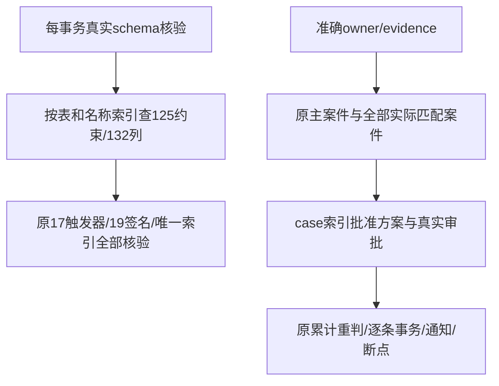
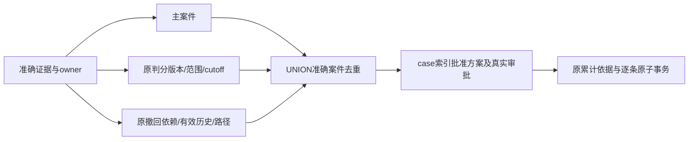
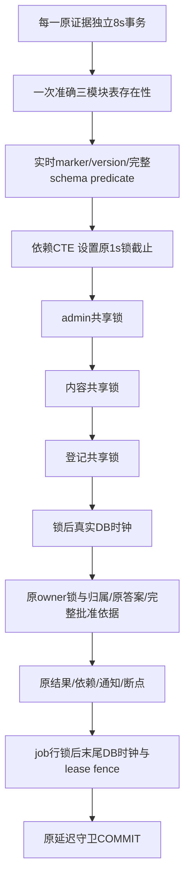
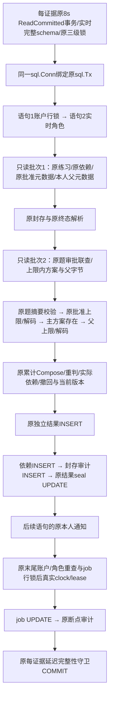
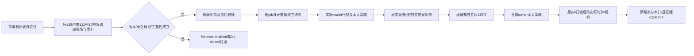

# P5b CI 容量查询修复方案

首次SSH草稿PR #23的完整head bc8561fc73ffe80549fdebca6a8adb0cc32f8c70，push/PR的千案件万证据批次均在原5分钟截止触发失败（约5100条）；没有重跑或放宽门槛。Native同一次交付修复继续执行，尚未完成Task16远端验收。

最大真实夹具诊断保持1000案件/1000独立批准方案/10000原证据。CPU采样大部分为等待数据库；SQL计划显示schema守卫对751约束计算定义而需要125个，对5592列扫描而需要132个；方案筛选先读取1000批准方案及审批事件，再排除999个。本机health十次约42ms，原依据十次约17ms，方案筛选十次约17ms，实际50条约933ms。诊断不是10000条容量PASS的替代。

修改文件：`backend/internal/store/correction_tx.go`只给准确catalog子查询增加不可展开边界，强制按现有表/约束名及表/列名查找后核验，不缓存schema状态；`backend/internal/store/correction_results.go`先物化准确owner/evidence及匹配案件，再按case索引读取批准方案和真实审批。旧predicate、主案件、cutoff、累计来源、排序、101/100上限及全部核验保留。更新本说明、验收与证据；不修改API、原七迁移、第八迁移、数学用途、50批次、8秒事务/30秒批次、5m/8m/9m/30m预算。

可行性审核：`OFFSET 0`只防止PG把准确相关查询展开为全catalog反连接；返回集合和原校验条件相同。物化案件先于方案，保留原OR predicate和主案件，不能遗漏其他撤回或规则案件。无数据或契约兼容性变化，无新增服务/依赖/生产访问。验证真实LinuxRED、最大夹具前后SQL计划、十种schema损坏/累计方案/断点/依赖末尾回滚回归，以及新提交完整Go/前端/双视口/五容量矩阵；最后最新完整head四workflow/all jobs实际成功，不能用本机或早期成功替代。当前无设计阻塞，性能GREEN仍需实测。

后段可行性补充：初步优化在本机完整容量仍于原5m实际RED，不能视为解决。3000条真实原子结果后的SQL采样准确显示方案匹配估算cost214184，生成148个JIT函数，单查询25.589ms（其中JIT25.300ms）；连续50条约2.30s。schema健康和原依据并未出现同样增长。JIT依估算cost触发、短查询编译开销可能大于收益，参见[PostgreSQL17说明](https://www.postgresql.org/docs/17/jit-decision.html)。

在同一最大夹具/相同3000结果与统计条件下，仅临时overlay比较候选查询：把“主案件 OR 判分条件 OR 撤回条件”分配成三个SELECT，再用UNION去重；每个SELECT保持准确evidence/owner，判分cutoff与撤回原始/有效依赖谓词原封保留。按不可变kind先过滤，避免把撤回子计划成本乘到999个无关判分案件。候选cost5931、无JIT、0.231ms、十次8.426ms且仍准确返回同一方案，确认可行后才修改产品的matched_cases。真实worker采样仍使用旧产品查询，因此2.287s不是候选产品GREEN；完整容量与最新远端仍必须实测。

修正只涉及先列出的correction_results.go；未改变PG全局/事务JIT设置、数据库统计设置、测试夹具与任何守卫。等价性是集合分配律，UNION去重对应旧WHERE每案件唯一，主案件仍要求同一准确evidence存在，所有其他真实匹配案件仍参与累计。既有跨案件、cutoff、外人证据、分叉/环与末行回滚回归覆盖语义；无契约或数据兼容性阻塞。Ruling22同一次查询计划修复保留这些必要证据。

测量后产品定向GREEN：既有schema损坏/跨案件累计/原子性/断点/无中间结果批准链回归35.12s PASS；完整1000案件/1000独立批准方案/10000证据、200批及所有expected sets实际PASS，耗时3m19.374331625s，heapDelta=371720，allocatedBytes=4689452848，maxBatchBytes=23540872。代码差异人工复核确认UNION为原OR集合去重、准确owner/主案件/所有其他案件/cutoff/批准上限一致，catalog125/132/17/19校验每事务保留，无缓存或签名/契约变化；产品diffSHA256=c410383673c1d7e92d118ff0692bbd45e048c3657a0d48ddadf968fe9db22317。这是提交前工作树定向证明；提交后全44命令将在一个精确新SHA重新执行，最新四远端workflow/六job仍待通过。

## 事务往返结构审核

d5a3340真实Linux对照：PR完整纠错job成功，影响容量267.704s、通知79.114s；push影响在5m失败，完成8000条时292.400s。push夹具约93s、每1000条约25s，PR夹具约73s、每1000条约16s。因此单次PR成功不能替代四run/六job门槛。已由自身SIGINT包装器停止未完成本机矩阵，不作为最终完整PASS。

临时overlay精确方法计时（不改产品/PG设置）：真实500条7.341s，process4.543s，事务额外约2.798s；schemaConfigured0.856s、旧学习/题库存在性0.241s、共享锁0.429s、两阶段DB时钟0.230s、原依据/批准依据合计1.515s、写结果1.167s、断点0.524s。纯body序列化仅0.046s，不猜测缓存能解决。夹具单独计时：方案2.671s、10000原证据29.082s、总32.698s；不简化原证据或触碰旧七迁移来降门槛。

修改/新增文件：新增store/correction_system.go，将每事务的三个模块存在性一次读取，永久marker/版本及相同125约束/132列/17触发器/19签名/唯一索引在另一请求实时读取；修改correction_tx.go只抽取共用完整predicate，不缓存其结果。修改correction_jobs.go的system入口，依赖MATERIALIZED的锁CTE严格按admin1296127049→内容1296127048→登记1296127047取得共享锁后读取clock，删除重复设置但保持1s lock_timeout；无锁入口仍设置原timeout再读clock。新增correction_system_internal_test.go测试桥及correction_system_test.go，在每级真实独占阻塞下核验前级已持有/后级未持有、clock晚于释放。

若后续阶段仍需优化，仅按同一已测流程合并以下准确读取：correction_results.go原始terminal元数据在当前事务原始记录不可变条件下复用一次，实际knowledge/unit/asset依赖用同一查询返回并核验缺失；correction_plans.go案件锁同时返回不可变kind，correction_process.go沿用该kind；correction_jobs.go已锁定job的MATERIALIZED结果之后读取clock，断点仍使用末尾真实DB时刻和现有lease/sequence/cursor检查。每一步先实测，保留完整来源/所有累计案件/原答案/审批与回滚，不引入跨事务状态缓存。文件实际改动与最终证据按实现归档。

可行性/兼容性审核：不改公开方法、API、schema、旧七/第八迁移、原数据和math摘要；原actor/个人学习配置逻辑不改变，共用predicate保持完全相同。新system存在性仍逐事务检查，不跨事务缓存；never-enabled仍quiet，任何曾启用/回退/缺表/marker/旧学习或题库缺失均拒绝。锁CTE的逐级FROM依赖与MATERIALIZED保证前级完成才能产出下一阶段行，clock放在已物化锁结果外，避免等待前采时；顺序/类型/键及末尾身份、租约检查不变。缺知识/单元仍报错，不能遗漏依赖；owner原始terminal行/案件kind均由既有不可变守卫及原内容/账户/案件锁保护。没有设计阻塞，实际性能仍待完整容量及四run全部job。

验收顺序：现有5m Linux RED为性能回归证据；新增锁顺序/锁后clock测试先在原产品运行（若PASS不伪称RED），再改入口并复验；每阶段对相同最大夹具500实际事务计时，并覆盖十种schema损坏、曾启用/未启用、租约/断点/账户撤销/末依赖回滚/累计链。完整1000/1000/10000、全部44命令、同一新SHA前端/双视口及最新四CI不得削减或加预算。

入口阶段实测：相同500原子事务7.341→6.545s（约11%）；37.60s锁/配置/租约/原子回归PASS。按审核继续合并精确terminal元数据、已锁案件kind、knowledge/unit/asset实际来源及job行锁之后的末尾clock；不合并身份/role快照，不改延迟守卫或每证据COMMIT。缺知识/单元继续报错，旧公开scanner调用和错误保持。

精确读取兼容回归：行锁后clock原实现基线PASS2.31s；新入口及累计/schema/租约/回滚PASS74.07s。真实空依赖/缺来源测试RED2.28s发现nil单元切片会编码为JSON null；仅把nil规范为[]，与原for循环零依赖语义相同，缺知识/单元仍返回sql.ErrNoRows。

往返优化提交前证据：准确读取/三级锁/行锁后clock/schema损坏/累计/断点/回滚定向PASS74.07s；空依赖及缺实际来源RED2.28s→GREEN6.13s；Node全部44项PASS5.59s。相同最大夹具真实500原子事务7.341→5.927446041s，完整原1000/1000/10000容量175.82s PASS，CORRECTION_CAPACITY cases=1000 plans=1000 affected=10000 workerBatches=200 completeSets=true heapDelta=354856 allocatedBytes=4609082512 maxBatchBytes=23127824 elapsed=2m54.980983041s。人工复核共用schema predicate与原定义相同、按事务查询无缓存，元数据仅同事务复用、实际依赖缺失报错、job时钟晚于锁等待、原身份/role读取顺序和每证据COMMIT不变；Go/API/迁移/契约输入未改动范围外文件。当前产品diffSHA256=dd1999ea9dcefa712e07dffab2b8ec79efc0a20c7c4f3c01f47fa45f04a4f4b6。这仍为提交前定向证明，提交后的完整44命令及最新四run/六job必须实际通过。

b38828c真实Linux第三次容量RED：push9000条297.793s，PR9000条284.994s，均在原5m超时；夹具约95s、后段每1000条21—23s。新入口/准确读取降低一部分开销但不足。final-ci2-go的12个已完成命令PASS，影响命令2.8s由本轮自己的包装器SIGINT停止；前端9条350项PASS仍为历史证据，未运行本轮浏览器，不宣称44条或远端PASS。临时500原子事务函数统计：correction_result_complete1000次616.568ms，其中correction_case_applies1000次467.339ms；结果每INSERT+seal UPDATE各校验一次。先测写入请求合并及schema/案件函数精确计划候选，不减少数量、时限、批准来源、schema实时性或逐证据原子提交。

## 原事务内语句批次审核

第三次完整Linux head仍在5m失败。重新比较实际SQL等待和500条事务：大范围单SQL依据合并6.058s，去除重复连接后6.016s，均无收益，拒绝进入产品；保留原方案/父结果查询的较小读取5.100s；账户/角色分别执行的批次4.945s；原查询的两组只读批次4.685s，较b388原5.927s约降低21%。这些是相同1000/1000/10000夹具中的500实际独立事务，不代替完整容量或Linux验收。原无测试名称运行明确不计为回归证据。

拟修改文件：新增store/correction_batch.go，只在当前sql.Tx对应的sql.Conn.Raw回调内使用既有pgx SendBatch；新增correction_inputs.go，按原SQL读取练习原记录、原依赖、所有实际匹配的批准方案和本人批准父结果，返回实际字节，沿用原累计算法。correction_jobs.go显式取得同一连接并在原8s/ReadCommitted事务结束后释放；correction_process.go保留前后账户/角色读取和末尾租约时钟，账户与角色仍为先行锁后角色的两条语句；合并同一结果依赖/审计/封存写请求，以及原job更新/断点审计请求。correction_results.go仅选择worker练习批次读取、在同一事务复用刚读且校验过的准确方案proof计算位置，并沿用原始依据优先、批准方案100项/2MiB、主方案存在、父结果100项/累计2MiB的检查顺序。practice_read.go、assessment_evidence.go、correction_plans.go只抽出原封存、原题与冻结方案纯解码器供原读取和批次共用。新增correction_batch_internal_test.go/correction_batch_test.go验证真实账户行阻塞后角色新快照及取消后连接可继续使用；更新本说明、ledger与最终证据。

可行性与兼容性审核：既有pgx支持通过database/sql连接回调发送批次，原始driver只能在Raw回调内使用，BatchResults必须在再次使用连接之前关闭，参见[pgx stdlib](https://pkg.go.dev/github.com/jackc/pgx/v5/stdlib)、[SendBatch](https://pkg.go.dev/github.com/jackc/pgx/v5#Conn.SendBatch)、[Go Conn.Raw](https://pkg.go.dev/database/sql#Conn.Raw)。批次里的原语句保持顺序、分别执行；不把角色并入账户行锁的同一SQL快照，不合并前后身份检查。连接和facts均绑定准确sql.Tx，提交后不复用，不在回调外存放pgx连接；标准driver或非worker读者走原实现。每个批次成功、读取失败或取消都必须关闭结果后才回到SQL事务，8s与1s锁截止仍在同一物理连接生效。

只读批次只提前取得当前锁保护的不可变来源，原记录的封存字节仍先解码；原题仍按原learningItemsSQL核验publication/submission/独立批准/位置/SHA。只在原批准及累计父字节上限允许时读取正文，并把解码留在原逻辑顺序中；其他evidence种类不改，源选择、cutoff、owner、101候选上限和累计算法不改。方案proof的事务内复用只省去对刚刚准确读取及校验的映射的再次请求；任何请求ref不在当前facts中继续原SQL。

写请求的结果parent已由前一语句插入，依赖/事件分别插入不同表，依赖RETURNING的count强制先完成所有依赖，再由审计RETURNING驱动既有结果seal UPDATE；通知留在后续语句，以原可见性看到封存结果。cursor更新通过RETURNING驱动原事件；所有FK、逐行触发器及延迟完整性检查均保留，不能在同一命令插入后又更新同一结果行。共享语句快照及RETURNING边界依据[PostgreSQL17数据修改CTE](https://www.postgresql.org/docs/17/queries-with.html#QUERIES-WITH-MODIFYING)，全程不改迁移、PG全局/事务设置、API或公开签名。

没有设计阻塞。实际GREEN仍要求新实时角色/取消负测、全部schema损坏/累计/原子性/租约回归、完整1000/1000/10000容量，以及同一新SHA全部44命令和最新四workflow/六job；不削减数量或修改5m/8m/9m/30m门槛。此为同一次必要修复轮中的Ruling24，不再派第二位reviewer，不合并、不部署。

产品批次定向证据：两项真实账户行等待/角色撤销及取消后单连接池恢复，优化前基线PASS3.18s；首个错误夹具因强制learner外键失败，只修正为撤销实际editor角色，不作为产品RED。产品复制纯解码器时残留两处临时计时语句被编译/assert拒绝，已清除；产品树不存在capacityDiagnostic。真实新产品权限/三级锁/锁后时钟/累计/原子回滚/租约定向PASS33.84s，完整Node44项PASS5.58s；实际产品原1000/1000/10000容量155.99s PASS，CORRECTION_CAPACITY cases=1000 plans=1000 affected=10000 workerBatches=200 completeSets=true heapDelta=367992 allocatedBytes=4491336096 maxBatchBytes=22646592 elapsed=2m35.230718166s。纯临时候选全部纠错通知非容量122.11s及完整容量151.14s保留为诊断证据，不替代新产品完整矩阵。

通知与末尾账户/角色三语句候选实测4.708s，相对4.685s没有收益，拒绝进入产品；notification_write.go未改变，通知仍在原独立后续语句。实际产品仅将原 SQL 组成准确事务内批次；不可变来源可提前只读预取，但解码和上限/主方案/父结果处置保留原顺序，批准新增仍经原案件与资格守卫及持久后续工作项处理。原角色读取为账户行等待之后的独立语句，前后权限、末尾租约DBclock和每证据COMMIT不合并、不缓存跨事务实际状态。全部44命令将冻结在同一新SHA新鲜执行，最新四run/六job仍需实际通过。

## Ruling25：测试夹具统一数据库时钟

424a6a2本机完整矩阵在原反馈容量的非空学习事实子场景实际失败，原日志保留；此前两轮同场景成功不能覆盖本次失败。准确约束为`terminal_at IS NULL OR terminal_at >= created_at`。原学习测评夹具用主机`time.Now()`生成创建时间，完成夹具用数据库`clock_timestamp()`生成终结时间，两台时钟轻微偏差可触发约束；一次性overlay令主机提前5秒，1.96秒重现同一约束失败，并打印准确约束和两时间，作为定位证据。

仅修改`backend/internal/store/learning_fixture_test.go`的`insertAssessmentBase`，在原隔离事务读取数据库时钟，创建时间和原24小时到期时间以该值计算；数学JSON、来源、答案、全部外键和CHECK、旧迁移、产品代码和数量/时间限制不变。本文件新增定位与兼容性审查记录。测试代码修改不改变公开兼容性，仍须原非空事实/学习/纠错/容量及新完整矩阵复验，不通过重复失败测试掩盖问题。

可行性审查：同一数据库时钟消除跨主机偏差，没有关闭时间约束或修改生产时钟。错误代价：若以放宽约束或重试处理，原学习事实兼容性和容量验收会被误报；原失败及受控偏差复现均归档。PR容量仍有独立真实5m失败，push成功不作为完整远端验收。

## Ruling26：准确事务的前置与末尾批次

424a6a2四项workflow最终均完成，五个job通过，PR事件的纠错job在5m失败：万条worker已于285.84s完成，后续完整元数据/登记/通知分页超过截止；push事件完整容量198.23s通过。两组原日志和四run/六job结构化结果保留。相同原1000案件/1000批准方案/10000证据夹具，当前实现500个独立原子事务4.806s；一次性候选前置优化4.281s，再加入末尾准确批次4.093s，约减少15%的当前本机worker时间，尚不是完整容量或CI验收。

拟修改或新增：`correction_system.go`提取原存在性/完整性判断及严格依赖的进入语句，新增`correction_start.go`用于完整健康核验后取得原锁/采时，并发送原job、证据元数据独立SELECT；`correction_jobs.go`挂接同事务前置事实；`correction_process.go`只在准确tx/job/ref范围消费这些实际读取值；`correction_finish.go`发送原通知INSERT、当前账户SELECT和锁后job时钟SELECT；`notification_write.go`提取原纯输入检查/SQL参数用于相同通知语句；`correction_batch.go`新增worker本人策略的准确账户字段读；`correction_roundtrip_test.go`覆盖真实账户等待后的强制换密码和通知后的末尾账户拒绝/全事务回滚。本文件更新可行性和测量证据。

可行性/兼容性审查：前置完整性以MATERIALIZED producer驱动原锁依赖，判定不成立时不取得锁或时钟；只在完整物理存在性分支预发送job/元数据，旧未启用/损坏分支保持原判断。job与元数据仍不同SQL语句，使用新的READ COMMITTED语句快照；结果及错误仅绑定准确sql.Tx、job与ref，先验证原租约，再处理原元数据/归属，不跨事务复用任何数据库事实。本人worker策略`ReadOwnAction`只使用ID与must_change_password，缩小账户投影仍原行锁及原Authorize；人员角色/凭据/会话认证继续原完整读。末尾批次保持通知、账户核验、job行锁后时钟三条独立语句，账户策略不成立时SQL不取得job锁；原续租检查/序列上限/断点顺序和审计在其后执行，所有结果和通知/断点同一原事务提交。

错误代价：不准确绑定事务、提前采时或绕过账户状态可使过期worker授予资格；错误预读顺序可改变错误类别；Raw结果未关闭可污染连接；故需要真实锁后账户状态、末尾拒绝全回滚、三级阻塞/行锁时钟、旧未启用/损坏schema、取消复用、全部纠错通知/完整容量测试，再进行相同最新head44命令与四run/六job验收。不得以候选500条计时代替10000完整集合，不变更数量、截止、迁移、PG设置、数学目的或逐条提交。此为同一次必要修复轮的继续，没有另行安排reviewer。
