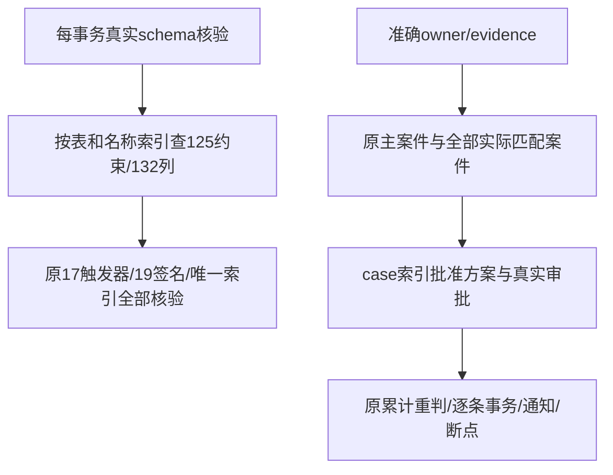
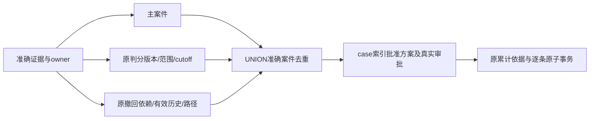

# P5b CI 容量查询修复方案

首次SSH草稿PR #23的完整head bc8561fc73ffe80549fdebca6a8adb0cc32f8c70，push/PR的千案件万证据批次均在原5分钟截止触发失败（约5100条）；没有重跑或放宽门槛。Native同一次交付修复继续执行，尚未完成Task16远端验收。

最大真实夹具诊断保持1000案件/1000独立批准方案/10000原证据。CPU采样大部分为等待数据库；SQL计划显示schema守卫对751约束计算定义而需要125个，对5592列扫描而需要132个；方案筛选先读取1000批准方案及审批事件，再排除999个。本机health十次约42ms，原依据十次约17ms，方案筛选十次约17ms，实际50条约933ms。诊断不是10000条容量PASS的替代。

修改文件：`backend/internal/store/correction_tx.go`只给准确catalog子查询增加不可展开边界，强制按现有表/约束名及表/列名查找后核验，不缓存schema状态；`backend/internal/store/correction_results.go`先物化准确owner/evidence及匹配案件，再按case索引读取批准方案和真实审批。旧predicate、主案件、cutoff、累计来源、排序、101/100上限及全部核验保留。更新本说明、验收与证据；不修改API、原七迁移、第八迁移、数学用途、50批次、8秒事务/30秒批次、5m/8m/9m/30m预算。

可行性审核：`OFFSET 0`只防止PG把准确相关查询展开为全catalog反连接；返回集合和原校验条件相同。物化案件先于方案，保留原OR predicate和主案件，不能遗漏其他撤回或规则案件。无数据或契约兼容性变化，无新增服务/依赖/生产访问。验证真实LinuxRED、最大夹具前后SQL计划、十种schema损坏/累计方案/断点/依赖末尾回滚回归，以及新提交完整Go/前端/双视口/五容量矩阵；最后最新完整head四workflow/all jobs实际成功，不能用本机或早期成功替代。当前无设计阻塞，性能GREEN仍需实测。

后段可行性补充：初步优化在本机完整容量仍于原5m实际RED，不能视为解决。3000条真实原子结果后的SQL采样准确显示方案匹配估算cost214184，生成148个JIT函数，单查询25.589ms（其中JIT25.300ms）；连续50条约2.30s。schema健康和原依据并未出现同样增长。JIT依估算cost触发、短查询编译开销可能大于收益，参见[PostgreSQL17说明](https://www.postgresql.org/docs/17/jit-decision.html)。

在同一最大夹具/相同3000结果与统计条件下，仅临时overlay比较候选查询：把“主案件 OR 判分条件 OR 撤回条件”分配成三个SELECT，再用UNION去重；每个SELECT保持准确evidence/owner，判分cutoff与撤回原始/有效依赖谓词原封保留。按不可变kind先过滤，避免把撤回子计划成本乘到999个无关判分案件。候选cost5931、无JIT、0.231ms、十次8.426ms且仍准确返回同一方案，确认可行后才修改产品的matched_cases。真实worker采样仍使用旧产品查询，因此2.287s不是候选产品GREEN；完整容量与最新远端仍必须实测。

修正只涉及先列出的correction_results.go；未改变PG全局/事务JIT设置、数据库统计设置、测试夹具与任何守卫。等价性是集合分配律，UNION去重对应旧WHERE每案件唯一，主案件仍要求同一准确evidence存在，所有其他真实匹配案件仍参与累计。既有跨案件、cutoff、外人证据、分叉/环与末行回滚回归覆盖语义；无契约或数据兼容性阻塞。Ruling22同一次查询计划修复保留这些必要证据。

测量后产品定向GREEN：既有schema损坏/跨案件累计/原子性/断点/无中间结果批准链回归35.12s PASS；完整1000案件/1000独立批准方案/10000证据、200批及所有expected sets实际PASS，耗时3m19.374331625s，heapDelta=371720，allocatedBytes=4689452848，maxBatchBytes=23540872。代码差异人工复核确认UNION为原OR集合去重、准确owner/主案件/所有其他案件/cutoff/批准上限一致，catalog125/132/17/19校验每事务保留，无缓存或签名/契约变化；产品diffSHA256=c410383673c1d7e92d118ff0692bbd45e048c3657a0d48ddadf968fe9db22317。这是提交前工作树定向证明；提交后全44命令将在一个精确新SHA重新执行，最新四远端workflow/六job仍待通过。
