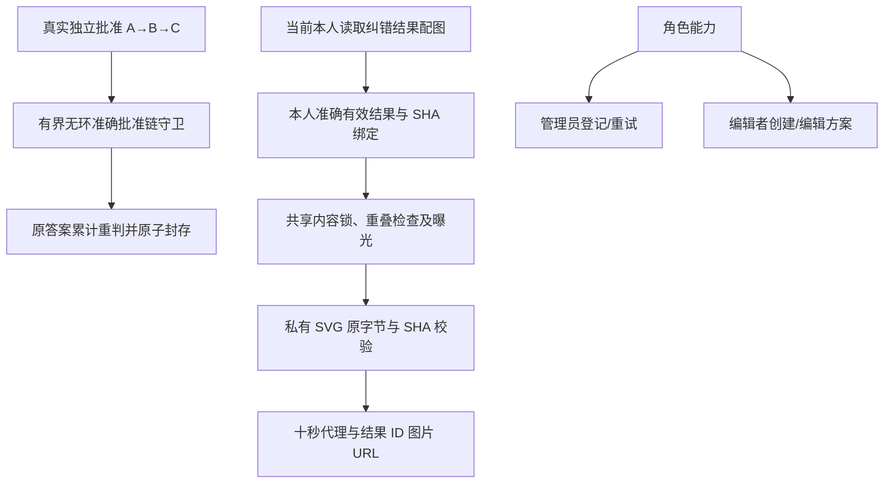

# P5b 一次审查修复方案

独立 reviewer 审查 `dad438d..daaafe7` 后复现两项 Important。第三项虽然原评级 Minor，但编辑者点击仅管理员操作会得到 403 并清空账户边界中的草稿；按实际工作中断升级为 Important，纳入同一次修复轮。先保留失败回归，再最小修复，最后完整本机矩阵和最新 head 四项远端 workflow。

修改 `00008_correction_notifications.sql` 的批准映射验证：准确批准事实中沿原实例走至最终实例，不依赖 worker 预先生成中间结果；最多 100 个方案引用/100 条链边，拒绝缺失批准、冲突、环和不完整链，原独立审批、案件归属、封存来源、事务守卫继续执行。原七个迁移不变；第八个迁移尚未发布，无已部署数据库升级。

新增 `backend/internal/store/correction_assets.go`，修改纠错 repository/service、HTTP route/dispatch，新增只读 `GET /api/v1/corrections/results/{id}/assets/{sha256}`。先验证当前账户和本人准确有效纠错结果，再确认 SHA 属于该结果有效题目，读取至多 1 MiB 原 SVG、校验 SHA 和安全标记，在同事务执行答案重叠和 30 分钟曝光记录，提交前重新验证账户。替代来源撤回后立即 404。旧 attempt 资源接口继续原有撤回保护。

修改 `api/openapi.yaml`，生成 `generated.d.ts`，修改纠错 proxy/types/schemas、结果页；新增 `correction-asset.tsx` 使用结果 ID。新增一个路径和 operation，不修改旧 88 路径、220 schema、32 response、三个安全模式的保护基线。兼容性可行性审查：公开类型只增路径；旧迁移/旧摘要目的/旧 asset 权限不变；新 proxy 复用私有 Cookie 白名单、禁止重定向/Set-Cookie、SVG SHA/安全校验、1 MiB 和同一 10 秒截止；不增加生产维护豁免。以旧完整契约哈希及新正反向回归作为验证，结论可实现且无阻塞问题。

修改 `case-list.tsx`、`case-panel.tsx`，管理员能力单独决定登记和重试入口，编辑者仍可创建和编辑方案。增加 Go、HTTP、前端单元和双视口真实图片回归；不扩展审核权限或更改既定额度。验收与最终审查文档记录真实 RED→GREEN、修复后全矩阵及 CI。

同一次链修复补充 `TestCorrectionReplacementChainIgnoresUnrelatedFork`：真实其他实例的批准分支冲突造成3.19秒RED，链守卫仅沿当前原实例的确定性边走到终点后，和当前链冲突/环及无中间结果回归一起8.17秒GREEN。其他题目无关分支不阻塞本证据；当前链分叉、环、缺边、超100引用/边仍拒绝。未完成的旧SHA矩阵已由其自身包装器安全中止，不用于最终验收；全部组将在新提交重跑。

同一次配图修复增加手机宽图边界：重新构建后800px图片在390px视口实际溢出（16.27秒RED，桌面PASS/手机FAIL）。`correction-asset.tsx`只改为使用原答题页`assessment.module.css`的figure样式及max-width约束，新增浏览器断言；无授权/数据/Go变更。Go受验提交751f45b保持真实记录，精确输入tree相同才复用，所有前端、20批浏览器及Node/最新head远端四项CI重新验证。

宽图边界 fresh build GREEN：桌面/手机两场景10.10秒通过，包含实际图片加载、本人有效结果URL、再次撤回404和原摘要保持。完整前端与20批浏览器及Node复核仍待本提交验收。
