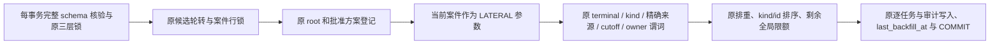

# P5b 最终 CI 补扫查询修复可行性审查

90fd12d 的产品源与受验 177ed57 完全相同，但 push / pull_request 的千案件万证据测试均在 5 分钟超时。两侧已完成全部 10000 条逐证据事务，随后在案件补扫登记超时。保留实际失败日志，不重跑旧 CI、不扩大时间预算。

隔离完整夹具的实际执行计划确认：提交结果后统计信息改变，旧评级规则案件的原 CROSS JOIN 被改成 Hash Join；每个案件 Seq Scan 全部 10000 条练习并解析规则版本，再按 cutoff 排除全部行。执行从 0.030ms 上升至 12.873ms，缓冲访问从 6 增至 32005；全 1000 案件轮转补扫从 3.050s 增至 12.950s。这是同一查询受真实统计信息影响的退化。

拟修改文件：`backend/internal/store/correction_backfill.go` 仅一条 terminal 候选查询；必要时在 `backend/internal/store/correction_backfill_test.go` 增加按真实统计信息和 cutoff/owner 核验的回归。新增或更新本证据、验收记录、裁定与 manifest。API、迁移、固定数学规则、原容量数量和预算不变。

可行性与兼容审查：案件主键只返回一行，kind 在原同事务读出且不可变；LATERAL 内部保留原全部条件和 LIMIT，OFFSET 0 仅阻止展平为非参数化 Hash Join，按 kind/id 的选集与顺序相同。原 SKIP LOCKED、根/方案/终结共享 50 预算、幂等排重、所有 FK/延迟守卫、每证据提交及读者权限继续保留。不缓存任何实际数据库事实。先用临时 overlay 运行原全部 1000/1000/10000 容量与执行计划，再对采纳后的产品运行补扫与完整纠错守卫、完整本机矩阵和新 SHA 的四工作流六 job。若计划或原集合不相等，候选不采纳。

## 候选与采纳结论

产品未修改时的完整原容量诊断 139.38s PASS，提交结果后的旧计划每案件执行 12.873ms、命中/读取共32005 buffers；全补扫 12.950s。仅单查询的临时LATERAL候选运行原1000案件/1000方案/10000证据及全部后续集合核验131.57s PASS；相同旧案件的实际计划2.657ms、2005 buffers，全补扫4.868s。仍有对日期/状态元数据的扫描，不宣称所有场景都只走索引；减少的是截止前无关封存题源解析与展平扩大的列读取。全部原断言和时限原样保留，未触碰测试夹具、迁移、PG设置或CI。

采纳只改 `correction_backfill.go` 的一条候选读取，并增加原因注释。现有完整容量即真实性能RED/完整集合GREEN证据；现有late-terminal、low-key、rotation、root/plan共享预算、规则范围、owner、锁/故障回滚及累积来源回归覆盖语义，无新增镜像实现的测试。接着运行产品定向和全部44条本机命令，再归档与SSH推送最终文档head，远端四run/六job全部成功才交付。
