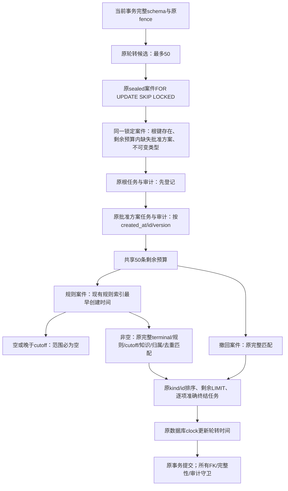

# P5b：最终补扫预算修复与兼容性复核

日期：2026-10-04。属于Task16同一次必要修复轮；一次独立审查保持，没有新增reviewer。修改前已经在临时覆盖中测量、复核可行性；本文件记录最终采用的查询设计。

## 真实问题与测量

完整head `215a8ed1cfe13856e25c7762912a70d55401d902` 的PR侧纠错容量在5m超时，其他五job成功。PR已处理10000条独立事务，282.294s完成worker、291.415s完成元数据后，在终结补扫中超时；Push完整影响244.667s、通知77.664s成功。原始脱敏日志和四run六job最终状态完整保留，未重跑失败CI。

Ruling28的当前案件LATERAL已避免展开解析所有题源，但旧规则案件仍逐次读取全部10000条练习的日期/状态元数据。新增两个内部优化，原测试规模、断言与预算保持：

| 本地原始全容量临时覆盖 | 实际结果 |
| --- | --- |
| 当前案件参数化（Ruling28） | 单案件2005 buffers / 2.657ms，整轮补扫4.868s |
| 仅索引最早创建时间的空范围判断 | 8 buffers / 0.041ms，整轮补扫3.760s；全部原集合PASS |
| 再合并锁定案件根/方案/类型元数据读取 | 整轮补扫3.041s；原1000/1000/10000、200批、原答案SHA、全部根/方案/通知集合PASS，整项128.87s |

这些不是生产SLO。同样完整夹具的worker往返候选（账户/案件原语句批次、结果幂等+条件基行INSERT）500事务4.507s，对照当前4.291s，没有可靠收益，均不采用。worker、结果封存、通知及每条COMMIT保持当前产品代码。

## 文件与架构

| 文件 | 实际修改 |
| --- | --- |
| backend/internal/store/correction_backfill.go | 当前锁定案件元数据合并、私有终结补扫SQL构建器、规则范围最早日期必要条件 |
| docs/operations/2026-10-04-p5b-empty-range-fix.md | 本次根因、决策、架构、兼容性与验证记录 |
| docs/operations/evidence/p5b/ | 实际诊断、失败与最新完整回归证据归档 |

## 修改前可行性与兼容性审查

1. 最早记录是排除空范围的必要条件：没有同规则记录，或所有记录创建时间大于cutoff，其任何sealed/terminal/指定知识子集也为空。最早查询不筛terminal、知识或owner，避免把较早的真实影响错误排除。非空范围仍执行所有原条件，截止取当前真实案件，不缓存任何数据库事实。索引已在00008存在，无新增迁移/索引/PG设置。
2. 原案件FOR UPDATE SKIP LOCKED、类型读取、根任务存在性和最多50条缺失批准方案可在同一有依赖的MATERIALIZED读取中完成。SKIP LOCKED没有行等待，原准确source_key与sealed/status仍保留。根缺失占一条，查询方案LIMIT扣除这一条；登记仍根→方案→终结证据，原并发重复键处理和共享预算不变。新登记历史撤回继续原路径；轮转下一轮继续查缺口，不引入全局高水位。
3. 预读只含ID、version、不可变kind和存在性；没有答案、封存数学正文或审批依据复用。原终结查询重新读取当前案件cutoff/完整条件。所有当前schema125约束/132列/17触发器/19签名/唯一索引核验仍每事务实际执行，来源、账户、批准、租约真实性和错误映射保持。
4. 原案件/计划/任务/通知FK、触发器、完整性与审计全部运行；原七迁移、新八迁移、API/公开权限、worker、原数学判分与摘要目的均字节未改。内部查询重组不增加用户流程，符合已批准兼容性边界。作者已逐条件核对SQL和共享预算，没有阻塞性设计问题。
5. 先保留本次真实Linux RED，再测原始完整夹具候选；产品提取后进行现有late-terminal、low-key、轮转、范围、归属、损坏、锁等待、断点、回滚和幂等回归。提交后的全部44命令重新执行，最终最新完整head四workflow/六job必须实际成功，不能用177ed57或上一受验d14e159替代。

原5m Go、8m浏览器、9m命令wrapper、30m CI job预算及固定数量保持，不隐藏用例、不重试、不将技术夹具计入正式数学资料。
