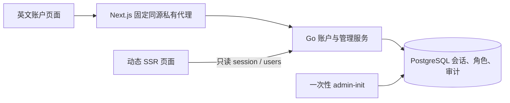

# P3a 账户与权限操作说明

日期：2026-10-01。适用版本：本仓库 P3a 功能分支，Go 1.27.1、PostgreSQL 17.11、Node.js 24.17.0、Next.js 16.3.7。实际验收及审查结论见 [验收记录](2026-10-01-p3a-acceptance.md)。P3b 内容审核、学习状态及生产部署另行推进。

## 架构与入口



页面：`/register`、`/login`、`/account`、`/admin/users`。匿名数学阅读继续沿用公开 API。SSR 只读身份、不创建匿名上下文、不转发 Cookie；浏览器首次通过 context 获得防伪令牌。账户成功不创建学习记录。

从项目根加载受保护环境，只加载、不打印：

```sh
set -a
source .env
set +a
```

Go 与 Next 使用相同 `APP_ENV` 和 `AUTH_PUBLIC_ORIGIN`，Next 的 `GO_API_INTERNAL_URL` 只指向受信任 Go 服务，所有三个值仅由服务端读取。例：本机开发 `APP_ENV=development`、`AUTH_PUBLIC_ORIGIN=http://127.0.0.1:3000`、`HTTP_ADDR=127.0.0.1:8080`、`GO_API_INTERNAL_URL=http://127.0.0.1:8080`。本机 HTTP 的 Go、Next 均只绑定 loopback，浏览器地址须与 origin 一致，不能把 localhost 与 127.0.0.1 混用。默认 npm dev/start 已绑定 127.0.0.1。

生产必须 `APP_ENV=production` 且 origin 为 HTTPS 的纯源地址（无路径、凭据、查询、片段）；同源 HTTPS 入口和部署属于 P7。不得依赖 Host 或 X-Forwarded-For 推导认证 origin。开发缺省 origin 保留原公开只读模式；账户 API 返回明确 AUTH_NOT_CONFIGURED，故障不显示为成功登录或伪造匿名。

## 迁移、备份与首次管理员

迁移显式执行，server 不自动升级数据库。P3a 新增 00003 的七张 auth 表，不改数学版本表和发布指针。任何真实库升级前，应使用受保护的 PostgreSQL 凭据配置完成全库备份、记录应用提交与数据库迁移版本，并确认恢复流程；备份存于受保护的非 Git 目录。不要把连接密码放入命令行、历史、日志或报告。实际生产备份恢复演练属于 P7。

```sh
node tools/verify/run.mjs --cwd backend -- env CGO_ENABLED=0 GOTOOLCHAIN=go1.27.1 go build -o bin/ ./cmd/...
./backend/bin/migrate --dir db/migrations up
./backend/bin/admin-init --username owner_admin
```

最后一条在终端隐藏读取口令。用户名 3–32 位 ASCII 字母、数字、下划线，存为小写；密码 15–128 个 Unicode 码点、至多 512 字节，保留空格和中文，不归一化。CLI 不支持密码参数、不提供默认密码。自动化仅在明确使用 `--password-stdin` 时读取单行标准输入，可从受保护秘密管理系统送入；不得在命令文本、测试报告或提交中写入真实口令。输出只含公开账户身份。初始化状态、账户、角色和审计在同一事务创建，并发只成功一次；再次执行返回 ALREADY_INITIALIZED。首次管理员仅含 learner/admin，editor/reviewer 需单独授予。

本次实现和验收没有迁移真实开发库，也没有建立开发或生产管理员。测试管理员仅由隔离 harness 在随机库中通过实际 CLI 初始化，口令是源码公开的测试夹具，禁止用于真实账户。

## 管理与恢复

管理员登录后进入 People & permissions。查询按用户名做字面匹配（`%`、`_` 无通配含义），每页默认 20、最多 100。每个账户保留 learner；授予角色必须填写 10–1000 码点理由。授予 reviewer 前应人工核对身份与独立性，系统无法证明不同账户属于不同自然人。

管理写入需要五分钟内明确输入当前密码。首次 428 会打开 Verify your password 对话框；验证成功不会自动执行之前的变更，用户必须再次点击提交。取消不执行管理变更。事务重新校验权限、会话、凭据版本及验证时间；至少保留一名管理员。不同角色集合提交后目标所有旧会话立即撤销；相同集合仅审计，不撤销。本人变更角色后需重新登录。

人工重置前在网站之外核验所有权，填写处理理由及 Ownership verification，并提供符合规则的临时密码。不要在说明中保存临时密码、Cookie、CSRF 或恢复秘密。重置后旧会话撤销，所有者用临时密码登录，仅能查看身份、改密或退出。改密后再次登录才恢复原角色的能力。普通改密也要求当前密码，并撤销所有设备会话。

Sign out 撤销当前会话，Sign out everywhere 撤销所有会话；空闲 30 分钟或绝对 7 日到期，最多五个有效会话。身份故障页可重试；畸形 Cookie 由 Clear sign-in cookie 触发 browser context 清除，再刷新，不让 SSR 改变身份。所有密码在提交完成或失败后清空；前端不持久化口令。

审计仅追加，保存动作、操作者/目标、角色前后、理由、核验说明、请求编号和数据库时间；登录失败仅存标准化用户名摘要。禁止直接 UPDATE/DELETE 审计。生产不能使用测试 harness 的 TRUNCATE、发布场景或控制端口。

## 限流与维护

context/session 合用 600 次/分钟，新匿名上下文 120 次/分钟；登录全局 120、用户名和前置上下文各 10/分钟；注册全局 30/分钟、前置上下文 3/10 分钟；改密/重新验证全局 120、会话 10/分钟；管理写全局 60、管理员 10/分钟。成功同样占预算，429 返回 Retry-After。全局预算可能让攻击影响其他用户，P7 再按实际流量评估；不要绕过每进程四次 Argon2 计算上限。

数据库记录决定过期和撤销，清理不决定会话有效性。每分钟清理至多 2000 条已终止且保留满 24 小时的 session/preauth/rate 记录；审计保留。监测固定错误及请求编号，不记录请求体、口令、令牌或数据库 URL。清理失败排查数据库可用性，不延长会话。

应用回退保留 auth 表、账户与审计，回退到只读版本不删除真实数据。禁止对真实账户库执行迁移 down；其仅供空的随机测试库验证。若升级存在问题，停止账户写入、保留备份及现场，按已验证的应用回退步骤处理。

## 隔离回归

真实 PostgreSQL 测试通过 IsolatedConfigs/OpenVerified 创建随机 math_master_test_*，每条连接核对数据库，拒绝连接参数覆写；正常退出删除自己的随机库。harness API/control 在 18081/18082，Next 在 18080。控制入口带令牌，正式 server 不导入该包；runtime.local.json 仅本机 600 权限且不上传。每条验证入口上限 540 秒，Go -timeout 5m，浏览器一 worker、零重试、单例 30 秒、每批 480 秒。两种视口各执行：

```sh
node tools/verify/run.mjs --cwd frontend -- env -u NO_COLOR npm run e2e -- catalogue.spec.ts reading.spec.ts
node tools/verify/run.mjs --cwd frontend -- env -u NO_COLOR npm run e2e -- auth.spec.ts auth-security.spec.ts
```

诊断关闭 trace/video，截图遮盖输入和文本框；禁止上传 runtime 文件、真实秘密或含请求凭据的日志。测试发布只在随机库完成，不表示数学内容已获审核。
