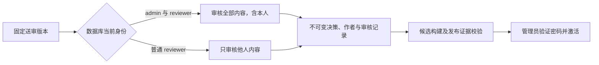

# 管理员审核全部内容：兼容性调整

日期：2026-10-06。用户已确认：管理员兼具 `reviewer` 权限时，可审核本人及他人提交的知识和题库内容。

## 权限与操作

| 当前账号 | 可见范围 | 可批准或退回的范围 |
| --- | --- | --- |
| admin + reviewer | 全部送审内容 | 包括本人及继承作者内容 |
| reviewer，未具有 admin | 独立审核队列 | 排除本人及继承作者内容 |
| admin，未具有 reviewer | 全部送审内容 | 只查看，不能作审核决策 |
| editor | 本人送审内容 | 只查看，不能作审核决策 |

知识审核入口 `/review` 按 admin、reviewer、editor 的顺序决定默认范围，与题库入口 `/review/questions` 一致。管理员兼审核者自审时，页面显示 `Administrator self-review`，填写 `Review responsibility statement`；批准记录显示 `Administrator self-review decision`。历史作者本人退回记录只显示 `Self-review decision`，不根据账号当前角色重写历史身份。

管理员自审仍需完成知识的五项检查或题库的六项检查、审核理由和责任说明；无模板题库保留生成不适用说明。普通审核者不能通过 API 自行批准或退回本人内容。审核完成不自动发布：管理员在发布管理准备候选、核对变更并验证密码后主动激活。

## 实现与可行性

页面、Go 决策、数据库触发器、候选构建及激活证据校验同步调整，避免出现能批准但不能发布、或服务已经批准而客户端拒绝结果的情况。后端在既有事务及账号锁内读取数据库当前权限；浏览器不能自行声明管理员授权。

候选构建内部的 `AdministratorReview` 标记只由数据库服务赋值，JSON 不接受也不输出这个字段。知识深拷贝显式保留该内部权限；旧调用默认继续拒绝未经服务器核验的自审。

主要文件：`frontend/src/app/review/page.tsx`、知识和题库的 `review-panel.tsx` / `schemas.ts`；`backend/internal/publication/release.go`、`backend/internal/question/model.go` / `release.go`；store 中两套审核和发布文件；新增 `db/migrations/00009_admin_content_review.sql` 及对应数据库、响应、页面和浏览器回归。

## 历史与契约兼容

- 使用新增迁移 00009 替换两处审核触发函数；00001—00008、冻结字节、摘要、正文和旧审核记录保持。
- 原 HTTP 路径、请求/响应字段及 manifest 身份格式保持。客户端响应校验接受服务器合法批准的作者自审，仍核验全部检查项、决策状态及冻结摘要。
- 原字段 `independenceNote` 保留作为兼容字段；管理员自审填写实际责任说明，页面不将其称为独立性声明。
- 新选择的自审批准在准备和激活时均要求审核人仍同时具有 admin、reviewer。撤销任一角色使未激活候选失效。已发布的固定证据可继续被后续快照继承，角色变化不改写历史或撤下既有内容。
- 自审可批准并发布，但不是独立数学复核。`content-audit` 的 `quality.independentReview` 和真实人员独立性验收继续按实际作者关系判断；管理员自审不冒充独立验收。

## 升级与回退

升级前按服务器运行手册备份并停止内容写入，显式运行迁移至 9，再启动同一发布版本的 Go 与前端服务。管理员兼审核者通过正常页面审核；这项代码交付不会代用户批准、发布内容或修改实际账号角色。

不存在已批准自审历史时，迁移 9 可回退至 8，并恢复旧触发规则。已有知识或题库自审批准时，down 在同一事务中拒绝回退，保留全部历史；应采用向前修复，不删除审核记录。应用回退仍须通过既有部署工具的 schema 兼容性校验，不能假定旧程序可以处理新增自审流程。

## 验证范围

失败测试已复现列表隐藏、页面缺少审核操作、Go 拒绝自审、候选复制丢失内部权限、客户端拒绝合法审批结果，以及普通作者可通过 API 自退回。回归覆盖管理员知识/题库自审发布、普通作者拒绝、缺检查项、撤权后激活拒绝、现有待审版本迁移、非空历史回退拒绝、固定历史继承及内部授权不可经 JSON 传递。

数据库测试及浏览器使用临时 PostgreSQL 17.11 容器和随机 `math_master_test_*` 数据库；不读取或改动真实 R1 或服务器资料。每批 Go 测试 5 分钟，浏览器批次 8 分钟；Go 调试和验证均设置 `CGO_ENABLED=0`。

独立审查发现并修复 P6b 字节门禁与新规则的冲突：保留原 `p6b/compatibility-baseline.json` 不变，新增精确兼容映射，只允许已批准的七个审核/发布文件使用本次预期摘要，并保护新迁移 00009。其余原契约、00001—00008、生成器、判分和数学字节仍逐文件验证；变更任一例外文件、旧保护文件或添加无关例外均会被测试拒绝。

最终本机验证：367 项前端单元、类型检查及生产构建通过；桌面/手机审核发布 12 项、既有编写/发布/撤回/安全 46 项通过；Node 内容工具与兼容门禁 83 项、运维 22 项通过。Go 核心、账户/HTTP、学习、反馈、纠错、内容验收、复核工具及容量分批完成，`go vet` 和全部命令构建通过。最大学习容量初次并行运行在 4 分钟初始化期限超时；相同代码、数据量及原时限的独立复跑 122.94 秒通过。未降低测试数量或放宽预算。

独立代码审查发现的 1 项 Important（旧字节门禁）与 1 项 Minor（旧发布说明）均已修复，并经同一审阅者限定复核通过。详细结果见[验证记录](evidence/admin-content-review/verification.json)。本阶段交付代码 PR，服务器及真实审批状态保持原状；规则在合并、迁移和部署后生效。
