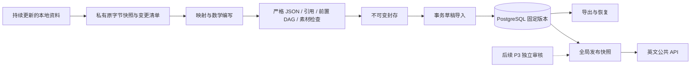

# P1 内容基础层操作说明

本阶段提供 Go 服务、正式目录、版本化草稿存储、离线校验和固定版本导入导出。正式目录为 16 板块、56 主题。首批包有 10 个知识草稿、1 个讲解单元和 1 个原创分数 SVG。9 个节点仍是编写骨架；所有数学内容均待独立复核，公开发布指针为空。P1 不包含审核批准、自动发布或用户学习状态。

## 架构与文件



`schemas/` 是唯一 JSON 契约，通过本地 Go 模块嵌入后端。`backend/internal/content/` 负责验证和封存；`store/` 负责版本存储；`cli/` 负责命令；`httpapi/` 负责公共查询。`db/migrations/` 为显式迁移；`tools/content-ingest/` 负责源快照；`tools/verify/` 负责单次 540 秒上限。CI 与后续容器构建须同时包含 `backend/` 和 `schemas/`。

## 本地环境

复制 `.env.example` 为未跟踪的 `.env`，填写本地凭据。不要提交实际数据库 URL、服务器配置或访问令牌。数据库仅监听 `127.0.0.1:55432`，固定 PostgreSQL 17.11。Go 固定 1.27.1，Node 24；所有 Go 调试与验证使用 `CGO_ENABLED=0`。

从项目根运行：

```sh
set -a
source .env
set +a
docker compose -p math-master-p1 -f compose.dev.yaml up -d --wait db
node tools/verify/run.mjs --cwd backend -- env CGO_ENABLED=0 GOTOOLCHAIN=go1.27.1 go build -o bin/ ./cmd/...
./backend/bin/migrate --dir db/migrations up
./backend/bin/content-check --catalogue content/catalogue/domains.json --package content/packages/elementary-fractions.v1.json --assets content/assets
./backend/bin/content-import --catalogue content/catalogue/domains.json --package content/packages/elementary-fractions.v1.json --assets content/assets
```

再次执行相同导入，`alreadyImported` 为 true。相同知识、讲解或路线的版本号不能换正文，改变内容必须升版并更新所有引用。导入只写 draft 快照，服务启动不会自动迁移。正式运维不默认回退迁移。

## 校验和退出码

成功 0；内容阻断 2；环境、数据库或 IO 失败 1。缺失前置、错误版本、前置循环、重复编号、非法主题、危险 Markdown/SVG 和素材摘要不一致均阻断。正文、证明或讲解不足进入 `reviewItems`；零阻断不代表数学审核通过。未设置 `DATABASE_URL` 仍可执行 check。

SVG 是原创素材，元素和属性受白名单约束。正文不接受 raw HTML，公式不执行外链、文件读取或自定义宏；P2 渲染仍需关闭 HTML 并设置 KaTeX `trust: false`，限制展开和尺寸。输入不执行公式或代码。

## 持续资料与恢复

源目录通过参数传入，不固定在业务代码。使用 `node tools/content-ingest/snapshot.mjs --source <目录> --out <全新批次目录>`，后续带 `--previous <上批 manifest.json>`。快照保存原字节并记录新增、修改、缺失及索引摘要异常。若复制时源内容变化，本批失败并清理自身输出，请在资料稳定后重跑。索引说明是数据，不作为命令执行。源缺失不自动撤回已发布版本。

导出必须指定包和其实际导入目录版本，并使用不存在的输出目录：

```sh
./backend/bin/content-export --id elementary-fractions --version 1 --catalogue-version 1 --out /tmp/math-master-recovery-new
./backend/bin/content-check --catalogue /tmp/math-master-recovery-new/catalogue.json --package /tmp/math-master-recovery-new/package.json --assets /tmp/math-master-recovery-new/assets
./backend/bin/content-import --catalogue /tmp/math-master-recovery-new/catalogue.json --package /tmp/math-master-recovery-new/package.json --assets /tmp/math-master-recovery-new/assets
```

素材从数据库字节恢复，不依赖原机器路径。导出不覆盖已有目录。原始来源、原编号、条件和权利信息独立记录在 `docs/content/`；其他源包与旧样例去重按内容批次继续整理，未知使用条件只作核验线索。源码库不提交源资料快照。

## 验证

`TEST_DATABASE_URL` 必须命名 `math_master_test_*`。测试不跳过数据库；每次创建随机专用库，仅删除该次自己创建的库。需要本地开发数据库角色的建库权限，不能配置生产角色。CI 也使用独立 PostgreSQL 服务。

```sh
node --test tools/verify/run.test.mjs tools/content-ingest/snapshot.test.mjs
node tools/verify/run.mjs --cwd backend -- env CGO_ENABLED=0 GOTOOLCHAIN=go1.27.1 go test ./internal/content ./internal/config ./internal/httpapi -timeout 5m -count=1
node tools/verify/run.mjs --cwd backend -- env CGO_ENABLED=0 GOTOOLCHAIN=go1.27.1 go test ./internal/store ./internal/cli -timeout 5m -count=1
```

数据库不可用时健康接口区分存活与就绪；API 失败不回退 JSON。上线前仍需 P3 的独立复核、完整图检查和事务发布切换。
