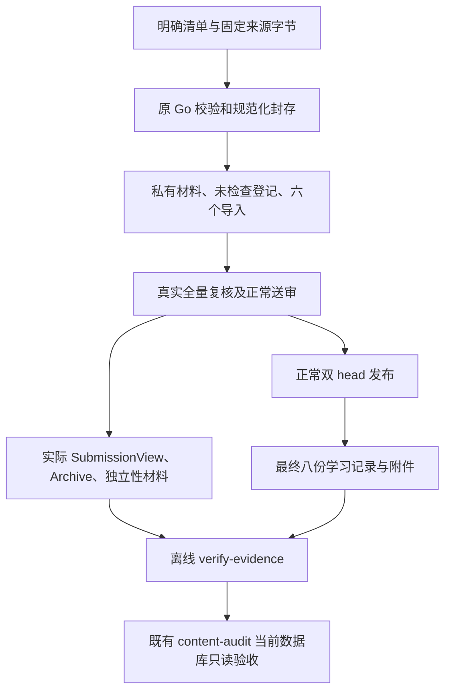

# 离线内容复核操作手册

`content-review` 仅处理明确文件，生成私有材料并核对证据一致性；不读取数据库连接配置，不联网，不初始化人员，不提交审批或发布。命令总期限 120 秒，原普通文件单读 8 秒规则保留。实现不改变现有 HTTP、题型、生成器、权限、判分、曝光、迁移及双 head 事务。

新增 `backend/internal/contentreview/` 负责全量范围、六导入、材料和证据；`internal/contentaudit/draft_selection.go` 捕获一次明确输入；`internal/cli/content_review.go` 与 `cmd/content-review/` 提供入口。共享题库扫描器增加仅供离线私有文件使用的 8MiB 解码入口，原 HTTP DecodeStrictJSON 仍为 4MiB。



以下命令从仓库根执行。`$REPO` 应填写规范绝对仓库路径，`$SNAPSHOT` 为已冻结的 P6a 私有快照；所有目录各层均不能为符号链接。`$CODE_SHA` 记录真实使用的完整 40 位代码提交，不能用后续文档提交替换。输出使用既有忽略的 `.superpowers/review/`，务必保留所需包，Native 执行工作目录清理不包含该目录。

```sh
REPO=/absolute/canonical/math_master
SNAPSHOT="$REPO/content/snapshots.local/p6a-20261004T045040522486Z"
CODE_SHA=$(git -C "$REPO" rev-parse HEAD)
mkdir -p "$REPO/.superpowers/review"
node tools/verify/run.mjs --cwd backend -- env CGO_ENABLED=0 GOTOOLCHAIN=go1.27.1 go run ./cmd/content-review prepare \
  --root "$REPO" \
  --input-manifest "$REPO/content/review/elementary-foundations.input.v1.json" \
  --snapshot "$SNAPSHOT" \
  --source-report "$SNAPSHOT/source-report.json" \
  --source-map "$REPO/content/source-maps/elementary-foundations.v1.json" \
  --route elementary-foundations --version 1 --code-sha "$CODE_SHA" \
  --out "$REPO/.superpowers/review/p6b-prepared-new"
```

使用固定 snapshotId `eebca0e9f8cbe8ce9afbed5f1f872f382f54e42b8004fcb57d23d05b99ff879a`、报告 SHA `7bd7c12118b915bc0a0ae4398b8018f1ba76e305736703a0617802677c7874ad`；初始映射原字节 SHA `26da1e09d9249d7642e6cd26d3ee4014304184acf53569ef24702cdda20d64b0`，修订映射按实际新 SHA 登记并保留旧文件。不重新读取持续更新的 Knowledge_JSON；八项高级资料差异继续隔离。合成来源测试必须显式 `--fixture-only`，正式用途中禁止取消夹具标记。

输出包括 `review-manifest.json`、初始登记与分片、`sources.json`、知识和五题包导入、五主题的全部材料及九图。清单保存准确身份、必需检查、来源、参数实例和输入/不可变输出摘要。登记根/分片不列入 manifest.files，避免相互摘要循环；其根绑定最终 manifest SHA，各分片 SHA 单独核对。复核请按[全量清单](../content/p6b-review-checklist.md)完成最终副本。

导入只有现有 publication.DraftInput/question.DraftInput 的字段。知识 SVG 使用捕获的同字节 Base64；同知识版本/批次/路径/文件 SHA 的出处合并，记录、旧 ID、用途和条件完整写入 Note/LegacyID。路线汇总的出处沿用已有准确知识关联，完整关系留在 sources.json；仅路线引用且无知识关联时拒绝导入。

正式人员在正常工作区导入并固定送审，服务器产生作者、submissionId、frozenDigest 及决策。保存实际 SubmissionView；题库保存发布后的正常 Archive，程序按冻结 InstanceIdentities 顺序重排后复算原 CanonicalFrozen。知识用原 FrozenDigest。不能用文件原字节 SHA 代替冻结摘要，也不能预填审批字段。

将整个不可变复核包保留在 evidence-root，另存实际冻结导出、负责人签署/构建证明和最终登记。`ReleaseContext` 含 schemaVersion=1、codeSHA、catalogueVersion/SHA、route（ID/version/SHA）、knowledgeHead/questionHead（ID/SHA）、manifestSHA256、fixtureOnly、buildRecord、attestedBy、attestation；文件引用均 `{path,sha256}`，path 为根内安全相对路径。未落实双 head 时可同时留空并保持待复核，半填身份拒绝，不能生成验收证据。

`EvidenceInput` 含 schemaVersion=1、releaseContext、reviewRegister、bindings[]、learningChecks[]。binding 含 space（knowledge/questions）、实际 submission 文件引用、题库 archive 引用、independenceVerified 和本人签署材料引用。程序只能核对文件与承诺一致，负责人须另核验独立自然人及真实构建。

八个学习名称必须精确为 reading、pass、fail、prerequisites、review、practice_exposure、retake、feedback_correction。每个 LearningRecord 保存 schemaVersion=1、name/result、完整 ReleaseIdentity context、executedAt、steps[action/expected/observed]、attachments[]、attestedBy、attestation。result 为 passed/failed/not_run；预期拒绝场景观察正确也可 passed，错误行为应 failed，不能按名称自动更改结果。代码、目录、路线、任一 head 或夹具标记变化后，受影响检查重新实际执行。

```sh
node tools/verify/run.mjs --cwd backend -- env CGO_ENABLED=0 GOTOOLCHAIN=go1.27.1 go run ./cmd/content-review verify-evidence \
  --evidence-root "$REPO/.superpowers/review/p6b-prepared-new" \
  --review-manifest "$REPO/.superpowers/review/p6b-prepared-new/review-manifest.json" \
  --input "$REPO/.superpowers/review/p6b-prepared-new/evidence-input.json" \
  --out "$REPO/.superpowers/review/p6b-verification-new"
```

| 退出码 | 含义 |
| --- | --- |
| 0 | prepared 或 evidence_ready；后者仍非正式 accepted |
| 3 | awaiting_review；没有 acceptance-evidence.json |
| 2 | 契约/身份非法，或实际执行结果 not_ready |
| 1 | IO、预算或取消失败 |

未检查、缺独立性、签署、实际构建、双 head 或任一 not_run 只写私有校验报告。完整复核及八份实际文件才生成原 schemaVersion=1 acceptance-evidence.json；已执行 failed 保留为 not_ready。输出另有中文说明和无人员路径的文件摘要清单。stdout 仅状态、数量、fixtureOnly 与 SHA；stderr 为稳定原因码。

| 预算 | 上限 |
| --- | --- |
| 输入清单 | 64KiB |
| 来源元数据/映射/单 corpus/SVG | 4MiB / 256KiB / 64MiB / 1MiB |
| 新私有 JSON/材料/登记单文件 | 8MiB；登记及材料最多100项，超过再分片 |
| 输出 | 256文件含完成标记、合计256MiB；目录0700、文件0600 |
| 证据读取 | bindings最多20；学习附件合计最多64个、单个8MiB；全读取合计256MiB |
| 原工作流 | 原知识/题库逻辑包、请求及封存预算全部保持 |

输出目录必须全新，Mkdir 原子保留，独占创建文件，完成标记最后写；失败只清理自身目录。拒绝路径逃逸、symlink、FIFO/设备、重复键、未知字段、非法 UTF-8/NUL、超范围整数及变动输入。不复制收藏 corpus 正文到复核包或公共仓库，含答案、人员、案件及环境材料始终私有。

准备段技术回归不等于 R1—R4 完成。真实环境/人员/许可结论未落实时整体 P6b 仍 awaiting_review；正式结果须由原 content-audit 在当前双 head 的单个只读一致事务中实际 accepted、fixtureOnly=false。此计划不部署 P7，也不授权代理代人审批。

## 已有路线的导入前置

正常工作流技术对照保留不可变规则：旧示例已经使用 `elementary-foundations/v1` 时，新三十节点路线以相同 ID/版本导入必须冲突。首次路线导入的正例只在尚未占用该版本的随机隔离库运行；没有清空或覆盖旧路线。正式环境若已有该旧版本，在 R2 追加准确路线版本并同步输入清单、对象来源映射及复核 manifest，重新全量复核后送审。不能为了导入通过删除正式数据。
