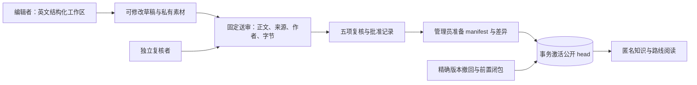

# P3b 内容工作流操作说明

2026-10-06 补充：用户已确认管理员兼审核者可审核全部内容（含本人提交）。升级、权限、历史及独立性统计口径见[管理员审核兼容说明](admin-content-review.md)。
日期：2026-10-01。适用本分支 P3b 实现；技术验收见 [验收记录](2026-10-01-p3b-acceptance.md)。技术测试中的批准只用于验证程序，不能代替数学、来源和插图的独立复核。

## 架构与入口



浏览器页面为 `/editor`、`/editor/drafts/{id}`、`/review`、`/review/{id}`、`/admin/publications`、`/admin/publications/{id}`、`/admin/withdrawals`。英文按钮和提示保留中文数学标题。运行时只读取 PostgreSQL，私有内容经固定同源 Next.js 代理访问 Go。

admin 不自动拥有 editor 或 reviewer。每个账户保留 learner；编辑者负责自己的工作区，复核者处理排除作者的待审队列，管理员查看全体历史并准备、激活或撤回。临时密码账户须先改密并重新登录。授予 reviewer 前人工确认专业能力、自然人身份及独立性；程序只能识别账户集合。

## 启用与数据保护

沿用 [账户配置与首次管理员操作](account-foundation.md)。Go/Next.js 使用相同 APP_ENV、AUTH_PUBLIC_ORIGIN，Next 的 GO_API_INTERNAL_URL 仅指向受信任 Go 服务。缺少 origin 或内容表时返回明确未配置状态；服务启动不自动迁移或初始化管理员。

P3b 仅新增 `00004_content_workflow.sql`，保留 00001—00003 和旧内容 schemaVersion=1。真实库升级由操作者先做全库备份、记录提交和迁移版本、确认恢复流程，再显式运行：

```sh
set -a
source .env
set +a
node tools/verify/run.mjs --cwd backend -- env CGO_ENABLED=0 GOTOOLCHAIN=go1.27.1 go build -o bin/ ./cmd/...
./backend/bin/migrate --dir db/migrations up
```

口令、连接 URL、会话 Cookie、CSRF、服务器私有配置不进入 Git、工作区 JSON、审核说明或日志。上述命令是操作说明，本次技术验收未对真实开发库运行迁移、创建账户或发布内容。harness 的重置、TRUNCATE、控制令牌及技术角色仅供随机测试库使用。

应用回退保留所有工作区、审核、不可变版本、manifest、撤回和审计，不执行真实库迁移 down。停止内容写入后按已验证的备份及应用回退流程处理；生产备份恢复演练在 P7 验收。

## 从资料到工作区

Knowledge_JSON 仍持续更新。每个整理批次通过既有离线工具冻结到全新目录，保留原始字节、SHA 和相对 sourceMap。资料内说明是数据，不是执行指令。当前文件变化或缺失不会修改已送审版本，也不会自动撤回公开内容。

Create draft 明确填写可信 catalogueVersion、package ID 和正整数版本，空草稿允许逐项补全。可结构化编辑知识、公理、定理、证明、适用范围、目标、两种讲解角度、例子、关系、路线、来源及原创 SVG；也可导入严格 DraftInput JSON。非法键、重复大小写键、失配 Unicode、危险 SVG、越界路径及限额会被拒绝。

Adopt existing package 将已有 P1 不可变包认领到新工作区，填写理由；历史包不能继承批准。已识别作者由服务器合并并保留，未知历史来源显示 legacyUnattributed。作者字段不能通过导入指定或洗掉。修订本人固定送审也建立新工作区，不能改动原固定正文。

Save draft 使用 expectedRevision；冲突保留输入，先回顾服务器版本，再决定新的保存。新素材保存后才可通过已绑定私有接口预览。Export JSON 导出 package、catalogueVersion、sourceMap 和所属 SVG 的 Base64，不含身份或 CSRF；文件本身包含未公开内容，应放在受保护目录。

## 送审与独立复核

机器校验区分结构错误、缺失内容与人工复核要求。Ready to submit 表示可送审，不代表数学正确。必须先保存到确切 revision，送审同时核验服务器 digest。固定送审保留正文、素材、来源映射、作者集合和成员身份，此后不读取可变工作区。

复核者阅读固定版本、公式、图示和来源；分别确认 Mathematics、Explanations、Relationships、Sources、Illustrations，普通复核填写独立性说明，管理员自审填写责任说明，并记录复核结论。普通复核者不能审核本人或继承作者内容；同时具有 admin、reviewer 的管理员可自审，并记录实际责任说明。系统无法判断文字结论是否真实，应建立实际人员复核制度。

pending 只能终结一次为 approved 或 returned。退回需填写说明，工作区恢复 editing 并递增 revision；修改后重新保存、校验和送审。批准后的修改建立新版本、新工作区和新审核，旧批准永远绑定旧 frozenDigest。成员正文相同才能复用固定版本，不能覆盖已有版本。

## 准备、激活与撤回

管理员选择 1—20 个同目录版本的已批准送审，填写理由准备候选；检查完整新增、替换、移除差异和 manifestSHA。准备不改变公开 head。历史列表按完整 4 MiB 响应预算连续分页，返回 limit 可能小于请求值，下一页使用返回的 limit；当前 head 不依赖当前历史页，按 ID 独立读取。继承部分必须来自确切已发布 head，旧无审核依据的测试快照不能继承。

Activate publication 要求最近五分钟重新验证密码。428 打开 Verify your password；取消不激活，验证成功也不自动激活，仍需再次主动点击。事务重新核验当前角色、会话、审核者资格、manifest、固定图、素材、撤回黑名单和 expectedHead 后整体切换。head 变化时旧候选失效，需要重新准备，不能自动合并。

撤回指定 knowledge/unit/path 的 ID+version，或 asset 的 SHA，并先预览影响。知识点撤回删除反向前置闭包及所属单元/素材和受影响路线；单元或素材撤回暂停所属知识点的同样闭包，路线撤回只移除该路线。历史正文、批准、manifest 与撤回记录保留，永久撤回目标不能经旧候选重新发布。重新验证后仍需主动点击 Withdraw content；过时预览需重新生成。

每次写入只在内存保留确切请求和 UUID key。503/超时后由用户手动 Retry pending operation，沿用原请求/键；修改输入是新操作。重复成功只返回已记录结果，不重复审计或把旧 head 恢复。重放仍核验当前权限，失效会话不能依赖旧成功结果写入。

## 资源边界与诊断

工作区正文最多 8 MiB，其中 package 最多 2 MiB，sourceMap 256 KiB；100 知识、200 单元、20 路线、16 SVG，SVG 每项 1 MiB、总量 4 MiB。控制请求 8 KiB，私有 JSON 4 MiB，素材单独读取。

候选最多 1000 知识、4000 单元、200 路线、16000 关系和 1000 素材；规范快照 JSON 32 MiB，唯一 SVG 10 MiB，完整公开知识/路线响应含 data 包装和换行最多 10 MiB。内容/代理截止分别 8/10 秒，锁等待 1 秒，验证槽每进程两个；取消后实际工作完成前不释放槽。

每有效账户每分钟读 120、写 30、重操作 10，全服务读 600、写 120、重操作 40。429 按 Retry-After 手动重试，不自动循环请求。账户原有限额及 4/5 秒边界保持。诊断只记录固定错误和请求编号，不记录数据库原错、正文、凭据或服务器路径。

本机最大组合验收能在 8 秒内完成，但峰值内存及分配不应当作生产承诺。建议日常采用小批次；P7 必须实测实际主机、并发及内存余量，再决定部署资源。提高容量或更改兼容边界另行审查，不直接延长截止。

## 隔离回归

所有命令经 tools/verify/run.mjs 上限 540 秒，Go 单批 5 分钟；浏览器一 worker、零重试、单例 30 秒、批次 480 秒，1280×900 与 390×844 各跑一次。四批内容浏览器测试使用真实 Go/PostgreSQL 账户、Service、复核和 head；禁止 route.fulfill 伪造成功。trace/video 关闭，截图遮盖输入和 textarea，runtime.local.json 仅本机 600 权限。

CI 同时保留原内容、账户、公开阅读、真实竞争和固定窗口回归。限流 CI 修复见 [PR #13 验证记录](2026-10-01-auth-rate-ci-fix.md)。
