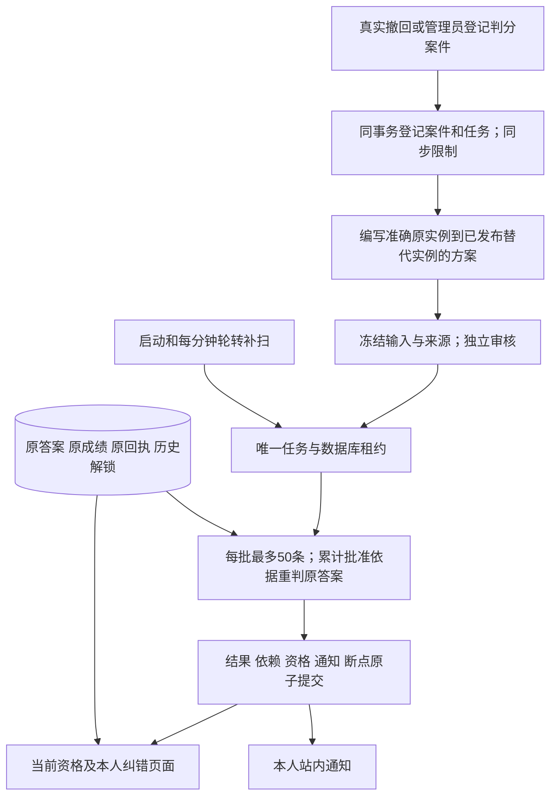

# P5b 纠错、独立重算与通知操作说明

本文描述本次开发的行为和恢复边界。测试只使用本机随机隔离数据库；生产迁移、部署、二进制回退及灾备演练仍由 P7 单独验收。

## 来源与处理链

撤回案件引用内容或题库中真实、永久的撤回事件和准确摘要。判分案件由管理员登记已注册的规则版本 1，可作用于全部知识或一个准确知识版本。范围截止使用数据库时间和原尝试的 created_at；截止前建立、截止后才提交的检测仍受影响。反馈的 resolved 或 revision_published 状态不能批准纠错。



editor/admin 可创建及编辑草稿，创建者可送审。reviewer/admin 决策时必须与创建者、实际草稿编辑者及所有涉及数学来源的作者独立；实际角色、会话、改密状态和所需近期认证在提交前重新核验。方案冻结准确原/替代实例、原/替代模板、实际参数、发布及独立批准事实。审批后正文不可修改；后续修订另建版本。

原题意、选项 ID/文本/顺序、输入格式、素材摘要、参数、知识身份和核心覆盖保持一致时，才允许只改变答案或解析。规则版本 1 仍为五题、至少四题正确，精确有理数或单选，skipped 计错误。不能缩小分母、换题、重解释原答案或迁移旧知识版本资格。父结果和本次映射共同从原答案出发；同一位置有不兼容的批准分支时等待审查，不按时间挑选胜者。

## 六种结果与当前资格

| 存储状态 | 英文界面含义 | 资格行为 |
| --- | --- | --- |
| corrected_passed | Corrected passed | 五题全部有效、覆盖完整并实际达到4/5时才追加纠错资格事件 |
| corrected_failed | Corrected failed | 确定重判仍未通过，不授予资格 |
| retake_required | Retake required | 无准确替代、题意或覆盖改变、有效题不足五题等情况需重测，分数为空 |
| review_material | Review material | 阅读证据受影响，需要回顾准确材料，不伪造阅读完成 |
| checked_unaffected | Checked unaffected | 检查后该证据无需改判，不伪造新的通过事实 |
| awaiting_review | Awaiting review | 缺独立批准或依据冲突，继续限制 |

当前资格统一计算原有效通过与有效纠错通过，仍受所有未处理案件、当前知识版本、撤回和曝光限制。历史解锁保留原来源，当前节点是否可推进由当前有效资格派生。诊断通过不会伪造阅读完成。原检测成绩、答案和学习提交回执字节保持不变，Original result 与 Corrected result 可分别回顾。

所有列表、任务、通知和写回执只有安全元数据。题面、答案、自由说明必须主动读取受保护详情；本人只能读取本人结果。准确原或替代实例/模板与未到期检测重合时拒绝交付，宽判分范围对该范围内所有活动检测阻断答案详情，不受历史 cutoff 限制。允许交付前在同一事务登记曝光，供题仍遵守既有30分钟冷却。

## 私有请求与恢复

私有响应使用 no-store。新请求最多65536 bytes，完整响应最多2097152 bytes；分页默认20、最大50，先权限条件再游标。服务端请求/单条事务最多8秒、锁等待1秒；客户端和 Next 的10秒总截止包含当前身份核验和后续读取。

命令第一次执行前冻结输入和 idempotency key。超时或响应丢失时只提供用户主动的 Retry same request；不自动重发 POST。POST 已确认但后续 GET 失败时明确显示已保存，保留原 key 和输入以恢复视图。身份确认期间旧私有子树隐藏；换账户、角色变化、会话撤销或强制改密时清除旧草稿。私有输入不写 localStorage、sessionStorage 或其他持久浏览器存储。

成功滑动窗口为数据库时间 `(now-1h, now]`：create 20/h、process 120/h、retry 20/h、notification-read 300/h。失败和同键成功重放不重复消费。通知按真实来源去重，首次已读时间由数据库确定，重放保留首次时间。后台系统处理不伪造用户会话、不消费人员额度。

## 常驻 worker、有限命令与任务恢复

CORRECTION_WORKER_ENABLED 缺省为 true，仅接受字面 true/false。false 关闭常驻处理，但同步限制、schema 核验和个人读取保护继续生效。显式有限维护命令可在常驻关闭时运行，仍遵守全部事务、归属、租约和 fencing 守卫。

常驻 worker 并发固定1，共用 server 原十连接池，正文和续租最多同时占两条连接；没有新的常驻服务或连接池。每批最多50条，共享30秒截止，单条事务采用8秒与剩余时间的较小值。数据库租约30秒、续租间隔10秒，旧令牌在提交前失效。取消或续租失败时等待正文提交/回滚结束；server 停止接收新请求，等待在途 HTTP、worker 和账户清理退出后关闭数据库。

启动与每分钟补扫总预算50个任务，按案件轮转，同时补真实撤回缺失根任务、已批准方案任务及逐证据终结任务。NOT EXISTS 在 LIMIT 前，已有根任务或根扫描成功不能掩盖后续才终结的旧尝试。每次正常分页续跑保留断点，不消费新的失败尝试。

一个 epoch 总共最多8次自动尝试，七次退避依次5、10、20、40、80、160、300秒。第八次失败后不再自动运行；管理员可按当前 sequence 手动重试，追加 epoch，保留游标、累计处理数和历史错误事件。日志只记合法 job ID 和固定错误类别。

下面是授权后的有限命令示例，需要从受保护环境加载 DATABASE_URL，不能把真实凭据写进仓库或命令行：

```sh
cd backend
CGO_ENABLED=0 GOTOOLCHAIN=go1.27.1 go run ./cmd/correction-maintenance --batches=1 --limit=50
```

参数范围 batches=1..10、limit=1..50，缺省分别1、50。没有可认领任务时提前结束；输出 JSON 的 batches/claimed/processed 和 lastBatch 如实描述本次执行，未认领时 lastBatch=null。退出码0表示本次有限运行成功，1表示配置/处理失败，2表示参数错误。一次有限运行不代表全库已完成，继续读取元数据或再次显式运行有限批次。

## 数据库健康、迁移与回退

00008 新增 correction_cases、correction_plans、correction_jobs、correction_results、correction_dependencies、correction_events、correction_idempotency、correction_rate_limits、notifications、notification_reads 十表。旧00001—00007完整字节与数学摘要用途不变。

每个事务核验十表、必需列、版本8及永久 correction_enabled 标记，并在 PostgreSQL 17.11 catalog 核验125个约束的定义与有效状态、17个触发器的表/函数/延迟绑定、19个函数签名和纠错资格唯一索引。结果不缓存。缺表、禁用/错绑触发器、缺函数、约束变弱或未验证等都使个人学习及纠错/通知入口拒绝服务，不能通过关 worker 绕过。

从未启用过的旧数据库保留旧学习行为，新增功能报告未配置。曾经启用的数据库即使十表被删除，永久标记仍要求 fail closed。空 Down 保留该标记，必须重新完整 Up 后才能恢复个人学习；任一十表非空时 Down 在删除前整体拒绝。不得手工清标记、删审计行或关闭守卫来获得假恢复。

保留原数据并先定位缺失的 schema 对象或失败任务；由后续授权的迁移流程恢复准确00008定义，核验全部守卫及独立来源，再启用处理。资格恢复来自当前有效证据派生，不能覆盖原答案、成绩、回执或历史解锁。

P5a 旧二进制不识别判分案件。若后续必须回退，保留 P5b 数据库，在网关/维护层默认拒绝个人学习、练习、检测、资格、账户、管理、全部私有读取和写入；只允许已核验的公共只读目录/素材和 health/ready 白名单。关闭常驻 worker 不足以作为回退保护。维护隔离生效前不得让旧二进制接受真实个人流量；回到具备 P5b 保护的二进制、schema 核验通过后再恢复入口。本文没有声称已部署或演练该维护方案。

## 验收入口

[实施计划](../superpowers/plans/2026-10-03-correction-impact.md)保留完整原批次和新增批次；[本机验收](2026-10-03-p5b-acceptance.md)记录实际 SHA、命令、退出码、耗时、数量和脱敏截图；[一次独立审查](2026-10-03-p5b-final-review.md)记录分级、裁定及修复。产品 PR 只交付 draft，最新完整 head 的 Go/前端 push/PR 四个 workflow runs 及全部 jobs 成功后才报告远端验证完成。
