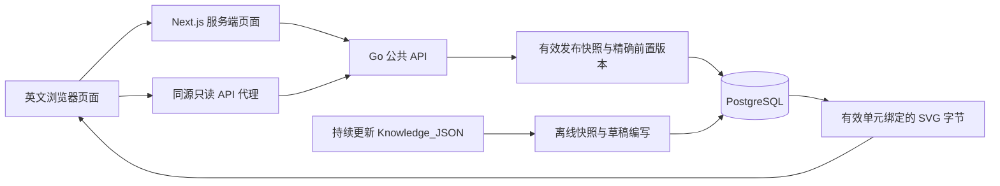

# P2 英文只读网站操作说明

页面包括学习首页、16 板块知识地图、板块详情、固定版本路线和知识阅读。界面以英文为主，保留中文术语对照；只消费真实 Go API。目录为 16 板块、56 主题。现有 10 个知识点均为草稿，其中 9 个是编写骨架；实际公开数学内容仍为 0。阅读、公式和 SVG 的联调使用随机隔离数据库，不能作为独立数学审核或生产种子。

## 架构与文件



`frontend/src/app/` 定义路由；`src/lib/api/` 负责契约、响应校验、5 秒超时和固定上游；`src/features/` 负责目录与安全阅读。公开 JSON 最大 10 MiB，SVG 最大 1 MiB。Markdown 禁用 HTML，文字链接只允许 HTTPS 或同源相对路径；图片必须是单元绑定的素材。KaTeX 使用本地字体，关闭信任、自定义宏，限制展开与尺寸，单条公式最大 4096 字符。所有公共读取禁用数据缓存。

`backend/internal/e2etest/` 与独立的 `cmd/e2e-harness` 只用于测试，正式 `cmd/server` 不导入它；`tests/e2e/` 管理真实生产构建的浏览器回归。CI 使用与 P1 相同的固定 action SHA，失败报告使用 [upload-artifact v7.0.1](https://github.com/actions/upload-artifact/releases/tag/v7.0.1) 的固定 SHA，仅保留失败截图和报告 7 天。

## 本机启动

工具版本：Go 1.27.1、Node 24.17.0、PostgreSQL 17.11。前端依赖由 `frontend/package-lock.json` 精确锁定。先按 [P1 操作说明](content-foundation.md) 启动数据库、显式迁移、导入草稿。所有 Go 调试保留 `CGO_ENABLED=0`。

在项目根的一个终端：

```sh
set -a
source .env
set +a
node tools/verify/run.mjs --cwd backend -- env CGO_ENABLED=0 GOTOOLCHAIN=go1.27.1 go build -o bin/server ./cmd/server
./backend/bin/server
```

在第二个终端，将 `frontend/.env.example` 复制为被忽略的 `frontend/.env.local`，内容如下：

```dotenv
GO_API_INTERNAL_URL=http://127.0.0.1:8080
```

该地址只属于服务端配置，不能改为 `NEXT_PUBLIC_*`。必须是 HTTP/HTTPS origin，不能包含凭据、路径、查询或片段。前端不会读取服务器私有配置或本地资料目录。

```sh
node tools/verify/run.mjs --cwd frontend -- npm ci
node tools/verify/run.mjs --cwd frontend -- npm run build
cd frontend
npm run start -- --hostname 127.0.0.1 --port 3000
```

浏览 <http://127.0.0.1:3000>。只有草稿时，所有板块显示 `In development`、公开知识数 0，路线区域显示建设中。公开 API 对草稿知识、路线和素材返回 404。Next.js 流式页面可能使用 HTTP 200 承载不可用页，并插入 noindex；页面验收检查不可用提示，数据接口严格检查 404。未连接数据库或上游不可用时显示暂时不可用，不回退设计样例。

关闭各服务终端用 Ctrl+C。需要停止本机数据库时执行 `docker compose -p math-master-p1 -f compose.dev.yaml stop db`；保留卷与资料快照，不运行带 `-v` 的删除命令。当前阶段不连接远程服务器、不部署，生产上线仍属 P7。

## 本机验证

从项目根加载私有 `.env`（不输出其值），每条验证最多 540 秒。Playwright 总时限 480 秒、单例 30 秒、单 worker、零重试，分别使用 1280×900 和 390×844 Chromium。生产 Go 与 Next 构建必须先生成：

```sh
set -a
source .env
set +a
node tools/verify/run.mjs --cwd backend -- env CGO_ENABLED=0 GOTOOLCHAIN=go1.27.1 go test ./... -timeout 5m -count=1
node tools/verify/run.mjs --cwd backend -- env CGO_ENABLED=0 GOTOOLCHAIN=go1.27.1 go build -o bin/ ./cmd/...
node tools/verify/run.mjs --cwd frontend -- npm run api:generate
git diff --exit-code -- frontend/src/lib/api/generated.d.ts
node tools/verify/run.mjs --cwd frontend -- npm run typecheck
node tools/verify/run.mjs --cwd frontend -- npm test
node tools/verify/run.mjs --cwd frontend -- npm run build
node tools/verify/run.mjs --cwd frontend -- npm audit --omit=dev
node tools/verify/run.mjs --cwd frontend -- npm exec -- playwright install chromium
node tools/verify/run.mjs --cwd frontend -- npm run e2e
```

Linux CI 安装浏览器时额外使用 `--with-deps`。测试不会复用已有服务；端口 18080、18081、18082 必须空闲。本机若同时设置 NO_COLOR 和 FORCE_COLOR，可在验证命令后加 `env -u NO_COLOR` 消除环境冲突。

`TEST_DATABASE_URL` 必须命名 `math_master_test_*`，连接角色须能建库；不能使用生产数据库角色。每次 harness 创建独立随机库，只操作自己创建的库，正常 SIGTERM 后使用新的 3 秒 context 清理。控制端口只绑定 loopback，场景改变必须携带随机令牌。状态文件 `tests/e2e/runtime.local.json` 使用 0600，包含随机库名称、端口、测试素材摘要和临时令牌，不包含数据库 URL，受 Git 忽略。不要上传状态文件；浏览器报告关闭 trace，CI 仅上传失败报告。

## 异常终止后的受保护恢复

SIGKILL 无法保证清理。若残留状态文件，先停止本次 harness 和前端进程，保留文件供核对；不得按前缀批量删除数据库。以下命令只删除状态中本次随机生成的 16 位十六进制数据库；需要已安装 `psql`，使用当前测试连接的管理库，凭据通过环境传递，不放入命令参数。若无法确认状态属于本次测试，先核对进程和记录，不执行：

```sh
python3 - <<'PY'
import json, os, re, subprocess
from pathlib import Path
from urllib.parse import urlsplit, urlunsplit
state = Path('tests/e2e/runtime.local.json')
name = json.loads(state.read_text())['database']
assert re.fullmatch(r'math_master_test_[0-9a-f]{16}', name)
u = urlsplit(os.environ['TEST_DATABASE_URL'])
assert u.scheme in ('postgres', 'postgresql') and re.fullmatch(r'/math_master_test_[a-z0-9_]+', u.path)
admin = urlunsplit((u.scheme, u.netloc, '/postgres', u.query, ''))
env = dict(os.environ, PGDATABASE=admin)
subprocess.run(['psql', '--no-psqlrc', '--set=ON_ERROR_STOP=1', '--command', f'DROP DATABASE "{name}" WITH (FORCE)'], env=env, check=True)
state.unlink()
PY
```

若自动清理失败，harness 会保留状态而非悄悄删除恢复依据。数据库仍运行、正常测试结束时随机库和状态文件应同时消失；开发库与其数据卷保留。
