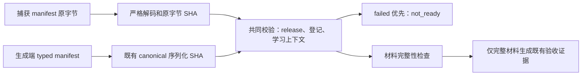

# P6b 唯一整分支审查及主执行者处置

审查者：fresh `/root/p6b_final_whole_branch_review`，gpt-6-astra/high，fork none。范围为 master `b78108d3dd363eae237dae59f76a7be774b9de85` 到实现及完整本地矩阵提交 `fc0bd30c6789de70733ba467efe729dc8c4abe64`。本文件保存独立报告摘要和主执行者裁决，不表示另一次独立审查。

独立审查结果：Critical 0、Important 2、新增 Minor 0；原始 Ready to merge 为 **No**。两项必须修复后做相关全套回归及准确最终 head 远端 CI。按 Native 约定只执行一次修复，不再派 reviewer。根审查结论不会被后续处置覆盖。

## 两项 Important

| 项目 | 实际问题与影响 | 主执行者裁决 | 验证要求 |
| --- | --- | --- | --- |
| I1 / P2 | `evidence.go` 将 typed manifest 再序列化求 SHA，CLI 丢弃捕获的 manifest 原字节。合法格式化后的文件仍绑定旧摘要时错误通过，正确绑定新原字节摘要反而被拒绝；真实 CLI overlay 已复现。 | 接受 Important；不能通过禁止空白/字段重排规避。离线文件入口保留同一 captured bytes，用其解码和求 SHA，贯穿 release、登记根/分片及学习上下文。 | CLI 和纯层覆盖 canonical、空白、字段重排；原字节正确绑定通过、旧绑定拒绝且无输出；报告仍保存实际原字节 SHA。 |
| I2 / P2 | 已执行 `failed` 与缺学习记录、`not_run`、缺构建或缺审核绑定并存时，主状态/退出码仍是 awaiting_review/3，掩盖已知失败；虽然未伪造通过证据，仍违反 failed→not_ready。 | 接受 Important；失败状态优先于等待，完整性仍单独决定能否输出 AcceptanceEvidence。 | CLI 与纯层四类组合均 not_ready/2，保留失败和待补理由；不完整组合不写验收文件；完整 failed 仍保存既有失败证据。 |

修复范围：`backend/internal/contentreview/evidence.go`、`evidence_files.go`、既有 `evidence_files_test.go`；`backend/internal/cli/content_review.go`、既有 `content_review_test.go`；中文计划、运维手册及本目录证据。新增 `VerifyEvidenceFromBytes` 是私有离线入口，既有 typed `VerifyEvidence` 保留生成端 canonical 序列化约定。现有 HTTP/API、DTO、数据库、判分与预算保持原范围。

首次 RED 日志同时含一个测试断言错误：report 中内部 `Evidence` 标记为 json:"-"。已在产品修复前改为检查实际验收文件存在并重跑有效 RED，保留首次及校正日志，不以错误断言作为缺陷证据。

## 独立审查已核对的技术事实

284 项旧运行时/契约/内容基线与 master 一致；三处 helper 提取无已知回归；新 8MiB 解码入口仅离线，原 HTTP 4MiB 限制保持。审查者独立复算当时全部 96 份 gzip 日志压缩及解压 SHA，并复数 Go 1376 pass/0 fail/0 skip、浏览器 162、Node 81、前端 350 和六容量。新 Node 9 项及 diff 检查通过。既有十条实施 Ruling 已逐项审查；I1 正是 Task2/Task4 原字节约定未落实的一处消费端缺陷，需要本轮修复。

这些数据属于原实现矩阵，不重标为审查修复后或最后文档提交的测试。修复后相关全套 Go/Node、固定快照 smoke 及准确远端 head 将另存来源、日志与时间。

## Declined to judge 的八项裁决

以下是独立审查明确无法代替执行者或实际人员判断的事项；主执行者逐项保留边界并列出判断错误的成本。

Final: Ruling: 真实数学结论和205来源的实际出处/许可不由技术审查代替 — R2须由实际人员逐项核验，fixture不算批准 — 错误成本：人工结论错误会引入错题或不合许可的内容。
Final: Ruling: 自然人身份、能力、独立性与实际构建真实性由负责人核验 — 工具只验证材料和声明一致性，不提供密码学身份证明 — 错误成本：负责人误判会接受虚假承诺或错误构建。
Final: Ruling: 真实R1—R4初始化/批准/发布/accepted未在准备段授权执行 — 当前整体awaiting_review、正式计数0 — 错误成本：正式里程碑仍须后续完成，不能宣称上线内容已验收。
Final: Ruling: P7生产部署不属于本轮范围 — 不部署、不将fixture当线上环境 — 错误成本：后续仍需部署方案与运维执行。
Final: Ruling: 先前学习容量查询间歇超时原因尚未证实 — 查询实现未改变，本轮89.819s通过不等于根因修复 — 错误成本：超时可能复现，保留历史诊断并持续按原预算验证。
Final: Ruling: P6a blueprint SHA回退问题按已确认设计继续延期 — 新复核采用实际完整JSON及正常Store事实，旧实现不在本轮修改 — 错误成本：旧摘要语义歧义仍在，未来修复须专门兼容审查。
Final: Ruling: P6a中文摘要缺双head及逐节点原因按已确认设计继续延期 — 完整JSON保留追踪事实，旧摘要格式不变 — 错误成本：只读摘要无法完整定位，未来格式改进须审查。
Final: Ruling: 准确最终head远端CI及合并授权由主执行者实际核验 — 必须四workflow/六job全成功，现仅授权SSH推送与草稿MR — 错误成本：CI未成功则不能交付；未经后续指令不能合并。

## 修复与交付状态

两项 Important 已由主执行者在一次修复中解决：I1 定向纯层6.834s/CLI7.711s，I2定向纯层13.787s/CLI11.434s均GREEN。后审查全部16批Go1403个pass事件、fail0/skip0，81项Node全通过，六容量均按原预算成功。具体修复链和日志摘要见[结构化处置](review-fixes.json)、[后审查Go矩阵](matrix-go-post-review.json)与[后审查Node矩阵](matrix-node-post-review.json)。未启动第二次独立审查。SSH草稿[PR #27](https://github.com/yyl1212/math_master/pull/27)已创建；准确产品head `0f8aa1ab72c857a800a4da44328f4cd4824fe6b1` 四workflow/六job均实际成功，见[CI原始结构化事实](ci-product-head.json)。归档后再次核验最新完整head，具体动态结果保留在PR说明与交接答复；无合并或生产操作。

未新增 Minor。两项已明确延期的 P6a 问题仍保留在上方裁决，不伪称本次已修复。整体 P6b 仍 awaiting_review，fixtureOnly=true，正式数量为零，R1—R4 未执行。
