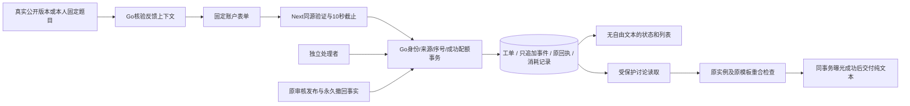

# 版本化反馈与处理操作说明

P5a 提供准确数学版本和网站区域的反馈、补充、五状态处理及可查回执。英文用户页为 `/feedback/new`、`/feedback`、`/feedback/{id}`；处理页为 `/review/feedback`、`/review/feedback/{id}`。P5b 的独立重算和站内通知另行设计，P6 正式内容质量与 P7 上线验收尚未完成。

## 来源和权限

知识、路线入口绑定当前公开发布的准确 ID/version/SHA。知识部位可以选择该来源实际关联的讲解或素材；素材使用 ID/SHA。练习和检测入口只接受自己的固定 item，检测位置为 1—5，生成实例保留 `qi-` 加 64 位摘要身份。工单成功创建后永久绑定原目标、来源、标题和位置，后续发布不迁移这些事实。

所有有效账户均可反馈；`reviewer/admin` 可以处理其他人的工单，`editor` 单独没有全体反馈权限。提交者不能处理自己工单；具有处理角色的提交者在自己的处理 URL 仍按 owner 权限显示。请求和事务提交前均重新核验当前会话、角色及强制改密状态。



## 状态、依据和异议

`new`、`processing`、`waiting_details`、`resolved`、`closed` 分别表示新建、处理中、等待补充、已解决和已关闭。新建可以转处理中、等待补充或关闭；处理中和等待补充可以转已解决、关闭或彼此转换。终态允许独立处理者重新开启为处理中。

提交者可以继续补充；新建和处理中保持原状态，等待补充、已解决和已关闭均重新进入处理中并清除当前依据。处理者保持原状态回复时沿用当前依据，历史事件的新依据字段为 `null`，不得重新提交一份终态依据。

| 目标状态 | 依据 | 核验 |
| --- | --- | --- |
| resolved | clarified | 完整解释及处理理由 |
| resolved | withdrawn | 原准确对象已有真实永久撤回事实 |
| resolved | revision_published | 原对象已撤回，修订已独立批准并属于当前发布；生成实例须使用不同 ID |
| resolved | service_fixed | 仅 site 网站问题 |
| closed | duplicate | 另一不同工单具有相同准确目标和分类 |
| closed | not_reproducible、out_of_scope、suggestion_recorded | 必须填写处理理由 |

撤回和修订使用现有 P3/P4a 流程，本模块核验事实，不直接批准数学内容。根知识和路线修订保持稳定 ID；讲解或素材修订必须属于对应知识。修订链接及反馈状态不能恢复学习资格、改写原答案、成绩或历史解锁。重复报告的另一个私有工单编号对提交者隐藏，即使访问自己的 review URL 也隐藏。

## 文本、曝光与分页

列表、单工单元数据、所有写入及同键重放只包含安全元数据，没有标题、位置、正文或预览。用户主动点击 `Read discussion` 才读取文本，每页最多 50 条；每次分页都会重新鉴权并检查准确原实例和原模板。当前有未到期检测与之重合时返回 `FEEDBACK_ANSWER_OVERLAP`（409），不交付标题、位置或回复，过期但未清理的 active 行不阻断。所有读者，包括处理者，都遵守该规则。

允许交付的题目讨论在同一数据库事务、提交前记录该读者的准确实例和原模板曝光。曝光失败则丢弃整个响应。讨论只按 React 纯文本展示，保留换行，不执行 HTML，不生成外部链接、图片或上传入口。

列表使用 `(created_at,id)` 边界，事件使用连续 sequence 边界，支持同微秒事件。version=1 游标最长 512 ASCII 字节，只携带边界；合法的其他账户边界不能扩大权限。线程没有总回复条数上限，超过 50 条仍可补充和结案。

## 成功配额、幂等与故障

配额使用数据库时钟和 `(now-window,now]`：每账户创建 5 次/15分钟及20次/24小时，owner 补充30次/小时，处理120次/小时。只有成功且实际追加事件的动作消耗一次；失败或同键原回执重放不消耗。429 提供绝对 `retryAt`，不要靠刷新或换键自动重试。

点击时先冻结账户、输入、路由和 UUID v4 幂等键。10 秒包括新身份核验和发送，Go 事务8秒、锁等待1秒；Next 包装请求同样10秒。仅用户主动点击 `Retry same request` 重放原键及原输入；工单已推进时仍返回原成功 sequence，当前投影不倒退。编辑输入是新命令，切换账户、撤权、卸载页会清除旧草稿和待确认命令；不使用 localStorage 或自动补发。

请求上限65536 bytes，JSON响应2097152 bytes。字符串按 trim 前 Unicode 标量计数：标题1—120、正文/回复1—4000、位置0—400；拒绝额外/重复JSON键、无效UTF-8、NUL和孤立代理项。私有响应使用 no-store，错误只含稳定错误代码、固定信息、请求编号及合法重试时间，不回传内部异常。

## 迁移、二进制回退和恢复

新增迁移仅 `db/migrations/00007_feedback_workflow.sql`，建立 `feedback_tickets`、`feedback_events`、`feedback_idempotency`、`feedback_rate_limits` 四张表及约束。00001—00006字节、旧75路径/192schema/32响应/3安全方案、数学摘要用途保持。服务启动不自动迁移。经 P7 备份、目标核对和维护窗口验收后才执行既有工具：

```sh
CGO_ENABLED=0 GOTOOLCHAIN=go1.27.1 go -C backend build -o bin/migrate ./cmd/migrate
./backend/bin/migrate --dir db/migrations up
```

缺少00007或任一反馈表时，反馈返回 `FEEDBACK_NOT_CONFIGURED`（503）；原公开和学习功能仍可使用。已拥有的学习层曝光保护不随反馈故障放松。恢复时检查迁移版本、四表完整性及迁移日志，再正确应用完整迁移；不能删除工单、事件或学习事实来绕过故障。

00007 的 Down 仅在四表全部为空时允许，任一合法非空状态均拒绝，且不会留下部分回退。已有反馈数据时回退应用二进制并保留四表；保留备份和迁移记录，重新部署兼容的二进制后恢复读取。不可删除原事件、回执、消耗或撤回事实以迎合旧程序。生产恢复演练属于 P7，本次只在隔离随机测试库验证。

## 验收范围

真实 Go/PostgreSQL 和两视口浏览器验证反馈来源、独立处理、永久撤回、新生成实例修订、补充重开、长线程、答案重合、纯文本、换账户和已提交响应丢失时的同键重试。历史容量为数据库约束保持启用的查询夹具，不能声称绕过HTTP配额或已正式批准数学课程。原14浏览器批次和两项最大学习容量保持，新加3浏览器批次及1项反馈容量；每条测试分别限时，两个 CI job 仍为30分钟。

## 表单恢复及账户边界

五个反馈SSR页共享按actor原子重建的账户边界；身份改变立即丢弃旧草稿、讨论及pending，新身份核验前不挂载私有内容。同actor的新SSR快照重新核验身份并保留既有编辑内容；临时身份服务失败可点击Reload page或在聚焦后恢复，成功核验清除旧错误。广播通知不是账户隔离的唯一防线。

已返回成功回执而最新元数据读取失败时，页面明确显示已保存，保留原冻结命令及key，禁止将同一表单重新新建；用户可主动同键重试，以最新元数据恢复视图，不再次消耗成功额度。读取继承原点击总截止，晚到响应不能自动导航或清草稿。

FEEDBACK_TARGET_STALE提供Refresh report target，重新读取同一来源并展示新版本，保留标题、位置及最长4000字详情。只有目标刷新成功才释放旧失败命令；输入和原key不会被偷偷修改，也不会自动提交。用户审阅新目标后主动新提交。

Reload report status仅更新元数据，保留未提交补充、处理回复及撤回/替代依据。序号冲突时原命令保持冻结，可主动原键确认，或明确Edit as a new request后保留草稿并使用最新序号提交；只有已成功提交且最新元数据确认后才清本次草稿。
