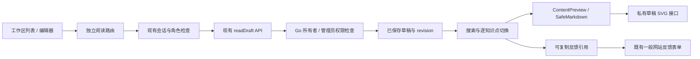

# 知识草稿阅读页

## 使用方法

在 `/editor` 工作区列表或草稿编辑器中点击 **Read saved draft**，进入 `/editor/drafts/{id}/preview`。页面以英文为主，保留知识点中文标题，支持英文标题、中文标题和 ID 搜索；按当前搜索结果使用目录按钮或 Previous / Next 逐点切换。目录沿用包内顺序，不代表学习完成顺序。

页面读取服务器保存的草稿，明确显示包版本、保存的 revision 和实际状态。编辑器有未保存改动或正在执行操作时，阅读入口禁用，保存成功后恢复。`editing`、`submitted` 是草稿工作流状态；本页面不据此认定独立数学审阅已通过，也不产生知识点解锁、学习完成或进度记录。

正文复用既有安全渲染器：单元按知识点 ID 与版本匹配，展示陈述、范围、数学体系、学习目标、条件、证明、讲解角度、例题、反例、来源、知识关系和原创 SVG。学习路线保留该草稿包中的完整版本引用。配图使用私有草稿素材入口。

**Give site feedback** 使用既有一般网站反馈入口。复制只读 Preview reference 中的草稿 ID、revision、包版本和当前知识点版本到反馈正文，以便定位；该反馈不是数学审阅决定。

## 权限与架构

沿用现有会话及 `editor` / `admin` 页面权限，并由 Go 的草稿读取 API 决定所有者和管理员可见范围。匿名用户、普通学习者和其他编辑者不能绕过既有边界查看草稿。请求不使用缓存；服务不可用时显示既有错误与重试页面。

## 文件与回归范围

- 新增阅读路由与 `draft-reading-view.tsx`，修改工作区列表、编辑器阅读入口和内容样式。
- 单元测试覆盖双语搜索、精确版本单元匹配、私有素材链接、保存后入口及空草稿。
- `content-draft-reading.spec.ts` 使用现有随机隔离数据库，覆盖桌面和手机、键盘切换、保存与未保存内容区分、权限边界、服务恢复和一般反馈入口。
- CI 将新用例与既有编写回归一起运行；同步保留内容权限、冲突及发布工作流回归。

API、数据库结构、角色规则和正式数学发布流程沿用既有实现。本功能只提供保存版本的阅读入口；正式内容仍按原独立审阅和发布流程处理。
