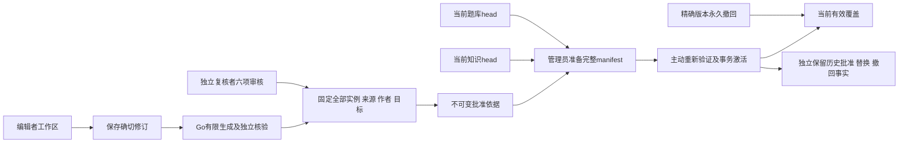

# P4a 可信题库操作说明

2026-10-06 补充：用户已确认管理员兼审核者可审核全部内容（含本人提交）。升级、权限、历史及独立性统计口径见[管理员审核兼容说明](admin-content-review.md)。
日期：2026-10-02。技术验收见 [记录](2026-10-02-p4a-acceptance.md)。本阶段建立题库编写、核验、独立审核、发布和撤回能力；个人练习、五题检测、资格、解锁和进度在 P4b 实现。技术测试中的批准只发生在随机测试库，不计入正式数学题量。

## 架构与入口



英文页面：`/editor/questions`、`/editor/questions/drafts/{id}`、`/review/questions`、`/review/questions/{id}`、`/admin/question-publications`、`/admin/question-publications/{id}`、`/admin/question-withdrawals`。导航取实际角色；admin 不自动拥有 editor/reviewer，编辑者只能改本人工作区，作者集合中的账户不能复核复制或继承的内容。程序识别账户，实际人员身份、数学能力和独立性需要组织审核。

## 显式启用

沿用 [账户配置](account-foundation.md) 的 origin、会话和管理员初始化流程；Go 与 Next 同源，GO_API_INTERNAL_URL 只在服务端使用。新增 `00005_question_bank.sql`，保留 00001—00004 与原内容 schemaVersion=1。启动时只读检查就绪状态，缺表或未记录迁移5返回 QUESTION_BANK_NOT_CONFIGURED，不自动迁移。

真实库升级前备份并核对恢复方案，随后由操作者显式执行：

```sh
set -a
source .env
set +a
node tools/verify/run.mjs --cwd backend -- env CGO_ENABLED=0 GOTOOLCHAIN=go1.27.1 go build -o bin/ ./cmd/...
./backend/bin/migrate --dir db/migrations up
```

本次验收未对真实开发库执行迁移、创建人员账户、批准数学内容或连接生产服务器。保留不可变历史和审计，应用回退不执行真实库迁移 down；部署、并发负载与恢复演练仍在 P7。

## 离线资料与归档

持续更新的 Knowledge_JSON 先由原快照工具保留原始字节、SHA 和相对 sourceMap，资料内说明作为数据处理。新 QuestionPackage 独立使用 kind=question-bank、schemaVersion=1，不能混入原 ContentPackage 或修改原数学版本。

CLI 仅检查、导入草稿和导出归档，不产生批准或公开 head：

```sh
./backend/bin/question-check --archive /path/to/archive.json --references /path/to/references.json
./backend/bin/question-import --archive /path/to/archive.json
./backend/bin/question-export --id your-question-package --version 1 --out /path/to/new-export-directory
```

归档包含 editable envelope、规范 package SHA、全部固定实例、引擎版本及来源责任。离线 references 是核验依据，不是平台发布授权；数据库导入重新解析当前已发布知识、目标、单元和 SHA 素材。外部 UUID 不能证明平台作者，同库原可信责任会继承，未知责任显示 legacyUnattributed。导出目录必须不存在，目录700、文件600；不含口令、Cookie、CSRF或数据库 URL。网页导出只含可编辑输入，完整不可变技术归档使用 CLI。

## 编写、校验与冻结

支持精确有理数四则、大小比较、缺失运算数三家族，固定单选及带支持见证的数值题。参数使用精确文本，每项最多32值、总组合最多1000，约束、干扰项和引擎版本均固定；不执行脚本。生成遍历所有合法组合并独立核验，错误答案、无解、多解、数学等价选项重复不会静默跳过。

主知识绑定 ID/version 与从0开始的固定目标索引，最多三个补充知识映射。Load published objectives 展示准确已发布版本的英文及中文标题和目标；保存不等于生成核验，机器通过不等于独立批准。

Create/Adopt 建立工作区，Save 使用 expectedRevision；冲突保留输入，先回顾服务器修订。Validate saved revision 生成绑定当前修订和服务器责任的摘要。任何编辑或新保存都会使前一校验不可用于送审。Submit 固定完整题包、全部实例、sourceMap、作者、来源不明标记、目标原文、目录及引擎版本和规范字节，不依赖之后的资料或工作区。

## 独立审核

审核页完整展示固定来源、作者、目标、参数范围、约束排除数量、引擎版本及每一实例，按返回的有效 limit 连续分页。首屏不能代替整批复核，没有虚假的“全部已看”标记。核对 Mathematics、Explanations、Objectives、Sources、Illustrations、Generation 六项，普通审核填写独立性说明，管理员自审填写责任说明，并记录生成说明和结论；没有模板也必须明确解释为何生成不适用。素材通过原已发布 SHA 接口读取，当前已撤回的素材不能绕过原可用边界。

pending 只终结一次为 approved/returned。退回使原工作区回到 editing、revision+1，旧冻结字节不变；批准后的修改创建新工作区、修订与审核，不继承批准。相同 ID/version 的数学正文不可改写，修正须使用新版本。

## 双快照发布与永久撤回

管理员选1—20个同目录版本的批准批次，Prepare 同时绑定当前 knowledge head、question head 和固定 manifest SHA。当前 head 按 ID 独立读取，历史页不必包含它；成员和数学差异全部分页，来源责任变化单独列为审核依据，不冒充数学替换。未选择的成员继承确切已发布 head 的历史证据；本次新选或重选证据须继续满足审核者资格。

Activate 要求最近五分钟重新验证。428 打开密码对话框，验证只恢复可重试资格，用户须主动 Retry previous request；不会自动写入。两个 head 任一变化、撤权、会话或凭据变化、摘要失配、来源不可用均阻止事务提交，旧候选须重新准备。

模板新版本须同步更新受影响蓝图；旧生成实例退出当前题池，原字节和历史批准仍保留。永久撤回支持 template/instance/blueprint 的准确 ID/version，包括非当前历史版本。先预览全部影响计数及分页差异；分页过程中 impactDigest 或两个 head 变化就清除预览，重新检查影响。模板撤回删除关联实例及依赖蓝图；固定题撤回删除显式依赖蓝图；单生成实例只移除该实例并实时重算剩余池；撤回蓝图保留讲解。版本黑名单不能经旧批准或重放复活。

覆盖报告区分全局去重数量、每知识的有效题量、固定/生成题、蓝图、核心与补充目标和五题可覆盖性。缓存的 ready 不作为当前依据，引用暂停会即时排除实例；不足五题或缺蓝图明确未就绪。历史批准、正常替换与永久撤回分别保存，P4b 后续须携带实际尝试时的 publication 读取历史依据。

## 未确认写入及资源边界

每个写命令只在内存保留同一 UUID key、route、确切输入。取消仅停止等待，超时/503不证明服务器未提交；界面保留输入并明确结果未确认，手动 Retry 使用同键同输入，无自动重试。重新编辑建立新命令；Discard local pending request 仅丢弃本机请求记录，不声称取消已提交操作。429按 Retry-After 主动重试，重放仍校验当前权限。

题库与 P3b 共用每进程两个实际工作槽，以及既有分钟预算：普通全局/个人120/30，重40/10，读600/120；coverage GET 算重操作。Go整个请求含正文/SQL最多8秒，锁等待1秒；Next含账户 context/正文/网络/响应总10秒；旧账户4/5秒及旧限流分类保留，取消后实际工作结束前不释放槽。

题包2MiB、草稿/冻结/私有完整响应4MiB、sourceMap256KiB、控制请求8KiB；每包50模板/200固定题/100蓝图/1000实例。当前题库200模板/10000实例/1000蓝图，模板与实例规范正文合计32MiB、manifest8MiB；每知识池1000题、核心目标8个。页默认20、最多100、offset最多100000；响应缩页时下一页使用实际返回limit。增加容量或更改兼容边界须另行审查。

## 验证与后续

命令统一经 tools/verify/run.mjs 限540秒，Go单批5分钟；浏览器一worker、retries=0、批次480秒，1280×900和390×844。四类题库场景和原六批公开/账户/内容回归全部使用真实 Next→Go→随机 PostgreSQL，控制端点只在独立 e2e-harness 的环回端口、随机能力令牌下开放，生产服务不导入它。

最大合法容量的本机实测见验收记录；累计分配、驻留和延时不是服务器负载承诺，P7需在实际主机及并发下验证。下一阶段先独立设计 P4b 的题面无答案 DTO、曝光排除、尝试、五题检测、资格、解锁及回顾，再推进反馈纠错和首批数学数据独立审核。
