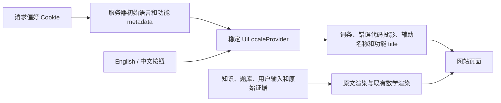

# 网站中英文界面切换

默认界面为 English。页头的 English / 中文按钮切换功能界面，密码确认弹窗内也提供相同入口。导航、表单、按钮、帮助、系统状态、成功和错误提示以及浏览器功能标题随当前语言显示。

知识标题及已有中文对照、正文、证明、例题、来源、许可、原始 SVG、题干、选项、答案、参数、用户留言和审阅理由均保持原文。选项的显示标签可以切换，提交的角色、题型和状态代码保持原值；五题至少四题正确、冷却、资格及独立纠错审批规则继续由原后台执行。

## 偏好与页面状态

偏好保存在 `math_master_ui_locale`：仅接受 `en`、`zh-CN`，Path 为 `/`、SameSite 为 Lax、有效期一年，HTTPS 下带 Secure；不设置 Domain。服务器按当前请求读取，缺失、非法和重复偏好回退英文。不会按 IP 或浏览器语言自动覆盖选择。

浏览器禁止写入偏好时，本页及当前站内导航仍可切换；完整刷新或新页面按可读取偏好重新初始化。已经打开的其他标签页不会被自动改写，完整刷新或新开页面读取最近保存的偏好。

切换只更新界面状态和偏好，不刷新路由、不提交表单、不验证密码、不改变角色、不批准内容、不消耗待重试请求、不标记通知已读。未保存草稿、密码、检测答案、审核勾选项和同一请求正文／请求键保留；既有操作的成功回调和会话失效规则保持原流程。

## 显示与数据边界

系统消息通过 `uiMessage(key, values)` 构造，参数按词条类型检查。超过一千条词条后，使用不可直接构造的紧凑消息类型避免 TypeScript 联合类型上限，传递和序列化结构仍为 `kind/key/values`。错误显示按模块与已验证 code 选择词条；传输层的原英文 message 和严格解析保持不变。

`FormMessage` 的旧字符串入口明确显示原文，不做英文文字匹配。导入／导出异常使用显式内部代码投影，原 `Error.message` 保留；无法分类的异常显示安全通用提示。语言切换不会通过遍历正文或替换 DOM 文本进行翻译。

知识的英语标题和已有中文字段按现有字段约定标记语言；自由用户文字不根据界面语言猜测其语言。`html.lang`、控件辅助名称和明确的页面功能标题随界面更新。页面标题使用显式 `PageTitleKey`，不接受任意知识标题作为系统词条。

## 覆盖与验证

[覆盖登记](ui-language-coverage.json)列出 39 个页面、82 个组件的词条、委托关系、原文数据区域和真实验证场景。学习账户上下文和路线连接图没有自有文字，登记为明确的非文字边界；覆盖消费者不能通过新增页面、空登记或虚构场景。

CI 追加七个分开的语言浏览器批次：公开阅读、账户、知识后台、题库、学习测评、反馈、纠错通知。保留原 22 个默认英文批次，以及单 worker、零重试、双视口和每批 480 秒浏览器总预算。旧工作流的字节保护仅扣除这七个精确新增步骤，原命令、名称、参数、预算及数据保护继续核验。

语言场景最终 28 项已通过，包含 Cookie 禁用后的站内导航标题、原文 API／SVG 字节、密码模态、未保存输入、同键重试、五题四正确和通知未读边界。完整默认英文 22 批 174 项、前端 398 项、Node 94 项、运维 22 项以及原 Go 14 批和六项容量检查已通过。类型、生产构建、API 生成字节和生产依赖审计通过；详细结果见[验证记录](evidence/ui-language-switch/verification.json)。一次独立整分支审查正在进行。

这项实现通过 PR 交付；服务器部署与真实知识批准／发布仍按各自授权流程进行。
