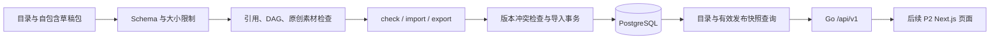

# P1：可信内容底座执行计划

> **执行代理要求：**逐项执行时使用 `superpowers:executing-plans`；若用户选择子代理执行，则使用 `superpowers:subagent-driven-development`。步骤使用复选框跟踪。本文件只规划 P1，后续阶段另写执行计划。

**目标：**建立可校验、可追溯、可重复导入的数学内容草稿底座，并提供 16 板块的 Go 只读查询 API。

**架构：**Go 标准库 HTTP 服务连接 PostgreSQL；离线 JSON 经结构、关系和素材校验后，作为不可变版本事务导入草稿。公共查询只读取有效发布快照，目录元数据可以公开，数学内容发布由 P3 的独立审核流程负责。

**技术栈：**Go 1.27.1、PostgreSQL 17.11、`database/sql` + `pgx/v5/stdlib`、`jsonschema/v6`、`goose/v3` 的 Go 库、[goldmark](https://github.com/yuin/goldmark) 1.x 的 Markdown AST；Node.js 24.17.0 仅用于验证命令的总时限控制。各 Go 库在任务 1 锁定具体补丁。

**方案依据：**[总体方案](../specs/2026-09-30-math-learning-platform-design.md)、[阶段路线图](2026-09-30-development-roadmap.md)。实施前同时阅读两份文档。

## 全局约束

- 数据库是运行时正式内容的唯一来源；JSON 用于导入、导出和离线校验。
- 稳定编号与版本分开；修订创建新版本，不覆盖旧版本。
- 学习前置必须无环，采用全部前置满足；证明、相关关系不自动成为解锁条件。
- 内容建设、个人解锁、个人学习是独立维度；预览学习记录不进入生产数据。
- 首版共 16 个学习分组，保留英中名称；界面和 API 可展示消息英文为主，文档中文。
- 公共列表每页最多 100 条；未发布数学内容不进入公共接口。
- Go 调试、构建、测试使用 `CGO_ENABLED=0`；单次验证总时限 540 秒，终止宽限 5 秒，总计小于 10 分钟。
- 不提交秘密，不记录数据库 DSN 或密码；素材原创，公式、HTML 和素材输入遵循安全边界。
- 开发前拉取最新 `master` 并新建 `codex/p1-content-foundation` 分支；完成代码审查、回归后创建 PR。
- P1 不实现题库判分、账号、个人状态、审核发布入口或正式部署，不计入 30/20/300 发布数量。

本计划新增的工程限制：内容包不超过 10 MiB；每份 SVG 不超过 1 MiB、单包素材总量不超过 10 MiB；标识匹配 `^[a-z][a-z0-9-]{0,63}$`；版本是正整数；单包每种实体的稳定编号只能出现一次；P1 包必须包含所有知识点关系和路线引用的具体版本。以后支持跨包引用时另审查完整发布图。

## 审查重点

1. 英中术语、重复编号与演示状态混入正式数据：保留 Unicode，拒绝重复和未知字段；由任务 2 验证。
2. 缺失/错版本引用、前置循环及混合关系：精确解析包内闭包，仅前置参与 DAG；由任务 3 验证。
3. 素材路径逃逸、主动 SVG 和非法 Markdown：拒绝越界/符号链接逃逸和可执行内容；由任务 3 验证。
4. 重复导入、同版本变更及导入中途失败：相同包幂等、旧版本不可覆盖、全事务回滚；由任务 4、5 验证。
5. 伪造审核/发布、草稿或撤回内容泄露与异常查询：导入只产生草稿，公共接口过滤版本且错误不含内部信息；由任务 5、6 验证。

---

## 文件结构与 P1 架构

| 新增或修改文件 | 职责 |
| --- | --- |
| `backend/go.mod`、`backend/go.sum`、`backend/cmd/server/main.go` | 固定依赖及服务入口 |
| `backend/internal/config/config.go`、`backend/internal/httpapi/health.go` | 环境配置、存活及数据库就绪检查 |
| `schemas/catalogue.schema.json`、`schemas/content-package.schema.json` | JSON Schema 2020-12 契约 |
| `backend/internal/catalogue/model.go`、`backend/internal/content/{model,decode,validate,assets}.go` | 目录/内容类型、结构、关系、素材检查 |
| `content/catalogue/domains.json`、`content/packages/elementary-fractions.v1.json`、`content/assets/equivalent-fractions.v1.svg` | 正式目录与原创未审核草稿 |
| `db/migrations/00001_content_foundation.sql`、`backend/internal/store/{store,migrate,import,export,catalogue,publication}.go` | 数据结构、事务导入和只读查询 |
| `backend/cmd/{migrate,content-check,content-import,content-export}/main.go`、`backend/internal/cli/content.go` | 命令行边界与退出码 |
| `api/openapi.yaml`、`backend/internal/httpapi/{handler,catalogue,error}.go` | 只读接口和错误约定 |
| `compose.dev.yaml`、`.env.example`、`tools/verify/{run,run.test}.mjs`、`.github/workflows/backend.yml` | 本地测试数据库及有时限验证 |
| `docs/operations/content-foundation.md`、`README.md`、`.gitignore` | 操作说明、开发入口及生成文件排除 |
| `docs/content/source-inventory.md` | wiw 空间资料的实际目录、出处和知识点映射，未定位资料明确标为待补充 |
| 各任务列出的 `*_test.go`、`backend/internal/content/testdata/`、`backend/internal/store/testdata/` | 业务与数据库回归，不复刻实现细节 |

## 锁定的数据与接口约定

目录根对象：`schemaVersion: 1`、`version: 1`、`domains`。`Domain` 含 `id/order/name/nameZh/topics/relatedDomainIds`；`Topic` 含 `id/name/nameZh`，主题 ID 在全目录唯一，以 `domainId-topicSlug` 组成。沿用预览的 16 板块 ID、顺序和 56 对术语，不沿用 `contentStatus`。建设状态由有效发布数据计算。

内容包根对象：`schemaVersion/id/version/knowledge/units/paths/assets`。`VersionRef` 为 `{id, version}`。`Knowledge` 含 `id/version/domainIds/topicIds/type/title/titleZh/statement/scope/objectives/conditions/system/proof/sources/relations`；关系含 `kind` 与 `target: VersionRef`，种类为 `prerequisite/derivation/related`。类型为 `concept/definition/axiom/theorem/corollary/method/mathematical-thinking`。

`Unit` 含 `id/version/knowledge: VersionRef/angles/examples/counterexamples/assetIds`。`Angle` 含 `kind/body`；`Path` 含 `id/version/domainIds/title/titleZh/nodes: []VersionRef`。`Source` 含 `kind/author/title/url/accessedAt/license/attribution`，区分原创与外部来源；原创不伪造外部来源日期。`Asset` 含 `id/path/sha256/author/license/attribution/knowledge: VersionRef`，路径相对 `content/assets`，P1 只接收原创 SVG。

草稿允许陈述、讲解或证明未完成，校验报告分别列阻断错误和待复核项，不据此宣称数学正确。P3 发布校验才强制完整内容、至少两种不同讲解角度、定理/推论的条件与证明、公理所属体系等要求。P1 将 10 个样例节点及前置图改写为草稿骨架，单独完善 Equivalent fractions 单元；删除所有个人状态和演示计数。

公共建设状态只有 `planned/published`：存在可公开的有效发布节点才是 `published`。未来用户进度不加入这些响应。响应固定英文主名称，中文对照单独字段；错误为 `{"error":{"code":"...","message":"...","requestId":"..."}}`。

## 任务 1：可启动服务、配置与验证时限

**文件：**新增 `backend/go.mod`、`backend/go.sum`、`backend/cmd/server/main.go`、`backend/internal/config/config.go`、`backend/internal/config/config_test.go`、`backend/internal/httpapi/health.go`、`backend/internal/httpapi/health_test.go`、`tools/verify/run.mjs`、`tools/verify/run.test.mjs`、`.env.example`；修改 `.gitignore`。

**接口：**`config.Load() (config.Config, error)`；`Config` 含 `HTTPAddr/DatabaseURL/ShutdownTimeout`；`httpapi.NewHealthHandler(pinger interface{ PingContext(context.Context) error }) http.Handler`。环境变量为 `HTTP_ADDR`（默认 `127.0.0.1:8080`）、`DATABASE_URL`（必填）、`SHUTDOWN_TIMEOUT`（默认 `5s`）。

- [ ] 1. 检查 Docker 引擎：`docker info`；核对并锁定 pgx/v5、jsonschema/v6、goose/v3、goldmark 1.x 的具体稳定补丁；建立 `github.com/yyl1212/math_master/backend` 模块，Go 指定 1.27.1，提交 `go.sum`。引擎不可用时先恢复本地数据库运行条件，不跳过集成验证。
- [ ] 2. 编写失败测试：`TestLoadRejectsMissingDatabaseURL`、`TestLoadDoesNotExposeSecret`、`TestHealthSeparatesLivenessAndReadiness`；断言无 DB 时 `/healthz` 为 200，`/readyz` 为 503，非法配置错误及响应不含测试密码。为时限包装器编写子进程成功/失败/超时用例，允许测试传入更短的 `--timeout-ms`，禁止超过 540000。
- [ ] 3. 运行 `cd backend` 后 `CGO_ENABLED=0 GOTOOLCHAIN=go1.27.1 go test ./internal/config ./internal/httpapi -timeout 2m -count=1`，预期新行为测试失败；`node --test tools/verify/run.test.mjs` 从项目根运行，预期包装器尚未实现而失败。
- [ ] 4. 实现上述接口和命令包装器：`node tools/verify/run.mjs --cwd backend -- <command> <args...>`。默认总时限 540 秒；超时终止进程组，5 秒后强制终止，返回非零；正常保留子进程退出码。服务只输出已脱敏配置，收到终止信号进行限时关闭。
- [ ] 5. 从根目录运行 `node --test tools/verify/run.test.mjs` 与 `node tools/verify/run.mjs --cwd backend -- env CGO_ENABLED=0 GOTOOLCHAIN=go1.27.1 go test ./internal/config ./internal/httpapi -timeout 2m -count=1`，预期全通过。以后全部验证命令经过该包装器。
- [ ] 6. 暂存本任务明确列出的文件，提交 `feat: 建立 Go 服务与有时限验证入口`。

## 任务 2：目录、草稿契约与严格解码

**文件：**新增两个 `schemas/*.schema.json`（文件名见结构表）、`backend/internal/catalogue/model.go`、`backend/internal/content/model.go`、`backend/internal/content/decode.go`、`backend/internal/content/decode_test.go`、`backend/internal/content/testdata/{valid-draft,unknown-field,duplicate-key}.json`、`content/catalogue/domains.json`、`content/packages/elementary-fractions.v1.json`、`content/assets/equivalent-fractions.v1.svg`、`docs/content/source-inventory.md`。

**接口：**产生 `catalogue.Catalogue/Domain/Topic` 和上节全部 `content` 类型；`content.DecodeCatalogue(r io.Reader) (catalogue.Catalogue, error)`、`content.DecodePackage(r io.Reader) (content.Package, error)`。以 JSON 标签锁定契约，schema 为唯一外部格式依据，两者输出同样的字段路径错误。

- [ ] 1. 写 `TestDecodePreservesChineseAndRejectsPreviewState`、`TestDecodeRejectsDuplicateKeysAndUnknownFields`、`TestDecodeLimitsBytesAndVersions`；断言 `unlocked/learningState/contentStatus/reviewedBy`、重复 JSON 键、负版本、尾随第二个对象、超过 10 MiB 均拒绝；超大输入在测试内生成，不提交大夹具；合法中文不损坏；正式目录恰为 16 板块、56 主题。
- [ ] 2. 运行包装器中的 `go test ./internal/content -run 'TestDecode' -timeout 2m -count=1`，预期新测试失败；测试使用 `CGO_ENABLED=0 GOTOOLCHAIN=go1.27.1`。
- [ ] 3. 实现类型、Schema 与严格解码，所有对象使用 `additionalProperties: false`；先检测重复键，再执行 schema 校验和类型解码。字节限制读取上限加 1，不信任文件声明大小。版本 1 不接受未知扩展字段。
- [ ] 4. 改写正式目录与 10 节点骨架，创建原创分数 SVG 和等值分数草稿单元，记录作者/使用条件/摘要；定理示例写明非零分母与非零缩放因子，不因演示图只用正数而扩大图示范围。来源与数学内容保留待复核身份。
- [ ] 5. 按用户提供的具体页面链接读取 wiw 资料，建立来源清单与首批知识点映射；每项记录空间页面、原始出处、作者/版本、使用条件、候选知识点和未解决问题。目前资料页面尚未定位；没有实际访问的材料只记待补充，不编造条目。不明使用条件只能作为核验线索，不复制原文或配图。
- [ ] 6. 同命令重跑，预期通过；确认设计目录仍仅作为预览引用，正式内容包无个人状态。
- [ ] 7. 暂存本任务文件，提交 `feat: 定义正式目录与版本化草稿契约`。

## 任务 3：引用、前置图与素材验证

**文件：**新增 `backend/internal/content/validate.go`、`backend/internal/content/assets.go`、`backend/internal/content/validate_test.go`、`backend/internal/content/assets_test.go`、`backend/internal/content/testdata/{missing-reference,wrong-version,prerequisite-cycle,related-cycle,unsafe-markup}.json`。

**接口：**`content.ValidateStructure(c catalogue.Catalogue, p content.Package, assetRoot string) content.Report`；`Report` 含 `Errors/ReviewItems []content.Issue`，`Issue` 含 `Code/Path/Message`；`content.ValidateAndSeal(c catalogue.Catalogue, p content.Package, assetRoot string) (content.ValidatedPackage, content.Report)`。`ValidatedPackage` 内部字段不导出，提供 `Catalogue() catalogue.Catalogue`、`Package() content.Package`、`AssetBytes(id string) ([]byte, bool)`、`SHA256() string`、`CatalogueSHA256() string` 的防变更副本/摘要；有阻断错误则返回零值。

- [ ] 1. 写 `TestReferencesRequireExactPackageVersion`、`TestPrerequisiteDAGIgnoresRelatedCycles`、`TestIDsAndDomainMembership`；断言错版本/缺失前置/重复稳定编号/不存在主题阻断，合法相关关系双向循环允许，知识点主题必须属于其声明板块，路线包含成员的全部前置闭包。
- [ ] 2. 写 `TestAssetsRejectTraversalAndActiveSVG`、`TestMarkdownRejectsExecutableContent`、`TestSealedPackageIncludesImmutableAssetBytes`；覆盖 `../`、绝对路径、符号链接逃逸、超大 SVG、摘要不匹配、SVG 的 script/事件/foreignObject/外部引用，以及 raw HTML、危险链接、公式中的外链/HTML 宏；安全 SVG 与普通 LaTeX 通过。改动封存后的原文件或 getter 返回值不改变封存字节。导入阶段不执行公式或用户代码。
- [ ] 3. 运行包装器中的 `go test ./internal/content -run 'TestReferences|TestPrerequisite|TestIDs|TestAssets|TestMarkdown|TestSealed' -timeout 2m -count=1`，预期失败。
- [ ] 4. 实现验证、原创 SVG 元素/属性白名单与受限 Markdown 检查；对稳定编号的前置图拓扑排序，给出可定位的环。包内引用必须准确匹配；不允许从数据库静默补齐。未完成正文/两角度/证明记为待复核项，不作为结构错误。规范摘要按解码后结构序列化计算，素材摘要参与包内容；有序路线与讲解保持原序。封存时保存已经验证的素材字节，导入不再次读取可能变化的文件。
  - SVG 仅允许 `svg/g/rect/line/path/circle/ellipse/polygon/polyline/text/tspan/title/desc`；属性仅允许 `xmlns/width/height/viewBox/x/y/x1/y1/x2/y2/cx/cy/r/rx/ry/d/points/transform/fill/stroke/stroke-width/font-size/font-family/text-anchor/role/aria-label`。禁止 DTD、处理指令、style、href、事件；颜色只接收固定颜色、十六进制或 `none`，不接收 URL。后续扩大集合须审查。
  - Markdown 通过 AST 检查原始 HTML 与链接，正文链接仅允许 HTTPS、以单个 `/` 开始的站内路径（拒绝 `//` 和反斜杠），图片只允许 `asset:<id>`；公式拒绝外链/HTML、文件读入和自定义宏命令。P2 渲染继续禁用 raw HTML，KaTeX 使用 `trust: false`，限制展开和尺寸；P1 检查不替代浏览器渲染安全。
- [ ] 5. 同命令通过后，对正式草稿执行同一校验流程，预期零阻断错误、有明确待复核项；确认 `ValidatedPackage` 不能绕过校验构造，修改其返回值不改变已封存数据。
- [ ] 6. 暂存本任务文件，提交 `feat: 校验内容引用前置图与原创素材`。

## 任务 4：数据库版本约束与导入事务

**文件：**新增 `db/migrations/00001_content_foundation.sql`、`backend/internal/store/store.go`、`backend/internal/store/migrate.go`、`backend/internal/store/import.go`、`backend/internal/store/import_test.go`、`backend/internal/store/testdata/fixture.sql`、`compose.dev.yaml`；修改 `.env.example`。

**接口：**`store.New(db *sql.DB) *store.Store`；`store.Up(ctx context.Context, db *sql.DB, migrationDir string) error`；`(*Store).ImportDraft(ctx context.Context, input content.ValidatedPackage) (store.ImportResult, error)`。`ImportResult` 含 `PackageID/Version/SHA256/AlreadyImported`；错误提供 `ErrImmutableConflict`、`ErrInvalidPackage`。导入必须检查已封存输入非零，不信任调用方声称已验证。

**数据约束：**表为 `catalogue_versions/domains/topics/domain_relations/knowledge/knowledge_versions/knowledge_relations/unit_versions/path_versions/path_nodes/assets/imported_packages/package_members/publication_snapshots/publication_members/publication_heads`。版本正文与哈希不可原地更新；`(id, version)` 唯一，关系引用外键到实际版本，包摘要唯一。导入记录固定目录版本及摘要；目录成员随目录版本保存。`publication_snapshots` 定义 `draft/published/withdrawn`，成员另有 `active/withdrawn` 可用状态；`publication_heads` 的单例记录指向当前全局快照。P1 只创建 draft，head 保持空；P3 添加审核事件、完整图合并检查和事务切换。正文不可变与发布状态可变分别处理。

- [ ] 1. 用 `.env` 私有值启动 `docker compose -f compose.dev.yaml up -d db`；数据库仅绑定 `127.0.0.1`，版本固定 17.11，凭据取环境。测试使用独立 `math_master_test_*` 数据库；未设置 `TEST_DATABASE_URL` 或库名不合规时直接失败，不跳过、不删除生产数据。
- [ ] 2. 写 `TestImportIsIdempotent`、`TestVersionCannotBeOverwritten`、`TestImportRollsBackLateFailure`、`TestConcurrentSamePackageImport`、`TestMigrationRoundTrip`。断言复跑返回 `AlreadyImported`、同版本不同摘要失败、模拟最后一步约束失败后所有新增内容/目录/包记录为零、并发重复提交只有一份结果且无半成品；新空测试库执行 up/up/down/up 后结构一致。
- [ ] 3. 运行包装器中的 `go test ./internal/store -run 'TestImport|TestVersion|TestConcurrent' -timeout 5m -count=1`，预期失败；连接/迁移每步均带 context 时限。
- [ ] 4. 实现迁移和导入事务，固定目录版本、包成员及版本摘要；相同版本相同内容可复用，不同内容拒绝。并发重复包由唯一约束与事务重读处理；封存哈希复核后整体导入，只创建草稿快照。失败不保留半包、半目录或活动发布指针。迁移不在 HTTP 服务启动时自动执行。
- [ ] 5. 同命令通过；另运行 `go test ./internal/store -run TestMigrationRoundTrip -timeout 5m -count=1`，新空测试库迁移、再次迁移不重复创建对象。只在专用测试库验证回退，正式运维不默认执行 down。
- [ ] 6. 暂存本任务文件，提交 `feat: 建立版本化存储与幂等草稿导入`。

## 任务 5：校验、导入、导出与迁移命令

**文件：**新增 `backend/internal/store/export.go`、`backend/internal/store/export_test.go`、`backend/internal/cli/content.go`、`backend/internal/cli/content_test.go`、四个 `backend/cmd/{migrate,content-check,content-import,content-export}/main.go`、`docs/operations/content-foundation.md`。

**接口：**`(*Store).ExportPackage(ctx context.Context, id string, version int) (content.Package, error)`、`(*Store).ExportCatalogue(ctx context.Context, version int) (catalogue.Catalogue, error)`、`(*Store).ExportAsset(ctx context.Context, sha256 string) ([]byte, error)`；`cli.Run(ctx context.Context, command string, args []string, stdout, stderr io.Writer) int`。素材按包中的固定摘要导出。命令库使用前述解码、封存与存储接口；输出 JSON 报告，退出码成功 0、内容阻断 2、配置/数据库/IO 失败 1。

**命令约定：**`content-check --catalogue <file> --package <file> --assets <dir>`；`content-import` 同参数并读 `DATABASE_URL`；`content-export --id <id> --version <n> --catalogue-version <n> --out <new-dir>`；`migrate --dir db/migrations up`。从项目根执行；导出目录必须新建且不能覆盖原内容，生成 `catalogue.json/package.json/assets/`，目录版本必须匹配包的实际导入记录。

- [ ] 1. 写 `TestCheckDoesNotRequireDatabase`、`TestImportRejectsClaimedPublication`、`TestExportRoundTripPreservesVersionsAndAssets`、`TestCLIReportsRedactedFailure`；断言合法草稿可离线检查，`status: published/reviewedBy` 等伪造字段被拒绝，导出再校验/导入内容摘要不变，错误退出码正确且不含凭据。
- [ ] 2. 运行包装器中的 `go test ./internal/cli ./internal/store -run 'TestCheck|TestImportRejects|TestExport|TestCLI' -timeout 5m -count=1`，预期失败。
- [ ] 3. 实现命令，check 输出阻断项和待复核项，import 始终导入草稿；素材受校验后以摘要及字节保存到 `assets`，导出从数据库恢复，不能依赖原机器文件仍在。export 固定具体版本，不导出个人记录或内部秘密。
- [ ] 4. 同命令通过；按操作说明迁移新的本地开发库，导入正式目录/草稿两次，第二次报告幂等；导出到临时新目录，check 为零阻断错误，库中公开数学内容数量仍为 0。
- [ ] 5. 文档记录待复核与阻断的区别、退出码、私有环境、导出恢复流程，以及 P1 不能发布内容的边界。
- [ ] 6. 暂存本任务文件，提交 `feat: 提供内容检查导入导出命令`。

## 任务 6：目录与发布内容只读 API

**文件：**新增 `backend/internal/store/catalogue.go`、`backend/internal/store/publication.go`、`backend/internal/store/read_test.go`、`backend/internal/httpapi/handler.go`、`backend/internal/httpapi/catalogue.go`、`backend/internal/httpapi/error.go`、`backend/internal/httpapi/catalogue_test.go`、`api/openapi.yaml`；修改 `backend/cmd/server/main.go`。

**接口：**产生 `catalogue.DomainSummary/DomainDetail`、`content.PathView/KnowledgeView`（公开版本内容及引用，无审核者/私有信息）。`(*Store).ListDomains(ctx context.Context, query string, limit, offset int) ([]catalogue.DomainSummary, int, error)`、`GetDomain(ctx, id) (catalogue.DomainDetail, error)`、`GetPublishedPath(ctx, id) (content.PathView, error)`、`GetPublishedKnowledge(ctx, id) (content.KnowledgeView, error)`；三个方法的 `ctx` 均为 `context.Context`、`id` 均为 `string`。`httpapi.NewHandler(reader httpapi.Reader, pinger httpapi.Pinger) http.Handler`；Reader 只包含上述四个查询签名，Pinger 含 `PingContext(context.Context) error`。

查询失败统一使用 `store.ErrNotFound/ErrUnavailable` 包装可区分的原因，其余错误映射为内部错误。`DomainSummary` 含 `id/order/name/nameZh/topics/relatedDomainIds/contentStatus/publishedKnowledgeCount`；`DomainDetail` 额外含已发布路线摘要。`PathView` 含固定路线版本、知识点及前置引用；`KnowledgeView` 含固定知识版本、关联单元、素材元数据。P2 再增加只允许有效发布引用的素材读取接口，不直接向浏览器暴露磁盘路径。

**路由：**`GET /api/v1/domains?q=&limit=&offset=`（默认 limit 20、offset 0）；`GET /api/v1/domains/{id}`；`GET /api/v1/paths/{id}`；`GET /api/v1/knowledge/{id}`；以及任务 1 的健康路由。列表为 `{items,total,limit,offset}`，详情为 `{data}`；搜索匹配英中名称及主题，顺序按目录 order 稳定。

- [ ] 1. 写 `TestCatalogueSearchAndPagination`、`TestPublicReadsHideDraftAndWithdrawnVersions`、`TestPublicKnowledgeKeepsPrerequisiteVersionRefs`、`TestErrorsAreEnglishAndRedacted`。断言中文、`Markov`、单引号/百分号查询安全，limit 0/101、负 offset 返回 400；错误 404 不区分私有草稿存在与否；真实 DB 查询不返回草稿/撤回版本，返回的关系指向同一有效快照。
- [ ] 2. 在 SQL 测试夹具中建立仅用于测试的发布/撤回快照，注明不能成为生产种子。运行包装器中的 `go test ./internal/httpapi ./internal/store -run 'TestCatalogue|TestPublic|TestErrors' -timeout 5m -count=1`，预期失败。
- [ ] 3. 用参数化查询和 `net/http` ServeMux 实现接口及 OpenAPI。知识详情只采用 head 指向的有效快照，过滤撤回成员；快照任一必须引用的前置已撤回时不继续作为有效发布路线返回。错误稳定代码为 `INVALID_QUERY/NOT_FOUND/SERVICE_UNAVAILABLE/INTERNAL_ERROR`，消息英文、请求编号可追踪；异常细节仅脱敏记录。公开内容响应先用 `Cache-Control: no-store`，P3 再设计发布切换与撤回一致性。
- [ ] 4. 同命令通过；空数学库中 `/domains` 返回 16 个 planned 板块及 56 主题，草稿知识/路线返回 404；停止 DB 后 healthz 200、readyz 和数据请求 503，不回退读取 JSON。
- [ ] 5. 核对 OpenAPI 的字段、必填项、分页上限和错误与真实响应一致；确认服务入口使用 DB reader，未引用 `design/data` 或本地 JSON 作为运行内容源。
- [ ] 6. 暂存本任务文件，提交 `feat: 提供正式目录与发布内容查询接口`。

## 任务 7：持续验证、阶段回归与交接

**文件：**新增 `.github/workflows/backend.yml`；修改 `README.md`、`docs/operations/content-foundation.md`；按审查结论修正本阶段实际问题，不新增未设计的业务功能。

**接口：**CI 与本地共用任务 1 的包装器；PostgreSQL 服务版本 17.11，Go 工具链 1.27.1，环境 `CGO_ENABLED=0`。不使用要求 CGO 的 `-race` 代替数据库并发用例。

- [ ] 1. 配置 CI 的格式检查、Go 静态检查、纯校验测试、真实 PostgreSQL 集成测试和构建，分为各自最多 540 秒的命令；CI 依赖固定版本，凭据为临时测试值，数据库命名符合测试保护。
- [ ] 2. 从根目录分别运行包装器：`go vet ./...`、`go test ./internal/content ./internal/config ./internal/httpapi -timeout 5m -count=1`、`go test ./internal/store ./internal/cli -timeout 5m -count=1`、`go build ./cmd/...`，均以 `--cwd backend -- env CGO_ENABLED=0 GOTOOLCHAIN=go1.27.1` 执行；运行 `node --test tools/verify/run.test.mjs`，预期全部通过。`gofmt -l` 无输出，`git diff --check` 无错误。
- [ ] 3. 按任务 5、6 操作复核导入/导出/API，无发布内容却声明已发布、错误包留下半数据、公开草稿、覆盖旧版本任一情况均为阻断问题。
- [ ] 4. 完成代码审查，覆盖五项审查重点、迁移约束、无秘密提交和后续 P3 发布兼容性；修复问题后只重跑受影响回归及阶段门槛，记录实际结果，不以计划中的“预期通过”冒充已测试。
- [ ] 5. README 添加启动、迁移、导入及测试入口，记录 P1 数学内容尚未发布。PR 说明具体交付、验证结果及 P2/P3 接口边界；推送当前分支，创建面向最新 master 的 PR 并附到当前任务。
- [ ] 6. P1 合并后，从最新 master 编写 P2 的英文页面执行计划；继续以原预览为视觉依据，先实现真实目录与诚实的空状态。

## 可行性及兼容性审查结论

- P1 只依赖本地 Go、Node 和可运行 PostgreSQL；Docker 引擎未验证，任务 1 在实现前检查。域名、服务器、独立复核者不阻塞草稿底座开发。
- 自包含包和每个稳定编号唯一的版本选择，使 P1 的前置图验证可独立完成；P3 在发布时仍需校验与当前全图的合并结果，不能把离线检查当成发布授权。
- 内容包 10 MiB 上限和 SVG 白名单是首版输入约束；扩大素材类型、允许跨包引用或 schemaVersion 升级均通过兼容性审查及专门回归。
- P1 没有既有生产数据库或 API 客户端，首次契约不需要历史迁移。P4 增加题库时采用新 schemaVersion 和明确转换，不能让版本 1 默默接受新字段。
- 不完整草稿有明确的待复核报告；公开目录建设状态由有效发布记录派生。技术校验与数学复核职责明确，没有“先把草稿当正式内容”才能联调的依赖。

## 计划自审记录

已将总体方案中 P1 的内容契约、版本不可变、前置图、运行来源、事务导入、匿名读取和输入安全约束映射到任务 1—7；账户/发布在 P3、判分/资格在 P4、反馈/重算在 P5、数量验收在 P6、部署/恢复在 P7。五项审查重点均有任务归属和具体断言。所有接口类型在前置任务定义，导出恢复同时覆盖内容与素材。本文件中的复选框均未执行。
