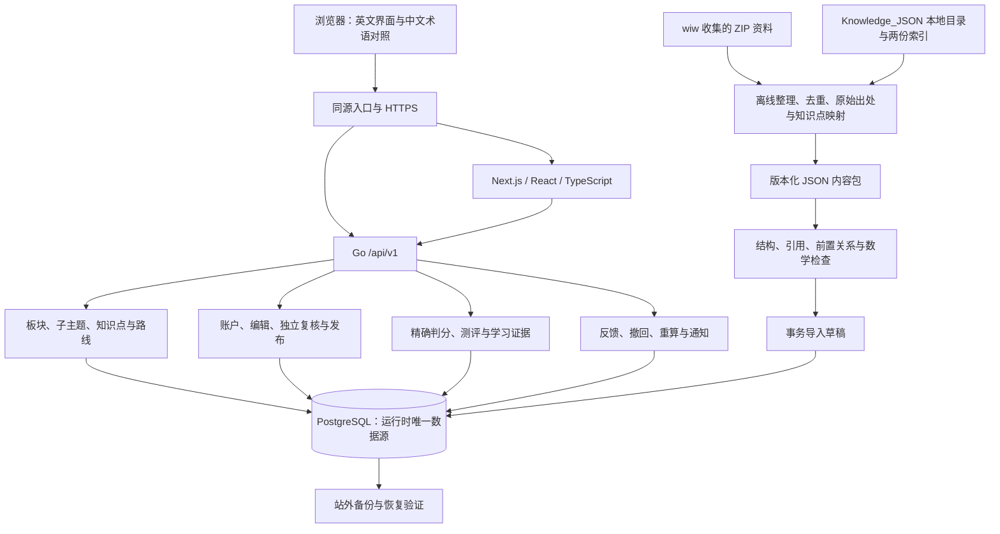

# 数学学习成长网站：首版开发路线图

日期：2026-09-30。状态：P1 内容基础层已完成独立审查及回归，并于 2026-10-01 通过 [PR #5](https://github.com/yyl1212/math_master/pull/5) 合并到 master；P2 已完成独立审查和回归，全部 CI 通过，于 2026-10-01 通过 [PR #7](https://github.com/yyl1212/math_master/pull/7) 合并到 master；P3a 账户基础方案已确认并通过 PR #8 合并，执行计划已确认通过 PR #9 合并，账户实现已完成独立审查与回归，通过 [PR #10](https://github.com/yyl1212/math_master/pull/10) 合并到 master，合并提交 90aca8e 的两项 CI 通过；[P3b 内容工作流设计](../specs/2026-10-01-content-workflow-design.md)已获书面确认并通过 PR #11 合并；[十项执行计划](2026-10-01-content-workflow.md)已获用户确认，沿用 Native；已通过 PR #13 提前完成限流 CI 前置修复，内容功能已实现，已完成技术验收、独立审查及问题修复，通过 [PR #14](https://github.com/yyl1212/math_master/pull/14) 交付，技术提交的四项 CI 全部通过。

设计依据：[总体方案](../specs/2026-09-30-math-learning-platform-design.md)。界面依据：[英文预览](../../../design/README.md)。用户已决定直接在项目中设计和开发，Figma 同步取消。

## 1. 交付目标与顺序

首版提供 16 个学习板块的完整导航，做扎实初等数学路线，形成“浏览 → 学习 → 检测 → 解锁 → 回顾 → 反馈纠错”的闭环。开发优先级为内容正确性、内容覆盖与数量、学习路径、页面美观。

知识点整理使用用户提供的本地 `/Users/wiw/Documents/math_master/Knowledge_JSON/`，对应空间目录 `math_master/Knowledge_JSON`；其他环境通过本地输入路径配置，不把该机器的绝对路径写入业务代码。2026-10-01 已完成文件检查：31 个资料包、8,722 条数学候选记录和 104 条软件能力记录；结构与重复内容见 [检查报告](../../content/2026-10-01-knowledge-json-inspection.md)。参考资料入口见 [资料来源清单](../../content/source-inventory.md)。联合原索引与增量索引选择主文件，保留摘要与来源，转换字段和编号、处理版本重叠，再映射到板块及前置关系；ZIP 另按包内目录离线整理。资料引用、数学核验与独立复核分别记录；资料已被收集不等于已获复制授权或已完成数学审核。

第一阶段先建立正式数据规范、Go 校验与导入工具、PostgreSQL 存储和只读查询 API；第二阶段把英文预览拆成 Next.js 页面并接入这些接口。后续每个阶段独立制定执行计划、审查接口、完成实现与回归。首阶段详细步骤见 [P1 执行计划](2026-09-30-content-foundation.md)。

阶段按验收结果推进，不按固定日期跳过验证。内容草稿可在 P1 后持续编写；发布必须等 P3 的独立审核流程完成，正式上线必须通过 P7。

| 阶段 | 依赖 | 可交付结果 | 验收门槛 |
| --- | --- | --- | --- |
| P1 可信内容底座 | 当前方案与预览整合到开发基线 | 数据规范、16 板块与子主题、版本化草稿、校验/导入/导出、只读 API | 重复导入幂等，错误包整体回滚，循环与缺失引用被拦截，草稿不泄露到公共接口 |
| P2 英文只读网站 | P1 | 板块目录、路线与知识点阅读页面，搜索、数学公式、原创图形、手机适配 | 使用 Go 数据接口；空数据和建设中内容显示正确；1280/390 像素及键盘导航回归通过 |
| P3 账户与内容审核 | P1、P2 | 注册登录、角色、管理员初始化、编辑与独立复核、发布快照、基础撤回 | 作者不能自审；匿名和越权账户不能写内容；发布整体校验与事务激活；撤回内容停止公开使用 |
| P4 学习与检测闭环 | P3 | 题型模板、精确判分、练习、5 题检测、诊断、解锁、学习进度与回顾 | 5 题至少 4 题正确；所有前置满足；诊断不伪造阅读；重复提交幂等；版本状态与授予资格事务一致 |
| P5 反馈与纠错闭环 | P4 | 版本化反馈、处理结果、证据限制、重算任务与站内通知 | 撤回当时即限制受影响证据；历史解锁保留；不足 5 有效题必须重测；任务可安全重跑 |
| P6 首批内容验收 | 草稿从 P1 后推进；发布依赖 P3，检测验收依赖 P4、P5 | 初等数学完整首批路线、内容覆盖报告与质量报告 | 至少 30 已发布知识点、20 已审核模板、300 有效实例；每节点至少 10 实例且至少 5 可检测 |
| P7 部署与试运行 | P2—P6 | 同源 HTTPS、四服务 Compose、备份恢复、负载结果、部署及回滚说明 | 服务器预检、秘密检查、站外备份与恢复演练通过；完成首版全部验收项 |

P1—P5 按表中的依赖推进。P6 的草稿编写与技术开发可以交替进行，避免最后才发现内容或题库不足。P7 的域名、存储和备份位置可以提前确认，正式部署发生在验收之后。

## 2. 目标架构

前端负责展示、阅读和交互。Go 负责权限、内容发布、判分、资格与解锁。初期使用模块化单体和同一 PostgreSQL 数据库；内容校验、审核和学习证据的边界由接口和事务维护。

JSON 是导入导出与版本审查格式，数据库是正式运行来源。预览中的 `unlocked`、`learningState`、虚构进度及 `preview` 状态不作为生产种子；它们继续只用于界面参考。

## 3. 文件与模块安排

| 目录或文件 | 阶段 | 责任 |
| --- | --- | --- |
| `schemas/catalogue.schema.json`、`schemas/content-package.schema.json` | P1 | 目录与内容包机器可校验的数据契约 |
| `api/openapi.yaml` | P1 起 | `/api/v1` 响应、分页与错误格式；每阶段扩充 |
| `content/catalogue/domains.json`、`content/packages/`、`content/assets/` | P1、P6 | 正式目录、原创内容草稿与图形；发布数量单独统计 |
| `backend/cmd/server/main.go`、`backend/internal/config/`、`backend/internal/httpapi/` | P1 | 服务入口、私有环境配置与 HTTP 边界 |
| `backend/internal/content/`、`backend/internal/catalogue/`、`backend/internal/store/` | P1 | 内容契约、目录查询与数据访问 |
| `backend/cmd/content-check/`、`backend/cmd/content-import/`、`backend/cmd/content-export/`、`backend/cmd/migrate/` | P1 | 离线检查、草稿导入、导出和迁移 |
| `db/migrations/` | P1 起 | 稳定编号、不可变版本、发布快照及后续业务表 |
| `frontend/src/app/`、`frontend/src/components/`、`frontend/src/lib/`、`frontend/src/styles/` | P2 起 | 英文页面、统一状态组件、API 客户端与样式 |
| `backend/internal/auth/`、`backend/internal/publication/`、`backend/cmd/admin-init/` | P3 | 账户、角色、审核与发布 |
| `backend/internal/question/`、`backend/internal/assessment/`、`backend/internal/learning/` | P4 | 数值解析、题库、测评、资格证据与路线进度 |
| `backend/internal/feedback/`、`backend/internal/correction/`、`backend/internal/notification/` | P5 | 版本化反馈、纠错限制、后台任务与结果通知 |
| `content/questions/`、`tools/content-validation/` | P4、P6 | 模板、有效实例生成、独立校验与数量报告 |
| `docs/content/source-inventory.md` | P1、P6 | wiw 收集的 Library 资料目录、原始出处、使用条件及知识点映射 |
| `docs/content/2026-10-01-knowledge-json-inspection.md`、`docs/content/knowledge-json-inventory.json` | 已完成资料检查 | 本地文件清单、摘要校验、主文件选择及候选记录结构与重叠结果 |
| `compose.yaml`、`ops/Caddyfile`、`backend/Dockerfile`、`frontend/Dockerfile` | P7 | 同源入口与应用、数据库服务编排 |
| `tools/verify/`、`.github/workflows/`、`tests/e2e/`、`docs/operations/` | 全阶段 | 有时限的验证、浏览器回归与运维文档 |

具体修改文件在各阶段执行计划中锁定。初期采用普通 CSS 与 CSS Modules 复用预览视觉，不引入额外大型 UI 组件库；需要公式时采用受限 Markdown 与 KaTeX。

## 4. 每阶段的执行内容

### P1：数据与查询底座

1. 锁定工具链、规范 `/api/v1` 错误与目录响应，建立服务存活和数据库就绪检查。
2. 建立 16 板块及 56 个子主题的稳定标识，区分目录、知识点与路线。
3. 定义内容包、知识点类型、版本、来源、讲解角度、关系及原创素材约束。
4. 实现结构、重复编号、引用、前置闭包、循环和素材路径检查。
5. 实现迁移、草稿事务导入、相同版本冲突检查和可复验导出。
6. 提供目录和已发布知识/路线的只读 API；初始数学内容保持草稿状态。

交付物是可启动的 Go 服务、数据库、命令行工具与通过验证的目录查询。P1 不计入首批已发布数学内容数量。

### P2：英文页面落地

详见 [P2 英文只读网站执行计划](2026-10-01-english-readonly-frontend.md)，包含六项任务、文件清单、架构、精确接口与兼容性审查；已实现六项任务，本机 22 项前端测试、16 项真实浏览器回归及 Go 回归通过；独立审查问题已修复，PR #7 和合并后 master 的 CI 均通过。

页面先实现 `/`、`/knowledge`、`/domains/[id]`、`/paths/[id]`、`/knowledge/[id]`。把预览中目录搜索、知识卡片、状态标识、详情导航和原创分数图拆成 React 组件。

目录关系与学习前置关系分别展示。匿名用户看到内容建设状态；个人解锁和学习记录在 P4 接入登录用户数据后显示。学习中心在未登录或没有记录时提供开始学习入口，不能显示演示的 `12 / 30` 或虚构学习时长。

后端不可用、空目录、规划中、内容修订、长英文名称与中文术语对照都需要明确的页面状态。SSR 请求使用仅服务端可见的 Go 内网地址；浏览器请求使用同源 `/api/v1`。

这一阶段补充按摘要读取原创素材的 Go 接口，仅允许当前有效发布快照引用的素材，使用正确 MIME 与禁止类型猜测的响应头；页面不访问服务器磁盘路径。Markdown 禁用 raw HTML，公式禁用受信任命令并限制展开和尺寸，素材只通过受控接口显示。

### P3：账户、复核与发布

按依赖拆成两次独立交付：P3a 建立账户/会话/角色和管理能力，P3b 在此基础上实现草稿、独立复核、发布与基础撤回。[P3a 账户与权限基础设计](../specs/2026-10-01-account-foundation-design.md)已获用户确认并通过 PR #8 合并；[七项执行计划](2026-10-01-account-foundation.md)已通过 PR #9 合并，P3a 实现通过 PR #10 合并，合并后的两项 CI 通过；下一阶段按已确认的 [P3b 设计](../specs/2026-10-01-content-workflow-design.md)和 [十项执行计划](2026-10-01-content-workflow.md)推进，计划已确认，限流基线修复已完成，Native 实施已完成，通过 [PR #14](https://github.com/yyl1212/math_master/pull/14) 交付。拆分不改变 P3 的整阶段验收门槛，不把账户完成计为内容发布完成。

实现用户名/密码登录、Argon2id、会话撤销、CSRF、限流和学习者/编辑者/复核者/管理员权限。管理员通过一次性 CLI 初始化，公开注册只创建学习者。

后台实现草稿编辑、送审、复核、发布与基础撤回。知识点草稿可以包含多个版本，发布快照必须固定具体版本及路线成员。发布在同一事务中检查完整前置图和来源/素材条件；作者与复核者为不同真实账户。

首批先发布一条经过独立复核的短路线，供 P4 联调。未找到独立复核者时继续保存草稿，技术开发可以推进，但生产内容发布暂停。

P3b 已实现固定送审、作者隔离、五项独立复核、候选与事务发布、永久撤回和英文后台。最大组合实测最长操作约 3.47 秒，保留 8 秒截止；已按 [P3b 计划](2026-10-01-content-workflow.md) 完成最终回归、一次独立整分支审查及三项问题修复，通过 [PR #14](https://github.com/yyl1212/math_master/pull/14) 交付，四项技术提交 CI 全部通过，证据见 [验收记录](../../operations/2026-10-01-p3b-acceptance.md)。实际数学内容的人员复核及上线仍分别在 P6/P7，技术测试不计发布数量。

### P4：学习、题库与资格

P3b 已通过 PR #14 合并，master 086ed7a 的两项 CI 通过。用户已于 2026-10-02 书面确认 [P4a 可信题库设计](../specs/2026-10-02-question-bank-design.md)及独立契约兼容性方案，通过 [PR #15](https://github.com/yyl1212/math_master/pull/15) 合并。[13 项执行计划](2026-10-02-question-bank.md)已确认并通过 PR #16 合并，沿用 Native。P4a功能、一次独立审查及四项重要问题修复、本机全回归已完成，通过[PR #17](https://github.com/yyl1212/math_master/pull/17)交付，技术提交四项CI全部通过，最终文档检查见PR最新状态，见[验收记录](../../operations/2026-10-02-p4a-acceptance.md)。按下列依赖分两次交付；P4 作为整阶段仍需完成原表全部验收，P4a 完成不能计为个人学习闭环完成。

| 子阶段 | 重点 | 下一步 |
| --- | --- | --- |
| P4a | 精确判分、有限参数模板、固定题、独立校验、题库审核/发布/撤回与覆盖 | 已完成独立审查修复及回归，通过PR #17交付；P4b独立设计及计划 |
| P4b | 安全练习、五题检测、诊断、学习证据、历史解锁、路线进度与回顾 | Task1—13、独立审查及重要修复通过；100浏览器/135单元及影响回归通过，实现 PR #19 完整head四项CI通过，已按授权合并；master基线8400ee5 |

实现主动开始、明确完成、练习、节点检测、诊断、回顾与进度。数值解析支持整数、有限小数、分数及题面明确的百分数，使用 `math/big.Rat` 比较，输入最多 128 字符。

每次检测使用 5 个有效题目，至少 4 个正确才通过。创建前 30 分钟内已显示答案的实例，以及最近一次已提交检测使用的实例，排除于选题；核心目标覆盖不足或有效题目不足时返回 `ASSESSMENT_NOT_READY`，不给资格。

普通后继解锁要求所有前置均具有“学习完成且检测通过”的当前有效证据，诊断资格可替代。诊断可以跨过前置，但只作用于被测节点，不创建阅读完成记录。资格事件、当前证据、历史解锁分别记录。

选题与提交时都检查内容有效性；提交尝试固定内容版本、规则版本和幂等键。同一用户重复提交或题目撤回与提交并发时，以数据库事务后的有效版本状态决定是否授予资格。

#### P4b：学习与检测设计进展（2026-10-02）

P4a [PR #17](https://github.com/yyl1212/math_master/pull/17)已合并，master 46206fc31e05651dd97c49390e4fb3bee76988ed的Go及前端两项CI全部通过；P4b文档分支已同步这一实现基线。

用户已书面确认[P4b方案](../specs/2026-10-02-learning-assessment-design.md)及第十四节兼容性变化，承接五题至少四题通过、全部准确前置有效资格、诊断与历史解锁；明确加入固定路线、单账户一个进行中检测、24小时到期及全入口答案曝光规则保持已确认设计。

[十三项实施计划](2026-10-02-learning-assessment.md)已确认并通过 [PR #18](https://github.com/yyl1212/math_master/pull/18) 合并，沿用 Native。从最新 master 1b002b8608aa87f0dfb73a442a75d14f24302400 新建实施分支并验证既有基线，Task1—13 已完成。审查修复后的完整本机回归含100个真实浏览器、135项前端单元通过，最大题源、历史、曝光、锁竞争、100条路线分页及共享harness完整容量均已通过；路线容量范围[调整方案](2026-10-02-learning-capacity-adjustment.md)已获用户确认。一次独立整分支审查与三项重要修复已完成，详见[审查记录](../../operations/2026-10-02-p4b-final-review.md)；[实现 PR #19](https://github.com/yyl1212/math_master/pull/19)的完整head四项CI全部通过，用户已于2026-10-03授权合并，现已合入master `8400ee56d59fd13ecf23f83d89d7685027c93c2d`；生产部署仍在P7验收。

### P5：反馈与内容纠错

反馈指向知识点、题目或解析的实际版本。实现新建、处理中、等待补充、已解决、已关闭及必须填写的处理理由。

发现内容错误时先撤回问题版本，在同一事务中设置证据限制；新练习和资格计算立即使用这一限制。数据库任务随后处理完整影响分析、重算和通知，不能等后台遍历完成才阻断旧证据。

仍有 5 个有效题且题意与目标覆盖不变时按原 4/5 标准重算；少于 5 个有效题或覆盖改变时提供重测。保留原始答案、旧结果、修正依据和历史解锁；存在其他有效通过证据时继续使用。公共页面与题库不缓存已撤回内容为有效版本。

#### P5a：版本化反馈方案进展（2026-10-03）

用户已于2026-10-03书面确认[P5a方案](../specs/2026-10-03-feedback-workflow-design.md)及第八节兼容性变化：先交付版本化反馈、五状态处理、补充/重开和可查回执，再单独设计P5b的纠错影响任务、独立重算和站内通知。[十二项/六十步执行计划](2026-10-03-feedback-workflow.md)已编写，包含精确文件/接口、架构、真实来源与曝光、成功配额/回执、Go/Node边界、容量/兼容和完整回归矩阵；用户已确认计划并保留Native，Task1—11及Task12本机矩阵已完成：283项前端、24项Node、原100+新增30项双视口浏览器全部通过；1000反馈/10000事件与原两项最大容量通过。一次独立整分支审查及五项重要问题RED→GREEN已完成，修复后完整矩阵通过；[PR #21](https://github.com/yyl1212/math_master/pull/21)的最新完整head `f46a9a07057ba6d100b2d83cd0ba5e12567430fb` 四项CI全部通过，用户已明确授权并于2026-10-03合并，master为 `0f2e11ab688300439c1d1ad7b6d908647be50187`；合并后master的Go/前端两项检查均已通过。用户已书面确认[P5b纠错影响、独立重算与站内通知方案](../specs/2026-10-03-correction-impact-design.md)及第十一节兼容性变化；[16项/80步实施计划](2026-10-03-correction-impact.md)已由用户确认并沿用Native实施；文档[PR #22](https://github.com/yyl1212/math_master/pull/22)已通过四项CI并合并，产品从最新master `dad438d13b37d1053e3bf42e7c32e3829e4518a6` 新建隔离分支。Task1—15已提交，Task16的一次独立审查及同一次三项重要问题RED→GREEN已完成，修复后350前端/146双视口/44Node/全部Go与五容量完整矩阵通过，SSH draft [PR #23](https://github.com/yyl1212/math_master/pull/23)已交付且首次四项CI通过，最终文档head按PR说明再次核验；产品合并和生产部署另行授权。P5a证据见[验收记录](../../operations/2026-10-03-p5a-acceptance.md)。

P4b [PR #19](https://github.com/yyl1212/math_master/pull/19)完整head `f919c5aa780f166fbadb718bb55830b82d4c175d` 四项CI已通过并按授权合并，master为 `8400ee56d59fd13ecf23f83d89d7685027c93c2d`。文档[PR #20](https://github.com/yyl1212/math_master/pull/20)已通过四项CI并合并；产品从最新master 20a68fa6f087e5e78561bf07c0229e072642e257新建codex/p5a-feedback-workflow隔离分支，旧基线及新旧回归均已验证。反馈处理沿用独立审核/发布/撤回，原答案、成绩、历史解锁和其他有效证据保留；P5b另审原4/5重算与不足五题重测。

### P6：首批数据与质量验收

先从已检查的 Manes 初等数学主文件整理数、四则运算及分数，核对并补齐小数、比例和百分数覆盖；其他知识点文件和 wiw 收集的参考资料按批次处理。记录原文件路径与摘要、资料标题、原始出处、作者或机构、获取日期、版本、使用条件及可覆盖知识点；ZIP 额外记录包内路径并检查解包体积。按主文件选择、`legacy_id` 与来源版本去重，转换后生成正式内容包；软件能力记录单独作为工具资料。其余材料映射到另外 15 板块的后续批次。对相互矛盾的陈述保留问题记录并核对条件，不直接合并成结论。

面向学习者显示可公开的原始出处；Library 内部链接留作授权编辑的整理记录，不混入公共知识详情。

按“数的认识与表示 → 四则运算 → 分数与小数 → 比例与百分数”建立完整首批路线，穿插估算、分类、比较、反例与问题分解。

覆盖报告同时统计已发布知识点、已审核模板、原创固定题、有效参数实例、每节点关联实例、检测目标覆盖与来源/审核完整率。实例按模板版本和规范化参数去重，同一题关联多个知识点只在总量中计一次。模板可以复用，但关联必须确实覆盖该知识点目标。

验收基线：30/20/300；每个首批知识点至少 10 个有效实例，至少 5 个可用于检测。模板参数范围、边界和答案通过独立反代或穷举检查，校验器不调用生成器的同一答案函数。文字条件、证明、解析与图形仍由独立复核者核验。

### P7：部署、恢复与试运行

首先读取实际服务器的系统、架构、CPU、内存、磁盘、端口和网络情况；再确定资源限制和镜像架构，验证域名与 HTTPS。

完成同源反向代理、Go/Next.js/PostgreSQL 编排、健康检查、迁移前备份、发布回滚说明与真实负载测试。负载报告分别记录目录查询、知识详情、题库选题、提交判分的响应时间、资源占用和查询计划，不预设未经测量的吞吐量。

每天备份，保留最近 7 日每日副本及最近 4 周每周副本；发布/迁移前追加备份。至少一份副本在服务器之外。恢复演练验证内容版本、审核历史、用户学习、作答与资格证据均可重建。全部通过后进入首版试运行。

## 5. 版本基线与现有环境

2026-09-30 已读取本机：Go 1.25.3、Node.js 24.17.0、npm 11.13.0、Docker CLI 29.8.1、macOS 26.5.1。P1 已验证 Docker 引擎 29.8.1 与 PostgreSQL 17.11；服务器资源尚未验证。

开发基线选择 Go 1.27.1、Node.js 24.17.0、Next.js 16.3.7、PostgreSQL 17.11。Go 通过项目工具链使用，避免依赖本机默认旧版本。Next.js 使用 App Router；React、TypeScript 和测试依赖在 P2 的执行计划中核验兼容版本，提交精确锁文件。Go 的 pgx/v5、jsonschema/v6 与迁移库在 P1 锁定具体稳定补丁；CI 不运行动态 `@latest` 安装。

选择基线已核对官方 [Go 下载](https://go.dev/dl/)、[Node.js 发布线](https://nodejs.org/en/about/previous-releases)、[Next.js 支持策略](https://nextjs.org/support-policy)与[安装文档](https://nextjs.org/docs/app/getting-started/installation)、[PostgreSQL 支持版本](https://www.postgresql.org/support/versioning/)。后续安全补丁更新通过依赖变更 PR 和回归；大版本升级单独审核兼容性。

## 6. 可行性、风险与兼容性审查

| 条件或风险 | 处理方式 | 影响阶段 |
| --- | --- | --- |
| 已完成：现有设计和预览整合到 master | 审阅并整合已有设计 PR，再从最新 master 开始功能分支；不在多个分支复制实现 | 正式 P1 开发前 |
| 本机 Go 版本与项目基线不同 | 使用 `GOTOOLCHAIN=go1.27.1`，本地、CI、镜像一致；运行时始终 `CGO_ENABLED=0` | P1 |
| 已完成：Docker 引擎与 PostgreSQL 测试环境验证 | P1 首个任务检查引擎及 PostgreSQL 测试环境；失败时先恢复本地测试环境 | P1 集成验证前 |
| 初等内容耗时与复核资源未知 | 从 P1 后持续编写，按小批次复核；先记录实际产出与耗时，再估算日历工期 | P3、P6 发布前 |
| 来源记录形状不同、编号规则不同，存在跨包样例重叠 | 本地文件与索引摘要已核验；按主文件入口做字段及编号映射，保留来源摘要与旧编号；完整证明包的 30 个旧样例映射避免重复计数，文字前置条件逐项映射到正式知识点 | P1 资料整理、P6 |
| 增加学习与测评字段导致契约变化 | P1 内容包 schemaVersion 固定为 1；P4a 已确认方案采用独立 question-bank/schemaVersion=1 契约，以固定版本引用现有知识，保留旧包和摘要；兼容性书面方案已确认，实现仍须旧契约回归与独立代码审查 | P4 |
| 发布、撤回与资格写入竞争 | 统一事务中的版本状态、快照和证据检查；并发场景纳入数据库集成测试 | P3—P5 |
| 内容修订稀释进度或锁回节点 | 固定路线版本和分母，保留历史解锁；当前资格由有效证据派生 | P4、P5 |
| SSR 或公共缓存泄露个人进度 | 公共内容 API 不混入个人数据；个人接口验证会话且不进入公共缓存 | P2、P4 |
| 服务器、域名、站外备份未核验 | 列为上线条件，技术开发不依赖提前部署到生产服务器 | P7 |

架构没有必须先购买第三方服务的开发依赖。开发准备事项、内容发布条件和上线条件分别处理；计划编写阶段不宣称这些条件已经完成。

## 7. 开发与回归制度

- 每阶段实施前审阅该阶段执行计划；兼容性变更附受影响字段、旧数据/客户端行为、迁移或回退说明。
- 开发前更新 `master`，新建 `codex/p1-content-foundation` 等功能分支；阶段内按可审查任务提交，结束后创建面向 `master` 的 PR。
- 对判分、内容校验、事务、权限和解锁先写能失败的业务测试；纯布局和文案改动用视觉/交互回归验证。
- Go 调试、构建、测试使用 `CGO_ENABLED=0`；每次测试最多 9 分钟，预留终止时间，较长回归拆批。
- 每阶段结束完成代码审查与回归；P4/P5 必须有独立审查。数据库并发验证使用真实事务和同步屏障，不用顺序单测代替。
- 文档使用中文；学习界面、按钮、错误提示和数学讲解以英文为主，保留中文术语对照。
- 图形优先使用原创 SVG/绘图代码；凭据留在被忽略的私有配置中。

建议执行方式为当前会话逐项实现，每阶段完成后独立审查；共享数据与接口较多，先稳定接口再考虑可独立任务的分工。实际执行方式由用户审阅计划后确定。

## 8. 后续扩展

首版稳定后，再分别设计初等数学其余主题、高等数学基础与证明训练、进阶专题/研究入口、专业投稿/分享与讨论。每个新板块沿用知识点、版本、审核、路线和学习证据模型；不以复制预览卡片或未经审核的批量生成代替内容建设。

CI交付同一次修复补充：首次bc8561f容量5m真实RED，按[查询修复审核](../../operations/2026-10-03-p5b-ci-query-fix.md)优化准确schema索引、案件分支估算及同事务准确前置/末尾读取往返、原事务语句批次及隔离夹具数据库时钟，不改数量/截止/守卫。全部Go、前端、20批浏览器在 `177ed57186a662db87b2b0fd0d56384607de3936` 新鲜完整复验，44命令/350前端/146浏览器/44Node/五容量PASS；首次失败和历史矩阵保留。产品草稿PR #23的最新完整head四run/全部job仍须实际核验。

交付证据QA补充Ruling27：原始stdout保持逐字节及SHA，仅在人工文档空白风格检查中排除准确证据目录的*.log；所有源码、JSON及诊断脚本继续检查，未变更Git设置、CI或测试预算。准确默认RED/限定GREEN及manifest核验已归档；全部27项裁定、16任务/80步完成，最新完整文档head仍以PR说明的四run/六job验收为准。

同一次必要修复轮追加Ruling28：最终文档90fd12d容量5m真实失败，仅将补扫terminal候选按当前已锁定案件参数化，保持原谓词/顺序/50预算/全部守卫；完整原容量与所有44命令在产品 `d14e159bc4fb57d7c1fcfa2b836feb48cb378fbb` 新鲜PASS，350前端/146浏览器/44Node/五容量，完整28裁定见实施账本。一次独立reviewer及零deferred minor保持；新最终归档head的四workflow/六job必须实际成功，最新结论以PR #23说明为准。
