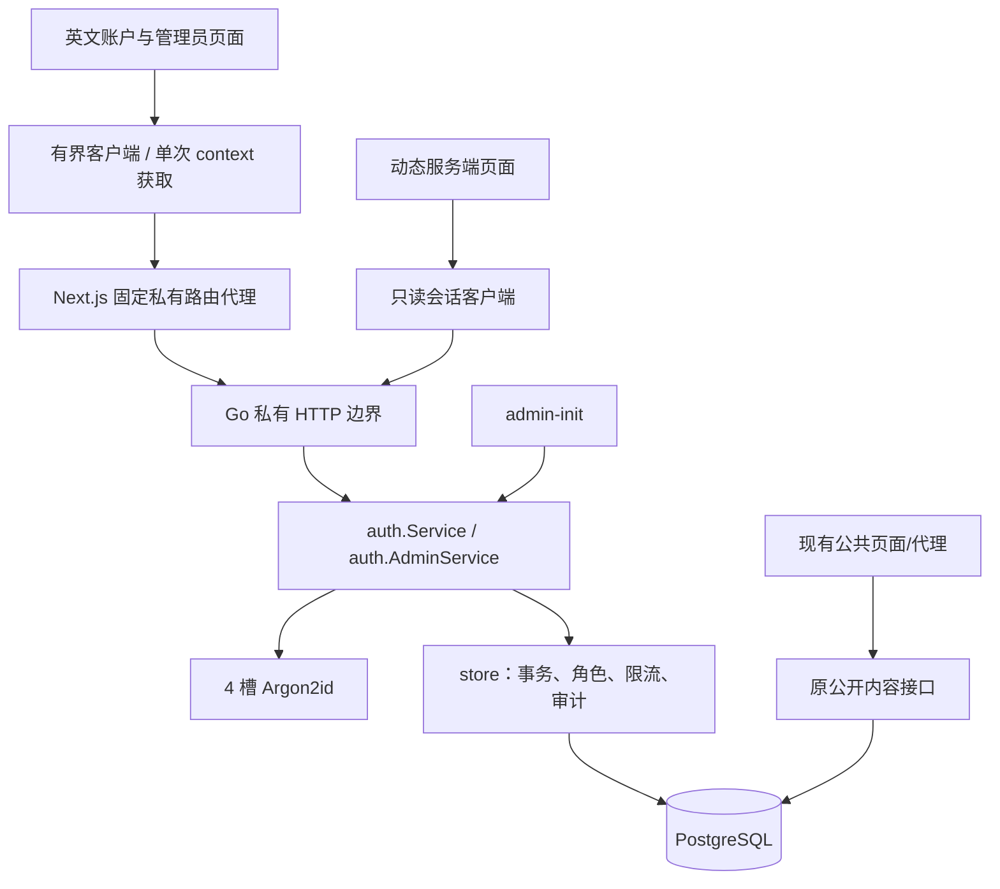
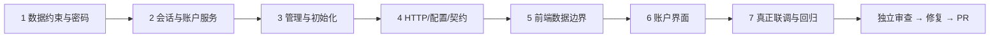

# P3a 账户与权限基础执行计划

> **执行者要求：** 使用 superpowers:executing-plans 在当前会话逐项实现，或在用户明确选择代理方式后使用 superpowers:subagent-driven-development。各步骤用复选框记录实际结果；没有完成的步骤不能提前勾选。

**Goal:** 建立真实英文账户页面、可撤销数据库会话和受控管理员权限，为 P3b 独立内容复核提供稳定身份。

**Architecture:** Go auth 定义业务类型、密码计算和服务接口，现有 store 实现 PostgreSQL 事务；auth 不导入 store。HTTP 边界与 Next.js 私有代理分别校验请求和响应，公共读取继续使用原接口；账户、会话和审计只新增数据表。

**Tech Stack:** Go 1.27.1（CGO_ENABLED=0）、PostgreSQL 17.11、Node.js 24.17.0、Next.js 16.3.7、React 19.3.0、TypeScript 5.9.3，沿用前端锁文件；新增 golang.org/x/crypto v0.57.0、golang.org/x/term v0.46.0。

**Spec:** [已确认的 P3a 设计](../specs/2026-10-01-account-foundation-design.md)。用户于 2026-10-01 确认，方案通过 [PR #8](https://github.com/yyl1212/math_master/pull/8) 合并。计划基线为 master `91783a9`；用户已确认通过 PR #9 合并计划，选择 Native 连续执行；七项实现正在本功能分支验收，整分支审查和 CI 结果以实际记录为准。

## 全局约束（Global Constraints）

- 用户优先级保持为内容正确性、数量与覆盖、学习路径、页面美观；文档使用中文，网站使用英文并保留中文数学术语。
- 公开数学内容保持当前状态，不为账户演示发布草稿；账户成功登录不生成学习完成、检测、解锁或掌握记录。
- 用户名允许 ASCII 字母、数字和下划线，长度 3—32，保存为小写且唯一；前后空白不自动修正。
- 密码为合法 UTF-8，15—128 个 Unicode 码点且最多 512 字节；允许空格和中文，不裁剪、不做 Unicode 归一化、不强制大小写/符号组合。
- Argon2id 参数固定为版本 19、内存 19456 KiB、迭代 2、并行度 1、随机盐 16 字节、输出 32 字节，按 PHC 格式保存；每进程最多同时进行 4 次密码计算。
- 会话和匿名 Cookie 令牌都由 crypto/rand 生成 32 字节；数据库只保存令牌 SHA-256。会话空闲期限 30 分钟，绝对期限 7 日；每用户最多 5 个有效会话，活动时间最多每 60 秒更新一次。
- 匿名上下文 10 分钟到期；近期密码验证期限 5 分钟；每个账户始终包含 learner，公开注册只能创建 learner。
- 生产使用 __Host-mm_session / __Host-mm_preauth，Secure、HttpOnly、SameSite=Lax、Path=/、无 Domain；本机 HTTP 使用 mm_session_dev / mm_preauth_dev，生产不接受开发 Cookie。
- 私有响应 Cache-Control: private, no-store；SSR、代理和页面不启用账户缓存。秘密不进入客户端公开数据、URL、日志、测试报告或 localStorage。
- 请求体上限 8 KiB；管理读取响应上限 1 MiB；固定上游超时 5 秒；拒绝未知/重复字段、跨源 CORS、任意上游与重定向。
- 表名固定为 auth_users、auth_user_roles、auth_sessions、auth_preauth、auth_rate_limits、auth_audit_events、auth_bootstrap；旧内容表、公共响应、schemaVersion=1 不修改。
- Go 全程 CGO_ENABLED=0 GOTOOLCHAIN=go1.27.1；单次验证经 tools/verify/run.mjs 最多 540 秒，Go 测试 -timeout 5m。浏览器 workers=1、retries=0、单例 30 秒；较长回归拆批，不突破 10 分钟。
- 从最新 master 新建 codex/ 功能分支。完成后独立代码审查、回归、CI、Git PR；生产部署、内容发布和学习状态不属于 P3a。
- 不读取或打印 config/server.local.json、真实账户密码、GitHub 凭据或 .env 内容；测试连接只由现有受保护随机测试库工具使用，保留开发库与资料快照。

## 审查重点（Review Focus）

1. 密码计算中请求取消不能提前释放 4 个计算槽，也不能由恶意 PHC 引发超额内存；任务 1 的 TestArgon2SlotsSurviveCancellation / TestPHCRejectsUnboundedParameters 验证。
2. 密码验证完成后、创建会话前发生改密，以及撤销管理员与其写操作并发，不能沿用旧权限；任务 2/3 的 TestLoginRacesPasswordChange / TestAdminRevocationRacesWrite 用真实事务验证提交顺序。
3. JSON 字段重复、大小写别名、孤立代理项转义和 Unicode 密码，不能被解码器悄悄改写；任务 4 的 TestPrivateJSONIsStrict 验证。
4. Go 畸形响应带 Set-Cookie、合并 Cookie 或中途超限，不能改变浏览器身份；任务 5 的 TestPrivateProxyResponseBoundary 验证。
5. 导航和表单同时首次获取匿名 context，以及双击管理按钮，不能造成两个竞争 Cookie 或重复提交；任务 5 的 TestContextSingleFlight、任务 6 的界面验证覆盖。

## 架构、依赖和文件责任





| 文件范围 | 任务 | 责任 |
| --- | --- | --- |
| db/migrations/00003_accounts.sql；backend/internal/auth/{model,password,session,policy}.go 及对应测试；store/accounts_schema_test.go | 1 | 数据约束、秘密类型、密码/Token 基础能力 |
| auth/{repository,service,rate_limit}.go；store/{accounts,sessions,auth_rate_limit,auth_audit}.go；store/{auth_fixture,auth_service,auth_concurrency,auth_rate_limit}_test.go | 2 | 注册、会话、改密、限流及真实事务测试 |
| auth/admin.go；store/roles.go；store/roles_test.go；cmd/admin-init/main.go；cli/{admin.go,admin_test.go} | 3 | 角色、密码重置和一次性管理员 |
| httpapi/{application,auth,admin,private_json,private_error,private_cookie}.go 及对应测试；config；cmd/server；api/openapi.yaml；.env.example | 4 | 请求边界、运行配置、API 契约与启动兼容 |
| frontend/src/lib/auth/{types,schemas,config,cookies,client,server-client}.ts 及测试；lib/api/private-proxy.ts 及测试；app/api/v1/{auth,admin}/[...segments]/route.ts；generated.d.ts；frontend/.env.example | 5 | 有界私有请求、SSR、Cookie 与响应校验 |
| app/{register,login,account}/page.tsx；app/admin/users/page.tsx；features/auth/{credentials-form,account-panel,admin-users,auth-state}.tsx 及测试；components/auth-status.tsx；site-header.tsx；styles/auth.module.css | 6 | 英文页面、真实会话导航、可访问性与响应式 |
| internal/e2etest/{auth_fixture.go,harness.go,harness_test.go}；tests/e2e/{auth.spec.ts,auth-security.spec.ts,fixtures.ts,playwright.config.ts}；两份现有 workflow；docs/operations/account-foundation.md；README.md | 7 | 隔离联调、时限、CI、运维与整分支验收 |

大括号表示同目录独立文件，路径相对根目录；上表省略的 backend/internal/ 前缀在任务文件清单中明确。任务新增测试只验证权限、输入、资源和实际业务效果，不为纯样式写镜像测试。

## 固定数据与接口约定

### 共用类型与事务规则

- auth.User：ID string、Username string、Roles []Role、MustChangePassword bool；JSON 名为 id/username/roles/mustChangePassword。Role 为 learner/editor/reviewer/admin，输出顺序固定为该顺序，输入角色去重后排序。
- auth.Digest、auth.Secret 均为 [32]byte；Cookies 包含 Session/Preauth 原始字符串；PreauthProof/SessionProof 包含 TokenHash Digest、CSRF Secret；NewPreauth/NewSession 同样只有摘要和 CSRF，不包含原始 Cookie。
- auth.Credential：UserID string、PHC string、Version int64。SessionRecord：User、CSRF、CredentialVersion int64、ReauthenticatedAt *time.Time；PreauthRecord：CSRF Secret。
- CookieDelta：SetSession/SetPreauth string、ClearSession/ClearPreauth bool，全部 json:"-"。ContextView：User *User、CSRFToken string。仅 HTTP 边界转换 CookieDelta；不能把服务返回的内部类型直接 JSON 编码。
- RegisterInput/LoginInput：username/password；PasswordInput：currentPassword/newPassword；ReauthInput：password；RolesInput：roles/reason；ResetInput：temporaryPassword/reason/ownershipNote。所有字段大小写精确匹配；备注 10—1000 码点，密码服从全局规则。
- UserQuery：Q string、Limit/Offset int；UserPage：Items []User、Total/Limit/Offset int，空 items 为 []。q 以字面子串匹配用户名，大小写不敏感；最多 128 UTF-8 字节，limit 默认 20、范围 1—100、offset>=0。未知/重复 query 拒绝。
- auth 错误使用可比较的哨兵：ErrInvalidInput、ErrInvalidCookie、ErrInvalidCredentials、ErrAuthenticationRequired、ErrCSRF、ErrForbidden、ErrUsernameUnavailable、ErrAlreadyAuthenticated、ErrLastAdminRequired、ErrPasswordChangeRequired、ErrReauthRequired、ErrNotFound、ErrUnavailable、ErrAlreadyInitialized；RateLimitError{RetryAfterSeconds int}。禁止直接显示底层错误字符串。
- 所有账户事务有 3 秒 DB 时限；HTTP 私有请求总 context 时限 4 秒。写操作在锁定行后取一次 DB clock_timestamp() 判断有效期并保存事件时间，不以事务开始前的旧时间绕过过期。对密码计算取消，只阻止后续提交，不提前释放正在运行的计算槽。
- 管理写与初始化先取得 pg_advisory_xact_lock(1296127049)，再按 UUID 排序锁定操作者/目标用户，再处理会话。账户写先锁用户，再锁 preauth/会话；限流单独短事务先全局、后按 scope/key/window_start 排序锁定，不在身份事务内持有限流锁。
- 密码计算可在事务外进行；LoginSession/ChangePassword/ReauthenticateSession 在用户行锁内检查期望 credential_version，写请求在事务内再次核对会话/CSRF/权限。新登录 reauthenticated_at 为 NULL，管理操作必须显式重新验证。
- 同角色集合的替换仍记录理由/审计，但不增加凭据版本、不撤销会话；发生实际角色变更时增加版本并撤销所有会话。重置与改密总是更新版本并撤销会话。操作对象是自己时 HTTP 清除本人 Cookie。
- 不创建停用/删除账户接口。审计 INSERT 与状态变化同事务；失败整体回滚。审计 ID 为 bigint identity，事件禁止 UPDATE/DELETE，保留操作前后角色、原因、操作者/目标、DB 时间及请求编号。

### HTTP 协议

完整路径加 /api/v1 前缀；所有私有方法严格匹配，HEAD/OPTIONS 不隐式继承 GET。除 admin/users 列表外，私有路径不接受 query。UUID 为系统生成的小写 v4 形式，非法 ID 返回 400；有权限但不存在的目标返回 404。

| 路径/方法 | 请求 | 成功 |
| --- | --- | --- |
| GET auth/session | 选定会话 Cookie；无认证副作用 Cookie | 200 {data:{user:User|null}} |
| GET auth/context | X-Requested-With: MathMaster；选定 Cookie | 200 {data:{user:User|null,csrfToken:string}}，必要的 Set-Cookie |
| POST auth/register | RegisterInput、preauth Cookie/CSRF/Origin | 201 {data:{user:User}}，消费并清除 preauth；不登录 |
| POST auth/login | LoginInput、preauth Cookie/CSRF/Origin | 200 {data:{user:User}}，新会话 Cookie + 清除 preauth |
| POST auth/logout、auth/logout-all | 精确空 JSON 对象 {}、会话 CSRF/Origin | 204，无正文，清除 Cookie |
| POST auth/password | PasswordInput、会话 CSRF/Origin | 204，无正文，撤销全部并清除 Cookie |
| POST auth/reauth | ReauthInput、会话 CSRF/Origin | 200 {data:{validUntil:RFC3339}} |
| GET admin/users | UserQuery，admin | 200 {items,total,limit,offset} |
| PUT admin/users/{id}/roles | RolesInput、admin/近期验证/CSRF/Origin | 204，无正文；自改角色时清除 Cookie |
| POST admin/users/{id}/password-reset | ResetInput、同上 | 204，无正文；自重置时清除 Cookie |

密码重置后的受限会话只允许 session/context/password/logout/logout-all；reauth、admin 接口返回 PASSWORD_CHANGE_REQUIRED。已登录时 register/login 返回 ALREADY_AUTHENTICATED；不会切换账户。

| 状态 | PrivateError.code | 固定英文 message |
| --- | --- | --- |
| 400 | INVALID_REQUEST / INVALID_COOKIE | Invalid request. / Invalid sign-in cookie. |
| 401 | INVALID_CREDENTIALS / AUTHENTICATION_REQUIRED | Invalid username or password. / Please sign in to continue. |
| 403 | CSRF_FAILED / FORBIDDEN / PASSWORD_CHANGE_REQUIRED | Request verification failed. / You do not have permission. / Change your password to continue. |
| 404 / 405 | NOT_FOUND / METHOD_NOT_ALLOWED | Resource not found. / Method not allowed. |
| 409 | USERNAME_UNAVAILABLE / ALREADY_AUTHENTICATED / LAST_ADMIN_REQUIRED | This username is unavailable. / Sign out before using another account. / At least one administrator is required. |
| 428 | REAUTHENTICATION_REQUIRED | Verify your password before continuing. |
| 429 | RATE_LIMITED | Too many requests. Try again later. |
| 503 | AUTH_NOT_CONFIGURED / SERVICE_UNAVAILABLE | Accounts are temporarily unavailable. / Service temporarily unavailable. |

私有错误外层沿用 error/code/message/requestId；只给 RATE_LIMITED 安全整数 Retry-After。未知内部/DB 错误统一 SERVICE_UNAVAILABLE；不影响公共旧 Error。代理制造的故障也用该私有固定文案。200/201 必须正确 application/json；204 必须无正文；所有状态都 private, no-store/nosniff。OpenAPI info 升为 1.2.0，仅新增私有路由/组件，旧公共字段与枚举保持原样。

### Task 1：数据约束、密码与令牌安全基础

**Files:** 新增 db/migrations/00003_accounts.sql；backend/internal/auth/{model,password,session,policy}.go 和对应 _test.go；backend/internal/store/accounts_schema_test.go。修改 backend/go.mod、go.sum。

**Interfaces:** 消费 store.Up(context.Context,*sql.DB,string)、testutil.Database(*testing.T)。产出 ValidateUsername(string)(string,error)、ValidateNewPassword(string)error、NormalizeRoles([]Role)([]Role,error)、NewID(io.Reader)(string,error)、NewSecret(io.Reader)(Secret,error)、EncodeSecret(Secret)string、DecodeSecret(string)(Secret,error)、TokenDigest(Secret)Digest、EqualSecret(Secret,Secret)bool，以及 PasswordHasher 的 Hash(ctx context.Context,password string)(string,error)/Verify(ctx context.Context,phc,password string)(bool,error) 和 NewArgon2Hasher(io.Reader)*Argon2Hasher。

- [x] **Step 1：写失败测试。** auth/password_test.go、session_test.go、policy_test.go 覆盖以下断言；store/accounts_schema_test.go 在随机库迁移后验证唯一约束、外键、审计禁止改删、没有 learner 的用户无法提交、增量迁移不改变原内容表。只有数据为空的隔离库允许验证 down/up，运维不得 down 真实账户表。

```json
{
  "TestUsernameAndPasswordPolicy": {"Math_User": "math_user", " math_user ": "INVALID_REQUEST", "15个数": "valid", "14个数": "invalid", "128个😀": "valid/512bytes", "129个a": "invalid", "合法密码末尾空格": "保留原字节"},
  "TestArgon2PHC": {"algorithm":"argon2id", "v":19, "m":19456, "t":2, "p":1, "saltBytes":16, "keyBytes":32, "wrongPassword":false, "twoHashes":"different salts"},
  "TestPHCRejectsUnboundedParameters": {"m=4294967295":"reject before derive", "duplicate m":"reject", "algorithm=argon2i":"reject", "bad base64":"reject", "wrong salt/key size":"reject"},
  "TestArgon2SlotsSurviveCancellation": {"heldDerivations":4, "fifth":"RATE_LIMITED immediately", "cancelFirst":"still 4 occupied until derive finishes", "releaseOne":"next calculation accepted"},
  "TestTokenAndIDBoundaries": {"tokenBytes":32, "encodedLength":43, "padding/invalidAlphabet":"reject", "rngFailure":"no token/user", "ID":"UUID v4"}
}
```

取消/并发测试使用密码包内部测试构造器 newHasher(random io.Reader,derive deriveFunc) 和通道门闩，deriveFunc 与 argon2.IDKey 签名一致；生产构造器只能使用真实 IDKey，不暴露环境开关。

- [x] **Step 2：验证 RED。** `node tools/verify/run.mjs --cwd backend -- env CGO_ENABLED=0 GOTOOLCHAIN=go1.27.1 go test ./internal/auth ./internal/store -run 'Test(UsernameAndPasswordPolicy|Argon2PHC|PHCRejectsUnboundedParameters|Argon2SlotsSurviveCancellation|TokenAndIDBoundaries|AccountsSchema)' -timeout 5m -count=1`。预期只因新能力缺失失败，连接/编译工具链故障先处理。
- [x] **Step 3：实现签名与迁移。** auth_users 存 UUID、唯一规范用户名、PHC、正 credential_version、must_change_password、created_at；roles 联合主键并 CHECK 角色枚举；auth_users 增加恒为 learner 的 default_role，通过 (id,default_role) 到 auth_user_roles(user_id,role) 的 DEFERRABLE INITIALLY DEFERRED / NO ACTION 外键保证提交时存在 learner，建表后 ALTER 添加该约束；sessions 存唯一 32 字节摘要、用户/版本、32 字节 CSRF、created_at/last_seen_at/absolute_expires_at/revoked_at/reauthenticated_at；preauth 存摘要/CSRF/created_at/expires_at/consumed_at；rate_limits 的联合主键为 scope/key/window_start；audit 存上述事件字段与仅用户名摘要的失败事件；bootstrap 单例行记录初始化用户。使用数据库 CHECK/FK/必要索引，不保存原始 Cookie。延迟外键的提交时检查依据 [PostgreSQL 17 CREATE TABLE](https://www.postgresql.org/docs/17/sql-createtable.html)，用户与角色在同一事务创建；不使用不可延迟的 RESTRICT 代替 NO ACTION。锁定 x/crypto v0.57.0、x/term v0.46.0，记录 x/sys v0.48.0、x/text v0.42.0 等实际传递变化。
- [x] **Step 4：验证 GREEN 与计算成本。** 重跑 Step 2。实现 BenchmarkArgon2Hash 和 BenchmarkArgon2Concurrent（实际最多 4 并发，真实 IDKey），运行 `node tools/verify/run.mjs --cwd backend -- /usr/bin/time -l env CGO_ENABLED=0 GOTOOLCHAIN=go1.27.1 go test ./internal/auth -run '^$' -bench '^BenchmarkArgon2(Hash|Concurrent)$' -benchtime=3x -benchmem -timeout 5m`；记录本机耗时、分配与最大驻留内存，说明其包含 Go 进程开销，不能当作生产容量。
- [x] **Step 5：提交。** `feat: add account schema and bounded password primitives`，只提交本任务文件，不提交配置秘密或测试产物。

### Task 2：账户、会话、CSRF、限流与撤销事务

**Files:** 新增 backend/internal/auth/{repository,service,rate_limit}.go 及 service_test.go；backend/internal/store/{accounts,sessions,auth_rate_limit,auth_audit}.go；store/{auth_fixture,auth_service,auth_concurrency,auth_rate_limit}_test.go。

**Interfaces:** 消费任务 1 类型/Hasher；在 auth/repository.go 定义 AccountRepository，由 *store.Store 实现，auth 不导入 store。方法签名为：

```go
type AccountRepository interface {
ReadCredential(ctx context.Context, username string) (Credential, error)
RecordLoginFailure(ctx context.Context, usernameHash Digest, requestID string) error
ReadSession(ctx context.Context, hash Digest, touch bool) (SessionRecord, error)
ReadPreauth(ctx context.Context, hash Digest) (PreauthRecord, error)
CreatePreauth(ctx context.Context, input NewPreauth) error
RegisterLearner(ctx context.Context, proof PreauthProof, userID, username, phc, requestID string) (User, error)
LoginSession(ctx context.Context, proof PreauthProof, userID string, expectedVersion int64, next NewSession, requestID string) (User, error)
LogoutSession(ctx context.Context, proof SessionProof, all bool, requestID string) error
ChangePassword(ctx context.Context, proof SessionProof, expectedVersion int64, phc, requestID string) error
ReauthenticateSession(ctx context.Context, proof SessionProof, expectedVersion int64, requestID string) (time.Time, error)
ConsumeRates(ctx context.Context, keys []RateKey) error
CleanupAuth(ctx context.Context, limit int) (int, error)
}
```

RateKey 为 Scope/Key string、Limit int、Window time.Duration，Key 空字符串表示全局额度。产出 NewService(repo AccountRepository,hasher PasswordHasher,random io.Reader)(*Service,error)；Service 方法固定为：

```go
Context(ctx context.Context, cookies Cookies) (ContextView, CookieDelta, error)
Session(ctx context.Context, cookies Cookies) (*User, error)
Register(ctx context.Context, cookies Cookies, csrf string, input RegisterInput, requestID string) (User, CookieDelta, error)
Login(ctx context.Context, cookies Cookies, csrf string, input LoginInput, requestID string) (User, CookieDelta, error)
Logout(ctx context.Context, cookies Cookies, csrf string, all bool, requestID string) (CookieDelta, error)
ChangePassword(ctx context.Context, cookies Cookies, csrf string, input PasswordInput, requestID string) (CookieDelta, error)
Reauthenticate(ctx context.Context, cookies Cookies, csrf string, input ReauthInput, requestID string) (time.Time, error)
Cleanup(ctx context.Context) (int, error)
```

字符串 csrf 先严格解码为 Secret，Cookie 先解码/摘要；内部 CookieDelta 的原令牌只能由 HTTP 边界写为 Cookie，不直接 JSON 编码。NewService 的假哈希生成失败返回错误，损坏的数据库 PHC 映射 ErrUnavailable；错误密码或凭据版本改变通过 RecordLoginFailure 记录摘要后返回 ErrInvalidCredentials。

- [x] **Step 1：写失败测试。** 在 store_test 包实现 newAuthFixture(t *testing.T)*authFixture，字段 db/repo/service/ctx；复用现有 setup(t) 的安全随机库，fixture 方法只通过真实 Service 创建上下文和账户，不打印秘密。以下每个期限断言使用独立初始会话；通过 SQL 设置相对 DB 时间，不等待真实分钟/天。

```json
{
  "TestAccountRegistration": {"role":["learner"], "duplicateCaseName":"USERNAME_UNAVAILABLE", "consumedPreauth":"CSRF_FAILED", "sessionCount":0, "publicationHeads":0},
  "TestSessionLifecycle": {"idle15m":"valid", "idle30m":"expired", "absolute7d":"expired", "sixLogins":"5 active/oldest revoked", "activity30s":"no touch", "activity90s":"touch", "logoutAll":"all invalid"},
  "TestContextRecovery": {"expiredCookie":"clear then anonymous", "databaseFailure":"SERVICE_UNAVAILABLE/no CookieDelta", "validPreauth":"same token/CSRF", "newPreauth":"10 minute expiry"},
  "TestPasswordAndReauth": {"wrongCurrent":"INVALID_CREDENTIALS/no state change", "change":"version+1/all revoked", "reauth":"validUntil=DB time+5m", "newLogin":"reauthenticated_at=null"},
  "TestLoginRacesPasswordChange": {"pauseAfterVerify":"change password and commit", "resumeOldLogin":"INVALID_CREDENTIALS/no valid session"},
  "TestAtomicAudit": {"forcedAuditInsertFailure":"user/session change rolled back", "loginFailure":"username hash only"}
}
```

用测试 PasswordHasher 包装器在已读取凭据后通过通道暂停验证，另一事务完成改密后释放；不能用顺序调用替代该交错。ReadSession 失败的服务替身只测错误传播，身份/撤销效果仍以 PostgreSQL 为准。

- [x] **Step 2：验证 RED。** `node tools/verify/run.mjs --cwd backend -- env CGO_ENABLED=0 GOTOOLCHAIN=go1.27.1 go test ./internal/auth ./internal/store -run 'Test(AccountRegistration|SessionLifecycle|ContextRecovery|PasswordAndReauth|LoginRacesPasswordChange|AtomicAudit|AuthRateLimits|AuthCleanup)' -timeout 5m -count=1`。
- [x] **Step 3：实现账户事务与有限资源。** CSRF 在被锁定的 preauth/会话内常量时间比较；注册/登录消费上下文与用户/会话变更一起提交。注册不登录，未知用户使用初始化时固定假 PHC 验证。会话查询检查 DB 时间、版本和撤销，touch 不获取后续用户锁；所有写先锁用户再处理会话。限流固定窗口：session/context 共用 auth_read 600/分钟，新 context 120/分钟；login 120 全局+10 用户名+10 preauth/分钟；register 30 全局/分钟+3 preauth/10分钟；password/reauth 120 全局+10 session/分钟；admin 写留给任务 3 的 60 全局+10 actor/分钟。用户名键用摘要，其他键用 token 摘要或 user ID，不用伪造 IP。ConsumeRates 先锁定/检查全局键，全局已满时只饱和更新这些已有键，不创建新的用户/上下文键；全局允许后，再按固定顺序锁定并计数全部附加键。拒绝时提交本次已有键的尝试计数并返回已知阻断窗口中最大的 Retry-After；计数饱和于 limit+1 防止溢出，窗口对齐 UTC。已成功计数但后续失败不退回额度。被全局拒绝的随机用户名不能继续增加键数量。
- [x] **Step 4：验证 GREEN、额度和清理。** 重跑 Step 2。TestAuthRateLimits 验证登录第 11 次、注册第 4 次、600/120/30/60 等全局门槛、重启同库后计数仍在、并发恰好达到限额且不会多放行；直接测试仓储 ConsumeRates，避免用数百次真实 Hash 堆测试。TestAuthCleanup 验证只删终止超过 24 小时的记录、总批次最多 2000、审计保留、失败不会让过期会话重新有效。确保新包 error 分支不记录原始参数。
- [x] **Step 5：提交。** `feat: add transactional accounts and revocable sessions`。

### Task 3：管理员初始化、角色控制与人工重置

**Files:** 新增 backend/internal/auth/admin.go；store/roles.go、roles_test.go；backend/cmd/admin-init/main.go；backend/internal/cli/admin.go、admin_test.go；复用任务 2 的 fixture/audit/limits。

**Interfaces:** auth.AdminRepository 复用任务 2 的 ReadSession/ConsumeRates 方法，并新增下列仓储方法；RoleMutation 为 ActorID string、Changed bool。

```go
type AdminRepository interface {
ReadSession(ctx context.Context, hash Digest, touch bool) (SessionRecord, error)
ConsumeRates(ctx context.Context, keys []RateKey) error
InitializeAdmin(ctx context.Context, userID, username, phc, requestID string) (User, error)
ListAccountUsers(ctx context.Context, sessionHash Digest, query UserQuery) (UserPage, error)
ReplaceAccountRoles(ctx context.Context, proof SessionProof, targetID string, input RolesInput, requestID string) (RoleMutation, error)
ResetAccountPassword(ctx context.Context, proof SessionProof, targetID, phc, reason, ownershipNote, requestID string) (RoleMutation, error)
}
```

产出 NewAdminService(repo AdminRepository,hasher PasswordHasher,random io.Reader)*AdminService，方法固定为：

```go
Initialize(ctx context.Context, username, password, requestID string) (User, error)
ListUsers(ctx context.Context, cookies Cookies, query UserQuery) (UserPage, error)
ReplaceRoles(ctx context.Context, cookies Cookies, csrf, targetID string, input RolesInput, requestID string) (CookieDelta, error)
ResetPassword(ctx context.Context, cookies Cookies, csrf, targetID string, input ResetInput, requestID string) (CookieDelta, error)
```

AdminService 先读取真实会话确定限流 actor，在独立短事务消耗管理额度，不持限流锁进入管理事务；Replace/Reset 仓储在管理事务内再次核验 Actor。ListAccountUsers 的 SQL 在同一读取快照检查会话、版本、admin 和 mustChangePassword，服务预检不替代仓储授权。CLI 接口 RunAdminInit(ctx context.Context,args []string,input io.Reader,stdout,stderr io.Writer,initializer AdminInitializer)int，AdminInitializer 仅含上述 Initialize 方法。

- [x] **Step 1：写失败测试。** store/roles_test.go 的 LastAdmin/Revocation 测试先持有 1296127049 锁，启动两个操作，通过 pg_locks 确认本随机库有两个未获授权锁等待者后释放；helper waitForAdminLockWaiters(t,db,n) 用有界 5 秒 context 查询，不用猜测 sleep。

```json
{
  "TestAdminInitializeOnce": {"twoConcurrentInitializers":"one success/one ALREADY_INITIALIZED", "bootstrapRows":1, "roles":["learner","admin"], "forcedAuditFailure":"no user/bootstrap"},
  "TestLastAdminConcurrentDemotion": {"twoAdminsRemoveOwnAdmin":"one success/one LAST_ADMIN_REQUIRED", "remainingAdmins":1},
  "TestAdminRevocationRacesWrite": {"revokeCommitsFirst":"other write rejected", "writeCommitsFirst":"allowed, audit order proves it", "unauthorizedAfterRevoke":"no mutation"},
  "TestResetRequiresOwnershipAndReauth": {"reauthOlderThan5m":"REAUTHENTICATION_REQUIRED", "missing note":"INVALID_REQUEST", "reset":"version+1/all sessions revoked/mustChangePassword"},
  "TestRestrictedResetSession": {"password/context/logout":"allowed", "reauth/admin":"PASSWORD_CHANGE_REQUIRED", "afterChange":"sign in again"},
  "TestLiteralUserSearch": {"q=%/_/引号":"literal", "case":"insensitive", "pagination":"stable username/id order"},
  "TestAdminCLISecretBoundary": {"--password=value":"reject", "stdin extra line/too long":"reject", "stdout/stderr":"no password/PHC/token", "repeated init":"no second admin"}
}
```

真实并发测试按最终审计 ID 顺序断言，不依赖 PostgreSQL 等待队列调度；两个自降权与两人互相撤权分开测试，不能把被撤销的 actor 401 错判为最后管理员保护失败。

- [x] **Step 2：验证 RED。** `node tools/verify/run.mjs --cwd backend -- env CGO_ENABLED=0 GOTOOLCHAIN=go1.27.1 go test ./internal/store ./internal/cli -run 'Test(Admin|LastAdmin|Reset|RestrictedReset|LiteralUserSearch)' -timeout 5m -count=1`。
- [x] **Step 3：实现签名、审核理由和初始化命令。** 管理事务按固定锁顺序重读会话/CSRF/角色/reauth/版本；NormalizeRoles 的结果必含 learner，同角色集合不撤销会话，实际变化撤销全部。重置理由和所有权说明不能为空且受码点限制，临时密码只用于 Hash，不进入响应。Bootstrap 的用户、角色、单例、审计一次提交；不提供补建或 HTTP 初始化入口。RunAdminInit 仅接受 --username 与可选 --password-stdin；终端默认仅对 *os.File 且 x/term.IsTerminal 为真的 input 用 x/term.ReadPassword，非终端要求显式 --password-stdin；显式 stdin 只去除单个输入行的行终止符而保留密码空格；拒绝未知参数。DB 连接由 main 使用现有配置建立，CLI 测试注入 initializer；真实 InitializeService 的事务仍有集成测试。
- [x] **Step 4：验证 GREEN 和旧流程。** 重跑 Step 2；再运行 Task 2 测试，验证自改/自重置清除 Cookie、其他人会话撤销与新增 roles 不改变内容库。测试失败输出仅用固定说明，不打印秘密结构体。
- [x] **Step 5：提交。** `feat: add guarded administrator and role management`。

### Task 4：Go HTTP 边界、配置兼容与 OpenAPI

**Files:** 新增 backend/internal/httpapi/{application,auth,admin,private_json,private_error,private_cookie}.go 与对应测试；修改 config/{config.go,config_test.go}、cmd/server/main.go、api/openapi.yaml、.env.example。

**Interfaces:** 产出 NewApplicationHandler(reader Reader,pinger Pinger,options AuthOptions)http.Handler；AuthOptions 包含 Accounts *auth.Service、Admin *auth.AdminService、PublicOrigin string、Production bool。NewHandler(Reader,Pinger) 和旧公共路由保持可用。Config 新增 AppEnv/PublicOrigin 字段，APP_ENV 默认 development，origin 空为只读模式；server 只在有效认证配置下构建 Service/AdminService 并启动每分钟 Cleanup，随进程 context 结束。private JSON helper 签名 decodePrivateJSON(io.Reader,any)error，Cookie helper 按 AuthOptions 的环境只解析预期两个名字；禁止由客户端/Host 提供配置。

- [x] **Step 1：写失败测试。** HTTP 单元测试通过可控 Repository/Hasher 组成真实 Service 校验边界；新增 httpapi/auth_integration_test.go 通过真实随机 DB/Service 和 httptest 验证身份与权限，不能用替身证明事务。以下输入用原始 bytes 构造，测试失败信息不包含 body。

```json
{
  "TestPrivateJSONIsStrict": {"duplicate username":"400", "Username alias":"400", "top-level null/array":"400", "trailing JSON":"400", "8KiB+1":"400", "invalid UTF-8":"400", "unpaired \ud800":"400", "paired emoji+Chinese password":"unchanged"},
  "TestOriginAndLoginCSRF": {"origin absent/wrong/null":"403", "cookie without token":"403", "token from another context":"403", "Sec-Fetch-Site=cross-site":"403", "context without X-Requested-With":"403"},
  "TestPrivateCookieBoundary": {"duplicate/quoted/padded/bad-length":"400+clear expected Cookie", "production dev cookie":"ignored/no auth", "context DB error":"503/no Set-Cookie", "login":"two separate Set-Cookie"},
  "TestPrivateProtocol": {"register":201, "login":200, "logout/change/roles/reset":204, "unknown":404, "HEAD/OPTIONS":405, "disabled auth":503, "all private":"private,no-store"},
  "TestAuthConfigCompatibility": {"old env":"read-only still starts", "production origin absent/http":"fail startup", "development http nonloopback":"fail", "origin credentials/path/query/hash":"fail", "Host/XFF override":"ignored"}
}
```

- [x] **Step 2：验证 RED。** `node tools/verify/run.mjs --cwd backend -- env CGO_ENABLED=0 GOTOOLCHAIN=go1.27.1 go test ./internal/config ./internal/httpapi -run 'Test(Private|OriginAndLoginCSRF|AuthConfig|AuthIntegration)' -timeout 5m -count=1`。
- [x] **Step 3：实现 HTTP 与契约。** 私有边界先有界读取 8193 字节并检查 UTF-8/JSON 字符串转义（拒绝孤立高/低代理项），再 token walk 拒绝重复/大小写别名和深度>8，最后只解码已知字段，拒绝多段 JSON。Origin 精确匹配规范化配置；context 自定义头，所有写同步 CSRF；读取不会获取管理能力。Request-ID 由 Go 新建，错误映射按固定表。CookieDelta 逐个写 Cookie，204 无正文，未知私有路由/方法不能由默认 HTML 错误或自动重定向代替。扩展 OpenAPI 1.2.0 的 PrivateError、User、Context、UserPage、请求体及 Cookie/CSRF/429/204 响应，不改旧 Error。配置模版只填公开 localhost origin，不读取真实 .env 或服务器配置。
- [x] **Step 4：验证 GREEN 和公共兼容。** 重跑 Step 2；`node tools/verify/run.mjs --cwd backend -- env CGO_ENABLED=0 GOTOOLCHAIN=go1.27.1 go test ./... -timeout 5m -count=1` 和 go vet ./...、go build -o bin/ ./cmd/...；公共 16 板块、草稿 404 和 SVG/HEAD 回归必须仍通过。新版启动前只对随机库迁移，开发库迁移由验收步骤明确备份后进行。
- [x] **Step 5：提交。** `feat: expose secure account APIs without changing public reads`。

### Task 5：前端私有代理、严格响应与 SSR 账户读取

**Files:** 新增 frontend/src/lib/auth/{types,schemas,config,cookies,client,server-client}.ts 及 {client,server-client,schemas}.test.ts；新增 lib/api/private-proxy.ts、private-proxy.test.ts；新增 app/api/v1/auth/[...segments]/route.ts、admin/[...segments]/route.ts；修改 generated.d.ts、frontend/.env.example。

**Interfaces:** 产出 createPrivateProxy(goOrigin:string,options:{publicOrigin:string;production:boolean},fetcher?:typeof fetch)：函数 (Request,segments:string[])=>Promise<Response>；与公共 createPublicProxy 独立。readServerSession(cookieHeader:string):Promise<AuthResult<User|null>> 只 GET auth/session；readServerUsers(cookieHeader:string,query:UserQuery):Promise<AuthResult<UserPage>> 只 GET admin/users。两者都不获取 context、不转发 Set-Cookie。getAuthContext():Promise<AuthResult<AuthContext>> 在浏览器共享单个在途 Promise，落定后释放；authRequest<T>(route:PrivateRoute,input:unknown):Promise<AuthResult<T>> 在写前取得当前 context 再发送 CSRF，禁止自动重试写请求。AuthResult<T> 为 {ok:true,data:T}|{ok:false,status:number,code:PrivateErrorCode,message:string,retryAfter?:number}；notifyAuthChanged():void 发布固定事件 math-master:auth-change。User/AuthContext/UserPage/UserQuery 来自生成契约的明确别名；PrivateRoute 是 {kind:register|login|logout|logout-all|password|reauth}、{kind:roles|reset;userId:string}、{kind:users;query:UserQuery} 的判别联合，kind 的各值为字符串字面量。authRequest 按 kind 选固定方法/路径，只有写请求获取 context；204 返回 AuthResult<void>，不得用任意 URL 字符串或 any。

- [x] **Step 1：写失败测试。** 新测试断言以下结果；模拟真实多 Set-Cookie 响应的单元用 Headers.append，原始非法合并字符串单独作为失败案例。

```json
{
  "TestPrivateProxyRequestBoundary": {"unknown path/method/query":"404/405/400 before fetch", "Cookie":"only two expected names; preserve duplicates for Go rejection", "Authorization/XFF/user request-id":"stripped", "write":"exact Origin/CSRF/custom header", "8KiB+1":"400 before fetch"},
  "TestPrivateProxyResponseBoundary": {"valid two cookies":"two preserved", "foreign cookie/Domain/wrong attrs/duplicate name":"503/no cookies", "malformed 400/404 or User":"503/no cookies", "status/code mismatch":"503/no cookies", "oversized chunked JSON":"503/body cancelled/no cookies", "204 nonzero Content-Length":"503", "valid Expires comma":"accepted", "redirect":"503"},
  "TestContextSingleFlight": {"header+form first context":"one fetch/same proof", "next call after settled":"fresh fetch", "rejected promise":"slot released"},
  "TestServerSessionIsolation": {"only allowed Cookie":"forward", "unavailable DB":"failure, not null", "no cache/private config":"not serialized", "admin user list 403/503":"failure, not empty list", "GET session":"never context/Set-Cookie"},
  "TestPrivateClientErrorSemantics": {"401 INVALID_CREDENTIALS":"retain existing signed-in state", "401 AUTHENTICATION_REQUIRED":"sign-in needed", "429":"safe Retry-After", "HTTP fault/invalid shape":"fixed unavailable message", "failed mutation":"no automatic retry"}
}
```

- [x] **Step 2：验证 RED。** 先运行 api:generate 并审查旧路径类型无变化；`node tools/verify/run.mjs --cwd frontend -- npm test -- src/lib/api/private-proxy.test.ts src/lib/auth/client.test.ts src/lib/auth/server-client.test.ts src/lib/auth/schemas.test.ts`。
- [x] **Step 3：实现签名、边界和生成类型。** 配置读取 APP_ENV/AUTH_PUBLIC_ORIGIN，与 Go origin 校验一致，服务端懒读取，npm build 不要求连接 Go 或创建上下文。固定 method/path/query 映射表只覆盖协议表；原始 Cookie 中只选已知名字，不能用会丢重复项的单值接口。只转发 Cookie、Origin、X-CSRF-Token、X-Requested-With、Sec-Fetch-Site，以及固定 Accept/Content-Type；不转发任意认证、Host/转发链或用户请求 ID。私有 JSON 请求最多 8 KiB、响应最多 1 MiB，流式有界读取、5 秒中断、redirect:error/cache:no-store。按路径/状态 Zod 严格校验成功/错误/204 后才复制安全 Set-Cookie：名字唯一、正确环境、Path=/、无 Domain、HttpOnly、SameSite=Lax、生产 Secure，令牌 43 位 base64url；清除 Cookie 必须空值且 Max-Age=0，新 Cookie Max-Age 为会话 604800 / preauth 600；按分号解析属性、正确处理 Expires 的合法逗号，不以逗号拆分 Set-Cookie。拒绝非法或合并 Cookie，未知错误制造固定 503，不能由失败状态猜测并清除有效身份。
- [x] **Step 4：验证 GREEN 和公共代理。** 重跑 Step 2；typecheck、全部 npm test、npm run build；将已审阅首次生成的 generated.d.ts 暂存为对照，重新 api:generate 后 git diff --exit-code -- frontend/src/lib/api/generated.d.ts，确认无生成漂移。公共代理的 Cookie/Authorization 剥离及 GET/HEAD 测试继续通过，不安装重复前端依赖或新增锁文件。
- [x] **Step 5：提交。** `feat: add validated private account transport and SSR session reads`。

### Task 6：英文注册、账户与角色管理界面

**Files:** 新增 frontend/src/app/{register,login,account}/page.tsx、app/admin/users/page.tsx；features/auth/{credentials-form,account-panel,admin-users,auth-state}.tsx、forms.test.tsx、admin-users.test.tsx；components/auth-status.tsx、auth-status.test.tsx；styles/auth.module.css。修改 components/site-header.tsx。

**Interfaces:** 消费任务 5 getAuthContext/authRequest/readServerSession/readServerUsers/notifyAuthChanged。产出 CredentialsForm({mode:'register'|'login'})、AccountPanel({user:User})、AdminUsers({initial:UserPage})、AuthState({kind:'anonymous'|'forbidden'|'unavailable'|'invalid-cookie'})、AuthStatus()。服务端页面动态读取真实 session，admin/users 的初始 UserPage 必须经 readServerUsers 取得，失败显示对应错误而非伪造空列表；客户端 Header/表单共享 getAuthContext，在路径变化或 auth-change 后刷新。角色管理读取传入 UserPage，查询使用协议 UserQuery；权限和近期验证由 Go 决定。

- [x] **Step 1：写关键交互失败测试。** 不为纯排版写测试；组件测试只覆盖真实行为和可访问性，fetch 使用契约合法 fixture。

```json
{
  "TestCredentialForms": {"labels/autocomplete":"username/new-password/current-password", "paste/Chinese/spaces":"preserved", "register success":"login", "login success":"account", "failure":"focus fixed English error/no password echo", "double click":"one mutation"},
  "TestAccountPanel": {"real identity":"User fields only", "logout/change":"clear field+notify+navigate", "mustChangePassword":"only change/sign-out controls", "wrong current password":"remain signed in", "no learning fields":"no fabricated progress"},
  "TestAdminUsers": {"learner/editor/reviewer":"no admin operations", "reason+ownership note":"required", "428":"reauthenticate then deliberate retry", "cancel dialog":"no mutation", "same-page success":"refresh state", "self revocation":"sign-in"},
  "TestAuthStatus": {"unavailable":"not anonymous/success", "context in flight":"single request shared with form", "auth page nav":"Knowledge Map not falsely selected"}
}
```

- [x] **Step 2：验证 RED。** `node tools/verify/run.mjs --cwd frontend -- npm test -- src/features/auth/forms.test.tsx src/features/auth/admin-users.test.tsx src/components/auth-status.test.tsx`。
- [x] **Step 3：实现页面与表单。** 注册/登录按钮为 Create account / Sign in，注册不登录；正常 account 显示用户名/角色、Change password / Sign out / Sign out everywhere，临时会话显示 Change your password to continue。admin/users 字面搜索、分页、角色集合、Reason/Ownership verification 和独立 Verify password 对话框；近期验证成功不自动重放之前的管理写请求，用户再明确提交。每个写操作在 await 前用同步 pending ref 锁住，完成/失败都清空密码字段，不保存到持久化或日志。所有账户导航禁用预取；SSR 匿名显示 Sign in 入口，无权限显示拒绝，故障显示 Accounts are temporarily unavailable，不把故障转成匿名；坏 Cookie 提示通过 browser context 清除后重新加载。保持系统字体、原创样式、1280/390 布局、标签、Tab 与错误焦点，不添加外部媒体。
- [x] **Step 4：验证 GREEN。** 重跑 Step 2；全部 typecheck/npm test/npm run build。异步 SSR 页面与真 Cookie 跳转由任务 7 实测，不以同步组件测试冒充。知识目录、路线与安全阅读组件回归仍通过。
- [x] **Step 5：提交。** `feat: add English account and administrator pages`。

### Task 7：真实联调、兼容回归、独立审查与交付

**Files:** 新增 backend/internal/e2etest/auth_fixture.go；修改 harness.go/harness_test.go。新增 tests/e2e/{auth.spec.ts,auth-security.spec.ts}，修改 fixtures.ts/playwright.config.ts；修改 .github/workflows/{backend,frontend}.yml；新增 docs/operations/account-foundation.md；修改 README.md、本计划、方案状态、路线图。

**Interfaces:** 测试进程启用 NewApplicationHandler，认证 origin 固定 http://127.0.0.1:18080，API/control 仍在 18081/18082；Next 测试 env 同时设置 APP_ENV=development、AUTH_PUBLIC_ORIGIN 和既有 GO_API_INTERNAL_URL。新增账号场景只操作本次随机库的 auth_* 表，沿用受令牌保护的控制端口，不加入正式 server。auth fixture 提供源码公开的隔离测试口令，不读取任何真实密码；runtime.local.json 不增加密码、Cookie 或 CSRF。每场景重置账号/限流/初始化状态，内容保持指定的旧 draft/published 测试场景；不改开发库。

- [ ] **Step 1：写真实浏览器失败测试。** 两种屏幕各测试：注册→登录→account→退出；错误密码不改身份；改密使另一个已打开浏览器会话失效；admin 初始化后登录→重新验证→授予 editor/reviewer→对方旧会话失效并重新登录；人工重置→临时会话受限→改密→重新登录；CSRF/跨源/伪造角色拒绝；接口故障→恢复后仍可读取真实登录态；匿名公共知识读取继续正常。页面断言只读真实 Go 返回，不路由拦截伪造成功。失败截图遮盖表单输入，trace/video 关闭，异常只显示固定失败信息，禁止将 Cookie、CSRF、控制令牌和 runtime 文件作为实际值或附件输出。
- [ ] **Step 2：验证 RED。** 先使用现有 production build/harness 执行 `node tools/verify/run.mjs --cwd frontend -- npm run e2e -- auth.spec.ts auth-security.spec.ts`，记录缺失认证场景/页面导致的失败；不能把端口占用或数据库连接故障计作 RED。
- [ ] **Step 3：接入 harness、两份既有 CI 与运维。** 复用 IsolatedConfigs/OpenVerified 及正常退出清理，auth reset 明确列出本随机库的表；guard 测试继续拦截 dbname/database 覆盖。正式 main 不能导入 e2etest。backend.yml 增加 auth 包单测，不遗漏新包；frontend.yml 构建新版 harness 并分别运行旧目录/阅读与新账户 E2E 两批，每批 globalTimeout=480000、单例 30000。沿用已锁定 Actions SHA 与 7 日失败报告，仅上传去秘密诊断，不新增第三份重复 workflow。中文操作文档说明认证 origin、只读兼容、admin-init 隐藏输入、所有权核验/近期验证、改密会话撤销、应用回退保留表、备份与版本；禁止执行 down 删除真实账户。
- [ ] **Step 4：完整 GREEN。** 从根目录加载私有环境但不打印；执行下表的所有命令。每批浏览器由已配置 desktop/mobile 两项目分别覆盖；若 480 秒不足，按 spec 文件拆更多批，不加重试或提高时限。人工查看两种屏幕登录/account/admin 截图和 Tab 路径；确认无横向溢出、密码遮盖、身份/拒绝/故障正确。SQL 验证开发库发布指针和数学草稿数量未因账户测试变化、所有本次随机库已清理；只记录数量，不输出配置或真实账户。
- [ ] **Step 5：独立审查、一次修复与 PR。** 使用 requesting-code-review 与 verification-before-completion 技能，新上下文整分支审查关注五项 Review Focus、权限/锁/秘密/公共兼容。Critical/Important 修复先写失败测试，再修复及相应/整分支回归；处理审查结论并保留验收记录。未解决阻塞问题不声称完成。提交 `test: verify real account flows and publish acceptance evidence`，push 功能分支并创建面向 master 的 Git PR，附到当前会话，核验最终提交 CI；不自行合并或部署。

### 最终验证命令

每一行单独由 540 秒验证入口执行，Go 必须携带指定环境；没有改动/失败时不重复扩大测试。

| 验证 | 命令（项目根） |
| --- | --- |
| 差异/工具 | git diff --check；node tools/verify/run.mjs -- node --test tools/verify/run.test.mjs tools/content-ingest/snapshot.test.mjs |
| Go 静态 | node tools/verify/run.mjs --cwd backend -- env CGO_ENABLED=0 GOTOOLCHAIN=go1.27.1 go vet ./... |
| Go 安全/HTTP | node tools/verify/run.mjs --cwd backend -- env CGO_ENABLED=0 GOTOOLCHAIN=go1.27.1 go test ./internal/auth ./internal/config ./internal/httpapi ./internal/content ./internal/e2etest ./internal/testutil -timeout 5m -count=1 |
| PostgreSQL/CLI | node tools/verify/run.mjs --cwd backend -- env CGO_ENABLED=0 GOTOOLCHAIN=go1.27.1 go test ./internal/store ./internal/cli -timeout 5m -count=1 |
| 构建 | node tools/verify/run.mjs --cwd backend -- env CGO_ENABLED=0 GOTOOLCHAIN=go1.27.1 go build -o bin/ ./cmd/... |
| 契约 | node tools/verify/run.mjs --cwd frontend -- npm run api:generate；git diff --exit-code -- frontend/src/lib/api/generated.d.ts |
| 类型/单元 | node tools/verify/run.mjs --cwd frontend -- npm run typecheck；node tools/verify/run.mjs --cwd frontend -- npm test |
| 生产构建/审计 | node tools/verify/run.mjs --cwd frontend -- npm run build；node tools/verify/run.mjs --cwd frontend -- npm audit --omit=dev |
| 原公开浏览器 | node tools/verify/run.mjs --cwd frontend -- env -u NO_COLOR npm run e2e -- catalogue.spec.ts reading.spec.ts |
| 新账户浏览器 | node tools/verify/run.mjs --cwd frontend -- env -u NO_COLOR npm run e2e -- auth.spec.ts auth-security.spec.ts |

## 计划自查、兼容性与交接

- 覆盖：设计第 4—7 节分别落到任务 1—6，第 8—10 节文件、兼容/事务及验收落到任务 1—7；P3b/P4/P7 不在实现任务内。全部五类 Review Focus 有具名失败测试。
- 接口：auth 只依赖其 Repository 接口；store 消费 auth 类型；HTTP/main 组装二者，避免 Go 导入循环。每个任务输出均先于消费者定义，任务 2 不依赖任务 3 的管理方法。
- 数据：增量七表及用户 FK，不修改数学版本/发布指针。credential_version、审计、撤销和管理员存活约束由同一事务决定；清理不改变有效性语义。
- 细化：session 与 context 共享 600/分钟读取额度；管理重新验证显式执行；同角色集合不撤销会话；全部为方案约束的实现细化，随本计划审阅。公共 API 的旧模式、no-store、404、HEAD 与授权信息剥离回归不变。
- 可行性：已核验版本与现有 Go/Next/PG 兼容；没有必须先部署、购买服务或发布数学草稿的开发依赖。真实独立人员、生产资源和公网条件属于后续阶段，未宣称完成。
- 执行方式：推荐 Native，在当前会话逐项实现七个任务，最后一次独立整分支审查；任务强依赖类型/事务，复用上下文减少交接成本。也可由用户选择逐项代理实现和审查，需更多独立上下文。用户已确认计划并选择 Native，实施过程中按逐项测试门槛推进。

任务勾选表示已执行步骤；实际命令结果、审查决定和限制见账户验收记录，不把设计或计划本身当作通过证据。
