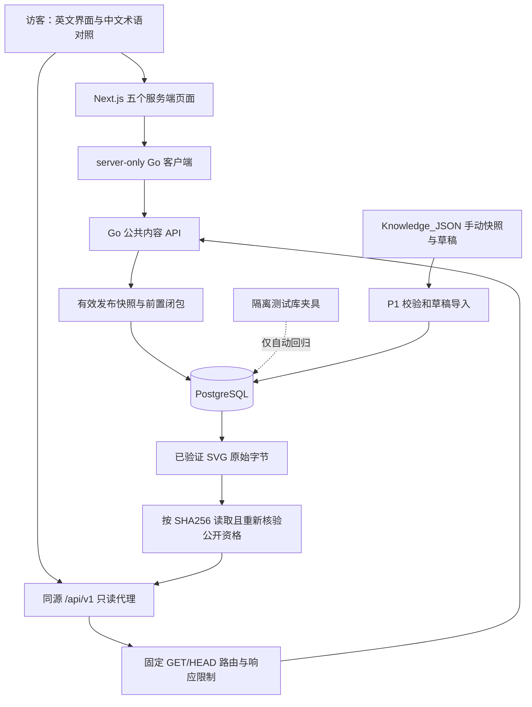
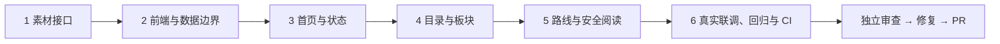

# P2 英文只读网站执行计划

> **执行要求：**沿用当前会话的原生执行方式，使用 superpowers:executing-plans 逐项实施；步骤用复选框记录。实现完成后进行一次独立代码审查与整分支回归。
>
> **状态：**2026-10-01 用户已确认；六项任务实现及本机回归已完成，已完成独立审查问题修复；最新远程 CI 结果见 PR。

**目标：**把英文预览落地为读取 Go 公共 API 的网站，让访客浏览真实板块、路线及已发布知识，清楚看到建设状态。

**架构：**Next.js App Router 服务端页面读取 Go，浏览器通过同源入口加载页面及受控素材。Go 继续负责有效发布快照和前置闭包判断，PostgreSQL 是运行时唯一内容来源。目录探索关系、知识前置关系及后续个人学习记录保持独立。

**技术栈：**Go 1.27.1、Node.js 24.17.0、Next.js 16.3.7、React 19.3.0、TypeScript 5.9.3、PostgreSQL 17.11、CSS Modules、受限 Markdown 与 KaTeX。

**设计依据：**[总体方案](../specs/2026-09-30-math-learning-platform-design.md)、[阶段路线图 P2](2026-09-30-development-roadmap.md#p2英文页面落地)、[英文预览](../../../design/README.md)、[现有 OpenAPI](../../../api/openapi.yaml)。

## 全局约束

- 严格按确认范围实施；开发前拉取最新 master，新建 `codex/` 分支；完成审查、回归后通过 Git 创建 PR（MR）。
- 页面以英文为主，板块、子主题及知识标题保留已有中文对照，不增加语言切换；项目文档使用中文。
- 内容正确性、覆盖与数量、学习路径优先于页面美观；目录为 16 板块、56 子主题，数字从真实 API 计算。
- Go 调试、构建及测试均设置 `CGO_ENABLED=0 GOTOOLCHAIN=go1.27.1`。
- 每条验证通过 `tools/verify/run.mjs` 执行，默认上限 540 秒，终止宽限 5 秒；禁止单次测试超过 10 分钟。
- Go 内容包 `schemaVersion=1` 不变；公共 API 不返回草稿、撤回版本、本机路径、数据库凭据或个人状态。
- P2 实现五个页面：`/`、`/knowledge`、`/domains/[id]`、`/paths/[id]`、`/knowledge/[id]`。
- 账户和审核发布属于 P3，个人解锁、学习进度和检测属于 P4；P2 不展示演示进度、掌握记录或虚构学习时长。
- 本地 `Knowledge_JSON` 持续更新，仍通过 P1 的手动快照与草稿流程整理；前端不直接读取原目录、ZIP、`design/data` 或 Git 内容包。
- 使用项目原创 SVG/CSS 图形、系统字体和本地 KaTeX 字体；不依赖 Figma、外部图片或字体服务。

## 审查重点

1. 已缓存的阅读页面遇到撤回：后续网络请求重新核验发布状态，返回 404；不能用摘要 URL 绕过撤回。任务 1、2、6 验证。
2. 搜索输入包含中文、重复参数、控制字符及超长内容：保持字面搜索，不产生开放代理、不回显原始错误。任务 2、4 验证。
3. API 故障、错误响应形状与零条记录：分别展示暂时不可用、无匹配结果或建设中，不能补入预览数据。任务 2、3、6 验证。
4. 知识中的链接、原始 HTML、公式宏和图片：不执行代码、不请求任意图片，公式展开及尺寸受限，署名仍可读。任务 5、6 验证。
5. 很长的英文名称、多前置节点、重复归属及版本替换：手机不横向溢出，目录关系不成为学习前置；不同版本不能被混作同一节点。任务 4、5、6 验证。

---

## 1. 方案选择与页面结构

| 方式 | 可行性与取舍 | 决定 |
| --- | --- | --- |
| 继续扩充静态预览 | 便于演示，但会形成第二份运行数据，无法可靠跟随发布与撤回 | 保留为视觉参考 |
| 浏览器直接跨域请求 Go | 需要暴露服务地址及增加跨域配置，页面首次阅读依赖客户端脚本 | 不采用 |
| Next.js 服务端读取 Go，同源受控读取接口 | 符合既有架构，页面和内容规则边界清楚，适合后续账户扩展 | 推荐并纳入本计划 |

| 页面 | 使用的数据 | 可见行为 |
| --- | --- | --- |
| Learning Hub `/` | 板块列表、建设状态与各板块有效知识数量 | 开始浏览入口、真实目录概览；无个人进度 |
| Knowledge Map `/knowledge` | 带 q、limit、offset 的板块列表 | 英中名称及子主题搜索，建设状态筛选，板块卡片 |
| Domain `/domains/[id]` | 板块详情及已发布路线摘要 | 全部子主题、相关板块、路线入口；无路线时说明建设中 |
| Learning Path `/paths/[id]` | 路线及固定版本节点的完整知识视图 | 前置关系、阅读顺序、节点链接；无个人锁图标 |
| Knowledge `/knowledge/[id]` | 当前有效知识版本、单元、素材元数据 | 陈述、条件、目标、讲解、证明、例子、反例、来源、版本 |

地图的状态筛选只针对 `planned/published`，文案为 `In development/Published`，不称为 `Locked/Unlocked`。地图最多加载 100 个板块；当前目录仅 16 个，使用 `limit=100, offset=0` 获取一次筛选结果，按真实返回数量显示。该入口搜索板块和子主题，不冒充全库知识全文搜索。

首页只显示板块数量及每个板块的 PublishedKnowledgeCount；知识可跨板块归属，不能相加后声称为全站唯一知识总数。当前 API 没有去重总数接口，P2 不显示这一指标。

首页按钮为 `Explore knowledge`。知识详情允许匿名阅读；链接只表示阅读入口，不授予检测资格。404 统一显示 `This content is not available.`，不猜测资源是草稿、撤回还是缺失。5xx、网络超时和无效响应统一显示 `Content is temporarily unavailable.`，提供重新加载入口。空目录显示 `The catalogue is being prepared.`，搜索零匹配显示 `No domains match your search.`。

内容修订在 P2 只能展示 API 返回的当前 `Version N`；API 尚无旧版本、修订说明或审计链接，不伪造这些字段。详情支持“回到知识地图”和有效关联节点的阅读；个人回顾记录留到 P4。

## 2. 架构与执行依赖





每个任务有测试、实现、提交；阶段验收以结果推进，不预设日历工期。P2 可以在公开数学内容为零时完成：真实数据验证目录和建设状态，隔离测试数据验证阅读与撤回流程。不能为演示把草稿直接发布到开发或生产内容库。

## 3. 文件范围与接口锁定

| 新增或修改 | 文件 | 职责 |
| --- | --- | --- |
| 新增 | `backend/internal/store/asset.go`、`asset_test.go` | 有效发布素材读取与数据库回归 |
| 修改 | `backend/internal/httpapi/handler.go`、`catalogue_test.go` | 扩展内部 Reader 及测试替身 |
| 新增 | `backend/internal/httpapi/asset.go`、`asset_test.go` | 二进制 SVG 响应、安全头与失败处理 |
| 修改 | `api/openapi.yaml` | 增加素材 GET/HEAD 契约，旧 JSON 契约不变 |
| 新增 | `frontend/package.json`、`package-lock.json`、`tsconfig.json`、`next-env.d.ts`、`next.config.ts`、`vitest.config.ts`、`tests/setup.ts`、`.env.example` | 固定工具链、模块别名、测试和私有 Go 地址模板 |
| 新增 | `frontend/src/lib/api/{generated.d.ts,types.ts,schemas.ts,server-config.ts,server-client.ts,public-proxy.ts}` | OpenAPI 类型、响应检查、服务端读取及限定代理 |
| 新增 | `frontend/src/lib/api/{server-client,public-proxy}.test.ts` | 响应、超时、转发边界 |
| 新增 | `frontend/src/app/api/v1/[...segments]/route.ts` | 浏览器同源只读入口 |
| 新增 | `frontend/src/app/{layout,page,loading,error,not-found}.tsx` | 页面框架、首页与统一状态 |
| 新增 | `frontend/src/components/{site-header,content-state,content-status,learning-hub}.tsx`、`learning-hub.test.tsx` | 导航、建设状态、匿名首页 |
| 新增 | `frontend/src/styles/{globals.css,layout.module.css,catalogue.module.css,reading.module.css}` | 复用预览颜色、响应式及阅读样式 |
| 新增 | `frontend/src/app/knowledge/page.tsx`、`domains/[id]/page.tsx` | 知识地图和板块页面 |
| 新增 | `frontend/src/features/catalogue/{query.ts,query.test.ts,knowledge-map.tsx,domain-view.tsx,catalogue.test.tsx}` | 查询规则、目录及板块展示 |
| 新增 | `frontend/src/app/paths/[id]/page.tsx`、`knowledge/[id]/page.tsx` | 路线和知识阅读页面 |
| 新增 | `frontend/src/features/reading/{path-graph.ts,path-graph.test.ts,path-view.tsx,knowledge-view.tsx,safe-markdown.tsx,safe-markdown.test.tsx,asset-image.tsx}` | 精确版本前置图、全部数学字段、安全渲染 |
| 新增 | `backend/internal/e2etest/{harness.go,harness_test.go}` | 仅供测试的随机数据库和场景控制 |
| 新增 | `backend/cmd/e2e-harness/main.go`、`tests/e2e/{playwright.config.ts,fixtures.ts,catalogue.spec.ts,reading.spec.ts}` | Go/Next.js 真实集成、桌面手机与键盘回归 |
| 新增 | `.github/workflows/frontend.yml`、`docs/operations/english-readonly-frontend.md` | 精确依赖 CI、启动和验收说明 |
| 修改 | `.gitignore`、`README.md`、本计划、总体方案、路线图 | 排除构建与测试产物，准确记录完成情况 |

上表的大括号表示同一目录的独立文件，路径均相对项目根。不新增数据库迁移、不改 P1 草稿和源快照。任务 6 的场景控制是测试进程的本机接口，正式 `cmd/server` 不挂载此接口。

### 固定协议

- 新接口：`GET /api/v1/assets/{sha256}`，摘要为 64 位小写十六进制；HEAD 状态及响应头与 GET 一致，无响应体。
- 成功：200，原始 SVG 字节，`Content-Type: image/svg+xml`，`X-Content-Type-Options: nosniff`，`Cache-Control: no-store`，`Content-Security-Policy: sandbox; default-src 'none'`，准确 Content-Length。不给长期缓存、304 或磁盘重定向。
- 摘要无效、缺失、只有草稿引用或公开资格失效，均返回已有 NOT_FOUND 404；数据库不可用 503，内部错误 500；沿用 JSON 错误与请求编号。
- 读取使用 P1 `withPublication` 的只读 RepeatableRead 事务和 3 秒时限。在该事务里找到有效知识视图的有效单元，单元的 `assetIds`、不可变 `unit_asset_bindings`、活动素材成员和其知识版本必须共同匹配所请求摘要，才读 `assets.bytes`。不能直接把管理用 `ExportAsset` 暴露给网络。
- 同一摘要仍被其他有效公开单元使用时可继续公开；仅撤回一个引用不等于全局撤回相同字节。事务开始后发生撤回的在途请求按其快照完成，撤回提交后的新读取必须拒绝失效引用。
- 服务端配置 `GO_API_INTERNAL_URL` 为可信固定 origin，仅 http/https，拒绝用户名、密码、查询、片段和非根路径；示例 `http://127.0.0.1:8080`。不使用 NEXT_PUBLIC 前缀、不写入 `next.config.env`。
- Go JSON 列表为 `{items,total,limit,offset}`，详情为 `{data}`；错误为 `{error:{code,message,requestId}}`。保留名称、版本及可选字段的现有含义。
- 客户端单次请求时限 5 秒，`cache:'no-store'`、`redirect:'error'`，不自动重试；未知错误只显示固定英文文案。页面动态渲染，不预生成内容、不启用内容数据缓存，内容链接关闭预取。
- 同源代理仅允许 domains 列表或一个合法 ID 的 domains/paths/knowledge，以及合法摘要 assets；只转发 GET/HEAD。列表原始参数交给 Go 做重复及未知参数校验，详情和素材不接受查询参数；任何 `url/host` 参数不能改变目标。
- 代理不转发 Cookie、Authorization、用户 X-Request-ID 或任意入站头；只接受 Go 的已知成功类型和安全响应头。JSON 响应累计上限 10 MiB，SVG 上限 1 MiB，使用有界读取而非先 `arrayBuffer()` 再判断；失败时释放响应流。
- 页面默认不持有个人数据。已打开页面不会自动擦除旧正文；刷新、重新导航或重新请求素材时重新核验。P3/P5 再设计变更提示。

### 依赖与可行性审查

2026-10-01 已通过官方 npm 元数据核验以下精确版本，不在本次规划安装依赖。实现任务 2 提交完整锁文件，CI 只用 `npm ci`，不运行 `@latest`。

| 依赖类别 | 固定版本 |
| --- | --- |
| 运行与页面 | Node 24.17.0；next 16.3.7；react/react-dom 19.3.0；server-only 0.0.1 |
| 类型及响应 | typescript 5.9.3；@types/node 24.19.0；@types/react、@types/react-dom 19.3.0；openapi-typescript 7.13.0；zod 4.6.5 |
| 数学阅读 | react-markdown 10.1.0；remark-math 6.0.0；rehype-katex 7.0.1；katex 0.16.47 |
| 单元测试 | vitest 5.0.3；vite 8.3.1；@vitejs/plugin-react 6.1.1；jsdom 30.1.1 |
| 组件与浏览器测试 | @testing-library/react 16.3.3；@testing-library/dom 10.4.2；@testing-library/jest-dom 7.0.1；@playwright/test 1.63.0 |

核验结果：Next 要求 Node >=20.9 且 React ^19；Node 24.17 满足所选 Vite、Vitest、jsdom 的要求。openapi-typescript 当前要求 TypeScript ^5，所以不随最新标签升级到 TypeScript 7。rehype-katex 依赖 KaTeX ^0.16，选用该系列 0.16.47，避免同时安装 0.18 造成渲染与 CSS 字体不一致。所选测试插件的编译器扩展均为可选 peer，不引入 React Compiler。

官方依据：[Next.js 安装](https://nextjs.org/docs/app/getting-started/installation)、[Vitest 使用边界](https://nextjs.org/docs/app/guides/testing/vitest)、[Playwright 生产构建测试](https://nextjs.org/docs/app/guides/testing/playwright)、[react-markdown API](https://github.com/remarkjs/react-markdown)、[KaTeX 参数](https://katex.org/docs/options)、[openapi-typescript 包元数据](https://registry.npmjs.org/openapi-typescript/7.13.0)、[rehype-katex 包元数据](https://registry.npmjs.org/rehype-katex/7.0.1)。

| 可行性或兼容性事项 | 审查结论 |
| --- | --- |
| 当前没有已发布数学内容 | 不阻塞 P2；真实目录与建设中页面可以验收，阅读用隔离夹具，发布流程仍依赖 P3 |
| 当前没有素材字节接口 | 任务 1 增量补齐并与已有快照资格复用，不需更改内容包或数据表 |
| Reader 增加方法 | 内部 Go 接口及 fakeReader 同时更新，全 Go 包构建检查；不改变已有公共 JSON 字段 |
| TS 与渲染库版本兼容 | 上述 peer/engine 已核验；安装后的依赖审计和生产构建属于任务 2 的执行门槛，发现问题先修订版本方案 |
| 异步服务端组件测试 | Vitest 只测同步展示组件和数据函数，异步页面用真实 Next.js/Go 的 Playwright 验证 |
| 路线版本替换与单独知识详情不同步 | 按精确 VersionRef 构图；跳转后若版本变化，显示实际当前版本，不把两个请求当成同一发布快照 |
| 知识详情缺少前置标题、历史审核与修订说明 | 关联仅有 ID/版本时显示可追溯 ID 和版本链接；不新增隐式抓取全图，不伪造额外字段 |
| 素材撤回与前端缓存 | 数据与素材均 no-store，内容导航不预取；请求事务边界及已打开页面的限制明确 |
| P2 与未来账户、进度兼容 | 不占用个人状态字段；P3/P4 单独扩展认证和用户状态，不提前加入解锁推导 |
| 新接口及前端工程 | 属于增量兼容性设计，随本计划审核；现有 schemaVersion、GET 语义、来源与版本规则不变 |

未发现必须先部署、购买服务或发布草稿才能开发的阻塞条件。P2 产品构建、浏览器回归及依赖审计现已通过，详见操作说明；独立审查与 CI 正在验收。

## 4. 逐项实施

所有命令从项目根执行。命令中设置的 TEST_DATABASE_URL 由本机私有环境提供；不得打印其值。每个任务的 RED 命令预期只因目标行为未实现而失败；基础设施故障先修复，不能算作 RED。

### 任务 1：公开素材读取与契约

**文件：**新增 store/asset.go、asset_test.go、httpapi/asset.go、asset_test.go；修改 handler.go、catalogue_test.go、api/openapi.yaml（完整路径见文件表）。

**接口：**消费 `withPublication(ctx, fn)`、`publicationState.knowledgeView(id)`；产出 `(*Store).GetPublishedAsset(ctx context.Context, sha256 string) ([]byte,error)`，扩展 `httpapi.Reader` 同名方法；handler 增加素材 GET/HEAD。

- [x] 编写失败测试 `TestPublicAssetRequiresEffectiveUnitBinding`：草稿 404；测试发布夹具后字节摘要匹配；撤回单元、素材、所属知识、前置或快照后拒绝；新快照替换素材摘要而单元版本未变导致旧单元失效后拒绝；仍有另一条有效引用时保留。
- [x] 编写失败 HTTP 测试 `TestPublicAssetResponseContract`：200 原始 SVG、全部安全头、正确长度；HEAD 无体；无效摘要 404；数据库故障 503；错误无内部信息。
最小断言示例（在上述撤回场景准备后）：

```go
_, err := s.GetPublishedAsset(ctx, digest)
if !errors.Is(err, store.ErrNotFound) { t.Fatal("withdrawn asset must be hidden") }
```

- [x] 运行 RED：`node tools/verify/run.mjs --cwd backend -- env CGO_ENABLED=0 GOTOOLCHAIN=go1.27.1 go test ./internal/store ./internal/httpapi -run 'TestPublicAsset' -timeout 5m -count=1`。
- [x] 实现 `GetPublishedAsset`，在同一发布读取事务中判断全部条件并读取字节，复验长度 <=1048576 和摘要；仅授权可见字节，不打开磁盘文件。
- [x] 实现 HTTP handler 与 OpenAPI，更新 fakeReader；Go 默认 GET 路由也处理 HEAD，显式避免 HEAD 写入响应体。
- [x] 重跑 RED 命令应全 PASS；再运行同包装置全部测试，确认 P1 读接口没有回归。
- [x] 提交：`feat: 增加受发布状态约束的公开素材接口`。

### 任务 2：前端工程与服务端数据边界

**文件：**新增前端基础配置、lib/api 全部文件及两组测试、同源 route.ts；修改 .gitignore。此任务将最小 layout/page 纳入工程，只显示真实请求结果状态，任务 3 再完善首页。

**接口：**

- generated.d.ts 由 `openapi-typescript ../api/openapi.yaml -o src/lib/api/generated.d.ts` 生成；types.ts 导出 DomainList、DomainSummary、DomainDetail、PathView、KnowledgeView、AssetView、VersionRef，均来自生成类型；AssetView 对应 components.schemas.AssetMetadata，VersionRef 对应 components.schemas.ref，其余同名。
- `ApiResult<T> = {ok:true,data:T} | {ok:false,kind:'invalid-query'|'not-found'|'unavailable',requestId?:string}`。
- `createGoClient(origin:string, fetcher:typeof fetch): GoClient`；GoClient 的 `listDomains(query:{q:string,limit:number,offset:number})`、`getDomain(id:string)`、`getPath(id:string)`、`getKnowledge(id:string)` 分别返回 `Promise<ApiResult<对应类型>>`。listDomains 的数据类型为完整 DomainList。
- `getGoClient(): GoClient` 只在服务端读取 server-config；public-proxy.ts 导出 `createPublicProxy(origin:string, fetcher:typeof fetch): (request:Request,segments:string[])=>Promise<Response>`；route.ts 仅从 server-config 传入可信 origin，测试注入自己的固定 origin/fetcher。
- schemas.ts 使用 Zod 校验 Go 响应；各 schema 推断类型与生成类型双向可赋值，严格验证必需字段、枚举、数字范围和全部嵌套知识字段；Zod 校验最大响应体遵循固定协议，单元/路线不得为缺失字段补默认值；未识别额外字段不传入展示。

- [x] 编写 `server-client.test.ts`：`handlesWireContractWithoutFallbackData` 验证列表/详情外壳、404/503/无效 JSON 与字段缺失；`abortsAfterFiveSeconds` 用假时钟验证 5000ms；`neverFollowsRedirectsOrPublishesOrigin` 验证 fetch 设置、私有配置未进入返回值。
- [x] 编写 `public-proxy.test.ts`：`onlyForwardsPublicReadRoutes` 覆盖路径穿越、编码斜线、非法摘要、未知路由、目标覆盖参数；`dropsCredentialsAndPreservesNoStore` 校验无 Cookie/Authorization 转发及安全头；`stopsReadingAtByteLimits` 流输入达到上限后取消；`headReturnsNoBody`。
契约断言示例（对应 503 和成功响应的 mock fetch 场景）：

```ts
expect(await client.getKnowledge('equivalent-fractions')).toMatchObject({ok:false, kind:'unavailable'});
expect(fetcher).toHaveBeenCalledWith(expect.anything(), expect.objectContaining({cache:'no-store', redirect:'error'}));
```

- [x] 创建手工最小 package.json、tsconfig 和 Vitest 配置，按依赖表安装精确版本并提交锁文件，tests/setup.ts 仅在单元测试 mock server-only，生产构建保留真实模块边界；不用动态脚手架、不添加大型 UI 库。脚本固定 `dev=next dev`、`build=next build`、`start=next start`、`typecheck=tsc --noEmit`、`test=vitest run`、`api:generate`、`e2e=playwright test --config ../tests/e2e/playwright.config.ts`；安装与命令均用限时 wrapper。
- [x] 运行 RED：`node tools/verify/run.mjs --cwd frontend -- npm test -- src/lib/api`，目标测试失败。
- [x] 实现类型生成、Zod 检查、private 配置、client 和限定代理；API 与页面不用共用秘密配置对象。关闭 Next 内容缓存；设置根布局 `lang=en`，每个内容 page.tsx 明确 `dynamic=force-dynamic`，不开启 Cache Components；页面 params/searchParams 按所选 App Router 的异步接口处理。
- [x] 运行 GREEN、`node tools/verify/run.mjs --cwd frontend -- npm run typecheck`、`node tools/verify/run.mjs --cwd frontend -- npm run build`、`node tools/verify/run.mjs --cwd frontend -- npm audit --omit=dev`；期望测试通过、构建成功、生产依赖无未处理的高危/严重漏洞。构建不需 Go 在线。
- [x] .gitignore 排除 frontend/node_modules、frontend/.next、frontend/*.tsbuildinfo、tests/e2e/*.local.json、test-results、playwright-report；文档描述 NEXT 私有配置文件。提交：`feat: 建立英文前端及受控 Go 数据边界`。

### 任务 3：匿名学习首页与统一状态

**文件：**完善 layout/page/loading/error/not-found.tsx；新增 site-header、content-state、content-status、learning-hub 及测试；globals.css、layout.module.css。

**接口：**消费 GoClient.listDomains 的 ApiResult；产出 `LearningHub({result}: {result:ApiResult<DomainList>}): ReactElement`、`ContentStatus({status}:{status:'planned'|'published'}): ReactElement`、`ContentState({kind}:{kind:'empty'|'no-results'|'not-found'|'unavailable'}): ReactElement`。

- [x] 编写 `learning-hub.test.tsx` 的 `showsRealCatalogueWithoutPersonalProgress`：16 条 planned 数据显示 16 个板块及各板块 0 个已发布知识，提供 Explore knowledge，不出现 12/30、虚构时长或学习状态；`distinguishesEmptyFromUnavailable` 断言两种固定英文文案；`doesNotSumOverlappingDomainKnowledge` 验证同一知识跨板块出现时不展示全站相加总数。
固定文案断言示例：

```tsx
render(<LearningHub result={{ok:false, kind:'unavailable'}} />);
expect(screen.getByText('Content is temporarily unavailable.')).toBeVisible();
expect(screen.queryByText('12 / 30')).not.toBeInTheDocument();
```

- [x] 运行 RED：`node tools/verify/run.mjs --cwd frontend -- npm test -- src/components/learning-hub.test.tsx`。
- [x] 实现同步展示组件和异步首页接线；导航仅有 Learning Hub 与 Knowledge Map，提供 skip link、main 标识、面包屑基础样式、可见 focus、加载提示和固定错误文案。
- [x] 复用原创绿色/暖白视觉、系统字体和响应式留白；中文对照标记 `lang=zh-CN`。不复制演示头像、个人进度和未实现功能按钮。
- [x] 重跑 RED 命令应 PASS，执行前端 typecheck 和 build。
- [x] 提交：`feat: 增加真实目录首页和统一内容状态`。

### 任务 4：16 板块地图、搜索与板块详情

**文件：**新增 catalogue 特性目录、knowledge/page.tsx、domains/[id]/page.tsx、catalogue.module.css。

**接口：**消费 `GoClient.listDomains`、`getDomain`；产出 `parseCatalogueQuery(params:Record<string,string|string[]|undefined>): {ok:true,q:string,status:'all'|'planned'|'published'} | {ok:false}`、`KnowledgeMap({result,q,status}:{result:ApiResult<DomainList>,q:string,status:CatalogueStatus}):ReactElement`、`DomainView({result}:{result:ApiResult<DomainDetail>}):ReactElement`；query.ts 同时导出 `CatalogueStatus='all'|'planned'|'published'`。

- [x] 编写 `query.test.ts` 的 `validatesUtf8QueryAndSingletonParameters`：q 为最多 512 UTF-8 字节，重复 q/status、U+0000、未知参数及非法 status 拒绝；中文合法，`%/_` 不解释成通配符。
- [x] 编写 `catalogue.test.tsx` 的 `filtersConstructionStateWithoutInventingUnlocks`、`showsTopicsAndRelatedDomainsSeparatelyFromPaths`：真实字段展示、状态筛选、路线为空提示、相关板块仅作为探索链接；显示的知识数使用 PublishedKnowledgeCount。
输入边界断言示例：

```ts
expect(parseCatalogueQuery({q:'数'.repeat(170)})).toEqual({ok:true,q:'数'.repeat(170),status:'all'});
expect(parseCatalogueQuery({q:'数'.repeat(171)})).toEqual({ok:false});
expect(parseCatalogueQuery({q:['Markov','概率']})).toEqual({ok:false});
```

- [x] 运行 RED：`node tools/verify/run.mjs --cwd frontend -- npm test -- src/features/catalogue`。
- [x] 实现 GET 搜索表单、all/planned/published 三个状态、16 板块稳定顺序与中文子主题；q 用 URLSearchParams 构建，状态在返回的最多 100 条目录中筛选并计数。query 无效显示固定提示，不调用 Go。
- [x] 接线板块详情；topics 当前没有独立主题 API，只作为目录条目展示，不能制造不可达主题路由。相关板块显示稳定 ID 链接；路线摘要指向 paths/[id]。
- [x] 手机卡片单列、长名字换行、控件有 label，保留搜索 URL 和浏览器后退语义；重跑 GREEN 和 typecheck。
- [x] 提交：`feat: 接入板块地图搜索和学习路线入口`。

### 任务 5：固定版本路线与安全数学阅读

**文件：**新增 reading 特性全部文件、paths/[id]/page.tsx、knowledge/[id]/page.tsx、reading.module.css。

**接口：**

- 消费 PathView/KnowledgeView。产出 `buildPathGraph(view:PathView): {levels:VersionRef[][],edges:{from:VersionRef,to:VersionRef}[]}`；path-graph.ts 同时导出 `class ContractError extends Error`，非法重复节点、缺失精确前置或循环抛此固定错误，由页面转 unavailable。
- `PathView({result}:{result:ApiResult<PathView>}): ReactElement` 与 `KnowledgeView({result}:{result:ApiResult<KnowledgeView>}): ReactElement` 位于各自展示模块，导入 API 类型时用别名避免同名冲突。
- `SafeMarkdown({source,assets}:{source:string,assets:AssetView[]}): ReactElement`；`AssetImage({asset,alt}:{asset:AssetView,alt:string}): ReactElement`。每个讲解单元传入的素材列表必须限制为该单元 assetIds 与有效视图 assets 的交集。

- [x] 编写 `path-graph.test.ts` 的 `usesOnlyExactPrerequisiteVersions`：多前置汇合、稳定层级、related/derivation 不构成前置边；缺失/不匹配版本、循环或重复节点失败。
- [x] 编写 `safe-markdown.test.tsx` 的 `blocksHtmlUnsafeLinksAndUnboundImages`：script/iframe/raw HTML 不产生可执行节点，javascript/data/http、协议相对及反斜线 URL 不可点击，远程图片不发请求；`asset:id` 只转换绑定素材，src 精确为 /api/v1/assets/摘要。
- [x] 编写 `limitsMathAndKeepsConditionsSourcesAndAttribution`：分数/行内公式正常渲染、KaTeX 参数 trust=false、maxExpand=100、maxSize=10、strict='error'；恶意 HTML/图片命令、递归宏和超长公式不能外联或破坏整页；展示条件、体系、来源许可、署名与当前版本。
渲染断言示例：

```tsx
const {container} = render(<SafeMarkdown source={'<script>alert(1)</script> and $1/2$'} assets={[]} />);
expect(container.querySelector('script')).toBeNull();
expect(container.querySelector('.katex')).not.toBeNull();
```

- [x] 运行 RED：`node tools/verify/run.mjs --cwd frontend -- npm test -- src/features/reading`。
- [x] 以路线节点顺序稳定排序，对精确 prerequisite 图做层级排列；桌面层级卡片配原创 SVG 连接线，SVG 标记 aria-hidden，完整文本前置列表始终存在。手机使用按层级排列的单列卡片，不强制横向滚动图。
- [x] 实现知识详情：标题与中文、类型、版本、准确陈述、适用范围、体系、全部条件和目标、证明、单元讲解角度、例子/反例、三类关系、来源/使用条件。无内容的可选节不填生成示例。单独知识关联没有标题字段时显示 ID 与 VersionRef。
- [x] SafeMarkdown 用 react-markdown + remark-math + rehype-katex，skipHtml=true，不引入 rehype-raw；KaTeX 采用上述限制且每次独立 macros，不使用外部自定义宏。通过 SafeMarkdown 内部的 remark 插件在 rehype-katex 之前处理 math/inlineMath AST，单条公式超过 4096 字符时显示 `Formula could not be displayed.`，其余正文仍可读；渲染失败也使用固定提示及转义的原公式文本。
- [x] 自定义 URL 规则：图片只允许精确合法 `asset:id`；文字链接只允许 https 或单斜线同源/相对路径，拒绝控制字符、反斜线、协议相对与其他协议。来源链接复用相同校验，外链使用 rel=noopener noreferrer。原创 SVG 用 img 加载，不把 SVG 字节注入 HTML；提供 alt、尺寸约束、署名和加载失败提示。
- [x] 知识陈述等非单元字段不允许借用其他单元的图片映射；当前 schema 不含单独说明图片绑定时显示缺失素材提示，不自动外联。公式 CSS 和字体只从锁定 KaTeX 包导入。
- [x] 重跑 GREEN、typecheck、build；提交：`feat: 增加固定版本学习路线与安全数学阅读`。

### 任务 6：真实 API 联调、浏览器回归及 CI

**文件：**新增 e2etest/harness、cmd/e2e-harness、tests/e2e 全部文件、frontend.yml、操作说明；更新 README、总体方案、路线图及本计划。

**接口：**harness.go 定义 `type Config struct { TestDatabaseURL,APIAddr,ControlAddr,StateFile string }`；`e2etest.Run(ctx context.Context, config Config) error` 创建随机 `math_master_test_*` 数据库，迁移、导入专用夹具，在 127.0.0.1 暴露实际 httpapi.Handler 与独立测试控制入口。配置只消费 TEST_DATABASE_URL 与本机端口；正式服务器不引用该包。

场景控制仅供测试：每次启动生成随机令牌写入本机权限 600 的临时状态文件，端口只绑定 loopback，要求令牌；支持空库、只有草稿、测试发布、撤回引用与暂时故障。harness 收到终止信号后用新的 3 秒 context 清理随机库和临时文件，不操作原开发库；SIGKILL 无法保证清理，文档提供仅清理本次记录的随机库的受保护恢复步骤。夹具允许现有 SVG/单元作测试数据，不能充当独立数学审核或生产种子。

- [x] 先编写 `harness_test.go`：`TestHarnessRejectsUnsafeDatabaseAndPublicBind`、`TestHarnessRequiresControlToken`、`TestHarnessCleansIsolatedDatabase`；断言随机库独立、未知/缺失令牌不能改场景、清理不影响原库。StateFile 使用被忽略的 tests/e2e/runtime.local.json，APIAddr/ControlAddr 必须为 loopback，控制入口不能复用正式 cmd/server 路由。
- [x] 运行 RED：`node tools/verify/run.mjs --cwd backend -- env CGO_ENABLED=0 GOTOOLCHAIN=go1.27.1 go test ./internal/e2etest -timeout 5m -count=1`。
- [x] 实现 harness 与 Playwright fixtures，fixtures 不打印数据库 URL 或令牌；构建 Go 服务与 Next.js 后用 webServer 管理测试进程，reuseExistingServer=false，workers=1、retries=0、globalTimeout=480000、单例 timeout=30000。配置 Chromium 的 1280×900 和 390×844 两个 project。
- [x] 编写 catalogue.spec.ts：`draftCatalogueShowsSixteenDomainsAndFiftySixTopics`、`englishChineseSearchAndHistoryWork`、`emptyAndUnavailableAreDistinct`、`keyboardCanReachEveryDomain`；检查正式页面不加载 design/data、无演示统计。
- [x] 编写 reading.spec.ts：`publishedFixtureCanBeReadWithMathAndOriginalSvg`、`withdrawalStopsNewReadsAndAssetRequests`、`longNamesAndMultiPrerequisitesFitBothViewports`、`clientResponsesDoNotExposeInternalConfiguration`。基于真实 Go 请求，page.route 不能替代服务端联调；不在 DOM 或响应中暴露私有地址/凭据。
真实撤回断言示例（由 fixtures 控制撤回后）：

```ts
expect((await request.get(`/api/v1/assets/${fixture.assetSha}`)).status()).toBe(404);
await page.goto(`/knowledge/${fixture.knowledgeId}`);
await expect(page.getByText('This content is not available.')).toBeVisible();
```

- [x] 首次运行 `node tools/verify/run.mjs --cwd frontend -- npm run e2e` 定位失败行为；修复页面/接口与夹具，重跑直到全 PASS。生产构建作为 webServer 输入，禁止只测 dev 模式。
- [x] 新增 frontend.yml：固定已核验 checkout/setup-node/setup-go action SHA、Node/Go/PG 精确版本，npm ci、API 重新生成及 git diff --exit-code、typecheck、unit、build、production audit、锁定版本 Playwright Chromium 安装、真实数据库 E2E。不改已有 backend.yml 验证职责；每条命令通过限时 wrapper，测试截图和报告仅失败时留作诊断。
- [x] 编写中文启动/验证说明：Go 与 Next 的本机地址、frontend/.env.local 模板、当前零发布数据的预期、测试库与正式导入区分、停止进程和保留开发数据步骤。生产部署仍待 P7。
- [x] 完成下方整阶段回归，记录实际命令和结果、桌面手机截图检查、独立代码审查及修复；提交：`test: 增加英文网站真实联调与持续验证`。

## 5. 最终回归和提交

按此顺序验证，数据库环境由私有本机配置准备，不输出凭据。一次运行失败后先定位原因，只重跑受修复影响的测试；最后执行完整回归。

```sh
git diff --check
node tools/verify/run.mjs -- node --test tools/verify/run.test.mjs tools/content-ingest/snapshot.test.mjs
node tools/verify/run.mjs --cwd backend -- env CGO_ENABLED=0 GOTOOLCHAIN=go1.27.1 go vet ./...
node tools/verify/run.mjs --cwd backend -- env CGO_ENABLED=0 GOTOOLCHAIN=go1.27.1 go test ./... -timeout 5m -count=1
node tools/verify/run.mjs --cwd backend -- env CGO_ENABLED=0 GOTOOLCHAIN=go1.27.1 go build -o bin/ ./cmd/...
node tools/verify/run.mjs --cwd frontend -- npm run api:generate
git diff --exit-code -- frontend/src/lib/api/generated.d.ts
node tools/verify/run.mjs --cwd frontend -- npm run typecheck
node tools/verify/run.mjs --cwd frontend -- npm test
node tools/verify/run.mjs --cwd frontend -- npm run build
node tools/verify/run.mjs --cwd frontend -- npm audit --omit=dev
node tools/verify/run.mjs --cwd frontend -- npm run e2e
```

浏览器实际检查：1280/390 两种宽度、长英文和中文换行、Tab 顺序与焦点、跳转及后退、公式可读、SVG 署名、404/空目录/建设中/503。公式或路线区域必要的局部滚动不能导致整页溢出。生成的图形沿用本项目原创素材，不以截图里显示为由省略内容版本与来源。

独立审查按五个审查重点、旧 API 兼容性和正式服务器没有测试控制入口进行；修复后重新验证对应范围。完整结果、实际发布数据量（仍可为零）及已知限制写入 PR。推送功能分支，通过 gh 创建面向最新 master 的 PR 并附到当前会话。用户审阅后再合并，不能因为检查全绿便自行发布数学草稿或部署服务器。

## 6. 本计划自审与阶段验收

本次规划自审已完成：

- 总体方案的英文、16 板块、五页面、真实建设状态、版本、公式/原创图形、中文对照和移动阅读分别落到任务 1—6。
- 文件责任、客户端返回类型和三层发布素材绑定一致；未新增知识全文搜索、主题 API、个人锁状态或修订历史等无后端支持的承诺。
- 五类边界分别有确定的测试名称与断言；Go 与 Next 异步页面按其实际测试能力分工。
- 新增素材 GET/HEAD 和 Reader 内部扩展已审查为增量设计；仍需用户审阅计划，实施后以生产构建和完整回归确认。
- 公开数据为零、持续更新输入、缺少独立数学复核者均不阻塞本阶段技术实现；不会把这些条件标成已完成内容发布。

P2 验收必须满足：五页面使用真实 Go 数据、目录/搜索及安全阅读测试通过、草稿和撤回素材均无泄露、1280/390 与键盘导航通过、生产构建与 CI 通过、独立代码审查无阻塞问题。本机实际结果：9 项工具测试、全部 Go 包测试/vet/build、22 项前端测试/typecheck/build、公开契约再生成一致、生产依赖 0 漏洞、16 项真实浏览器回归均通过。独立代码审查与远程 CI 完成后补充验收。

