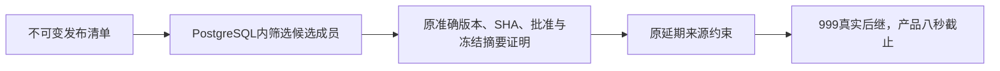

# P4b 批准来源查询性能修正

依据已确认P4b每动作八秒要求继续修复CI，不新增产品行为。43973da的Go push run 37020233272真实999后继提交8.00295366秒失败，同SHA Go PR 7.708545929秒。临时分段测量后已移除诊断代码：本机总2.844312708秒，其中业务748.165166毫秒、提交触发器2.091034166秒；相同来源的复习提交仅33.950958毫秒约束提交。瓶颈为每个新解锁在延期约束中重复展开完整不可变发布清单。

修改db/migrations/00006_learning_assessment.sql的learning_content_approved一个查询；修改backend/internal/store/learning_paths.go批量读取准确前置关系和写入已合格的直接后继，仍在同一持锁事务内逐项读取当前资格；新增backend/internal/store/learning_approval_test.go差分数据库回归及learning_paths_test.go多前置、重复交付和账户隔离回归，并在真实最大容量中逐项与优化前来源证明比对。更新验收、实施判断及结构化证据。临时Go诊断已恢复；旧迁移、实体表数、公开DTO、数学摘要、来源证明条件和八秒预算保持。

可行性：当前依赖固定PostgreSQL17.11，使用其JSONPath筛选只减少交付给SQL连接的清单行；版本、SHA、独立批准、submission、冻结digest及active/published检查仍按原表达式核验。保留数组/对象ID为候选并由原条件拒绝，保留原文本版本比较，避免默认JSON数值比较改变1与1.0。先冻结优化前SQL并验证伪造/缺字段/异常JSON/重复条目决策，真实完整最大计数差分与八秒容量回归通过后提交。若查询没有足够收益则撤回该尝试，继续测量，不扩大预算。

迭代：第一次仅筛选清单的1000证明差分通过，999提交2.703643666秒，收益不足。分段另有前置关系225.825162毫秒、当前身份238.295333毫秒、逐条INSERT234.296318毫秒。将后继准确当前身份及发布头复用首次查询，全部前置关系一次读取，再批量INSERT并只返回真实新行；共享内容锁与用户行锁、每个前置资格、每行延期来源证明保持。没有新表或缓存跨事务，不改变旧固定路线加入。
