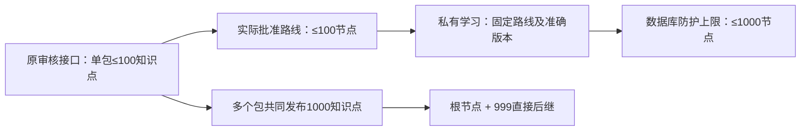

# P4b 容量验收调整提案

状态：用户已于2026-10-02书面确认推荐调整，按本方案实施。发现来源：Task 13 真实审核链路的 `INVALID_REFERENCE`，不是性能失败。

旧内容接口的约束是每包最多 100 个知识点、200 个讲解单元、20 条路线和16个素材。路线节点必须属于同包知识点，且不能重复。这使当前审核链路可生产的路线最多100节点。P4b 数据库的1000节点上限只是内部防护上限；它不能证明旧审核流程能生产1000节点路线。

## 推荐调整

保留旧内容接口、数学摘要和兼容快照。容量验收改用20条实际批准的100节点路线，读取最大合法100条路线分页；数据库仍保留1000节点上限。其余容量目标不变：当前发布1000个知识点、4000个讲解单元、200条路线、1000个素材；200个模板、10000个实例、1000个蓝图；单目标1000候选和8核心目标；999个直接后继（1000知识点总数包含根节点）；101条真实个人历史；所有动作维持8秒预算。

多个内容包携带相同不可变根知识点及准确讲解/素材，建立跨包共同前置。它们只复用同一准确身份，不复制学习分数或审核结果。长路线包包含100个知识点、100个讲解单元、20条路线及1个根素材，经过真实独立复核，所有引用在包内。根单元/素材保持准确身份；其他99个知识仅替换第4个讲解单元为无素材的下一版本，原题库使用的第1个单元不变，当前4000单元/1000素材计数保持。随后明确加入20条100节点路线和80条现有较短路线，验证最多100条路线的分页。

新增/修改文件：本提案；计划Task13容量段；`backend/internal/store/learning_capacity_test.go`及测试数据构造器；中文验收记录。共享harness的capacity场景使用同一实际数据构造，单个产品动作仍限8秒；容量初始化含多次独立审核动作，作为测试准备单独限4分钟，其他场景原40秒准备限额保持。必要性能优化仍只作用于已批准的私有学习仓储；不修改旧迁移、公开DTO、原审核限制或生产数据。

另一选择是另行设计跨包路线审核能力。它涉及旧内容行为兼容性，需单独设计和审核；不能在P4b容量夹具中绕过现有审核、直接标记批准或扩大接口限制。
