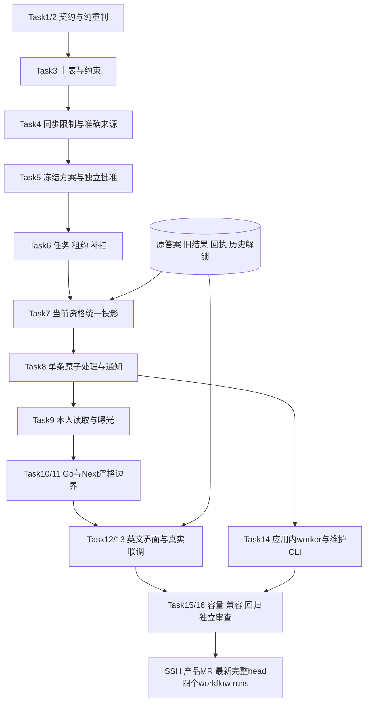

# P5b 纠错影响、独立重算与站内通知 Implementation Plan

> **For agentic workers:** REQUIRED SUB-SKILL: Use superpowers:executing-plans to implement this plan task-by-task. Steps use checkbox (`- [ ]`) syntax for tracking.
>
> 日期：2026-10-03。用户已书面确认 P5b 方案及第十一节兼容性变化；用户已确认实施计划，Native实施16项/80步已完成；一次独立审查与同一次三项重要修复、完整本机矩阵和首次SSH draft四项CI已通过，最终文档提交仍按最新head再次核验。产品基线为文档PR #22合并后的 `dad438d13b37d1053e3bf42e7c32e3829e4518a6`；不运行生产迁移。

**Goal:** 错误依据即时限制学习证据；以独立批准的准确依据重判原答案，保留旧事实，给本人提供可查的纠错结果和站内通知。

**Architecture:** correction 定义契约、等价检查和纯重判，store 在既有内容锁和账户锁下实现同步限制、只追加证据、持久任务及通知。Go 应用内 worker 使用数据库租约、有限分页和事务断点；Next.js 私有页面消费独立纠错接口。当前资格统一计算原有效通过和纠错通过。

**Tech Stack:** Go 1.27.1、PostgreSQL 17.11、Node.js 24.17.0、Next.js 16.3.7、React 19.3.0、TypeScript 5.9.3；复用 pgx、goose、Zod、Vitest、Playwright，不新增依赖或常驻服务。

**Spec:** [已确认 P5b 方案](../specs/2026-10-03-correction-impact-design.md)。[PR #21](https://github.com/yyl1212/math_master/pull/21) 已合并，基线 master `0f2e11ab688300439c1d1ad7b6d908647be50187`，合并后两项 CI 通过。计划批准及文档 MR 合并后，再 SSH fetch 最新 master 并创建 `codex/p5b-correction-workflow` 产品分支。

## Global Constraints

- 文档中文、产品英文；数据正确性优先。不改 Knowledge_JSON、不发布正式数学内容、不部署生产；技术夹具使用原创材料，不计 P6 数量。
- 不改原答案、五题封存、原成绩、原学习提交回执、历史资格事件、历史解锁、旧七个迁移或数学摘要用途。原 HTTP 结果继续按既有规则显示当前限制，存储回执字节与旧 score/outcome 不变。
- 固定规则版本 1、五题至少四题通过、精确有理数/单选、skipped 计错误。不缩分母、不换题、不迁移旧知识版本资格、不引入新解析器或容差。
- 内容/题库撤回即时生效；规则案件登记与限制、任务同事务。规则 cutoff 使用数据库时间和原尝试 created_at，晚提交仍属于原范围；新尝试在已注册算法获独立批准前阻断。
- 案件引用真实撤回；规则案件仅 admin 登记。方案由 editor/admin 创建，reviewer/admin 独立决策，创建者及全部涉及数学来源的作者不得自审。反馈 resolved/revision_published 不能批准纠错。
- 所有读取、重放、命令提交都复核当前会话/角色/账户/改密状态。系统处理锁定所属账户并复核有效状态，不伪造用户会话、不消费人员额度；停用账户保持限制，恢复账户后的当前资格重新派生。
- 内容锁顺序：adminLockID=1296127049 共享→1296127048 共享→相关账户 UUID 排序→案件/方案或学习证据→曝光状态→任务 fencing 核验。认领是先提交的短事务，不与正文事务嵌套。
- 新写入≤65536 bytes、完整响应≤2097152 bytes，锁等待1秒、请求/单条事务≤8秒。客户端及 Next 总截止10秒包含当前身份核验，晚到响应失效；人工同键重试，私有输入不写持久存储。
- 成功滑动窗口采用 DBclock `(now-window,now]`；create 20/h、process 120/h、retry 20/h、notification-read 300/h 分开。失败/同键成功重放不扣额；跨操作摘要域独立。
- 分页默认20/最大50、先权限 WHERE 再游标，空数组为[]，可空字段必须显式 null。列表/任务/通知/写回执只有安全元数据，无题面、答案、自由说明、凭据或其他人身份。
- worker 并发固定1、共享现有十连接池且最多占用2条，不再建连接池；每批≤50且共享30秒截止，单条 `min(8秒,剩余时间)`。数据库租约30秒，旧令牌在提交前被拒绝。
- 总自动尝试8次，七次退避5/10/20/40/80/160/300秒；手动重试追加 epoch，保留断点及错误事件。关闭 worker 不解除限制；每分钟及启动有限补扫≤50。
- Go 使用 `CGO_ENABLED=0 GOTOOLCHAIN=go1.27.1`，每批5m；浏览器 workers=1/retries=0/两视口/globalTimeout=480000；包装器≤540秒，每个 CI job 30分钟，不扩截止、不删旧批次、不放宽断言。
- 保留原283前端单元、130浏览器、24Node验证及全部 Go/三项旧容量。新增容量分两个独立批次；交付需最新完整 head 的 Go/前端 push/PR 四个 workflow runs 及其全部 jobs 成功。
- 曾启用 P5b 后缺表/部分迁移，个人学习、练习、检测、资格及新增写入 fail closed。原 P5a 二进制不识别规则问题，回退必须保留数据库并隔离全部个人学习入口；P7 才演练生产维护模式。

## Review Focus

1. 替代来源撤回与纠错通过提交并发：两种锁顺序都不能授予失效资格；Task4/7/8 `CorrectionWithdrawalFence`、`CorrectionWithdrawalCommitRace`。
2. 父纠错依赖再次出错，两份批准映射冲突或只解决一个案件：从原答案按累计依据重判，未处理案件继续限制；Task2/7/8 `CorrectionCumulativeConflict`、`CorrectionOtherCaseStillRestricts`。
3. 根扫描已成功后旧尝试才提交，以及旧二进制未登记终结任务：按 created_at cutoff 和逐证据唯一键补扫；Task6/8 `CorrectionLateTerminalAfterRootDone`、`CorrectionLegacyTerminalBackfill`。
4. POST已提交但GET失败/identity永不返回/SSR静默换账户：原key和输入保留，十秒截止含读身份、账户原子卸载；Task11/12/13 `CorrectionConfirmedPendingRefresh`、`CorrectionActorDeadline`。
5. 跨账户游标、替代实例不同但模板重合、窗口恰左边界：不越权/不泄露答案、失败不扣额；Task5/9/13/15 `CorrectionSlidingBoundary`、`CorrectionReplacementTemplateExposure`、`NotificationCursorIsolation`。

---

## 文件、架构与顺序

路径相对仓库根。花括号列举精确文件；测试文件与实现同目录，不授权无关重构。

| Task | 新增/修改文件 | 责任 |
| --- | --- | --- |
| 1 | 新 backend/internal/correction/{model,policy,state,validation,digest}.go 及对应 *_test.go；新 backend/internal/notification/{model,policy,validation}.go 及对应 *_test.go | 纯契约、权限、状态、摘要 |
| 2 | 新 correction/{equivalence,evaluate,algorithm}.go 及对应 *_test.go | 固定实例等价、累计依据、精确重判 |
| 3 | 新 db/migrations/00008_correction_notifications.sql；新 backend/internal/store/correction_{fixture,schema,migration}_test.go | 十表、不可变约束、永久启用标记 |
| 4 | 新 store/correction_{tx,sources,cases,restriction,idempotency,rate}.go 及对应 *_test.go；改 store/learning_{tx,qualification,read,history}.go、assessment_{commands,read,evidence}.go、practice_{commands,read}.go、backend/internal/{assessment,learning}/model.go | 准确来源、当前身份、规则同步限制 |
| 5 | 新 store/correction_{plans,review}.go 及对应 *_test.go；扩充 correction_{idempotency,rate}.go 及测试 | 方案版本、独立批准、原回执、成功额度 |
| 6 | 新 store/correction_{jobs,backfill}.go 及对应 *_test.go；改 store/workflow_withdrawal.go、question_withdrawal.go、assessment_commands.go、practice_commands.go | 同事务任务、租约、晚提交补扫 |
| 7 | 新 store/correction_{projection,grant}.go 及对应 *_test.go；改 store/learning_{qualification,read,history,paths,actions}.go、assessment_read.go、backend/internal/learning/model.go | 当前资格统一投影、追加纠错资格事件 |
| 8 | 新 store/correction_{process,results}.go 及对应 *_test.go；新 store/notification_write.go、notification_write_test.go | 原子处理、结果/通知/授予/断点 |
| 9 | 新 store/correction_{read,exposure}.go 及对应 *_test.go；新 store/notification_{read,idempotency}.go 及对应 *_test.go；改 store/assessment_sources.go | 本人结果、受保护依据、通知分页/已读 |
| 10 | 新 correction/{repository,service}.go、service_test.go；新 notification/{repository,service}.go、service_test.go；新 httpapi/correction_{routes,json,dispatch,error}.go、correction{,_json,_integration}_test.go、notification_{routes,json,dispatch,error}.go、notification{,_integration}_test.go；改 httpapi/application.go、api/openapi.yaml；新 api/correction-boundary-cases.json | Go 服务、19操作、批准字段兼容 |
| 11 | 新 frontend/src/lib/{correction,notification}/{types,schemas,bytes,client,server-client,test-fixtures}.ts、{schemas,client,server-client}.test.ts；新 lib/api/{correction,notification}-proxy.ts 及 .test.ts；新 app/api/v1/{corrections,notifications}/route.ts、[...segments]/route.ts；改 lib/learning/{types,schemas,test-fixtures}.ts及 schemas.test.ts；生成 lib/api/generated.d.ts | 严格 TS、同源代理、共享边界 |
| 12 | 新 features/correction/{correction-account,case-list,case-panel,plan-editor,review-panel,result-panel,status}.tsx、{pending-command,page-data}.ts、{correction,review,review-regressions}.test.tsx、pending-command.test.ts；新 features/notification/{notification-account,inbox,pending-command,page-data}.tsx/ts 与 inbox.test.tsx、pending-command.test.ts；新 app/review/corrections/page.tsx、[id]/page.tsx、[id]/plans/[planId]/[version]/page.tsx、app/corrections/[id]/page.tsx、app/notifications/page.tsx | 英文处理/审核/本人纠错/通知五页 |
| 13 | 新 features/correction/{evidence-link,qualification-link}.tsx 及 .test.tsx；改 features/assessment/result-panel.tsx、features/learning/{history-list,overview-panel,path-progress,knowledge-controls,learning-status}.tsx、components/site-header.tsx；新 backend/internal/e2etest/correction_{fixture,control}.go、correction_fixture_test.go；改 e2etest/{harness,learning_fixture,learning_control}.go；新 tests/e2e/{correction-user,correction-review,notification-security}.spec.ts、correction-helpers.ts | 既有结果入口、真实夹具、三浏览器批次 |
| 14 | 新 correction/{worker,runner}.go 及对应 *_test.go；新 backend/internal/cli/correction.go、correction_test.go；新 backend/cmd/correction-maintenance/main.go；改 backend/cmd/server/main.go、backend/internal/config/{config.go,config_test.go}、.env.example、e2etest/harness.go | 应用内 runner、有限 CLI、配置/退出 |
| 15 | 新 store/correction_{capacity,compatibility}_test.go；新 api/correction-compatibility-baseline.json、tools/verify/correction-compatibility.test.mjs；改 tools/verify/feedback-compatibility.test.mjs | 最大容量、精确兼容白名单、回退证明 |
| 16 | 新 tools/verify/correction-ci.test.mjs；改 feedback-ci.test.mjs、.github/workflows/{backend,frontend}.yml；新 docs/operations/correction-workflow.md、2026-10-03-p5b-{acceptance,final-review}.md、evidence/p5b/；更新本设计/计划/路线 | 原矩阵保持、一次审查、恢复文档、SSH MR |

以下 store、correction、notification、httpapi 简写分别位于 backend/internal/；features/lib/app 位于 frontend/src/。Task12 的通知文件精确为 notification-account.tsx、inbox.tsx、pending-command.ts、page-data.ts。

顺序 Task1→16，每项 RED→GREEN 后提交。Task7 先用合法冻结纠错夹具实现投影，再由 Task8 消费；Task8 写通知事务助手，Task9 才开放读取。Task10 在全部 Store 方法完成后声明 Repository 和编译断言，不引入未实现占位方法。

## 跨任务契约

### 类型、来源与判分

Go 导出字段、JSON lowerCamelCase，TS/OpenAPI 保持同名。`*` 表示键必须存在且可 null；联合类型未选分支全为 null。Identity 复用 question.Identity，UUID v4/SHA256/实例 ID 复用原验证器；序号为1—9007199254740991，版本1—2147483647，时间 RFC3339/DBclock。

| 类型 | 固定字段/枚举 |
| --- | --- |
| CaseInput / RuleScope | CaseInput={kind:withdrawal/grading_rule,withdrawal:*WithdrawalRef,rule:*RuleScope}；WithdrawalRef={space:content/question,id:UUID}；RuleScope={ruleVersion:int,kind:all/knowledge,knowledge:*Identity}，all 的 knowledge=null。cutoff 仅服务端确定，不接受自由说明/客户端 cutoff |
| CaseMetadata | id,kind,withdrawal,rule,cutoff:*time,sequence,createdAt,hasApprovedPlan:bool；无创建者身份、题面和文字理由 |
| EvidenceRef / Dependency | EvidenceRef={kind:learning-event/practice/assessment/enrollment,id:UUID}；Dependency={kind:knowledge/unit/asset/template/instance/blueprint,id,version:*int,sha256}，素材 version=null。enrollment 仅路线通知，不进入判分 |
| Mapping / PublishedInstance | Mapping={original:Identity,originalPublicationId:UUID,replacement:PublishedInstance}；PublishedInstance={identity:Identity,publicationId:UUID}。每方案0—50个准确实例映射，不做模板模糊替换；生成参数、原/新实际实例及原/新模板在批准依据与每条结果中固定 |
| PlanRef / PlanInput | PlanRef={id:UUID,version:int}；PlanInput={expectedSequence:*int,parent:*PlanRef,algorithmVersion:int,mappings:[]Mapping,reason:string}；创建 expectedSequence=null，更新必须非null。reason 为1—4000 Unicode标量、非全空白、拒绝NUL/非法UTF-8/孤立代理项，纯文本 |
| SubmitInput / DecisionInput / RetryInput | Submit={expectedSequence:int}；Decision={expectedSequence:int,decision:approve/reject,reason:string}；Retry={expectedSequence:int}。决定与方案理由只经 protected detail 交付 |
| PlanMetadata / PlanDetail | Metadata={ref,caseId,status:draft/pending/approved/rejected,sequence,algorithmVersion,mappingCount,createdAt,updatedAt,digest:*SHA}；Detail={plan:Metadata,parent:*PlanRef,mappings:[]Mapping,reason:*string,decisionReason:*string}；metadata读reason=null/mappings=[]，protected读reason非null；不含作答者答案，已送审正文/摘要不变 |
| ResultStatus / DispositionReason | status:corrected_passed/corrected_failed/retake_required/review_material/checked_unaffected/awaiting_review；reason:answer_corrected/rule_regraded/source_invalid/intent_changed/coverage_changed/knowledge_changed/insufficient_items/no_approved_basis/conflicting_basis/path_withdrawn/unaffected |
| ResultMetadata | id,caseId,plan:*PlanRef,parentResultId:*UUID,evidence:EvidenceRef,knowledge:*Identity,status,reason,score:*int,passed:*bool,validity:effective/restricted,handledCaseIds:[]UUID,createdAt。非检测判分结果 score/passed=null；不复制原成绩或答案 |
| ResultDetail / CorrectedItem | Detail={result:ResultMetadata,items:[]CorrectedItem,planReason:*string}；Item={position:1—5,original:Identity,effective:Identity,originalTemplate:*Identity,effectiveTemplate:*Identity,prompt:string,choices:[]question.Choice,answer:assessment.Answer,correct:bool,explanation:string,assets:[]question.AssetRef}；固定题template=null，仅本人已作答的practice/已提交assessment有对应1/5项，其他为[]；retake/awaiting_review不交付未经确认的新答案 |
| NotificationMetadata / UnreadCount / ReadReceipt | Metadata={id,type:checking/corrected/retake/review_material/path_unavailable,evidence,caseId,resultId:*UUID,createdAt,readAt:*time}；Unread={count:int64}；ReadReceipt={status:200,notificationId:UUID,readAt:time}，首次时间不变。正文由产品静态英文文案生成 |
| JobMetadata / JobState | id,caseId,plan:*PlanRef,type:withdrawal_impact/rule_impact/approved_plan/attempt_terminal,state:queued/running/succeeded/retry_wait/failed,sequence,epoch,attempt,nextRunAt:*time,processedCount,errorClass:*string；不交付租约内部令牌、答案/原错误文本 |
| Page[T] / Envelope[T] / Receipt | Page={items:[]T,nextCursor:*string}；Envelope={actorId:UUID,data:T}；Receipt={status:200/201,case:*CaseMetadata,plan:*PlanMetadata,job:*JobMetadata}，恰一个资源非null；通知使用独立 ReadReceipt |
| Query / 内部处理类型 | Query={limit:int,cursor:string}；内部 Basis={originalSeal:assessment.Seal,originalAnswers:[]assessment.Answer,originalItems:[]question.Instance,effectiveItems:[]question.Instance,handledCaseIds:[]string,parentResultId:*string,parentResultIds:[]UUID,planRefs:[]PlanRef,audit/effectiveDeps:[]Dependency}；Evaluation={status,reason,score:*int,passed:*bool,correct:[]bool}；Lease={jobId,token:int64,until:time,epoch:int,attempt:int}；Batch={claimed:bool,processed:int,remaining:bool,state:JobState}；ScanKey={kind:EvidenceKind,id:string} |

PlanProof={caseId,algorithmVersion,parent:*PlanRef,mappings:[]ResolvedMapping,authors:[]UUID,contentApprovalIds/questionApprovalIds:[]UUID}；ResolvedMapping={original/replacement:question.Instance,originalPublicationId/replacementPublicationId:UUID,originalApproval/replacementApproval:question.MemberEvidence}。它描述方案来源，不冒用尚不存在的某用户assessment.Seal。notification.EvidenceRef单向别名correction.EvidenceRef，correction不import notification；两域其他分页/Envelope独立定义。

创建首版方案生成新planId/version=1；parent非null时要求同case且原版本已送审，锁定原planId后分配其最大版本+1，并保留指定父版本，不能覆盖正文。批准并不保证每个受影响实例都有映射；无准确映射的已撤回位置仍retake/awaiting，不能按模板生成未批准替代题。

游标为规范 base64url JSON，最多512 ASCII bytes：列表/结果/通知 `{version:1,createdAt,id}` 按 created_at/id 降序；任务扫描 `{version:1,kind,id}` 按固定 kind顺序及id升序。案件补扫另用轮转案件游标，不能用根任务已存在替代终结证据检查。

处理原则：每个位置从原实例、原答案出发，累积父结果已批准映射和本次映射。Mapping.original可以是原封存实例，或父结果的准确有效实例，必须匹配真实案件及冻结的原批准来源；显式O→A→B链把原答案交给最终B，不能重解释答案。相同原位置存在不兼容分支时返回awaiting_review，不按时间选择。比较知识身份、题型、题面、选项ID/文本/顺序、输入格式、素材摘要、实际参数和核心覆盖；只允许答案/解析改变。旧模板依赖仅当使用它的全部位置均被有效替代后才移出effective集合。结果列出完整audit集合、effective集合及准确handledCaseIds，不能覆盖其他案件。

算法注册常量 `AlgorithmV1=1`，名称 correction-grade-v1，仅复用现有精确规则，不自定义输入解释。批准规则修复要求当前二进制注册该算法、验证通过、独立批准事件存在；新尝试仍保存原 rule_version=1。新算法/阈值必须另审，未知规则保持限制并给重测。

### 固定接口

以下 ctx=context.Context、tx=*sql.Tx、a=question.Access、u=auth.User、now=time.Time、q=correction.Query；notification 的 Query/Page/Envelope 具有相同字段但独立类型，避免领域循环依赖。

| 层 | 签名 |
| --- | --- |
| 纯契约 | `correction.Authorize(auth.User,Action) error`；`CanReview(auth.User,creatorID string,authors []string) bool`；`ValidateCase(CaseInput) error`；`ValidatePlan(PlanInput) error`；`NextPlanState(PlanStatus,Action) (PlanStatus,error)`；`Canonical(purpose string,value any) ([]byte,string,error)`；新增用途仅 correction-case-v1/correction-plan-v1/correction-result-v1/correction-command-v1/notification-command-v1 |
| 纯判分 | `Equivalent(original,replacement question.Instance) (bool,DispositionReason,error)`；`ComposeBasis(original Basis,parents []Basis,approved []Basis) (Basis,error)`；`Evaluate(Basis) (Evaluation,error)`；`RegisteredAlgorithm(version int) bool` |
| 事务 | `Store.CorrectionPreflight(ctx,a,action correction.Action) (auth.User,error)`；`Store.correctionTx(ctx,a,action correction.Action,related []string,fn func(context.Context,*sql.Tx,auth.User,time.Time) error) error`；`correctionConfigured(ctx,tx) (bool,error)`；`correctionWithConfig(ctx,enabled bool) context.Context`；`correctionOriginalEvidenceSQL(ctx,kind,id string) string`（kind/id仅内部常量/别名）；`correctionResolveSources(ctx,tx,caseID string,in correction.PlanInput) (correction.PlanProof,error)`；`correctionEvidenceGuard(ctx,tx,owner string,ref correction.EvidenceRef) ([]assessment.RestrictionReason,error)`；`correctionNewAttemptGuard(ctx,tx,owner string,k question.Identity,rule int,now time.Time) error` |
| 案件/方案命令 | `Store.CreateCorrectionCase(ctx,a,in correction.CaseInput) (correction.Envelope[correction.Receipt],error)`；`Store.CreateCorrectionPlan(ctx,a,caseID string,in correction.PlanInput) (…)`；`Store.UpdateCorrectionPlan(ctx,a,ref correction.PlanRef,in correction.PlanInput) (…)`；`Store.SubmitCorrectionPlan(ctx,a,ref correction.PlanRef,in correction.SubmitInput) (…)`；`Store.DecideCorrectionPlan(ctx,a,ref correction.PlanRef,in correction.DecisionInput) (…)`；`Store.RetryCorrectionJob(ctx,a,id string,in correction.RetryInput) (…)`，省略返回均为相同 Envelope[Receipt],error |
| 回执/配额 | `correctionReplay(ctx,tx,actor,action,resource,key,digest string) (correction.Receipt,bool,error)`；`correctionRemember(ctx,tx,actor,action,resource,key,digest string,r correction.Receipt) error`；`correctionConsumeRate(ctx,tx,actor,scope string,now time.Time) error`；通知对应 `notificationReplay/Remember` 使用 notification.ReadReceipt，不使用泛型方法 |
| 任务 | `correctionEnqueueCase(ctx,tx,caseID string,plan *correction.PlanRef,now time.Time) error`（Task4登记root，Task5扩展plan）；`correctionEnqueueWithdrawal(ctx,tx,space,id string,now time.Time) error`；`correctionEnqueueTerminal(ctx,tx,ref correction.EvidenceRef,owner string,now time.Time) error`；`Store.BackfillCorrections(ctx,limit int) (int,error)`；`Store.ClaimCorrectionJob(ctx) (*correction.Lease,error)`；`Store.RenewCorrectionLease(ctx,lease correction.Lease) (correction.Lease,error)`；`Store.FinishCorrectionJob(ctx,lease correction.Lease,state correction.JobState,errorClass string) error` |
| 投影/处理 | `correctionPassingEvidence(ctx,tx,owner string,k question.Identity) (*learning.QualificationView,error)`；`correctionGrantEvidence(ctx,tx,owner string,k question.Identity,v learning.QualificationView,now time.Time) error`；`learningInvalidateProjection(ctx,tx,owner string,k question.Identity)`；`Store.ProcessCorrectionJob(ctx,lease correction.Lease,limit int) (correction.Batch,error)`；`correctionBuildBasis(ctx,tx,caseID string,plan *correction.PlanRef,ref correction.EvidenceRef) (correction.Basis,error)`；`correctionProcessEvidence(ctx,tx,lease correction.Lease,ref correction.EvidenceRef,now time.Time) error`；`notificationAppend(ctx,tx,owner string,in notification.Source) error`，Source={dedupKey,type,evidence,caseId,resultId} |
| 纠错读取 | `Store.ListCorrectionCases(ctx,a,q) (correction.Envelope[correction.Page[correction.CaseMetadata]],error)`；`Store.ReadCorrectionCase(ctx,a,id string) (correction.Envelope[correction.CaseMetadata],error)`；`Store.ListCorrectionPlans(ctx,a,id string,q) (correction.Envelope[correction.Page[correction.PlanMetadata]],error)`；`Store.ReadCorrectionPlan(ctx,a,ref correction.PlanRef,detail bool) (correction.Envelope[correction.PlanDetail],error)`；`Store.ListCorrectionJobs(ctx,a,id string,q) (correction.Envelope[correction.Page[correction.JobMetadata]],error)`；`Store.ListOwnCorrections(ctx,a,ref correction.EvidenceRef,q) (correction.Envelope[correction.Page[correction.ResultMetadata]],error)`；`Store.ReadOwnCorrection(ctx,a,id string,detail bool) (correction.Envelope[correction.ResultDetail],error)` |
| 通知 | `Store.ListNotifications(ctx,a,q notification.Query) (notification.Envelope[notification.Page[notification.Metadata]],error)`；`Store.ReadNotificationCount(ctx,a) (notification.Envelope[notification.UnreadCount],error)`；`Store.ReadNotification(ctx,a,id string) (notification.Envelope[notification.Metadata],error)`；`Store.MarkNotificationRead(ctx,a,id string) (notification.Envelope[notification.ReadReceipt],error)` |
| 服务/运行时 | `correction.NewService(Repository) (*Service,error)`、`notification.NewService(Repository) (*Service,error)`；服务方法与上述导出Store方法输入/输出一致。`correction.NewRunner(WorkerRepository,Options) (*Runner,error)`；`Runner.Run(ctx) error`；`Runner.RunOnce(ctx) (Batch,error)`；WorkerRepository 为上述 Backfill/Claim/Renew/Process/Finish 五方法，Options={Enabled:bool,Limit:int}，并发/连接/截止固定不可调大 |

CLI固定 `cli.RunCorrection(ctx context.Context,args []string,stdout,stderr io.Writer) int`，参数 `--batches=1..10 --limit=1..50`，默认1/50，输出Batch累计安全JSON；退出0成功/无待处理、1失败/未配置、2参数错误。维护命令显式授权有限运行，不受常驻worker开关影响；仍执行全部数据库限制。

Action 固定 createCase/createPlan/updatePlan/submitPlan/decidePlan/retryJob/listCases/readCase/listPlans/readPlan/listJobs/listOwn/readOwn/readOwnDetail；notification 固定 list/count/read/markRead。案件/任务管理读取允许 editor/reviewer/admin；本人读取和通知需有效账户；写入权限按 Global Constraints。计划详情只有管理者且必须通过曝光保护。

新增错误：503 CORRECTION_NOT_CONFIGURED、409 CORRECTION_CONFLICT、CORRECTION_SOURCE_STALE、CORRECTION_ANSWER_OVERLAP、CORRECTION_LEASE_LOST；未知算法400 INVALID_REQUEST。只从内部日志记录安全 errorClass；HTTP 使用现有 code/message/requestId，429 另 retryAt。新尝试规则阻断复用409 ASSESSMENT_NOT_READY，readiness 与 restriction 增加 grading-issue；active 封存作答允许终结为 affected，不丢原答案。

### API 与前端固定路由

管理路径为 `/api/v1/corrections`，本人路径与管理列表分开。全部响应 private/no-store；写入同源/CSRF/UUID v4 Idempotency-Key；list 默认仅 limit/cursor，证据列表唯一 kind/id；未知/重复query拒绝。

| 方法/路径 | 请求→data；权限 |
| --- | --- |
| GET/POST /corrections/cases | Query→Page[CaseMetadata] / CaseInput→Receipt；管理读 / admin写 |
| GET /corrections/cases/{id} | 无query→CaseMetadata；管理 |
| GET/POST /corrections/cases/{id}/plans | Query→Page[PlanMetadata] / PlanInput→Receipt；管理读 / editor或admin写 |
| GET/PUT /corrections/plans/{id}/versions/{version} | 无query→PlanDetail（reason=null、mappings=[]） / PlanInput→Receipt；管理，PUT仅本人draft创建者或admin，不能改变创建者 |
| GET /corrections/plans/{id}/versions/{version}/detail | 无query→PlanDetail完整；管理及曝光保护 |
| POST /corrections/plans/{id}/versions/{version}/submit | SubmitInput→Receipt；创建者editor/admin |
| POST /corrections/plans/{id}/versions/{version}/decision | DecisionInput→Receipt；独立reviewer/admin |
| GET /corrections/cases/{id}/jobs | Query→Page[JobMetadata]；管理 |
| POST /corrections/jobs/{id}/retry | RetryInput→Receipt；admin |
| GET /corrections/evidence | kind/id/limit/cursor→Page[ResultMetadata]；本人证据 |
| GET /corrections/results/{id} | 无query→ResultDetail（items=[]、planReason=null）；本人 |
| GET /corrections/results/{id}/detail | 无query→ResultDetail完整；本人且曝光保护 |
| GET /notifications | Query→Page[Metadata]；本人 |
| GET /notifications/count | 无query→UnreadCount；本人 |
| GET /notifications/{id} | 无query→Metadata；本人 |
| POST /notifications/{id}/read | 空对象{}→ReadReceipt；本人 |

以上16路径、19操作，Go/Next/TS共享边界夹具。导航路由：`/review/corrections`、`/review/corrections/[id]`、`/review/corrections/[id]/plans/[planId]/[version]`、`/corrections/[id]`（纠错result ID）、`/notifications`。案件页包含新方案表单；plan页面含编辑/送审/独立决策。不另造公共答案路由。

严格 TS 方法固定 createCase/createPlan/updatePlan/submitPlan/decidePlan/retryJob/listCases/readCase/listPlans/readPlan/readPlanDetail/listJobs/listOwn/readOwn/readOwnDetail；通知 list/count/read/markRead。方法参数对应Go DTO，不传服务端cutoff或操作者ID；客户端命令快照为 `{actorId,method,path,key,input,confirmedReceipt}`。

## 数据与兼容性决策

十表全部由00008管理，以下为必需列/键；通用 id UUIDv4、created_at DBclock，准确身份按原知识/题库组合外键校验，不使用任意JSON代替关系约束。

| 表 | 列与不变量 |
| --- | --- |
| correction_cases | kind、withdrawal_space/id 或 rule_version/scope_kind/knowledge身份、cutoff、sequence、creator_user_id*、sealed、last_backfill_at*。withdrawal分别FK到真实content/question事件并唯一；rule范围/cutoff固定，限制在插入事务生效，业务来源字段禁止UPDATE/DELETE，仅last_backfill_at作为可变调度投影 |
| correction_plans | 复合PK(id,version)、case_id FK、parent_id/version* FK、creator_user_id、status、sequence、algorithm_version、frozen_body/bytes/digest*、sealed。draft更新需序号、送审一次封存；决定只能通过独立事件推进；旧版本不可覆盖 |
| correction_events | id、subject_kind=case/plan/job/result/exposure、subject_id UUID、subject_version*、case_id、plan_id/version*、job_id*、result_id*、owner_user_id*、kind、sequence、actor_user_id*、body/bytes/digest、recorded_at。kind涵盖案件/方案/决策、job_attempt_failed/job_retry、qualification_granted/detail_exposed；(subject_kind,subject_id,subject_version,sequence) NULLS NOT DISTINCT唯一，qualification按owner/knowledge/原attempt/completion/result唯一，无UPDATE/DELETE |
| correction_jobs | source_key唯一(case/plan/type/evidence)、case/plan FK、evidence_kind/id*、state、sequence、epoch、attempt、lease_token/until*、next_run_at*、cursor_kind/id*、processed_count、error_class*。running才有lease；递增fence/断点/次数的检查及追加事件绑定；任务无正文 |
| correction_results | owner、case/plan/parent_result FK、原evidence与knowledge身份、status/reason/score/passed、handled_case_ids、basis/bytes/digest、sealed、created_at。唯一(task source,epoch无关,evidence,basis_digest)，score/passed只在准确1/5题重判分支非null；封存后不可更新，五题分支4/5及覆盖DB守卫 |
| correction_dependencies | result FK、role=audit/effective、kind/id/version*/SHA、位置关联；唯一(result,role,kind,id,version,SHA)，保护封存子项，校验准确原/替代来源及所属证据 |
| correction_idempotency | PK(owner,action,resource,key)、digest、status、receipt bytes，成功仅追加；notification-read使用独立action/purpose，原learning/feedback表不复用 |
| correction_rate_limits | owner、scope=create/process/retry/notification-read、consumed_at、command_key；唯一成功命令消费，按owner/scope/time索引及原窗口边界 |
| notifications | owner、dedup_key唯一、type、evidence、case/result FK、created_at；UNIQUE(id,owner_user_id)供已读归属FK引用；只追加，不存用户自由文字；索引(owner,created_at DESC,id DESC) |
| notification_reads | PK(owner,notification_id)、notification复合归属FK、read_at首次时间；只追加，跨账户插入DB拒绝 |

00008 增加 `goose_db_version.correction_enabled`，设置version_id=0标记true；永久guard禁止该行被删除、标记回false或改version_id。空表Down可以移除十表/业务函数/新索引，保留标记列及guard；删除version8不能绕过。检查除了十表存在，还核对关键列、constraint/trigger及marker，部分配置拒绝相关服务。Down检查十表事实和事件全空，否则拒绝；不删除数据来凑空表。

索引固定：原依赖(kind,id,version,SHA,evidence_kind,evidence_id,owner)复用既有索引，新增asset SHA反查；assessment_attempts(rule_version,created_at,id,owner_user_id)与practice_attempts(((seal #>> '{body,ruleVersion}')::integer),created_at,id,owner_user_id)，不为practice加新规则列；纠错effective依赖(kind,id,version,SHA,result_id)及asset SHA；结果(owner,evidence_kind,evidence_id,created_at,id)；jobs(state,next_run_at,lease_until,id)及source唯一；cases轮转键。批准来源及撤回在SQL过滤后才装入每批≤50元数据。

补扫按cases.last_backfill_at NULLS FIRST、created_at/id轮转；每次终结查询只选匹配范围且缺少准确job source_key的证据，不用全局/终结高水位排除早ID的晚提交。root/plan/terminal登记共享每轮50条预算，SQL先NOT EXISTS再LIMIT；已存在任务不等同其余证据全部登记。

原 `learning_grant_complete` 禁止将原failed改成passed，保持原守卫。纠错通过以封存 correction_results 为通过依据，`correction_events.qualification_granted` 追加纠错资格事件；DB守卫验证批准、完整五题、所属原尝试、原mode/knowledge及normal完成事件。`learningGrantEvidence` 遇 correctionId 分支调用新授予助手，不向旧qualification表伪造passed。后继解锁复用原 `source_kind=assessment/source_id=原attempt`、唯一键及所有前置校验，审计关联在新事件保存。normal稍后补完阅读可以追加准确新资格事件；diagnostic不造完成。worker当次无资格不影响以后合法读取/授予。

批准结果→父结果的关系及每个handledCaseID都有外键/证据检查；basis.parentResultIds中的所有引用由延迟守卫验证为同owner/原evidence的既有封存结果，禁止环。资格投影对原证据检查当前case；对纠错证据检查完整累计basis、有效依赖、所有未处理case、当前知识/完成/覆盖，不能只按最新时间选一个结果。显式获批子结果替代父结果后，祖先通过不再兜底，即使子结果failed/retake；冲突的获批分支限制该原attempt直到有确定依据，其他原attempt的有效pass保留。memo只在当前transaction；插入新结果后清除该knowledge的passes/evidence缓存再授予。有效score计数和normal是否qualified分别计算，避免遗漏overview/path/history中的原SQL。

答案/自由说明交付先检查原与替代实例及模板，在DBclock下拒绝未到期active重合，再同事务 learningRecordExposure。规则范围较宽且理由没有有限实际题目来源时，对范围内任一active检测拒绝；读后追加 `detail_exposed` 事件及原曝光序列，新选题在相同范围30分钟内遵守原ExposureCooldown，避免自由说明绕过准确实例保护。仅metadata读不记曝光；返回>2MiB或记账失败不交付正文。

批准字段白名单：LearningQualificationView新增必需nullable UUID `correctionId`；LearningRestrictionReason及六处内联enum增加grading-issue：LearningPrerequisiteState/PathNode/ResultItem的properties.reasons.items，LearningResultView.oneOf[0/1/2].properties.reasons.items；对应六数组maxItems统一8→9。LearningBlueprintOption.reasons enum增加grading-issue，maxItems由5→6。除此之外原schema/path/response/security、旧migration1—7及原数学purpose全部原hash不变。原结果字段含义不变，无纠错分数塞入旧score。

## 实施前基线门槛

Native执行前先复核 `origin/master`，从最新合并文档基线新建/复用干净隔离产品worktree，记录完整SHA。确认本机已锁定Node/Go、Docker/PostgreSQL17.11及testutil随机库；不得把生产DSN用于测试。执行末尾矩阵的所有既有批次，记录实际283/130/24及三项容量基线，失败先按systematic-debugging定位。

设计PR #22首次文档head `030adab` 的Go push run [37093925545](https://github.com/yyl1212/math_master/actions/runs/37093925545) 初次失败：`TestHarnessCleanupWaitsOnEarlyExit/early-return` 在随机库清理后仍发现数据库。同提交其余三项CI首次通过，失败检查仅重跑一次后全部通过；未取得具体SQL失败原因，不能宣称已修复。保留初次失败与重跑日志；产品基线单独执行 `node tools/verify/run.mjs --cwd backend -- env CGO_ENABLED=0 GOTOOLCHAIN=go1.27.1 go test ./internal/e2etest -run '^TestHarnessCleanupWaitsOnEarlyExit$' -timeout 5m -count=1 -v`，再跑完整foundation。若复现，定位锁等待/DB错误/真实截止，不能放宽三秒清理、隐藏断言或反复重跑凑绿。

下述命令均从仓库根执行，DB批次沿用测试专用 TEST_DATABASE_URL；所有 task 的 *_test.go 包含表格指定失败场景。RED可以因新契约未定义而编译失败，但后续行为负测必须先见预期错误；GREEN不允许skip或仅编译。

## Task 1：纯契约、状态、权限、摘要

- [x] **Step 1 — 写失败测试。** `CorrectionValidation/Policy/State/Digest`、`NotificationValidation/Policy` 断言：未知分支/多余字段/非null无关分支/客户端cutoff/非安全整数拒绝；无editor权限不能createPlan，reviewer不能自审，notification只本人；不同purpose相同body摘要不同；draft→pending→独立决策，送审后不可edit。
- [x] **Step 2 — RED。** `node tools/verify/run.mjs --cwd backend -- env CGO_ENABLED=0 GOTOOLCHAIN=go1.27.1 go test ./internal/correction ./internal/notification -timeout 5m -count=1`。Expected：缺少新类型/规则的编译失败或对应断言FAIL。
- [x] **Step 3 — 最小实现。** 按类型表实现model/policy/state/validation/digest；两个领域不import store/learning，notification的Source只携安全类型，避免循环；动作、limit/Unicode/nullable范围固定。
- [x] **Step 4 — GREEN。** 重跑Step2及原 `./internal/assessment ./internal/learning ./internal/feedback` 同样5m命令。Expected：全部PASS，旧purpose集合不增加。
- [x] **Step 5 — 提交。** `git add backend/internal/correction backend/internal/notification`；`git commit -m 'feat: 定义纠错与站内通知契约'`。

## Task 2：实际实例等价与原答案累计重判

- [x] **Step 1 — 写失败测试。** `CorrectionFiveOriginalAnswers/EquivalentGenerated/CumulativeConflict/FixedCoverage/PracticeOnly`：corrected4/5通过、3/5失败、skipped=false；替代ID不同但其他等价可判，题意/选项顺序/格式/素材/参数/知识/核心改变不授予；缺一题必须retake；两份同位置冲突awaiting；原答案/Seal序列化前后字节相等，practice只单项不资格。
- [x] **Step 2 — RED。** `node tools/verify/run.mjs --cwd backend -- env CGO_ENABLED=0 GOTOOLCHAIN=go1.27.1 go test ./internal/correction -run '^TestCorrection(Five|Equivalent|Cumulative|Fixed|Practice)' -timeout 5m -count=1`。Expected：新判分接口缺失或对应处置断言FAIL。
- [x] **Step 3 — 最小实现。** 实现Equivalent/ComposeBasis/Evaluate及注册算法1，复用原数值/单选判分；ordered五位置与core并集一致，显式checked_unaffected/no_approved_basis；parents冻结其PlanRef/effective来源，不生成新题、不重新解释原输入。
- [x] **Step 4 — GREEN。** 重跑Step2及 `go test ./internal/correction ./internal/assessment ./internal/question -timeout 5m -count=1`（同CGO/toolchain/包装器）。Expected：新旧精确判分PASS，无数学摘要变化。
- [x] **Step 5 — 提交。** `git add backend/internal/correction`；`git commit -m 'feat: 实现固定依据的纠错重判'`。

## Task 3：十表迁移与数据库不变量

- [x] **Step 1 — 写失败数据库测试。** `CorrectionSchemaImmutable/DirectApprovalRejected/Ownership/Marker/Down`：直接SQL修改批准/结果/旧答案、伪造通过、foreign owner/replacement SHA、删除marker/版本8绕过均拒绝；draft正确送审及合法封存可提交；十表空Down后marker保留，任一表有事实Down失败。夹具复用真实独立发布，不禁trigger。
- [x] **Step 2 — RED。** `node tools/verify/run.mjs --cwd backend -- env CGO_ENABLED=0 GOTOOLCHAIN=go1.27.1 go test ./internal/store -run '^TestCorrection(Schema|Migration)' -timeout 5m -count=1`。Expected：不存在十表/marker/守卫，测试FAIL。
- [x] **Step 3 — 最小实现。** 按数据表/索引决策写00008与correction_fixture_test；封存结果/依赖及独立决策使用延迟完整性约束，原表guard不替换。marker guard独立保留，source FK按content/question分支，不加第十一表。
- [x] **Step 4 — GREEN。** 重跑Step2及 `node tools/verify/run.mjs -- node --test tools/verify/learning-compatibility.test.mjs tools/verify/feedback-compatibility.test.mjs`。Expected：Up/Down和全部负测PASS、原1—7字节不变。
- [x] **Step 5 — 提交。** `git add db/migrations/00008_correction_notifications.sql backend/internal/store/correction_fixture_test.go backend/internal/store/correction_schema_test.go backend/internal/store/correction_migration_test.go`；`git commit -m 'feat: 增加纠错通知迁移与不可变约束'`。

## Task 4：准确案件、同步限制和身份锁

- [x] **Step 1 — 写失败测试。** `CorrectionCases/Cutoff/WithdrawalFence/CommitIdentity/PartialConfig`：worker停止时仍立即不qualify；cutoff前active晚提交仍affected，cutoff后新建被阻断；unsupported rule不恢复；知识范围不能误伤另一知识；role撤销/账户停用/缺表/删version8不能开放；withdrawal真实SHA匹配及asset摘要跨ID匹配。
- [x] **Step 2 — RED。** `node tools/verify/run.mjs --cwd backend -- env CGO_ENABLED=0 GOTOOLCHAIN=go1.27.1 go test ./internal/store -run '^TestCorrection(Cases|Cutoff|WithdrawalFence|CommitIdentity|PartialConfig)' -timeout 5m -count=1`。Expected：CreateCorrectionCase/同步guard缺失或资格仍有效FAIL。
- [x] **Step 3 — 最小实现。** 实现correctionTx/Configured/sources/cases/restriction及最小idempotency/rate、root登记correctionEnqueueCase；管理员命令固定source/cutoff、同事务事件/job。学习Tx/Preflight配置guard并设置事务context，原passed SQL加correctionOriginalEvidenceSQL；never-enabled返回空SQL，不引用不存在表。原qualification/overview/history同步限制，练习answer/reveal拒绝受限判分但可abandon，检测保留原答案并终结affected。新增Go grading-issue常量与readiness；Task5扩充完整方案额度，不留未保护写入。
- [x] **Step 4 — GREEN。** 重跑Step2和旧learning/assessment非capacity批次（末尾矩阵）。Expected：同步负测及旧即时withdrawal限制PASS，未启用00008仍保留原学习行为。
- [x] **Step 5 — 提交。** `git add backend/internal/store/correction_{tx,sources,cases,restriction,idempotency,rate}.go backend/internal/store/correction_{tx,sources,cases,restriction,idempotency,rate}_test.go backend/internal/store/learning_{tx,qualification,read,history}.go backend/internal/store/assessment_{commands,read,evidence}.go backend/internal/store/practice_{commands,read}.go backend/internal/{assessment,learning}/model.go`；`git commit -m 'feat: 同步登记纠错案件与规则限制'`。

## Task 5：版本化方案、独立审核、回执及成功额度

- [x] **Step 1 — 写失败测试。** `CorrectionPlanVersion/IndependentReview/SourceProof/ReplayAfterAdvance/SlidingBoundary`：作者/创建者不能approve、撤权末尾拒绝；实例参数及原/新publication审批固定；已送审不能改正文，reject之后新版本；相同key在seq推进后原Receipt逐字节相等且event/rate只一次，异body409；左边界不计入、失败/重放不扣额度；feedback resolved不可冒充批准。
- [x] **Step 2 — RED。** `node tools/verify/run.mjs --cwd backend -- env CGO_ENABLED=0 GOTOOLCHAIN=go1.27.1 go test ./internal/store -run '^TestCorrection(Plan|Independent|SourceProof|Replay|Sliding)' -timeout 5m -count=1`。Expected：缺方案/审核方法或保护断言FAIL。
- [x] **Step 3 — 最小实现。** 实现Create/Update/Submit/Decide及统一回执/rate；身份/权限→原key→seq/来源/全部数学作者→消费成功scope→事件/投影→提交前复核。送审封存实际参数/发布审核；approve同事务enqueue approved_plan；只有注册算法+独立approve允许新尝试，旧cutoff限制不解除。理由不出现在receipt。
- [x] **Step 4 — GREEN。** 重跑Step2和原feedback非capacity批次。Expected：独立审核、原Receipt、全部窗口负测PASS，P5a权限/额度不变。
- [x] **Step 5 — 提交。** `git add backend/internal/store/correction_plans.go backend/internal/store/correction_review.go backend/internal/store/correction_idempotency.go backend/internal/store/correction_rate.go`及各 *_test.go；`git commit -m 'feat: 独立批准冻结纠错方案'`。

## Task 6：同事务登记、租约、重试及逐证据补扫

- [x] **Step 1 — 写失败测试。** `CorrectionEnqueueRollback/LeaseClaim/RetryEpoch/LateTerminalAfterRootDone/LegacyTerminalBackfill/RotatingBackfill`：撤回/终结写失败任务也回滚；成功回执重放不造第二事件；两个claim只有一个，过期租约token递增；八次及准确七退避、manual epoch保留cursor/errors；rootdone后晚提交/旧二进制终结逐条补漏，多案件轮转不饿死。
- [x] **Step 2 — RED。** `node tools/verify/run.mjs --cwd backend -- env CGO_ENABLED=0 GOTOOLCHAIN=go1.27.1 go test ./internal/store -run '^TestCorrection(Enqueue|Lease|Retry|LateTerminal|LegacyTerminal|Rotating)' -timeout 5m -count=1`。Expected：无准确outbox/lease/backfill，断言FAIL。
- [x] **Step 3 — 最小实现。** 实现job唯一source/DBclock短claim/SKIP LOCKED/fence/续租/Finish及最多50轮转补扫；新撤回和已作答practice/已提交assessment终结在原Tx登记，abandon/expire不假造答案/成绩，既有幂等receipt不重写。过期running重新claim先记前attempt失败；正常batch续扫不增加错误重试次数；错误才进入七次退避。稳定ScanKey存job，补扫分别查root与terminal唯一键。
- [x] **Step 4 — GREEN。** 重跑Step2及旧workflow/question撤回/assessment命令对应批次。Expected：无重复任务、无高水位遗漏、所有事务回滚及并发租约PASS。
- [x] **Step 5 — 提交。** `git add backend/internal/store/correction_{jobs,backfill}.go backend/internal/store/correction_{jobs,backfill}_test.go backend/internal/store/{workflow_withdrawal,question_withdrawal,assessment_commands,practice_commands}.go`；`git commit -m 'feat: 持久登记纠错任务与有限补扫'`。

## Task 7：统一当前资格、进度与追加授予

- [x] **Step 1 — 写失败测试。** `CorrectionProjection/OtherCaseStillRestricts/CompletionLater/OriginalBytes/ProjectionInvalidation/ProjectionSupersededPassNotFallback`：原failed→纠错4/5提供资格但旧qualification不变；normal需当前完成/diagnostic不造阅读；父corrected_passed被获批子failed/retake替代后不兜底，冲突分支awaiting；另一原attempt的有效pass保留；新替代withdraw即时无效；旧original/receipts/unlocks字节不变；overview/path/knowledge latest status一致，memo插入后刷新。
- [x] **Step 2 — RED。** `node tools/verify/run.mjs --cwd backend -- env CGO_ENABLED=0 GOTOOLCHAIN=go1.27.1 go test ./internal/store -run '^TestCorrection(Projection|OtherCase|Completion|OriginalBytes)' -timeout 5m -count=1`。Expected：旧SQL只认原passed，纠错资格/计数断言FAIL。
- [x] **Step 3 — 最小实现。** 实现correctionPassingEvidence/Grant及memo invalidation，修改learningCurrentEvidence/EffectivePass/KnowledgeState及overview/path/history实际SQL，不逐节点装全文。Go QualificationView新增CorrectionID可空字段，原证据=null。使用新qualification_granted事件+原unlock source，全部前置共享校验；latest阅读状态按原尝试terminal排序，不能按后台完成时间抢占用户更新的检测。
- [x] **Step 4 — GREEN。** 重跑Step2、ProjectionInvalidation及全部旧learning/assessment非capacity批次。Expected：全部当前视图一致、旧合法pass/版本/normal/diag语义PASS；旧数据库伪造failed资格仍拒绝。
- [x] **Step 5 — 提交。** `git add backend/internal/store/correction_{projection,grant}.go backend/internal/store/correction_{projection,grant}_test.go backend/internal/store/learning_{qualification,read,history,paths,actions}.go backend/internal/store/assessment_read.go backend/internal/learning/model.go`；`git commit -m 'feat: 将纠错证据纳入当前学习资格'`。

## Task 8：原子处理、不可变结果和通知

- [x] **Step 1 — 写失败测试。** `CorrectionProcessAtomic/WithdrawalCommitRace/CumulativeResults/StaleLease/CrashResume/NotificationDedup`：在结果/依赖/资格/通知/断点每个点故障整条回滚；lease过期或旧token不能提交；corrected4/5/3/5/awaiting/retake/review/route静态通知准确；父basis再撤回和两个case不互相掩盖，重跑100次零重复。
- [x] **Step 2 — RED。** `node tools/verify/run.mjs --cwd backend -- env CGO_ENABLED=0 GOTOOLCHAIN=go1.27.1 go test ./internal/store -run '^TestCorrection(Process|WithdrawalCommit|CumulativeResults|StaleLease|CrashResume|NotificationDedup)' -timeout 5m -count=1`。Expected：无处理事务/结果写入或原子性断言FAIL。
- [x] **Step 3 — 最小实现。** 实现Process/Evidence/results/notificationAppend；每条content/account锁下重读原答案、获批累计basis和实时限制→纯Evaluate→result/deps封存→invalidate memo→新资格/后继→静态notify→提交前fence及cursor。未终结active只留terminal待检，不读未提交答案、不自动submit；awaiting记录不等同需要retake；无批准不能恢复。
- [x] **Step 4 — GREEN。** 重跑Step2及Task2纯判分/Task7投影批次。Expected：全部原子故障/并发PASS，八秒单条/30秒共享预算，无伪分数、无重复授予通知。
- [x] **Step 5 — 提交。** `git add backend/internal/store/correction_process.go backend/internal/store/correction_results.go backend/internal/store/notification_write.go`及 *_test.go；`git commit -m 'feat: 原子处理纠错证据与本人通知'`。

## Task 9：本人读取、来源曝光与通知已读

- [x] **Step 1 — 写失败测试。** `CorrectionOwnPrivacy/ReplacementTemplateExposure/BroadRuleExposure/ResultPagination`、`NotificationCursorIsolation/ReadReplay/Rate`：foreign结果/notification无内容；同微秒跨页不重不漏；metadata零自由文本；新ID同template重合拒绝，过期active不误拦，曝光记账失败正文为空；宽scope读后30分钟阻断新选题；首次readAt与同keyreceipt不变且额度一次。
- [x] **Step 2 — RED。** `node tools/verify/run.mjs --cwd backend -- env CGO_ENABLED=0 GOTOOLCHAIN=go1.27.1 go test ./internal/store -run '^Test(Correction(Own|ReplacementTemplate|BroadRule|ResultPagination)|Notification)' -timeout 5m -count=1`。Expected：缺私有读取/曝光/已读接口或越权断言FAIL。
- [x] **Step 3 — 最小实现。** 实现管理metadata与protected plan detail、本人纠错metadata/detail、notification四方法；先权限WHERE再cursor、响应上限先判断再曝光。原/替代模板并集及范围型detail_exposed处理；通知已读首次insert及notification独立摘要回执/rate，详情无自由理由的metadata路由不记曝光。
- [x] **Step 4 — GREEN。** 重跑Step2和旧assessment/private asset/feedback曝光批次。Expected：全部权限/分页/曝光/额度PASS，重放仍先重新认证、两个源都受保护。
- [x] **Step 5 — 提交。** `git add backend/internal/store/correction_{read,exposure}.go backend/internal/store/correction_{read,exposure}_test.go backend/internal/store/notification_{read,idempotency}.go backend/internal/store/notification_{read,idempotency}_test.go backend/internal/store/assessment_sources.go`；`git commit -m 'feat: 提供安全纠错读取与通知中心接口'`。

## Task 10：服务、HTTP、OpenAPI及共享边界

- [x] **Step 1 — 写失败测试。** `CorrectionService/HTTP/JSON/Integration`、`NotificationHTTP/Integration` 使用共享JSON夹具断言19操作权限、严格query/duplicate key/额外字段、65536/65537byte、2MiB完整response、401/403/CSRF/identity末尾及所有错误；原LearningResultView score/outcome含义不变。
- [x] **Step 2 — RED。** `node tools/verify/run.mjs --cwd backend -- env CGO_ENABLED=0 GOTOOLCHAIN=go1.27.1 go test ./internal/correction ./internal/notification ./internal/httpapi -timeout 5m -count=1`。Expected：路由404、缺服务/JSON DTO或严格边界FAIL。
- [x] **Step 3 — 最小实现。** 声明完整Repository及Store编译断言，Service转发策略/validation，新增CorrectionOptions/NotificationOptions到application；注册精确API表，named DTO对应闭合联合分支，学习nullable correctionId/grading-issue按批准白名单更新Go/OpenAPI，来源/自由文本不进入日志。
- [x] **Step 4 — GREEN。** 重跑Step2和 `node tools/verify/run.mjs --cwd backend -- env CGO_ENABLED=0 GOTOOLCHAIN=go1.27.1 go vet ./...`。Expected：新旧HTTP及named contracts PASS，所有handler ≤8秒、无未实现Repository方法。旧compat测试此时仅批准字段变化失败，Task15精确白名单解决，不改baseline掩盖。
- [x] **Step 5 — 提交。** `git add backend/internal/{correction,notification}/{repository,service}.go backend/internal/{correction,notification}/service_test.go backend/internal/httpapi/{correction,notification}_{routes,json,dispatch,error}.go backend/internal/httpapi/correction{,_json,_integration}_test.go backend/internal/httpapi/notification{,_integration}_test.go backend/internal/httpapi/application.go api/openapi.yaml api/correction-boundary-cases.json`；`git commit -m 'feat: 接入纠错通知私有HTTP契约'`。

## Task 11：严格客户端、同源代理、响应字节与截止

- [x] **Step 1 — 写失败测试。** 两域schemas/client/server-client/proxy及learning schema断言共享boundary-cases；无null键/unknown props/孤立代理/非法cursor/版本/多query拒绝；response超限/actor不一致拒绝；identity挂起或消费流挂起总10秒终止；命令中断只保留原key，不自动重复POST。
- [x] **Step 2 — RED。** `node tools/verify/run.mjs --cwd frontend -- npm test -- src/lib/correction src/lib/notification src/lib/api/correction-proxy.test.ts src/lib/api/notification-proxy.test.ts src/lib/learning/schemas.test.ts`。Expected：新client/schema/代理缺失或严格边界FAIL。
- [x] **Step 3 — 最小实现。** 按固定方法实现types/schemas/bytes/client/server-client、Next代理及两命名空间routes；复用私有cookie/CSRF/no-store及deadline机制；metadata/完整正文严格不同schema；`npm run api:generate`更新实际 lib/api/generated.d.ts，旧learning夹具显式correctionId=null及新enum。
- [x] **Step 4 — GREEN。** 重跑Step2、`node tools/verify/run.mjs --cwd frontend -- npm run typecheck`、生成类型并检查只含批准/新增差异。Expected：TS/Go共享字节和严格结构一致，无any/双重断言绕过parser。
- [x] **Step 5 — 提交。** `git add frontend/src/lib/{correction,notification} frontend/src/lib/api/{correction,notification}-proxy.ts frontend/src/lib/api/{correction,notification}-proxy.test.ts frontend/src/app/api/v1/corrections frontend/src/app/api/v1/notifications frontend/src/lib/learning/{types,schemas,test-fixtures}.ts frontend/src/lib/learning/schemas.test.ts frontend/src/lib/api/generated.d.ts`；`git commit -m 'feat: 增加纠错通知严格客户端与代理'`。

## Task 12：英文审核、纠错结果与通知私有页面

- [x] **Step 1 — 写失败组件测试。** `CorrectionConfirmedPendingRefresh/ActorDeadline/PrivateDraftRefresh/SSRActorSwitch`、`NotificationReadPending`：POST确认后GET失败不能清key；页面refresh不清draft；身份永不返回/read与retry都10秒终止；SSR actorA/实时actorB整子树原子卸载，点击正在核验时UI禁重复；correction六状态无伪分数；已读失败允许同keymanual retry，账户切换零旧私有文本。
- [x] **Step 2 — RED。** `node tools/verify/run.mjs --cwd frontend -- npm test -- src/features/correction src/features/notification`。Expected：新页面/恢复状态缺失或上述断言FAIL。
- [x] **Step 3 — 最小实现。** 实现文件表中的五页面和account/pending-command/page-data组件。计划操作有固定输入快照、手动retry、独立review按钮；详情与正文分开加载；结果 Original result/Corrected result/Retake required/Review material；通知静态文字链接本人结果，不生成新题或伪完成记录。
- [x] **Step 4 — GREEN。** 重跑Step2、全前端 `npm test` 及 `npm run typecheck`（分别包装器）。Expected：新负测及原283单元全部PASS，输入和pending仅内存，无长期私有缓存。
- [x] **Step 5 — 提交。** `git add frontend/src/features/{correction,notification} frontend/src/app/review/corrections frontend/src/app/corrections frontend/src/app/notifications`；`git commit -m 'feat: 增加英文纠错审核与通知页面'`。

## Task 13：旧页面入口与真实浏览器联调

- [x] **Step 1 — 写失败测试。** evidence/qualification link及三个浏览器文件：真实撤回→即时限制→独立approve→有限批处理→本人corrected/retake→通知首次read；原答案/result历史链接不丢；跨账户/同模板替代/宽规则/停用/revoke；POST成功GET失败和SSRA→B。每个场景1280×900与390×844。
- [x] **Step 2 — RED。** 逐批 `node tools/verify/run.mjs --cwd frontend -- env -u NO_COLOR npm run e2e -- correction-user.spec.ts`，然后 correction-review.spec.ts、notification-security.spec.ts，均≤8m。Expected：缺harness场景/入口或真实端到端断言FAIL。
- [x] **Step 3 — 最小实现。** 旧result/history/currentqual通过明确ref读取本人metadata，不在旧payload塞纠错成绩；header提供通知入口。harness使用随机testutil库及真实发布/批准/Store方法，控制接口仅loopback+随机token；新场景显式run bounded job；增加十表FK共享reset，原learning/feedback场景也重置干净，不关trigger或增加公开调试路由。
- [x] **Step 4 — GREEN。** 重跑三新批次、`go test ./internal/e2etest ./internal/testutil -timeout 5m -count=1`及原17浏览器批次（逐批）。Expected：原130+新增浏览器全部PASS、无skip/retry/残留跨场景通知，桌面手机布局证据可复查。
- [x] **Step 5 — 提交。** `git add frontend/src/features/correction/{evidence-link,qualification-link}.tsx frontend/src/features/correction/{evidence-link,qualification-link}.test.tsx frontend/src/features/assessment/result-panel.tsx frontend/src/features/learning/{history-list,overview-panel,path-progress,knowledge-controls,learning-status}.tsx frontend/src/components/site-header.tsx backend/internal/e2etest/correction_{fixture,control}.go backend/internal/e2etest/correction_fixture_test.go backend/internal/e2etest/{harness,learning_fixture,learning_control}.go tests/e2e/{correction-user,correction-review,notification-security}.spec.ts tests/e2e/correction-helpers.ts`；`git commit -m 'feat: 联通学习结果纠错入口与真实联调'`。

## Task 14：runner、有限维护CLI及退出连接预算

- [x] **Step 1 — 写失败测试。** `CorrectionRunnerBudget/BackfillTick/CancelDrain/CLI`：同批总30秒、每条≤剩余时间且renew提前，worker≤2连接/池总10；关闭worker同步guard仍生效；退出等待事务后关DB；never-enabled安静idle，曾启用缺表显式错误；CLI batches1—10、limit1—50、默认1/50，非法值拒绝、无无限模式，输出无DSN/答案。
- [x] **Step 2 — RED。** `node tools/verify/run.mjs --cwd backend -- env CGO_ENABLED=0 GOTOOLCHAIN=go1.27.1 go test ./internal/correction ./internal/config ./internal/cli -timeout 5m -count=1`。Expected：无Runner/配置/CLI或预算退出断言FAIL。
- [x] **Step 3 — 最小实现。** WorkerRepository驱动runner，startup与每分钟Backfill，任务无可领时等待可取消ticker；CORRECTION_WORKER_ENABLED严格bool默认true，固定并发1，不提高连接池。main同步等待worker和HTTP关闭后db.Close，日志仅jobID/errorClass。维护CLI只读本地配置，最多10个30秒批次，使用相同认领/锁/算法，never-enabled退出明确未配置。
- [x] **Step 4 — GREEN。** 重跑Step2、`node tools/verify/run.mjs --cwd backend -- env CGO_ENABLED=0 GOTOOLCHAIN=go1.27.1 go build ./cmd/...`，CLI test调用一次随机库批次。Expected：全部生命周期/连接预算PASS，不启动生产任务、不持有认领锁做正文。
- [x] **Step 5 — 提交。** `git add backend/internal/correction/{worker,runner}.go backend/internal/correction/{worker,runner}_test.go backend/internal/cli/correction.go backend/internal/cli/correction_test.go backend/cmd/correction-maintenance/main.go backend/cmd/server/main.go backend/internal/config/{config.go,config_test.go} .env.example backend/internal/e2etest/harness.go`；`git commit -m 'feat: 运行有限纠错worker与维护命令'`。

## Task 15：最大容量、旧契约保护与回退证明

- [x] **Step 1 — 写失败测试。** `CorrectionCapacityImpact` 保留1000案件/1000批准方案/10000受影响证据，`CorrectionCapacityNotifications` 保留10000通知/10000同源重跑；分页/批次直到全部，断言expected sets完全相等、不重不漏/正文内存不全量/无重复授予；`CorrectionCompatibility` 原failed guard、旧回执/成绩、空/非空Down、启用标记及缺表fail closed。Node负测删除旧path、超白名单字段、阈值、旧migration或purpose皆FAIL。
- [x] **Step 2 — RED。** 两新capacity各 `node tools/verify/run.mjs --cwd backend -- env CGO_ENABLED=0 GOTOOLCHAIN=go1.27.1 go test ./internal/store -run '^TestCorrectionCapacityImpact$' -timeout 5m -count=1 -v`（通知替换为Notifications）；`node tools/verify/run.mjs -- node --test tools/verify/correction-compatibility.test.mjs`。Expected：未优化/未保护容量或白名单FAIL，不能降低数量/延时。
- [x] **Step 3 — 最小实现。** 从产品基线记录88paths/220schemas/32responses/3security及1—7migration哈希/旧purpose到新baseline；旧feedback baseline文件不重写，只对精确批准JSON pointers做可逆归一化，并先断言新形状完全符合白名单。未获批准变化仍对原hash；必要索引/SQL仅限Task3决策，容量夹具复用独立审核事实且保留所有约束，不按每API请求创建1000来源。
- [x] **Step 4 — GREEN。** 重跑两新容量/Compatibility，旧三capacity逐批，全部Node兼容。Expected：全部数量/连续完整扫描及锁负测PASS，每批≤5m；旧字节/数学用途保护仍可复现，新增规范field明确记录。
- [x] **Step 5 — 提交。** `git add backend/internal/store/correction_{capacity,compatibility}_test.go api/correction-compatibility-baseline.json tools/verify/correction-compatibility.test.mjs tools/verify/feedback-compatibility.test.mjs`；若容量定位要求修改已列索引/query，另按实际文件逐个add且不得扩大范围；`git commit -m 'test: 验证纠错最大容量与契约兼容'`。

## Task 16：CI、恢复说明、完整回归与一次独立审查

- [x] **Step 1 — 写失败CI保护测试。** 新CorrectionCI及旧FeedbackCI扩展：删除任一原17browser/三capacity、改变原5m/8m/9m/30m、skip旧Question、将新batch只写在step名、重复/遗漏新测试分类皆FAIL；新20浏览器批次包含全部old prefix，原foundation11包保留并加入两新包，新增独立Gojob包含Correction非capacity及两新capacity，全部真实可执行。
- [x] **Step 2 — RED。** `node tools/verify/run.mjs -- node --test tools/verify/correction-ci.test.mjs tools/verify/feedback-ci.test.mjs`。Expected：新job/新浏览器未运行，保护FAIL。
- [x] **Step 3 — 最小实现。** backend.yml保留原verify job与三capacity，旧store skip仅扩为 `^Test(Learning|Assessment|Feedback|Correction|Notification)`；新增 correction_verify job，独立同版本PG服务/锁定Actions/CGO环境，执行新非capacity/两capacity各5m，两个job各30m。frontend只追加三browser批次，原17顺序保持。文档记录source/cutoff/六处置、审批、补扫、八次+manual恢复、关闭worker仍限制、曾启用缺表、二进制回退维护与十表非空Down拒绝，验收记录不预写PASS。
- [x] **Step 4 — 完整GREEN与独立审查。** 执行下列矩阵，保留精确SHA/命令/退出码/耗时/脱敏结果及双视口截图；Native完成全部功能后 requesting-code-review 安排一位新reviewer审查master→全分支实际diff/方案/计划/证据。重要问题先RED回归→最小修复→受影响复验，最后完整矩阵一次。Expected：原全部+新增测试PASS、零阻塞/重要未解决问题；交付指标为实际数量，不预承诺新增case数量。
- [x] **Step 5 — 交付。** `git add tools/verify/{correction,feedback}-ci.test.mjs .github/workflows/{backend,frontend}.yml docs/operations/correction-workflow.md docs/operations/2026-10-03-p5b-{acceptance,final-review}.md docs/operations/evidence/p5b docs/superpowers/specs/2026-10-03-correction-impact-design.md docs/superpowers/plans/2026-10-03-correction-impact.md docs/superpowers/plans/2026-09-30-development-roadmap.md`；`git commit -m 'test: 完成P5b回归审查与恢复证据'`。SSH正常push产品分支，`gh pr create --draft --base master --body-file <脱敏中文说明文件>`，成功后attach_artifact；读取最新完整head的四workflow runs及全部jobs，全部成功后汇报PR。不自行合并实现MR、不部署；四run验收记录必须是最新head，文档再push需再次核对。

## 完整验证矩阵

每行独立包装器命令，顺序执行；不用一个大go test或一批browser超过10分钟。工具自身关闭残留子进程，禁止test retry/skip。新增job不重复跑原长store批次。

| 批次 | 仓库根命令 |
| --- | --- |
| 格式/入口 | `git diff --check`；`node tools/verify/run.mjs --cwd backend -- node -e 'const {spawnSync}=require("node:child_process");const r=spawnSync("gofmt",["-l","."],{encoding:"utf8"});process.stdout.write(r.stdout??"");process.exit(r.status!==0?1:r.stdout.trim()?1:0)'` |
| 全部Node保护 | `node tools/verify/run.mjs -- node --test tools/verify/run.test.mjs tools/verify/learning-compatibility.test.mjs tools/verify/feedback-compatibility.test.mjs tools/verify/correction-compatibility.test.mjs tools/verify/feedback-ci.test.mjs tools/verify/correction-ci.test.mjs tools/content-ingest/snapshot.test.mjs` |
| Go静态 | `node tools/verify/run.mjs --cwd backend -- env CGO_ENABLED=0 GOTOOLCHAIN=go1.27.1 go vet ./...` |
| Go纯/HTTP/harness | `node tools/verify/run.mjs --cwd backend -- env CGO_ENABLED=0 GOTOOLCHAIN=go1.27.1 go test ./cmd/server ./internal/correction ./internal/notification ./internal/feedback ./internal/assessment ./internal/learning ./internal/question ./internal/auth ./internal/content ./internal/publication ./internal/config ./internal/httpapi ./internal/e2etest ./internal/testutil -timeout 5m -count=1` |
| 原store/CLI | `node tools/verify/run.mjs --cwd backend -- env CGO_ENABLED=0 GOTOOLCHAIN=go1.27.1 go test ./internal/store ./internal/cli -skip '^Test(Learning|Assessment|Feedback|Correction|Notification)' -timeout 5m -count=1`；CLI新Correction命名测试在新增非capacity批次包含 ./internal/cli，不能因skip遗漏 |
| 学习/检测 | `node tools/verify/run.mjs --cwd backend -- env CGO_ENABLED=0 GOTOOLCHAIN=go1.27.1 go test ./internal/store -run '^Test(Learning|Assessment)' -skip '^TestLearningCapacity' -timeout 5m -count=1` |
| 反馈 | `node tools/verify/run.mjs --cwd backend -- env CGO_ENABLED=0 GOTOOLCHAIN=go1.27.1 go test ./internal/store -run '^TestFeedback' -skip '^TestFeedbackCapacity' -timeout 5m -count=1` |
| 纠错/通知/新CLI | `node tools/verify/run.mjs --cwd backend -- env CGO_ENABLED=0 GOTOOLCHAIN=go1.27.1 go test ./internal/store ./internal/cli -run '^Test(Correction|Notification)' -skip '^TestCorrectionCapacity' -timeout 5m -count=1` |
| 旧三capacity，各一命令 | `node tools/verify/run.mjs --cwd backend -- env CGO_ENABLED=0 GOTOOLCHAIN=go1.27.1 go test ./internal/store -run '^TestFeedbackCapacity$' -timeout 5m -count=1 -v`；依次将-run换为 `^TestLearningCapacitySourceVolume$`、`^TestLearningCapacityMaxPool$`，数量/锁条件不变 |
| 新两capacity，各一命令 | 同上-run依次 `^TestCorrectionCapacityImpact$`、`^TestCorrectionCapacityNotifications$`，不得合成超过5m的批次 |
| Go构建 | `node tools/verify/run.mjs --cwd backend -- env CGO_ENABLED=0 GOTOOLCHAIN=go1.27.1 go build ./cmd/...` |
| 前端依赖/类型/单元/构建/审计 | 各命令单独 `node tools/verify/run.mjs --cwd frontend -- npm ci`、`npm run api:generate`（校验generated无未提交diff）、`npm run typecheck`、`npm test`、`npm run build`、`npm audit --omit=dev` |
| harness构建 | `node tools/verify/run.mjs --cwd backend -- env CGO_ENABLED=0 GOTOOLCHAIN=go1.27.1 go build -o bin/e2e-harness ./cmd/e2e-harness` |
| 浏览器安装 | `node tools/verify/run.mjs --cwd frontend -- npm exec -- playwright install chromium`，CI保留--with-deps |
| 原17+新3浏览器 | 各批 `node tools/verify/run.mjs --cwd frontend -- env -u NO_COLOR npm run e2e -- <下表当前行文件>`，20次独立执行 |

| 浏览器批次 | 文件 |
| --- | --- |
| 1—2 | catalogue.spec.ts reading.spec.ts；auth.spec.ts auth-security.spec.ts |
| 3—6 | content-authoring.spec.ts；content-review.spec.ts；content-release.spec.ts；content-security.spec.ts |
| 7—10 | question-authoring.spec.ts；question-review.spec.ts；question-release.spec.ts；question-security.spec.ts |
| 11—14 | learning-progress.spec.ts；learning-practice.spec.ts learning-assessment.spec.ts；learning-diagnostic.spec.ts learning-security.spec.ts；learning-review-regressions.spec.ts |
| 15—17 | feedback-user.spec.ts；feedback-review.spec.ts；feedback-security.spec.ts |
| 18—20 | correction-user.spec.ts；correction-review.spec.ts；notification-security.spec.ts |

## 可行性自审与覆盖

| 已核对的约束或阻塞风险 | 计划决定/验证 |
| --- | --- |
| 原DB不允许failed资格伪装passed | 新result+qualification_granted事件，旧守卫和unlock source不改；Task3/7 |
| 原learning idempotency保存资源回执而HTTP读取动态投影 | 仅存储回执/原result字段字节不变，HTTP保持当前限制；Task7/10/15 |
| 当前资格SQL分散且有Tx memo | 包含CurrentEvidence/EffectivePass/KnowledgeState/overview/path/history，insert后memo失效；Task7 |
| 原同源扫描可能因旧template仍被其他位置使用而失真 | 按五位置计算effective并集，handled案件逐个核验；Task2/8 |
| 根任务已存在不足以覆盖晚终结 | 同事务terminal outbox+逐证据补扫+case轮转；Task6/8 |
| 宽规则理由无法列举有限题面且会泄露答案 | 未到期scope active拒绝，detail_exposed+30分钟既有冷却，不扫描全题库正文；Task9/13 |
| 新容量增加CI耗时 | backend新增独立job，原长verify不重复执行新store，job仍30m；每capacity5m；Task15/16 |
| 旧compat保护学习schema hash会因批准新字段失败 | 精确JSON pointer白名单、断言新形状后逆向归一化，旧baseline不重写；Task15 |
| 原17 browser/三capacity及CI结构保护必须同时更新 | 保留全部旧prefix/条件，测试主动删批次/新job不执行可检出；Task16 |
| shared harness TRUNCATE遇十表FK及worker退出 | 所有原场景reset包含新表，取消处理后再reset/关闭，fixture私有且有真实批准；Task13/14 |

自审结论：16任务/80步骤，接口按依赖顺序落地；没有需要购买服务、生产访问或正式资料变更的开发阻塞。数学批准、性能、并发和当前CI清理问题不能靠设计宣称通过，分别有失败测试、容量门槛和基线前置。

| 方案覆盖 | 任务 |
| --- | --- |
| §1—3 即时限制、旧事实、四服务与事务 | Global Constraints、Task3/4/6/7/14 |
| §4 独立审批、实际实例和规则算法 | 契约、Task1/2/5 |
| §5 五题重判、累计案件、当前资格 | Task2/7/8/13 |
| §6 持久任务、租约、重试、晚提交补扫 | Task6/8/14/15 |
| §7 十表、marker、摘要及回退 | 数据决策、Task3/15/16 |
| §8 私有接口、英文页面、额度、曝光及恢复 | API表、Task4/5/9/10/11/12/13 |
| §9—10 文件、最大容量、全部回归 | 文件表、Task15/16、完整矩阵 |
| §11 批准兼容性的字段/旧事实/回退限制 | 白名单及数据决策、Task3/7/10/11/15/16 |
| §12 用户审阅计划、Native实施及MR | 本文状态、实施前基线、Task16 |

用户已确认并沿用Native；最新master隔离分支与基线预检已完成，Task1—15逐项提交。Task16的一次独立审查与同一次必要修复已经完成，修复后350前端/146双视口/44Node/全部Go及五容量完整矩阵通过，SSH draft与最新head四项CI尚在交付，产品合并与生产部署需另行授权。

## 实施中的必要文件补充

不扩展已批准的公开契约或兼容性范围；以下补充来自真实回归和容量定位，具体裁定随验收账本保存。

| 任务 | 补充文件或修改 | 原因 |
| --- | --- | --- |
| 14 | backend/cmd/server/main_test.go；store/correction_worker_test.go | 验证停止接收后等待HTTP/worker退出，真实旧库与损坏库分支 |
| 15 | store/correction_schema_manifest.go；correction_tx.go | 必需约束/准确触发器绑定/函数/唯一索引fail closed，同时减少catalog查询往返 |
| 15 | store/correction_backfill.go、correction_process.go、correction_results.go | 固定kind SQL与单结果批量依赖INSERT，保留50条与全部事务/行守卫 |
| 15 | store/correction_jobs_test.go、correction_process_test.go、correction_capacity_internal_test.go | 终结owner边界、批量末行失败原子回滚、仅测试调用生产通知append |
| 15 | tools/verify/correction-compatibility.mjs | 精确逆向批准JSON pointers，旧完整schema hash继续核验 |
| 15 | store/{import,auth_fixture,workflow_fixture,question_fixture,learning_fixture,feedback_fixture,feedback_capacity}_test.go | 旧missing-feedback场景从UpTo(7)建立真实从未启用库，不清永久标记，不变原数量/锁/断言 |
| 16 | 原foundation批加入 ./cmd/server | server退出回归不能被CI漏跑；原11包及两个新包仍全部运行 |

## Task16 独立审查的一次必要修复

只安排一位fresh reviewer，最终原结论With fixes；三项按用户影响均为Important。按[修复方案](../../operations/2026-10-03-p5b-review-fixes.md)及[审查记录](../../operations/2026-10-03-p5b-final-review.md)先正式RED，后最小修复和完整矩阵。补充store/correction_assets.go、correction_review_regression_test.go；修改第八迁移批准链守卫、correction repository/service、HTTP route/dispatch与测试、OpenAPI/generated、纠错SVG proxy及types/schemas、结果配图组件和admin入口能力、隔离harness及双视口图片测试。兼容性审查结论无阻塞：仅增加本人有效结果私有SVG路径/操作，原16路径/19操作继续保留，实际共17路径/20操作；原88路径及旧schema/response/security完整保护，不改旧七迁移、摘要目的、数学五题门槛或生产数据。

Task16交付的同一次CI性能修复继续按[事务往返结构审核](../../operations/2026-10-03-p5b-ci-query-fix.md)执行；只合并实时准确SQL往返，保留全部任务/数据/校验/独立证据事务/截止和四run门槛。未完成旧head矩阵不作为验收。

CI交付同一次修复补充：首次bc8561f容量5m真实RED，按[查询修复审核](../../operations/2026-10-03-p5b-ci-query-fix.md)优化准确schema索引、案件分支估算及同事务准确前置/末尾读取往返、原事务语句批次及隔离夹具数据库时钟，不改数量/截止/守卫。全部Go、前端、20批浏览器在 `177ed57186a662db87b2b0fd0d56384607de3936` 新鲜完整复验，44命令/350前端/146浏览器/44Node/五容量PASS；首次失败和历史矩阵保留。产品草稿PR #23的最新完整head四run/全部job仍须实际核验。

## P5b 实施交付记录

16项/80步全部完成，最终逐任务账本、27项裁定及完整证据见[实施账本](../../operations/evidence/p5b/implementation-ledger.md)和[验收记录](../../operations/2026-10-03-p5b-acceptance.md)。已创建[产品草稿PR](https://github.com/yyl1212/math_master/pull/23)，首次head `177ed57186a662db87b2b0fd0d56384607de3936` 的Go/前端push及PR四workflow与六job均已通过；本归档再提交后仍再次核验最终head。不自动合并、不部署。

交付证据QA补充Ruling27：原始stdout保持逐字节及SHA，仅在人工文档空白风格检查中排除准确证据目录的*.log；所有源码、JSON及诊断脚本继续检查，未变更Git设置、CI或测试预算。准确默认RED/限定GREEN及manifest核验已归档；全部27项裁定、16任务/80步完成，最新完整文档head仍以PR说明的四run/六job验收为准。
