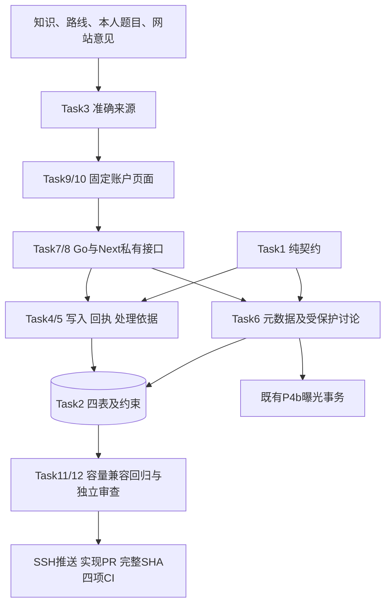

# P5a 版本化反馈与处理结果 Implementation Plan

> **For agentic workers:** REQUIRED SUB-SKILL: Use superpowers:subagent-driven-development (recommended) or superpowers:executing-plans to implement this plan task-by-task. Steps use checkbox (`- [x]`) syntax for tracking.
>
> 沿用用户已选定的 Native：当前会话使用 superpowers:executing-plans 逐项实现，全部实现后进行一次独立整分支审查。2026-10-03 已确认设计及第八节兼容性变化；用户已书面确认本计划；Task1—11及Task12编码和本机完整矩阵已实施，Task12一次独立审查、五项重要修复与完整矩阵283单元/130浏览器已通过，Step5实现MR及最新四项CI正在交付。设计及计划通过文档 [PR #20](https://github.com/yyl1212/math_master/pull/20) 交付，产品实现另建分支。

**Goal:** 用户可对真实数学版本或网站区域提交、补充和追踪反馈，独立处理者可回复、核验处理依据并留下完整结果。

**Architecture:** feedback 定义纯契约、状态和权限，store 使用现有认证、内容共享锁和曝光事务实现准确来源、只追加事件、并发序号及原始回执。独立 Go/Next.js feedback 命名空间将安全元数据与受保护讨论分开；数学修订继续经过现有独立审核、发布与撤回。

**Tech Stack:** Go 1.27.1、PostgreSQL 17.11、Node.js 24.17.0、Next.js 16.3.7、React 19.3.0、TypeScript 5.9.3；复用当前锁定 pgx、goose、Zod、Vitest、Playwright，不新增产品依赖。

**Spec:** [已确认 P5a 方案](../specs/2026-10-03-feedback-workflow-design.md)。P4b [PR #19](https://github.com/yyl1212/math_master/pull/19) 已按授权合并，master 基线 `8400ee56d59fd13ecf23f83d89d7685027c93c2d`。实施前再次 SSH fetch 最新 master，经 using-git-worktrees 创建 `codex/p5a-feedback-workflow` 产品分支；本次文档分支不实现业务。

## Global Constraints

- 文档中文，产品英文为主并保留中文数学术语；优先数据正确性、16学习板块与真实路径。测试不修改持续更新的 Knowledge_JSON，也不批准正式数学内容。
- P5a交付反馈及处理回执；P5b另审影响、独立重算和统一通知。反馈状态/修订链接不能恢复资格；原答案、成绩、历史解锁与其他有效通过证据保留。
- 全部有效账户可反馈；处理角色复用 `reviewer/admin`，editor单独无全体反馈权限。提交者不能处理自己工单；当前角色、会话、MustChangePassword在请求及提交前复核。
- 根目标site/knowledge/path/instance；数学引用ID/version/SHA，素材仅ID/SHA；实例沿用 `question.ValidInstanceID`，包含qi-加64位摘要。来源是当前公开发布或本人冻结练习/测评item。
- 状态new/processing/waiting_details/resolved/closed；补充/处理非空文本；结案需结构化依据。同状态回复保留依据，重开清空当前结案投影并保留历史事件。
- 标题1—120、正文/回复1—4000、位置0—400个Unicode标量值；必填文本拒绝全空白，全部文本拒绝NUL、非法UTF-8、孤立代理项。拒绝重复键/额外字段；纯文本保留换行，不执行HTML、图片或链接。
- 列表、元数据、全部写回执及重放无标题/位置/正文/回复预览；自由文本只从discussion读。feedback响应private/no-store，无持久化私有草稿，日志不记录文本、答案或凭据。
- instance discussion对每个读者核对其未到期active assessment的准确实例和原template；重合409 FEEDBACK_ANSWER_OVERLAP且无文本。实际交付前同事务调用 `learningRecordExposure`，记账失败不交付；过期但未清理的active行不阻断。
- 仅新增00007和feedback_tickets/events/idempotency/rate_limits四表；旧00001—00006、内容/题库schema、数学摘要用途及学习表不变。Down只允许四表全部空；已有数据可回退二进制并保留表。
- 写顺序：当前认证/资源权限→同键原请求及回执→当前序号/来源/依据→成功配额及事件/投影→提交前身份复核。失败/同键成功重放不消费；Feedback Preflight不复制learning先扣额度逻辑。
- 新建5次/15分钟且20次/24小时，owner补充30次/小时，handler处理/回复120次/小时；DBclock滑动区间 `(now-window,now]`，拒绝返回retryAt。过期消费可清理，线程无总事件上限。
- 锁顺序：共享adminLockID=1296127049→共享1296127048→UUID排序相关账户行/操作者会话→工单行→读者曝光状态。锁等待1秒、Go总期限8秒；只核验已有事实，不嵌套发布事务。
- 客户端点击起10秒含实时身份核验及发送，Next总期限10秒；请求≤65536 bytes，完整响应≤2097152 bytes，旧限制保持。超时不承诺服务器回滚；手动重试固定actor/输入/路由/UUID v4键。
- 游标默认20、最大50；数据库先限制权限再分页；未知/重复query与非法数字拒绝。UUID/SHA小写、RFC3339数据库时间沿用原规范，空数组为[]。
- Go全部加CGO_ENABLED=0、GOTOOLCHAIN=go1.27.1；只用testutil随机库/原创夹具。Go单批5m、浏览器workers=1/retries=0/globalTimeout=480000、外层run.mjs最多540秒。
- 保留旧100浏览器、135前端单元和P4b两个最大容量批次；浏览器不skip/retry/删批次；Go的-run/-skip分批合起来覆盖全部旧新测试。最新产品完整SHA的Go/前端push/PR四项CI通过后交付；生产部署在P7。

## Review Focus

1. 原回复成功但响应丢失，工单已被推进后以旧序号重试：原成功序号回执，不倒退状态、不新增事件/额度；Task4 FeedbackReplayAfterAdvance。
2. 生成题撤回/新ID修订，处理者同时是其他测评考生：精确原template阻断重合，链接不恢复资格；Task5/6 FeedbackGeneratedReplacement、FeedbackOriginalTemplateExposure。
3. 标题、位置、回复含答案，duplicate指向另一人私有报告：元数据无文本，owner discussion隐藏其他ID/身份；Task5/6/8 FeedbackDuplicatePrivacy、FeedbackMetadataRedaction。
4. 换账户/撤权、identity永不返回，或服务已提交而客户端超时：10秒含identity、旧输入不串账户、仅同键手动重试；Task3/9 FeedbackCommitIdentity、FeedbackPendingIdentityDeadline。
5. 讨论超过50条/同微秒、跨账户游标、配额恰左边界：连续无重复不越权，长期仍能结案、窗口准确；Task4/6/11 FeedbackSlidingBoundary、FeedbackCursorIsolation、FeedbackCapacity。

---

## 文件责任、架构与依赖

路径相对仓库根；花括号枚举精确文件，不授权无关重构。

| Task | 新增/修改文件 | 责任 |
| --- | --- | --- |
| 1 | 新backend/internal/feedback/{model,policy,state,validation,digest}.go及对应*_test.go | 纯契约/状态/权限/摘要 |
| 2 | 新db/migrations/00007_feedback_workflow.sql；backend/internal/store/feedback_{fixture,schema,migration}_test.go | 四表及数据库不变量 |
| 3 | 新store/feedback_{tx,targets}.go及对应*_test.go（以下store均backend/internal/store） | 当前身份/共享锁/准确来源 |
| 4 | 新store/feedback_{write,idempotency,rate}.go及对应*_test.go | 新建/补充/成功配额/原回执 |
| 5 | 新store/feedback_resolution.go、feedback_resolution_test.go | 独立处理/真实依据 |
| 6 | 新store/feedback_{read,exposure}.go及对应*_test.go | 安全投影/分页/讨论曝光 |
| 7 | 新feedback/{repository,service}.go、service_test.go；httpapi/feedback_{routes,json,dispatch,error}.go、feedback_test.go、feedback_json_test.go、feedback_integration_test.go（均backend/internal下）；api/feedback-boundary-cases.json；改httpapi/application.go、backend/cmd/server/main.go、api/openapi.yaml | 完整服务及14操作 |
| 8 | 新frontend/src/lib/feedback/{types,schemas,bytes,client,server-client,test-fixtures}.ts、{schemas,client,server-client}.test.ts；lib/api/feedback-proxy.ts及.test.ts；app/api/v1/feedback/route.ts、[...segments]/route.ts；生成lib/api/generated.d.ts（均frontend/src下） | 严格TS、字节代理/私有读取 |
| 9 | 新frontend/src/features/feedback/{feedback-account,new-form,ticket-list,discussion-panel,review-panel,status}.tsx、{pending-command,page-data}.ts、{feedback,review}.test.tsx、pending-command.test.ts；app/feedback/new/page.tsx、feedback/page.tsx、feedback/[id]/page.tsx、review/feedback/page.tsx、review/feedback/[id]/page.tsx（均frontend/src下） | 固定账户命令与五页 |
| 10 | 新features/feedback/report-link.tsx及.test.tsx；改app/knowledge/[id]/page.tsx、app/paths/[id]/page.tsx、features/practice/practice-panel.tsx、features/assessment/{assessment-panel,result-panel}.tsx、components/site-header.tsx（均frontend/src下）；新backend/internal/e2etest/feedback_{fixture,control}.go、feedback_fixture_test.go；改e2etest/harness.go；新tests/e2e/feedback-{user,review,security}.spec.ts、feedback-helpers.ts | 真实来源入口/联调 |
| 11 | 新store/feedback_capacity_test.go、api/feedback-compatibility-baseline.json、tools/verify/feedback-compatibility.test.mjs | 1000工单/10000事件及旧契约兼容 |
| 12 | 新tools/verify/feedback-ci.test.mjs及最终审查回归frontend/src/features/feedback/review-regressions.test.tsx；重要修复消费Task9组件/SSR及Task10浏览器；docs/operations/feedback-workflow.md、2026-10-03-p5a-acceptance.md、2026-10-03-p5a-final-review.md、evidence/p5a/脱敏报告/截图；改.github/workflows/{backend,frontend}.yml与本设计/计划/路线 | 完整回归/运维/审查/SSH PR |



顺序Task1→12，Task3—6完整实现后Task7才声明完整Repository和Store编译断言，不放未实现方法。每项RED→GREEN后提交；审查问题另加失败回归、最小修复及复验。

## 跨任务契约

### 类型与查询

Go导出字段/lowerCamelCase JSON，TS/OpenAPI同名。沿用 `question.Identity={id,version,sha256}`；新 `AssetRef={id,sha256}` 无version。下表 `*` 表示必需键且可null；未选分支必须null，缺键/额外键/空串冒充null拒绝。

| 类型 | 精确字段 |
| --- | --- |
| Target | kind:site/knowledge/path/instance；identity:*Identity；area:*Area；part:*Part。site仅area非空，数学仅identity非空；path/site不带Part；unit部位仅knowledge；asset部位可用于knowledge/本人instance，均按设计§3.1实际依赖验证 |
| Part / Source | Part={kind:unit/asset,unit:*Identity,asset:*AssetRef}，仅对应分支非空。Source={kind:site/publication/practice/assessment,publicationId:*UUID,attemptId:*UUID,position:*int}；site全空、publication仅publicationId、practice仅attemptId和position=1、assessment仅attemptId和position1—5 |
| ContextQuery（内部）/Context | Query={kind:site/knowledge/path/practice/assessment,id:string,area:Area,partKind:string,partId:string,position:int}，只有对应路由字段有值；Context={target:Target,source:Source,label:string}，label只取类型/ID/版本不取题干或用户文本 |
| CreateInput / ReplyInput / TransitionInput | Create={target,source,category:Category,title:string,message:string,location:string}；Reply={expectedSequence:int64,message:string}；Transition={expectedSequence:int64,status:Status,message:string,resolution:*Resolution}；sequence为JS安全整数1—9007199254740991，数据库bigint，无额外业务事件数上限 |
| Resolution | kind:ResolutionKind；withdrawal:*WithdrawalRef；replacement:*Replacement；duplicateOf:*UUID。withdrawn仅withdrawal，revision_published同时withdrawal/replacement，duplicate仅duplicateOf，其他附加字段全空 |
| WithdrawalRef / Replacement | WithdrawalRef={space:content/question,id:UUID}；Replacement={kind:knowledge/path/unit/asset/instance,identity:*Identity,asset:*AssetRef,publicationId:UUID}，素材仅asset，其他仅identity |
| Metadata | id:UUID；target:Target；label:string；category:Category；status:Status；sequence:int64；createdAt/updatedAt:time.Time；resolutionKind:*ResolutionKind；targetValidity:current/replaced/withdrawn/not_applicable；canHandle:bool。无creator ID/用户名/原标题/私有正文 |
| EventView / DiscussionPage | Event={sequence:int64,kind:created/replied/transitioned,actor:submitter/review_team,from:*Status,to:Status,message:string,resolution:*Resolution,recordedAt:time.Time}；DiscussionPage={title:string,location:string,items:[]EventView,nextCursor:*string}；原正文在seq1，owner的duplicateOf永远null |
| Page[T] / Receipt / Envelope[T] | Page={items:[]T,nextCursor:*string}；Receipt={status:201/200,ticket:Metadata}，重放原状态码/元数据；Envelope={actorId:string,data:T}，仅当前读者ID，用于拒绝跨账户旧响应 |
| ListQuery / Binding（内部） | Query={limit:int,cursor:string,status:*Status,category:*Category}；Binding={Target:Target,Source:Source,OwnerID:*string,Knowledge:*Identity,Instance:*Identity,Template:*Identity,Units:[]Identity,Assets:[]AssetRef,KnowledgePublicationID:*string,QuestionPublicationID:*string,ContentApprovalIDs:[]string,QuestionApprovalIDs:[]string}，实际来源填充，site引用全空；不进入HTTP/日志 |
| Action | readContext/create/reply/transition/listOwn/readOwn/discussOwn/listReview/readReview/discussReview；review读与transition需reviewer/admin，其余需有效已完成改密账户 |

Category/Area/Status/ResolutionKind沿用设计§3—4的六/六/五/八枚举。math_error/unclear_explanation拒绝site。状态变化进入resolved/closed需新resolution；其他迁移/同状态回复resolution必须null。同状态回复保留旧依据；owner在waiting_details/resolved/closed回复恢复processing，其他保持。handler合法状态边按设计图，无new→resolved或终态直接互换。

context查询：site唯一area；knowledge允许成对partKind/partId（版本/SHA由当前发布解析）；path无query。practice位置固定1，assessment要求唯一position；这两者可选成对partKind/partId且partKind只能asset，由本人固定item解析。列表limit/cursor，review列表另可status/category；events仅limit/cursor；详情/写无query。未知/重复/未配对参数拒绝。

票据游标为version=1的base64url规范JSON `{version,createdAt,id}`，事件为 `{version,sequence}`，最多512 ASCII bytes；票据按created_at/id降序，事件seq升序。游标仅边界，先认证/资源授权再带权限WHERE查询。DiscussionPage每页重复title/location，每页都必须记账。

sentinel：ErrNotConfigured→503 FEEDBACK_NOT_CONFIGURED、ErrConflict→409 FEEDBACK_CONFLICT、ErrTargetStale→409 FEEDBACK_TARGET_STALE、ErrAnswerOverlap→409 FEEDBACK_ANSWER_OVERLAP；其他复用auth/question的400/401/403/404/409 IDEMPOTENCY_CONFLICT/429/503。body超限400 INVALID_REQUEST。RateError={RetryAt:time.Time}；HTTP错误仅code/message/requestId，RATE_LIMITED另retryAt，无输入/答案。

### 固定接口

下列 `ctx=context.Context,a=question.Access,tx=*sql.Tx,u=auth.User,now=time.Time,q=feedback.ListQuery`；显式类型优先。方法消费/产出以这里为准。

| 层 | 精确签名 |
| --- | --- |
| 纯规则 | `ValidateCreate(CreateInput) error`；`ValidateReply(ReplyInput) error`；`ValidateTransition(Status,TransitionInput) error`；`OwnerReplyState(Status) (Status,error)`；`Authorize(auth.User,Action) error`；`CanHandle(user auth.User,ownerID string) bool`；`CanonicalCommand(action Action,resource string,input any) ([]byte,string,error)`，新用途feedback-command-v1 |
| 事务/来源 | `Store.FeedbackPreflight(ctx,a,action feedback.Action) (auth.User,error)`；`Store.feedbackTx(ctx,a,action feedback.Action,related []string,fn func(context.Context,*sql.Tx,auth.User,time.Time) error) error`；`feedbackConfigured(ctx,tx) (bool,error)`；`feedbackResolveTarget(ctx,tx,actor string,target feedback.Target,source feedback.Source,creating bool) (feedback.Binding,error)` |
| 命令/上下文 | `Store.ReadFeedbackContext(ctx,a,q feedback.ContextQuery) (feedback.Envelope[feedback.Context],error)`；`Store.CreateFeedback(ctx,a,in feedback.CreateInput) (feedback.Envelope[feedback.Receipt],error)`；`Store.ReplyFeedback(ctx,a,id string,in feedback.ReplyInput) (feedback.Envelope[feedback.Receipt],error)`；`Store.TransitionFeedback(ctx,a,id string,in feedback.TransitionInput) (feedback.Envelope[feedback.Receipt],error)` |
| 读取 | `Store.ListFeedbackTickets(ctx,a,review bool,q) (feedback.Envelope[feedback.Page[feedback.Metadata]],error)`；`Store.ReadFeedbackTicket(ctx,a,id string,review bool) (feedback.Envelope[feedback.Metadata],error)`；`Store.ReadFeedbackEvents(ctx,a,id string,review bool,q) (feedback.Envelope[feedback.DiscussionPage],error)` |
| 回执/额度/依据 | `feedbackReplay(ctx,tx,actor,action,resource,key,digest string) (feedback.Receipt,bool,error)`；`feedbackRemember(ctx,tx,actor,action,resource,key,digest string,r feedback.Receipt) error`；`feedbackConsumeRates(ctx,tx,actor string,action feedback.Action,now) error`；`feedbackResolutionProof(ctx,tx,ticketID string,in feedback.TransitionInput) error` |
| 曝光 | `feedbackDiscussionExposure(ctx,tx,reader string,b feedback.Binding) error`：当前DBclock/未到期active/准确原instance/template，随后复用learningRecordExposure，非instance无曝光 |
| 服务 | Repository只含FeedbackPreflight与上面七个公开仓储方法；`NewService(Repository) (*Service,error)`；Service同名转发及 `Preflight(ctx,a,action Action) (auth.User,error)`，无ConsumeRates/acquire/新validation池 |
| TS | FeedbackCommand为create/reply/transition三分支 `{actorId,key,route,input}`；`sendFeedback(command:FeedbackCommand,signal:AbortSignal):Promise<Envelope<Receipt>>`；`getFeedbackContext(query:ContextQuery,signal:AbortSignal):Promise<Envelope<Context>>`；`readFeedback<T>(route:string,signal:AbortSignal):Promise<Envelope<T>>`，按固定route+具名schema，不接受任意DTO |
| 页面 | `useFeedbackCommand(actorId:string,onSuccess:(receipt:Receipt)=>Promise<void>)` 返回run(command不含key/actorId)、retry/clear/busy/pending/error；FeedbackAccountProvider持有固定actorId/invalidate，所有新响应actorId不符清页 |

## Task 1：纯契约、权限、状态与摘要

**Files:** 文件表Task1。**Interfaces:** 产出跨任务DTO/纯规则，仅依赖auth/question基础类型。

- [x] **Step 1：写FeedbackState/Policy/Validation/Digest失败测试。** 同名测试使用以下断言；另表测五状态/八依据/全部Action和角色、终态原状态回复、site分类。
```go
if next,err:=OwnerReplyState(Status("closed")); err!=nil||next!="processing" { t.Fatal(next,err) }
if err:=ValidateReply(ReplyInput{ExpectedSequence:1,Message:strings.Repeat("中",4000)}); err!=nil { t.Fatal(err) }
if err:=ValidateReply(ReplyInput{ExpectedSequence:1,Message:strings.Repeat("😀",4001)}); err==nil { t.Fatal("scalar limit") }
if CanHandle(auth.User{ID:"owner",Roles:[]auth.Role{auth.RoleAdmin}},"owner") { t.Fatal("self handling") }
```
  摘要验证同输入同digest，换动作/资源/序号/文本不同digest；unit/asset互斥，asset额外version在Task7字节验证。
- [x] **Step 2：确认RED。** `node tools/verify/run.mjs --cwd backend -- env CGO_ENABLED=0 GOTOOLCHAIN=go1.27.1 go test ./internal/feedback -timeout 5m -count=1`。Expected：新符号缺失或上述确切断言失败。
- [x] **Step 3：实现精确纯接口。** 标量在trim前计数，必填文本trim后非空；保留原文不归一化。摘要复用规范JSON字节规则，仅增加feedback-command-v1用途。
- [x] **Step 4：确认GREEN。** 同Step2；Expected：纯包PASS；非法原始编码/代理项留给Task7，不让Go解码替换后冒充合法。
- [x] **Step 5：提交。** `git add backend/internal/feedback`；`git commit -m "feat: define versioned feedback contracts and rules"`。

## Task 2：四表迁移与数据库不变量

**Files:** 文件表Task2。**Interfaces:** 消费Task1；测试 `newFeedbackFixture(t *testing.T) *feedbackFixture` 复用store_test的newLearningFixture、真实双账号审核发布；新事件用数据库微秒时间。

- [x] **Step 1：写FeedbackSchema/Migration失败测试。** 随机库Up→空Down→Up；创建工单及seq1必须同事务，所有不变量直接SQL负测。
```go
if countFeedbackTables(t,db)!=4 { t.Fatal("four tables") }
if tryUpdateOriginalTitle(t,db,ticketID)==nil { t.Fatal("immutable title") }
if tryAppendEvent(t,db,ticketID,3)==nil { t.Fatal("sequence gap") }
if tryDownSeven(t,db)==nil { t.Fatal("nonempty rollback") }
```
  同文件定义上述SQL helper；错误owner/source/SHA/伪批准、无创建事件、投影不匹配、改/删event/receipt、非法迁移拒绝。四张表各自单独非空均拒绝Down。
- [x] **Step 2：确认RED。** `node tools/verify/run.mjs --cwd backend -- env CGO_ENABLED=0 GOTOOLCHAIN=go1.27.1 go test ./internal/store -run '^TestFeedback(Schema|Migration)' -timeout 5m -count=1`。Expected：缺00007/表/确切约束失败。
- [x] **Step 3：实现00007及合法夹具。** FK/数据库函数校验真实固定来源、owner、SHA和批准；延迟约束验证连续事件/最新投影；原报告/事件/回执不可改删。新终态依据入库时核验，保留的历史依据不要求永久当前head。索引owner+created_at+id、status/category+created_at+id、ticket+seq、actor/scope+consumed_at；Down一次核验四表全空后删除，失败整体回滚。
- [x] **Step 4：确认GREEN。** 同Step2；Expected：数据库全部正负例PASS，旧00001—00006字节无变化。
- [x] **Step 5：提交。** `git add db/migrations/00007_feedback_workflow.sql backend/internal/store/feedback_fixture_test.go backend/internal/store/feedback_schema_test.go backend/internal/store/feedback_migration_test.go`；`git commit -m "feat: add append-only feedback schema"`。

## Task 3：当前身份、共享事务与真实来源

**Files:** 文件表Task3。**Interfaces:** 产出FeedbackPreflight/feedbackTx/Configured/ResolveTarget/ReadFeedbackContext；复用managedIdentity、learningLocks与固定item/发布成员。

- [x] **Step 1：写FeedbackTargets/CommitIdentity/Configuration失败测试。** 真实author/reviewer分别批准，五种context包含qi-64/unit/asset/site；撤权/会话过期竞争用屏障，身份变化先提交，再继续业务。
```go
if got.Data.Target.Identity.ID!=frozenItem.Instance.ID { t.Fatal("original item") }
if got.Data.Source.Position==nil||*got.Data.Source.Position!=5 { t.Fatal("position") }
if !errors.Is(otherOwnerErr,auth.ErrNotFound) { t.Fatal(otherOwnerErr) }
if committedAfterRevocation||insertedEvents!=0 { t.Fatal("commit identity") }
```
  public head变化/伪部位/错误SHA拒绝；自己的旧题withdrawn/普通替换后仍解析原固定item；全部角色可读本人context，editor不可读review；部分/全部缺00007返回ErrNotConfigured。
- [x] **Step 2：确认RED。** `node tools/verify/run.mjs --cwd backend -- env CGO_ENABLED=0 GOTOOLCHAIN=go1.27.1 go test ./internal/store -run '^TestFeedback(Targets|CommitIdentity|Configuration)' -timeout 5m -count=1`。Expected：缺新接口或来源/身份断言失败。
- [x] **Step 3：实现精确仓储接口。** 8秒总期限/1秒锁等待，shared locks→稳定账户/会话→业务→提交前复核，Preflight仅认证/角色。公开新创建核验expected head，旧私有题不要求当前题库成员；标签只由类型/ID/版本生成，Binding不进入DTO。缺迁移不走免曝光降级。
- [x] **Step 4：确认GREEN。** 同Step2；Expected：真实来源、撤权、DBclock/锁等待/缺迁移PASS，Context JSON无正文/答案/批准封印。
- [x] **Step 5：提交。** `git add backend/internal/store/feedback_tx.go backend/internal/store/feedback_targets.go backend/internal/store/feedback_tx_test.go backend/internal/store/feedback_targets_test.go`；`git commit -m "feat: resolve authenticated feedback sources"`。

## Task 4：新建、补充、原回执与成功配额

**Files:** 文件表Task4。**Interfaces:** 产出CreateFeedback/ReplyFeedback、Replay/Remember/ConsumeRates；内部now只来自当前事务DBclock，不接收HTTP时间。

- [x] **Step 1：写FeedbackCommands/ReplayAfterAdvance/SlidingBoundary/Rates失败测试。** 两连接屏障同键并发；先创建推进seq2，再重试原命令。
```go
if replay.Data.Ticket.Sequence!=1||current.Data.Sequence!=2 { t.Fatal("original receipt") }
if createEvents!=1||rateConsumptions!=1 { t.Fatal("single success") }
if !errors.Is(changedInputErr,question.ErrIdempotencyConflict) { t.Fatal(changedInputErr) }
if fifthCreateStatus!=201||sixthCreateStatus!=429 { t.Fatal("5/15m") }
```
  同一已捕获DB微秒now下seed消费恰now−15min和晚1µs，前者排除后者计入；另测20/24h、30/h、120/h的N/N+1、失败不消费、真实retryAt、重放不消费。重放仍需当前身份/权限，不被后来head/状态/序号拒绝。
- [x] **Step 2：确认RED。** `node tools/verify/run.mjs --cwd backend -- env CGO_ENABLED=0 GOTOOLCHAIN=go1.27.1 go test ./internal/store -run '^TestFeedback(Commands|Replay|Sliding|Rates)' -timeout 5m -count=1`。Expected：命令/窗口/原回执断言失败。
- [x] **Step 3：实现精确写接口。** 身份及资源权限先于replay；唯一actor/action/resource/key下同digest立即返原Receipt；新动作才查source/sequence、配额与事件/投影，失败无消费/新receipt。owner重开清当前resolutionKind，旧事件保留。
- [x] **Step 4：确认GREEN。** 同Step2；Expected：真实同键并发只一个业务成功、原回执、配额边界PASS，所有receipt序列化无自由文本。
- [x] **Step 5：提交。** `git add backend/internal/store/feedback_write.go backend/internal/store/feedback_idempotency.go backend/internal/store/feedback_rate.go backend/internal/store/feedback_write_test.go backend/internal/store/feedback_idempotency_test.go backend/internal/store/feedback_rate_test.go`；`git commit -m "feat: add atomic feedback commands and replay"`。

## Task 5：独立处理与真实结案依据

**Files:** 文件表Task5。**Interfaces:** 产出TransitionFeedback/feedbackResolutionProof；消费Task4回执/额度，只读核验既有撤回/发布事实。

- [x] **Step 1：写FeedbackTransitions/GeneratedReplacement/DuplicatePrivacy失败测试。** 五状态矩阵、同状态回复、终态重开；两个handler同序号屏障并发。
```go
if !errors.Is(selfHandleErr,auth.ErrForbidden) { t.Fatal(selfHandleErr) }
if successCount!=1||latestSequence!=oldSequence+1 { t.Fatal("concurrent sequence") }
if oldGeneratedID==newGeneratedID||replacementErr!=nil { t.Fatal("new instance id") }
if ownerDuplicateOf!=nil { t.Fatal("other ticket id") }
```
  真实撤回匹配根/部位、当前独立批准修订/知识对应；未发布/错误知识/伪撤回拒绝，service_fixed仅site。duplicate不同工单、完整Target含Part、category全匹配；自引用/别版本拒绝。结案前后原learning/answers/results/unlocks逐值保持。
- [x] **Step 2：确认RED。** `node tools/verify/run.mjs --cwd backend -- env CGO_ENABLED=0 GOTOOLCHAIN=go1.27.1 go test ./internal/store -run '^TestFeedback(Transitions|GeneratedReplacement|DuplicatePrivacy)' -timeout 5m -count=1`。Expected：处理接口或依据/竞争断言失败。
- [x] **Step 3：实现处理/依据校验。** 另一reviewer/admin处理，replay先于sequence；知识/路线稳定ID、unit对应知识、asset新SHA、instance新ID/知识均核验真实批准当前发布。保存固定事件依据，后续发布不改旧记录；duplicate ID仅授权非owner discussion可见，metadata/receipt永不含。
- [x] **Step 4：确认GREEN。** 同Step2；Expected：全部正负依据/并发PASS，原学习事实未改。
- [x] **Step 5：提交。** `git add backend/internal/store/feedback_resolution.go backend/internal/store/feedback_resolution_test.go`；`git commit -m "feat: add independent feedback handling proofs"`。

## Task 6：安全元数据、讨论曝光与连续分页

**Files:** 文件表Task6。**Interfaces:** 产出三种读取和feedbackDiscussionExposure，消费固定Binding及原learningRecordExposure。

- [x] **Step 1：写FeedbackMetadataRedaction/OriginalTemplateExposure/Exposure/CursorIsolation/Read失败测试。** title/location/正文/reply用不同答案哨兵，逐种list/detail/write/replay序列化；discussion才有文本。
```go
if strings.Contains(metadataJSON,"answer-sentinel") { t.Fatal("metadata free text") }
if !errors.Is(overlapErr,feedback.ErrAnswerOverlap)||deliveredText!="" { t.Fatal("overlap") }
if exposedInstance!=originalInstance||exposedTemplate!=originalTemplate { t.Fatal("original refs") }
if len(seenSequences)!=51||duplicates!=0 { t.Fatal("event pages") }
```
  handler也有active overlap；同模板不同实例阻断、精确旧新template区分；过期active不阻断。记账失败无文本；撤回/交付真实锁屏障验证当前限制/原引用。同微秒51工单、跨actor游标、limit20/50/51、filter/404；discussion第2页也记账，>50条仍能结案。
- [x] **Step 2：确认RED。** `node tools/verify/run.mjs --cwd backend -- env CGO_ENABLED=0 GOTOOLCHAIN=go1.27.1 go test ./internal/store -run '^TestFeedback(Metadata|OriginalTemplate|Exposure|Cursor|Read)' -timeout 5m -count=1`。Expected：新读取/曝光符号或泄漏/分页断言失败。
- [x] **Step 3：实现精确读取/逐字段投影。** 授权先于游标，metadata不复用完整ticket/event；discussion同authenticated tx解析原instance/template，当前DBclock判断未到期active，获取reader曝光状态并记账，提交成功后才交付；失败丢弃已准备文本。owner即使经review URL也隐藏其他duplicate ID/身份。
- [x] **Step 4：确认GREEN。** 同Step2；Expected：投影、51条连续分页、精确曝光及真实事务竞争PASS。
- [x] **Step 5：提交。** `git add backend/internal/store/feedback_read.go backend/internal/store/feedback_exposure.go backend/internal/store/feedback_read_test.go backend/internal/store/feedback_exposure_test.go`；`git commit -m "feat: protect feedback discussion and exposure"`。

## Task 7：完整Go服务、HTTP/OpenAPI与共享边界

**Files:** 文件表Task7。**Interfaces:** 声明完整Repository/NewService/Store编译断言；新增 `FeedbackOptions{Service:*feedback.Service,PublicOrigin:string,Production:bool}` 和 `serveFeedback(http.ResponseWriter,*http.Request,FeedbackOptions)`；AuthOptions只增加Feedback字段。

- [x] **Step 1：写FeedbackHTTP/JSON/Service失败测试及共享raw bytes。** cases固定 `{name,route,rawBase64,expectedValid,expectedStatus,expectedCode}`；合法字节expectedValid=true且status/code=null，实际201/200由真实HTTP测试证明；非法固定false/400/INVALID_REQUEST。rawBase64保留非法UTF-8/重复键，不能用已解析JSON替代。
```go
if status!=400||code!="INVALID_REQUEST" { t.Fatal(status,code) } // 65537-byte body
if chinese4000Status!=201 { t.Fatal("legal maximum") }
if overlapStatus!=409||overlapCode!="FEEDBACK_ANSWER_OVERLAP" { t.Fatal(overlapStatus,overlapCode) }
if preflightRateCalls!=0 { t.Fatal("no preflight quota") }
```
  共享cases固定title120/121、body4000/4001、location400/401、emoji/中文/NUL/孤立代理项/UTF-8、重复/额外键、null分支、asset额外version、qi ID、seq0/1/9007199254740991/9007199254740992、position0/1/5/6、重复query、截断流和两种私有source。真实HTTP测Origin/CSRF/唯一键、14操作、响应边界/private-no-store、未配置503和全部错误码。
- [x] **Step 2：确认RED。** `node tools/verify/run.mjs --cwd backend -- env CGO_ENABLED=0 GOTOOLCHAIN=go1.27.1 go test ./internal/feedback ./internal/httpapi -run 'Feedback' -timeout 5m -count=1`。Expected：缺新服务/路由或边界断言失败。
- [x] **Step 3：实现精确服务和14操作/OpenAPI。** 路由按设计§6，原路由不改；字节校验先拒绝非法Unicode/重复键再闭合DTO。8秒HTTP、64KiB body、完整安全包装≤2MiB，写按Receipt.status返回，错误不回显输入；server显式注入不自动迁移。共享case文件自身闭合验证。
- [x] **Step 4：确认GREEN。** 同Step2，另 `node tools/verify/run.mjs --cwd backend -- env CGO_ENABLED=0 GOTOOLCHAIN=go1.27.1 go build ./cmd/...`。Expected：PASS、旧HTTP保留、全部命令/replay无文本。
- [x] **Step 5：提交。** `git add backend/internal/feedback backend/internal/httpapi backend/cmd/server/main.go api/openapi.yaml api/feedback-boundary-cases.json`；`git commit -m "feat: expose strict private feedback API"`。

## Task 8：TypeScript契约、同源代理与私有读取

**Files:** 文件表Task8。**Interfaces:** 产出固定TS客户端、`proxyFeedback(request:Request,segments:readonly string[]):Promise<Response>`；server-client按当前cookie调用仅服务端Go地址，显式no-store不缓存私有响应。

- [x] **Step 1：写schemas/client/server-client/proxy失败测试。** Node读取同一boundary raw bytes，每种非法输入与Go相同status/code；合法case只验证字节/DTO通过，业务成功另由真实联调证明。
```ts
expect(validateRaw(boundaryCase.rawBase64).valid).toBe(boundaryCase.expectedValid);
if (!boundaryCase.expectedValid) expect(validateRaw(boundaryCase.rawBase64).status).toBe(400);
expect(JSON.stringify(metadata)).not.toContain("answer-sentinel");
expect(response.headers.get("cache-control")).toBe("private, no-store");
expect(await rejectsOversizeStream(2097153)).toBe(true);
```
  本任务定义validateRaw/rejectsOversizeStream测试helper；再测request65536/65537、response2097152/2097153、截断响应、允许字段重建、多cookie/header/额外字段、10s deadline、503/409/429/网络。readFeedback非法/跨namespace route拒绝。
- [x] **Step 2：确认RED。** `node tools/verify/run.mjs --cwd frontend -- npm test -- src/lib/feedback src/lib/api/feedback-proxy.test.ts`。Expected：缺模块或字节/投影断言失败。
- [x] **Step 3：实现严格Zod/原字节读取及routes。** JSON.parse前拒绝非法UTF-8/代理项/重复键；只按固定路由转发、逐字段构造metadata/discussion，保留安全requestId/错误，不执行HTML或外链。运行 `node tools/verify/run.mjs --cwd frontend -- npm run api:generate`，不手写generated.d.ts。
- [x] **Step 4：确认GREEN。** 同Step2，另 `node tools/verify/run.mjs --cwd frontend -- npm run typecheck`。Expected：边界/代理PASS，TS/OpenAPI字段一致。
- [x] **Step 5：提交。** `git add frontend/src/lib/feedback frontend/src/lib/api/feedback-proxy.ts frontend/src/lib/api/feedback-proxy.test.ts frontend/src/app/api/v1/feedback frontend/src/lib/api/generated.d.ts`；`git commit -m "feat: add typed feedback client and private proxy"`。

## Task 9：固定账户命令与用户/处理页面

**Files:** 文件表Task9。**Interfaces:** 产出useFeedbackCommand/FeedbackAccountProvider及五页，page-data固定actor读取；discussion显式读原文，metadata不代替正文。

- [x] **Step 1：写FeedbackPendingIdentityDeadline/Pages/Review失败测试。** 假时钟测试点击开始计时、identity等待/同键手动retry；恶意HTML/中文4000/换行纯文本显示。
```ts
await vi.advanceTimersByTimeAsync(10000);
expect(sendFeedback).toHaveBeenCalledTimes(0); // identity永不返回
expect(pendingCommand.key).toBe(firstCommand.key); // 同输入手动retry
expect(screen.queryByRole("img")).toBeNull(); // 纯文本
expect(screen.queryByText("answer-sentinel")).toBeNull(); // metadata/overlap
```
  增加cross-tab换actor、旧read响应/unmount、撤权/强制改密、已提交后客户端超时、回执seq1/最新seq2；成功/replay后另读metadata。五状态/空队列/登录/无权/503/409/429/超时可恢复；reviewer自己工单只补充不能处理。
- [x] **Step 2：确认RED。** `node tools/verify/run.mjs --cwd frontend -- npm test -- src/features/feedback`。Expected：新命令/页面或账户/截止/纯文本断言失败。
- [x] **Step 3：实现精确页面/命令接口。** 固定actor/deep-freeze输入/UUID key，identity和send共享10s预算/AbortController；认证变化清旧草稿、pending和private reads。无自动重发/持久化，成功后refetch；discussion每页经保护接口。状态显示New/In progress/Waiting for details/Resolved/Closed及依据选择。
- [x] **Step 4：确认GREEN。** 同Step2及typecheck；Expected：时序/状态PASS，纯文本完整，旧学习命令不改。
- [x] **Step 5：提交。** `git add frontend/src/features/feedback frontend/src/app/feedback frontend/src/app/review/feedback`；`git commit -m "feat: build feedback and handling pages"`。

## Task 10：真实来源入口与浏览器闭环

**Files:** 文件表Task10。**Interfaces:** `ReportLink({source}:{source:ContextQuery})` 只定位来源，Go context决定身份；`setupFeedback(ctx context.Context,s *store.Store) (feedbackFixture,error)` 在原harness中集成，生产不导入e2etest。

- [x] **Step 1：写ReportLink/FeedbackFixture与三组Playwright失败测试。** 每组两个视口走真实Go/Next/随机PostgreSQL，fixture用真实author/reviewer批准和本人practice/assessment，不造前端成功响应。
```ts
await expect(page.getByRole("link",{name:"Report a problem"})).toBeVisible();
await expect(page.getByText("Waiting for details",{exact:true})).toBeVisible();
await expect(page.getByText("In progress",{exact:true})).toBeVisible(); // owner补充
await expect(page.getByText("answer-sentinel",{exact:true})).toHaveCount(0); // active overlap
```
  user覆盖知识/路线/本人练习/测评/site、终态异议重开/分页；review覆盖独立处理/真实撤回/新实例修订/原状态回复；security覆盖editor/匿名/其他404/自处理/cross-tab/active曝光/纯文本。feedback503时公开SSR正文仍可浏览。
- [x] **Step 2：确认RED。** `node tools/verify/run.mjs --cwd backend -- env CGO_ENABLED=0 GOTOOLCHAIN=go1.27.1 go test ./internal/e2etest -run 'Feedback' -timeout 5m -count=1`；按Task12构建后分别跑三个新增浏览器命令。Expected：缺入口/夹具或流程断言失败，环境未启动不算RED。
- [x] **Step 3：实现真实入口/隔离夹具。** 知识可定位实际unit/asset；practice固定item、assessment位置1—5，结果保持原attempt；siteheader网站意见。control仅loopback/鉴权/测试库，readiness等待夹具；不扩大学习题源或改旧测试前提。
- [x] **Step 4：确认GREEN。** 同Step2及report-link单元；Expected：新E2E两个视口全PASS、零skip/retry；脱敏截图目视核对长英文/中文、版本、冲突、active阻断。
- [x] **Step 5：提交。** `git add frontend/src/features/feedback frontend/src/app/knowledge frontend/src/app/paths frontend/src/features/practice frontend/src/features/assessment frontend/src/components/site-header.tsx backend/internal/e2etest tests/e2e/feedback-user.spec.ts tests/e2e/feedback-review.spec.ts tests/e2e/feedback-security.spec.ts tests/e2e/feedback-helpers.ts`；`git commit -m "feat: connect real feedback sources and browser flows"`。

## Task 11：历史容量与旧契约兼容

**Files:** 文件表Task11。**Interfaces:** baseline从master8400ee5的旧OpenAPI/00001—00006/数学摘要用途生成并记录commit，不从已修改API自取基线。

- [x] **Step 1：写FeedbackCapacity/feedback-compatibility失败测试。** 历史夹具合法来源/事件/投影/DB微秒；可填过去历史测查询，不冒充突破HTTP配额。初始化phase≤4m，之后仍用Go5m剩余总deadline。
```go
if tickets!=1000||events!=10000 { t.Fatal(tickets,events) }
if ownerPageSize!=50||reviewPageSize!=50||discussionPageSize!=50 { t.Fatal("bounded pages") }
if largestOperation>=8*time.Second||statusRaceSuccesses!=1 { t.Fatal("deadline/race") }
```
```js
assert.deepEqual(baseline.counts,{paths:75,schemas:192,responses:32,securitySchemes:3});
assert.throws(()=>compareOneChangedLearningField(),/Learning/);
assert.equal(changedOriginalMigrationDetected,true);
```
  定义上述负测helper；所有旧对象canonical digest逐值比对，保留原兼容测试。记录SQL EXPLAIN/延时/bytes，响应≤2MiB；长期工单>50仍补充/结案。
- [x] **Step 2：确认RED。** `node tools/verify/run.mjs -- node --test tools/verify/feedback-compatibility.test.mjs`；`node tools/verify/run.mjs --cwd backend -- env CGO_ENABLED=0 GOTOOLCHAIN=go1.27.1 go test ./internal/store -run '^TestFeedbackCapacity$' -timeout 5m -count=1 -v`。Expected：确切兼容/容量失败；若实现首跑已满足容量，如实记录首跑PASS，不制造假RED。
- [x] **Step 3：完成覆盖并修复实际问题。** 无性能缺陷则不改产品；有失败先定位/最小修复，不放宽8s/5m/数量/原容量。补充空Down/非空拒绝/缺迁移旧系统工作的实测证据。
- [x] **Step 4：确认GREEN。** 同Step2及Task12两个旧P4b容量/旧store/learning批次；Expected：新旧容量、75路径/192schema/32responses/3security逐值PASS，原兼容检查未删。
- [x] **Step 5：提交。** `git add backend/internal/store/feedback_capacity_test.go api/feedback-compatibility-baseline.json tools/verify/feedback-compatibility.test.mjs`；实际修复逐文件add后 `git commit -m "test: verify feedback capacity and legacy compatibility"`。

## Task 12：CI、完整回归、运维与独立整分支审查

**Files:** 文件表Task12。**Interfaces:** 消费Task1—11；验收记录含完整SHA、命令/数量/耗时、截图/审查及尚未满足生产条件。

- [x] **Step 1：写feedback-ci.test.mjs失败检查。** 解析实际workflow run命令/Playwright，原14浏览器批次、新3批次、旧2/新1容量独立执行；删除旧批次或加入skip的负测必须发现。
```js
assert.equal(oldBrowserBatches.length,14);
assert.equal(newFeedbackBatches.length,3);
assert.equal(capacityCommands.length,3); // 原2+新1不合并Go5m
assert.equal(playwrightRetries,0);
assert.equal(playwrightGlobalTimeout,480000);
```
  测试文件定义解析helper，检查每条wrapper/单次时限，不只搜无关字符串。
- [x] **Step 2：确认RED。** `node tools/verify/run.mjs -- node --test tools/verify/feedback-ci.test.mjs`。Expected：缺新增批次；负测捕获删改/skip。
- [x] **Step 3：扩充CI/运维文档。** pure组加入feedback；旧store批次skip改为 `^Test(Learning|Assessment|Feedback)`；新增feedback非capacity/capacity独立批次，原14浏览器再加3。文档明确五状态/依据/曝光/配额/缺迁移/保留四表binary回退与恢复；路线不宣称P5b/P6/P7完成。
- [x] **Step 4：运行以下完整矩阵并做一次独立整分支审查。** requesting-code-review安排一位新reviewer审查最新master到完整分支实际diff/设计/计划/证据；Native实施方式保留。重要问题先失败回归/最小修复/受影响复验。Expected：旧100浏览器/135单元及全部新增/Go/容量/兼容PASS、零skip/retry；报告不把技术夹具当数学批准。
- [ ] **Step 5：提交交付。** 明确add本任务CI/ops/计划状态/设计状态/路线，`git commit -m "test: complete feedback regression and operational acceptance"`。本机全通过后SSH普通push、创建面向最新master的实现PR并attach；最终标题描述围绕行为，四项CI核对最新完整SHA。合并/部署按届时授权，创建PR不代表合并授权。

### 完整验收命令

仓库根目录逐条独立运行；只使用testutil隔离库。锁定依赖安装/生成API，构建Go harness和前端、安装锁定Chromium后跑浏览器；沿用CI测试环境，禁止生产DATABASE_URL/服务器。

```bash
node tools/verify/run.mjs --cwd frontend -- npm ci
node tools/verify/run.mjs --cwd frontend -- npm run api:generate
node tools/verify/run.mjs --cwd frontend -- npm run typecheck
node tools/verify/run.mjs --cwd frontend -- npm test
node tools/verify/run.mjs --cwd frontend -- npm run build
node tools/verify/run.mjs --cwd frontend -- npm audit --omit=dev
node tools/verify/run.mjs --cwd frontend -- npx --no-install playwright install chromium
node tools/verify/run.mjs --cwd backend -- env CGO_ENABLED=0 GOTOOLCHAIN=go1.27.1 go vet ./...
node tools/verify/run.mjs --cwd backend -- env CGO_ENABLED=0 GOTOOLCHAIN=go1.27.1 go test ./internal/feedback ./internal/assessment ./internal/learning ./internal/question ./internal/auth ./internal/content ./internal/publication ./internal/config ./internal/httpapi ./internal/e2etest ./internal/testutil -timeout 5m -count=1
node tools/verify/run.mjs --cwd backend -- env CGO_ENABLED=0 GOTOOLCHAIN=go1.27.1 go test ./internal/store ./internal/cli -skip '^Test(Learning|Assessment|Feedback)' -timeout 5m -count=1
node tools/verify/run.mjs --cwd backend -- env CGO_ENABLED=0 GOTOOLCHAIN=go1.27.1 go test ./internal/store -run '^Test(Learning|Assessment)' -skip '^TestLearningCapacity' -timeout 5m -count=1
node tools/verify/run.mjs --cwd backend -- env CGO_ENABLED=0 GOTOOLCHAIN=go1.27.1 go test ./internal/store -run '^TestFeedback' -skip '^TestFeedbackCapacity' -timeout 5m -count=1
node tools/verify/run.mjs --cwd backend -- env CGO_ENABLED=0 GOTOOLCHAIN=go1.27.1 go test ./internal/store -run '^TestFeedbackCapacity$' -timeout 5m -count=1 -v
node tools/verify/run.mjs --cwd backend -- env CGO_ENABLED=0 GOTOOLCHAIN=go1.27.1 go test ./internal/store -run '^TestLearningCapacitySourceVolume$' -timeout 5m -count=1 -v
node tools/verify/run.mjs --cwd backend -- env CGO_ENABLED=0 GOTOOLCHAIN=go1.27.1 go test ./internal/store -run '^TestLearningCapacityMaxPool$' -timeout 5m -count=1 -v
node tools/verify/run.mjs --cwd backend -- env CGO_ENABLED=0 GOTOOLCHAIN=go1.27.1 go build ./cmd/...
node tools/verify/run.mjs --cwd backend -- env CGO_ENABLED=0 GOTOOLCHAIN=go1.27.1 go build -o bin/e2e-harness ./cmd/e2e-harness
node tools/verify/run.mjs -- node --test tools/verify/run.test.mjs tools/verify/learning-compatibility.test.mjs tools/verify/feedback-compatibility.test.mjs tools/verify/feedback-ci.test.mjs tools/content-ingest/snapshot.test.mjs
```

浏览器保留master8400ee5的frontend.yml全部14批次，逐条运行；下列原14条及新增3条每条完整运行两个视口：

```bash
node tools/verify/run.mjs --cwd frontend -- env -u NO_COLOR npm run e2e -- catalogue.spec.ts reading.spec.ts
node tools/verify/run.mjs --cwd frontend -- env -u NO_COLOR npm run e2e -- auth.spec.ts auth-security.spec.ts
node tools/verify/run.mjs --cwd frontend -- env -u NO_COLOR npm run e2e -- content-authoring.spec.ts
node tools/verify/run.mjs --cwd frontend -- env -u NO_COLOR npm run e2e -- content-review.spec.ts
node tools/verify/run.mjs --cwd frontend -- env -u NO_COLOR npm run e2e -- content-release.spec.ts
node tools/verify/run.mjs --cwd frontend -- env -u NO_COLOR npm run e2e -- content-security.spec.ts
node tools/verify/run.mjs --cwd frontend -- env -u NO_COLOR npm run e2e -- question-authoring.spec.ts
node tools/verify/run.mjs --cwd frontend -- env -u NO_COLOR npm run e2e -- question-review.spec.ts
node tools/verify/run.mjs --cwd frontend -- env -u NO_COLOR npm run e2e -- question-release.spec.ts
node tools/verify/run.mjs --cwd frontend -- env -u NO_COLOR npm run e2e -- question-security.spec.ts
node tools/verify/run.mjs --cwd frontend -- env -u NO_COLOR npm run e2e -- learning-progress.spec.ts
node tools/verify/run.mjs --cwd frontend -- env -u NO_COLOR npm run e2e -- learning-practice.spec.ts learning-assessment.spec.ts
node tools/verify/run.mjs --cwd frontend -- env -u NO_COLOR npm run e2e -- learning-diagnostic.spec.ts learning-security.spec.ts
node tools/verify/run.mjs --cwd frontend -- env -u NO_COLOR npm run e2e -- learning-review-regressions.spec.ts
```

```bash
node tools/verify/run.mjs --cwd frontend -- env -u NO_COLOR npm run e2e -- feedback-user.spec.ts
node tools/verify/run.mjs --cwd frontend -- env -u NO_COLOR npm run e2e -- feedback-review.spec.ts
node tools/verify/run.mjs --cwd frontend -- env -u NO_COLOR npm run e2e -- feedback-security.spec.ts
```

另检查gofmt、git diff --check、API生成无漂移与审查修复后完整head；现有两个CI job总限30分钟保持，每条测试仍限单次时限。若实际新增矩阵使job超时，先拆同workflow独立job并审查CI改动，不拉长单测或削减覆盖。

## 覆盖与自审记录

| 设计要求 | 任务及证据 |
| --- | --- |
| §1—2 分段/模块/架构 | Global Constraints、Task1/7/12，P5b不提前改资格 |
| §3 来源/部位/site/旧题/生成ID | Task1/2/3/10，真实发布和固定item |
| §4 五状态/重开/理由/依据/隔离 | Task1/4/5/9/10，全矩阵与原学习事实不变 |
| §5 权限/无文本元数据/纯文本/曝光/账户/截止 | Task3/6—10，准确原template、active、撤权/身份等待 |
| §6 四表/约束/回执/配额/锁/14操作/分页/边界 | Task2—8/11，SQL负测/并发/共享raw cases |
| §7 文件/五页/SSR/可恢复状态 | 文件表、Task8—10，双视口真实Go |
| §8—9 兼容/缺迁移/回退/可行性 | Task2/3/11/12，旧逐值/非空Down |
| §10 容量/旧回归/当前SHA四项CI | Task10—12，1000工单/10000事件与受限时矩阵 |
| §11 设计确认→计划审阅→Native实施 | 本计划状态及实施门槛 |

2026-10-03自审核对：产出/消费者一致，完整Repository不提前断言，原身份/锁/曝光函数实际存在，配额在成功事务，四表不触及旧数据，五个Review Focus均有具名测试，DTO/TS/OpenAPI统一，两个原容量不合并超5m。12项都有RED/GREEN及提交；容量满足时如实首跑PASS，不伪造失败。设计层无阻塞；本机全部矩阵已经实测通过，Task12一次独立审查及重要修复已通过，最终完整SHA四项CI继续作为交付门槛。

## 审阅与实施门槛

用户已确认12项/60步骤，保留Native；文档PR #20已合并，从最新master 20a68fa6f087e5e78561bf07c0229e072642e257建立隔离产品分支并完成旧基线、新旧完整矩阵。实施证据见[验收记录](../../operations/2026-10-03-p5a-acceptance.md)。仅本机隔离随机测试库验证，生产迁移和部署仍在P7。一次整分支独立审查与当前实现MR完整head四项CI正在执行。
