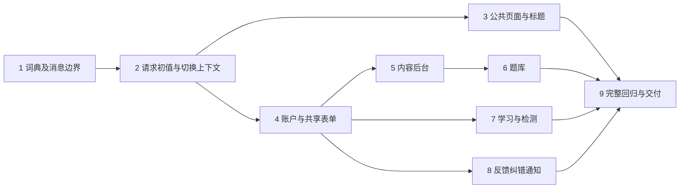

# 网站功能界面中英文切换执行计划

> **For agentic workers（致执行代理）：** REQUIRED SUB-SKILL：按用户选择使用 `superpowers:executing-plans`（Native，推荐），或 `superpowers:subagent-driven-development`。按任务逐项执行，以 `- [ ]` 跟踪步骤。计划审核和实施方式未确认前，不写产品代码。

**Goal（目标）：** 为前后台功能界面增加 English / 简体中文切换，保存浏览器偏好，并完整保留数学数据、输入、认证及业务状态。

**Architecture（架构）：** Next.js 请求级读取独立语言 Cookie，稳定根 Provider 与静态词典为服务器标签边界及客户端组件提供翻译。提示状态保存语义 key/错误 code；Go 数据、英文错误校验与权限逻辑保持。语言切换只更新界面上下文和偏好，不刷新或提交业务。

**Tech Stack（技术栈）：** 仓库锁定的 Next.js 16.3.7、React 19.3.0、TypeScript 5.9.3、Node.js 24.17.0、Vitest 5.0.3、Playwright 1.63.0；不新增运行依赖。

**Spec（设计）：** [已确认书面设计](../specs/2026-10-06-ui-language-switch-design.md)。用户于 2026-10-06 确认该书面设计；本执行计划待审。

## 全局约束

- 语言代码固定为 `en`、`zh-CN`。无偏好、非法值、重复语言 Cookie 或读取失败时使用英文；不根据 IP、用户身份或浏览器语言自动覆盖用户选择。
- 偏好 Cookie 名称为 `math_master_ui_locale`，仅存语言代码，`Path=/`、`SameSite=Lax`、有效期一年，HTTPS 下设置 Secure。有效期实现值 `31536000` 秒；不设置 Domain 或身份 Cookie 名称。
- 本期不主动同步其他已打开标签页的界面状态；每个已打开应用保持本页当前选择。新开页面或完整重新加载读取浏览器最近保存的偏好。
- 按钮切换仅更新 Provider 和偏好，不调用整页 reload、导航、router.refresh、登录恢复或业务提交。
- 语言不得成为表单、单元、工作区、测评、消息列表或认证组件的 React key。密码框、答案、审核检查项、未保存输入、待重试原输入与 Idempotency-Key 保留。
- 原始数据、不可变版本、冻结字节、SHA、数值格式及已有日期显示方式保持；不做知识翻译、语言版本课程、账号跨设备同步或多语言 URL。
- Go 英文 message、严格响应解析、HTTP 状态、认证 Cookie、角色、CSRF、近期密码验证、expectedRevision/head、判分与生成规则保持。界面按 namespace/code 本地化，不覆盖传输层 message。
- 本期交付全部功能模块，不能把开关或部分模块完成算作整体验收。新功能文案与已有数据明确分开；不按英文字符串全文替换、不扫描内容 DOM、不对用户数据调用翻译器。
- 从最新 master 新建 `codex/ui-language-switch` 实现分支；实现前核对 PR #34 管理员审核例外及本设计/计划的集成，不能覆盖权限修复。已授权合并时，仅在最新 CI 全通过且无冲突后整合；未获合并授权不自行合并依赖。
- 设计/计划通过 Git PR 审核；实现完成经独立代码审查、回归、SSH 推送及 PR 交付。真实内容批准、发布与服务器部署另按对应授权，不由语言按钮触发。
- 中文项目文档，素材沿用原创素材；每批验证由 `tools/verify/run.mjs` 限制，单次不超过十分钟。Go 兼容回归使用 `CGO_ENABLED=0`、`GOTOOLCHAIN=go1.27.1`、`-timeout 5m`。最大容量与浏览器顺序执行，保留原数据量和时限。

## Review Focus（审查重点）

1. 中文首屏、客户端导航及两个不同语言浏览器：首屏和当前界面一致，请求之间不串语言（任务 2、3、9）。
2. 密码弹窗、检测答案及未确认写入在切换时存在：输入、角色和同一请求键保持，切换不能提交或消耗重试（任务 4、5、7、8）。
3. 用户正文恰好等于英文按钮文案、正文中有 HTML/公式：只翻译明确的系统 key，正文按原文和既有安全渲染显示（任务 1、3、9）。
4. 非法/重复偏好或 Cookie 禁用：英文回退或本页切换仍可用，身份 Cookie 原值和登录状态不变（任务 1、2、4）。
5. 已有成功/失败提示和晚到的异步结果：切换后按当前语言显示，原 error code/message、冻结摘要、输入和 pending 请求不变（任务 1、4—8、9）。

## 文件职责与任务关系

| 单元 | 新增文件 | 责任 |
| --- | --- | --- |
| 纯配置与词典 | `lib/i18n/config.ts`、`types.ts`、`format.ts`、`errors.ts`、`messages/en.ts`、`messages/zh-CN.ts` | 严格语言值、类型化 key/参数、消息描述、模块错误映射 |
| SSR 与稳定上下文 | `lib/i18n/server.ts`、`provider.tsx`、`ui-text.tsx`；`components/language-switch.tsx`、`ui-page-title.tsx` | 请求级初值、偏好、标签/提示显示、html.lang 和功能标题 |
| 页面文案登记 | `docs/operations/ui-language-coverage.json` | 每个实际页面/组件的系统词条、数据边界及验证场景 |
| 业务模块迁移 | 附录列明的现有组件、页面及相关样式 | 只改显示与消息状态，不改请求/业务值 |
| 验证与说明 | `lib/i18n/*.test.*`、模块测试、`tests/e2e/ui-language-*.spec.ts`、`docs/operations/ui-language-switch.md` | 完整功能覆盖、原文不变、状态和权限回归 |

本表 `lib/`、`components/` 相对 `frontend/src/`。后端、数据文件、业务 DTO、客户端/代理的严格解码器不进入语言修改范围。



### 任务 1：类型化词典、Cookie 规则与消息边界

**Files：** 新增 `frontend/src/lib/i18n/{config,types,format,errors}.ts`、`messages/{en,zh-CN}.ts`，测试 `config.test.ts`、`format.test.ts`、`errors.test.ts`；建立 `docs/operations/ui-language-coverage.json` 初始登记（未完成行不填通过）。

**Interfaces：** `UiLocale = 'en' | 'zh-CN'`；`UI_LOCALE_COOKIE`、`UI_LOCALE_MAX_AGE`；`parseUiLocaleCookie(rawHeader: string): UiLocale`；`buildUiLocaleCookie(locale: UiLocale, secure: boolean): string`。英文条目形状为 `{ text: string; params: readonly string[] }`，导出 `MessageKey` 和 `MessageValues<K>`；中文为相同 key 的字符串，插值参数与英文完全对应。

`UiMessage` 为带 `kind:'system'` 的按 key 分配参数联合；`UiNotice` 为系统消息、`{kind:'error';namespace;code;requestId?;retryAfter?}`、`{kind:'literal';text:string}` 三种显式描述。`UiErrorNamespace` 固定为 `public | auth | content | question | learning | feedback | correction | notification`。导出 `uiMessage<K>(key:K, values:MessageValues<K>):UiMessage`、`formatUiNotice(locale:UiLocale, notice:UiNotice):string`、`uiError(namespace:UiErrorNamespace, failure:{code:string;requestId?:string;retryAfter?:number}):UiNotice`。

- [ ] 写失败测试：无 Cookie、`en`、`zh-CN`、非法值和重复目标名称分别得到 `'en','en','zh-CN','en','en'`；构造偏好含 Path、Lax、`31536000`，仅 HTTPS 有 Secure，且不含身份 Cookie 名称。
- [ ] 写消息行为断言，按字面期待，而非复用被测函数计算期待值：
```ts
expect(formatUiNotice('zh-CN', uiMessage('nav.knowledgeMap', {}))).toBe('知识地图');
expect(formatUiNotice('zh-CN', {kind:'literal', text:'Save draft'})).toBe('Save draft');
expect(formatUiNotice('zh-CN', uiMessage('common.itemNumber', {number:2}))).toBe('第 2 项');
```
- [ ] 运行 `node tools/verify/run.mjs --cwd frontend -- npm test -- src/lib/i18n/config.test.ts src/lib/i18n/format.test.ts src/lib/i18n/errors.test.ts`，先确认失败是缺少行为，再实现以上接口。普通文本格式化不执行 HTML；未知系统 key/code 安全显示当前语言的通用不可用提示。
- [ ] 验证中文键及参数一致性、动态数量、两个模块相同错误 code 的不同说明；`failure.message` 输入对象不被改写，用户正文不进入 key。补齐当前模块的错误映射，后续任务扩充模块词条但不改变消息接口。
- [ ] 测试与类型检查通过后提交：`feat: 建立界面语言词典与消息边界`。

### 任务 2：请求级初值、稳定 Provider 与语言开关

**Files：** 新增 `frontend/src/lib/i18n/server.ts`、`provider.tsx`、`ui-text.tsx`，`frontend/src/components/language-switch.tsx`，测试 `server.test.ts`、`provider.test.tsx`；修改 `frontend/src/app/layout.tsx`、`components/site-header.tsx` 和 `styles/globals.css` 的页头布局部分。

**Interfaces：** 消费任务 1。导出 `readRequestUiLocale():Promise<UiLocale>`（server-only）、`UiLocaleProvider({initialLocale,children})`、`useUiI18n():{locale:UiLocale;setLocale:(locale:UiLocale)=>void;t:<K extends MessageKey>(key:K,values:MessageValues<K>)=>string}`、`UiText({notice:UiNotice})`、`LanguageSwitch()`。

- [ ] 写失败测试 `locale-switch-keeps-dirty-input-and-component-instance`：Provider 内放含未保存原文的实际输入组件，切换后值相同、mount 次数仍为 1；辅助语言状态变为中文；明确不调用 reload、router.refresh、导航或业务写入；用户正常点击/键盘进入开关的自然焦点移动允许，切换后不得抢焦点或重建业务输入。
- [ ] 写 `cookie-write-failure-keeps-current-page-selection`、`separate-request-locales-do-not-share-state`：写 Cookie 受限时本页仍为中文；两个独立请求分别输出 en/zh-CN。测试只使用偏好和虚构身份 Cookie，不读取真实会话。
- [ ] 运行 `node tools/verify/run.mjs --cwd frontend -- npm test -- src/lib/i18n/server.test.ts src/lib/i18n/provider.test.tsx` 确认失败，随后实现上述接口及开关。Root layout 只读取偏好；客户端 Provider 初次使用初值，导航不因新的 initialLocale prop 重置当前已打开应用的状态。
- [ ] 开关使用 `type="button"`、语言自身名称、当前状态标记，位于表单外；只写 `math_master_ui_locale`，不发送网络请求。SSR 与客户端均由同一初值渲染 UiText，SSR 中不得有模块级可变语言值。
- [ ] 同批测试及 `npm run typecheck` 通过后提交：`feat: 增加稳定的界面语言切换`。此时为内部迁移基础，不能作为全功能发布。

### 任务 3：公共页面、阅读栏目及功能标题

**Files：** 附录“公共与阅读”组、`frontend/src/app/layout.tsx` 及附录全部页面的固定 metadata；新增 `components/ui-page-title.tsx`、`lib/i18n/page-titles.ts`，修改 `lib/i18n/server.ts`；测试 `public-reading.test.tsx` 和 `tests/e2e/ui-language-public.spec.ts`；扩充词典和文案登记。

**Interfaces：** 任务 1、2；`UiPageTitle({messageKey:PageTitleKey})`（`components/ui-page-title.tsx`）、在 `lib/i18n/server.ts` 导出 `getUiMetadata(messageKey:PageTitleKey):Promise<Metadata>`。`PageTitleKey` 是明确页面功能标题的词条子集；不能接收知识标题或任意用户文字。`PageTitleKey` 在 `lib/i18n/page-titles.ts` 定义并导出。每页显式声明对应 key，不用路径猜测正文标题。

- [ ] 先写 `public-ui-changes-with-identical-knowledge-body`：真实阅读组件在切换后显示“证明/来源”等 UI 栏目，知识 title/titleZh、证明、例题、许可、原始 Markdown 和数据 SVG 原值相同；用户正文含“Save draft”和 HTML/公式时仍走原安全渲染。
- [ ] 写功能 title、html.lang、已标记中文对照及已知英文数学块的语言属性测试；切换 title 只管理功能元数据，不遍历 DOM 翻译正文。页面自带动态功能标题与 Next metadata 的生命周期在真实导航中验证，不能仅用 document.title stub 宣称完成。
- [ ] 运行 `node tools/verify/run.mjs --cwd frontend -- npm test -- src/lib/i18n/public-reading.test.tsx` 确认失败，再迁移本组标签。服务器数据获取/鉴权保持，静态标签使用小型 UiText 边界；SafeMarkdown 只改自带系统失败提示，source、URL及素材处理保持。
- [ ] 在双视口运行 `node tools/verify/run.mjs --cwd frontend -- env -u NO_COLOR npm run e2e -- ui-language-public.spec.ts`：中文 Cookie 首屏、切换/刷新/新开页面、真实客户端导航、非法/重复偏好及功能 title，目录 names/nameZh 和知识原文保持。
- [ ] 测试、类型检查与本组登记通过后提交：`feat: 本地化公共功能与阅读栏目`。

### 任务 4：账户、消息状态和共享表单控件

**Files：** 附录“账户与共享控件”组；新增 `frontend/src/lib/i18n/auth-forms.test.tsx`、`tests/e2e/ui-language-auth.spec.ts`；扩充词典。HTTP client、cookies、proxy、schemas 的传输/验证行为不修改。

**Interfaces：** `FormMessage(props: ({notice:UiNotice|null;message?:never}|{message:string|null;notice?:never}) & {error?:boolean})` 渲染时取当前语言并保留原有 alert/status 焦点规则；旧 message 入口按原文显示，不能同时提供两种模式，保证后续模块渐进迁移时仍可编译。共享 TextField/NumberField/SelectField/Rows/RefFields 的 label 接受 `UiNotice | string` 作为渐进迁移兼容输入；string 明确作为原文，不自动查词典。SelectField 增加受控 `optionLabels?:Readonly<Record<string,UiNotice>>`，option value 保持原值。

- [ ] 写 `auth-error-and-password-dialog-update-without-value-reset`、`role-label-changes-but-submits-original-code`：已展示错误切换后更新；密码/用户名值及同一挂载实例不变；“审核者”仍以 `reviewer` 提交。未知错误与本地校验使用明确系统描述。
- [ ] 运行 `node tools/verify/run.mjs --cwd frontend -- npm test -- src/lib/i18n/auth-forms.test.tsx` 看失败，再迁移账户及共享控件。为旧调用保留兼容入口，逐任务将系统标签转为描述；最终不能留下本期范围内的原文字面系统提示。
- [ ] 用真实账户测试中文注册/登录/退出及权限页，添加虚构偏好 Cookie 后原身份选择/验证仍正常。密码/角色确认模态内提供 LanguageSwitch，沿用焦点陷阱且 type=button；切换只影响文案，不重新获取 auth context、不修改角色或清空输入；正常角色保存导致的会话失效规则保持。
- [ ] `node tools/verify/run.mjs --cwd frontend -- env -u NO_COLOR npm run e2e -- ui-language-auth.spec.ts` 通过后提交：`feat: 本地化账户与共享表单状态`。

### 任务 5：知识草稿、审核及发布后台

**Files：** 附录“内容管理”组；测试 `frontend/src/lib/i18n/content.test.tsx`、`tests/e2e/ui-language-content.spec.ts`；保留 PR #34 已确认改动，扩充词典与登记。

**Interfaces：** 消费任务 1—4；`useContentCommand().message/error` 接受明确 UiNotice（迁移期 string 原文兼容），状态保存描述或完整已验证 failure；pending-command、请求正文和键不变。

- [ ] 写 `dirty-draft-and-checked-review-preserved-across-toggle`：原数据草稿、输入、revision、审核检查项保持，角色不因语言改变；sourceMap、原始 JSON和导出不变。
- [ ] 写 `pending-content-request-keeps-original-body-and-key`：故障后切换，再由用户点击现有重试，收到相同 body/key；切换本身无 mutation。PasswordDialog 保留输入、焦点陷阱和验证后的再次主动提交要求；其内部提供同一 LanguageSwitch 紧凑入口，不把背景页头置于模态可交互区。
- [ ] 运行 `node tools/verify/run.mjs --cwd frontend -- npm test -- src/lib/i18n/content.test.tsx` 看失败，再迁移全部知识后台标签及消息，按 error code 展示，保留 message 严格解析。系统 success 文案存 key，切换时不残留旧语言。
- [ ] 真实双视口验证管理员全部送审、管理员自审责任说明、普通作者拒绝、候选差异、密码弹窗、激活与撤回；文本语言改变但真实 payload、权限与固定版本行为相同。若 PR #34 尚未在实现基线中整合，先解决授权集成，不以重复修改 Go 绕过。
- [ ] `node tools/verify/run.mjs --cwd frontend -- env -u NO_COLOR npm run e2e -- ui-language-content.spec.ts` 通过后提交：`feat: 本地化知识编辑审核与发布`。

### 任务 6：题库编写、核验、审核与发布

**Files：** 附录“题库”组；测试 `frontend/src/lib/i18n/question.test.tsx`、`tests/e2e/ui-language-question.spec.ts`；扩充词典和登记。

**Interfaces：** 共享控件、UiNotice 与 optionLabels；题库 `useQuestionCommand` 保存描述/已验证错误，参数、dirty、分页、实例身份及 pending 状态保持。不修改生成器、correctNumeric、传输层验证或业务枚举。

- [ ] 写 `localized-question-fields-preserve-template-and-choice-values`：模板题干、参数、固定题、选择题文字和正确答案原值不变；“数值题/待审核”等显示标签提交仍用原 value。
- [ ] 写 `existing-question-error-and-generation-check-retain-data`：核验摘要、原错误 message、128 字符数值上限、已有生成结果保持，提示按当前语言渲染。
- [ ] 运行 `node tools/verify/run.mjs --cwd frontend -- npm test -- src/lib/i18n/question.test.tsx` 看失败，再迁移全部编写/差异/覆盖/审核/发布/撤回标签及状态消息。动态模板序号采用完整带参数的词条，不拼接已译片段。题库密码弹窗使用同一紧凑 LanguageSwitch，保留模态焦点与密码输入。
- [ ] `node tools/verify/run.mjs --cwd frontend -- env -u NO_COLOR npm run e2e -- ui-language-question.spec.ts` 验证中文完整编写、冻结、管理员自审和发布；原 source/题干/每实例答案保持，并验证切换后同键重试无新批准。
- [ ] 本组验证及登记通过后提交：`feat: 本地化题库功能界面`。

### 任务 7：学习进度、练习、检测与历史

**Files：** 附录“学习练习检测”组；测试 `frontend/src/lib/i18n/learning.test.tsx`、`tests/e2e/ui-language-learning.spec.ts`；扩充词典和登记。

**Interfaces：** UiNotice 及已验证 LearningResult 仅作显示投影；现有 attempts、qualifications、exposure、ruleVersion、activeAttempt、formatCode 与时间原值保持。

- [ ] 写 `answer-entry-and-active-attempt-survive-language-toggle`：选择题原选项文字、已选 ID、分数输入 `1/2`、尝试编号保持，切换不创建或提交测评，不展示原本隐藏的答案。
- [ ] 写 `progress-status-localizes-with-unchanged-qualification`：解锁/已掌握显示中文但原状态、数量与证据版本相同；未满足前置、无足够五题及曝光冷却仍拒绝普通检测。
- [ ] 运行 `node tools/verify/run.mjs --cwd frontend -- npm test -- src/lib/i18n/learning.test.tsx` 看失败，再迁移本组功能、模式选择、空状态及结果帮助，保持原数值/日期格式和原数据正文。
- [ ] `node tools/verify/run.mjs --cwd frontend -- env -u NO_COLOR npm run e2e -- ui-language-learning.spec.ts` 用真实诊断、练习、检测及历史验证语言双向切换，不改变原五题至少四题正确、冷却、资格或回顾规则。
- [ ] 测试与登记通过后提交：`feat: 本地化学习练习与测评`。

### 任务 8：反馈、纠错与通知

**Files：** 附录“反馈纠错通知”组；测试 `frontend/src/lib/i18n/feedback-correction.test.tsx`、`tests/e2e/ui-language-feedback.spec.ts`、`ui-language-correction.spec.ts`；扩充词典和登记。

**Interfaces：** 提示按 UiNotice/namespace/code 渲染；票据、讨论、source intent、返工、计划审批、通知归属、曝光与 pending-command 的正文和状态计算保持。

- [ ] 写 `user-comment-matching-ui-text-remains-original`：用户留言 `'Save draft'` 与审核/发布理由原样显示；系统提示才变为中文。通知模板固定框架可翻译，引用的用户正文不得进入系统 key。
- [ ] 写 `feedback-and-correction-pending-state-keeps-request`：错误/确认/重试文字变更时保留 original body/key、confirmed 标志及编辑输入；切换不标记通知已读或造成答案曝光。
- [ ] 运行 `node tools/verify/run.mjs --cwd frontend -- npm test -- src/lib/i18n/feedback-correction.test.tsx` 看失败，再迁移票据、讨论、编辑、审批、结果及通知系统文案；来源对象、用户理由和原证据保持原文。
- [ ] 分别运行 `node tools/verify/run.mjs --cwd frontend -- env -u NO_COLOR npm run e2e -- ui-language-feedback.spec.ts` 与 `ui-language-correction.spec.ts`，验证双语权限、手动同键恢复及既有独立纠错审批约束。
- [ ] 本组登记与验证通过后提交：`feat: 本地化反馈纠错和通知`。

### 任务 9：覆盖审计、兼容回归与 PR 交付

**Files：** 完成 `docs/operations/ui-language-coverage.json`；新增 `docs/operations/ui-language-switch.md`、`tools/verify/ui-language-coverage.test.mjs`；修改 `.github/workflows/frontend.yml` 追加分开的语言 E2E 批次、`tools/verify/ui-language-ci.test.mjs` 及操作/总体设计/路线图说明。原 CI 命令、测试与预算保留。

**Interfaces：** 覆盖登记 schemaVersion=1；`pages[]` 保存实际 page 文件、模块、系统词条、原文数据区域和真实测试场景；`components[]` 保存源文件、词条及验证关联。每个标为完成的模块都有实际运行记录，不能用扫描结果代替行为验收。

- [ ] 先写覆盖登记及 CI 验证：新增未登记 page 时拒绝漏项；语言批次缺失时拒绝；原命令、零重试、单 worker、双视口和 480 秒浏览器总预算不放宽。用有效/缺项登记及配置输入测试消费者行为，不靠原文 grep 宣称界面翻译完成。
- [ ] 检查本期系统 JSX、辅助名称、placeholder、枚举标签、成功/失败/空状态、弹窗和 title。对逐模块真实中文场景核对词条，保留的英文数据不算漏翻，误译正文或未覆盖的系统状态算失败。
- [ ] 运行默认英文完整单元、类型和生产构建：`node tools/verify/run.mjs --cwd frontend -- npm test`、`npm run typecheck`、`npm run build`；分别使用同一验证器，不把三个命令合为一批无限时测试。
- [ ] 运行 `node tools/verify/run.mjs -- node --test tools/content-ingest/*.test.mjs tools/verify/*.test.mjs`；保持旧 API、数据、数学字节保护。词典只影响显示；若现有测试把 system failure.message 当英文展示文本，改测当前显示/原失败描述并保留英文契约断言，不能关闭保护。
- [ ] 逐批运行新增 7 个 `ui-language-*.spec.ts`；默认英文既有回归沿用 `.github/workflows/frontend.yml` 原分组。所有实际写入只在测试 harness 的随机数据库；真实原文夹具检查切换前后 API 字节、内容 SHA及源码数据文件不变，Cookie影响不得进入Go错误响应。
- [ ] 运行 `.github/workflows/backend.yml` 原分批 Go 兼容回归及容量检查，禁用 CGO、原时限和数量。容量与浏览器不并行；每批失败明确记录，修复后只重跑受影响范围，禁止跳过、降数据量或加重试掩盖失败。
- [ ] 执行一次独立整分支代码审查，重点核对 Review Focus、数据/UI边界、server-only、Cookie、函数 title 与状态保留；修复阻塞问题并验证。Native 在此执行一次整体审查，不能用作者自审替代。
- [ ] 更新总体设计的旧“首版不增加语言切换”约定与路线图；记录真实验证结果、已审查差异和使用方式。拉取最新 master 核对整合，SSH 推送并创建实现 PR，附加至当前任务。合并/部署按已授权范围执行，不能因本计划自动发布真实知识。

## 可行性与计划自审

九个任务共享同一语言、key/参数和 notice 接口；任务 1—4 建立稳定边界，任务 5—8按模块迁移，兼容入口保证每项可单独验证与提交。中间状态不作为完整中文功能发布。实施建议 Native 顺序推进，避免不同实现者各自定义消息类型或重构同一共享控件；完成后保留一次独立整分支审查。

已核对设计覆盖、文件存在性、任务间类型/方法名、五项 Review Focus 与任务测试映射。数据域、Cookie、SSR、title、用户输入、消息跟随语言和全部功能覆盖均有归属；未发现需修改 Go/数据库或翻译数学数据的技术阻塞。依赖 PR #34/#35 的集成仍须最新 CI、无冲突与用户授权，不能用本计划状态代替实际合并。

状态：书面设计已确认；执行计划待审核并选择实施方式。尚未安装新依赖、写功能代码或运行产品测试。

## 附录：实施文件清单

以下为当前实际文件清单；拉取最新 master 后补录新增文件，不能以本清单为理由漏掉新功能文案。所有组都只修改功能标签、帮助、消息与显示代码；原数据 prop、正文和 JSON 保持。

**公共与阅读**

- `frontend/src/components/site-header.tsx`
- `frontend/src/components/auth-status.tsx`
- `frontend/src/components/content-state.tsx`
- `frontend/src/components/content-status.tsx`
- `frontend/src/components/learning-hub.tsx`
- `frontend/src/features/catalogue/domain-view.tsx`
- `frontend/src/features/catalogue/knowledge-map.tsx`
- `frontend/src/features/reading/asset-image.tsx`
- `frontend/src/features/reading/knowledge-view.tsx`
- `frontend/src/features/reading/path-connections.tsx`
- `frontend/src/features/reading/path-view.tsx`
- `frontend/src/features/reading/safe-markdown.tsx`

**账户与共享控件**

- `frontend/src/features/auth/account-panel.tsx`
- `frontend/src/features/auth/admin-users.tsx`
- `frontend/src/features/auth/auth-state.tsx`
- `frontend/src/features/auth/credentials-form.tsx`
- `frontend/src/features/content/field-controls.tsx`

**内容管理**

- `frontend/src/features/content/command-controls.tsx`
- `frontend/src/features/content/content-preview.tsx`
- `frontend/src/features/content/content-state.tsx`
- `frontend/src/features/content/diff-panel.tsx`
- `frontend/src/features/content/draft-editor.tsx`
- `frontend/src/features/content/draft-list.tsx`
- `frontend/src/features/content/draft-reading-view.tsx`
- `frontend/src/features/content/package-fields.tsx`
- `frontend/src/features/content/page-access.tsx`
- `frontend/src/features/content/path-fields.tsx`
- `frontend/src/features/content/publication-panel.tsx`
- `frontend/src/features/content/review-panel.tsx`
- `frontend/src/features/content/source-fields.tsx`
- `frontend/src/features/content/submission-list.tsx`
- `frontend/src/features/content/unit-fields.tsx`
- `frontend/src/features/content/withdrawal-panel.tsx`

**题库**

- `frontend/src/features/question/blueprint-fields.tsx`
- `frontend/src/features/question/command-controls.tsx`
- `frontend/src/features/question/coverage-panel.tsx`
- `frontend/src/features/question/diff-panel.tsx`
- `frontend/src/features/question/draft-editor.tsx`
- `frontend/src/features/question/draft-list.tsx`
- `frontend/src/features/question/fixed-fields.tsx`
- `frontend/src/features/question/generation-panel.tsx`
- `frontend/src/features/question/page-access.tsx`
- `frontend/src/features/question/publication-panel.tsx`
- `frontend/src/features/question/question-state.tsx`
- `frontend/src/features/question/review-panel.tsx`
- `frontend/src/features/question/submission-list.tsx`
- `frontend/src/features/question/template-fields.tsx`
- `frontend/src/features/question/withdrawal-panel.tsx`

**学习练习检测**

- `frontend/src/features/assessment/answer-fields.tsx`
- `frontend/src/features/assessment/assessment-panel.tsx`
- `frontend/src/features/assessment/result-panel.tsx`
- `frontend/src/features/learning/attempt-asset.tsx`
- `frontend/src/features/learning/history-list.tsx`
- `frontend/src/features/learning/knowledge-controls.tsx`
- `frontend/src/features/learning/knowledge-list.tsx`
- `frontend/src/features/learning/learning-account.tsx`
- `frontend/src/features/learning/learning-status.tsx`
- `frontend/src/features/learning/overview-panel.tsx`
- `frontend/src/features/learning/path-progress.tsx`
- `frontend/src/features/practice/practice-panel.tsx`

**反馈纠错通知**

- `frontend/src/features/correction/case-list.tsx`
- `frontend/src/features/correction/case-panel.tsx`
- `frontend/src/features/correction/correction-account.tsx`
- `frontend/src/features/correction/correction-asset.tsx`
- `frontend/src/features/correction/evidence-link.tsx`
- `frontend/src/features/correction/plan-editor.tsx`
- `frontend/src/features/correction/qualification-link.tsx`
- `frontend/src/features/correction/result-panel.tsx`
- `frontend/src/features/correction/review-panel.tsx`
- `frontend/src/features/correction/status.tsx`
- `frontend/src/features/feedback/discussion-panel.tsx`
- `frontend/src/features/feedback/feedback-account.tsx`
- `frontend/src/features/feedback/new-form.tsx`
- `frontend/src/features/feedback/report-link.tsx`
- `frontend/src/features/feedback/review-panel.tsx`
- `frontend/src/features/feedback/status.tsx`
- `frontend/src/features/feedback/ticket-list.tsx`
- `frontend/src/features/notification/inbox.tsx`
- `frontend/src/features/notification/notification-account.tsx`

**页面功能标题与 metadata（任务 3）**

- `frontend/src/app/account/page.tsx`
- `frontend/src/app/admin/publications/[id]/page.tsx`
- `frontend/src/app/admin/publications/page.tsx`
- `frontend/src/app/admin/question-publications/[id]/page.tsx`
- `frontend/src/app/admin/question-publications/page.tsx`
- `frontend/src/app/admin/question-withdrawals/page.tsx`
- `frontend/src/app/admin/users/page.tsx`
- `frontend/src/app/admin/withdrawals/page.tsx`
- `frontend/src/app/assessments/[id]/page.tsx`
- `frontend/src/app/assessments/[id]/result/page.tsx`
- `frontend/src/app/corrections/[id]/page.tsx`
- `frontend/src/app/domains/[id]/page.tsx`
- `frontend/src/app/editor/drafts/[id]/page.tsx`
- `frontend/src/app/editor/drafts/[id]/preview/page.tsx`
- `frontend/src/app/editor/page.tsx`
- `frontend/src/app/editor/questions/drafts/[id]/page.tsx`
- `frontend/src/app/editor/questions/page.tsx`
- `frontend/src/app/feedback/[id]/page.tsx`
- `frontend/src/app/feedback/new/page.tsx`
- `frontend/src/app/feedback/page.tsx`
- `frontend/src/app/knowledge/[id]/page.tsx`
- `frontend/src/app/knowledge/page.tsx`
- `frontend/src/app/learn/page.tsx`
- `frontend/src/app/learning-history/page.tsx`
- `frontend/src/app/login/page.tsx`
- `frontend/src/app/notifications/page.tsx`
- `frontend/src/app/page.tsx`
- `frontend/src/app/paths/[id]/page.tsx`
- `frontend/src/app/practice/[id]/page.tsx`
- `frontend/src/app/register/page.tsx`
- `frontend/src/app/review/[id]/page.tsx`
- `frontend/src/app/review/corrections/[id]/page.tsx`
- `frontend/src/app/review/corrections/[id]/plans/[planId]/[version]/page.tsx`
- `frontend/src/app/review/corrections/page.tsx`
- `frontend/src/app/review/feedback/[id]/page.tsx`
- `frontend/src/app/review/feedback/page.tsx`
- `frontend/src/app/review/page.tsx`
- `frontend/src/app/review/questions/[id]/page.tsx`
- `frontend/src/app/review/questions/page.tsx`
