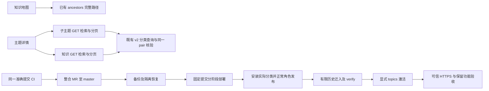

# 主题学习补齐与上线执行计划

> **For agentic workers:** REQUIRED SUB-SKILL: Use superpowers:executing-plans。沿用已确认的 Native，实施者本人完成两项补齐，合并前一次独立审查。

**Goal:** 补齐已批准主题学习方案的地图路径与详情独立检索，通过同一提交验证后部署现有网站并切换主题体验。

**Architecture:** 地图使用已有响应 ancestors；详情采用两个 GET 表单及既有 q 查询，保持知识/分类配对核对。发布沿用既有固定提交、备份恢复演练和显式迁入/激活工具。

**Tech Stack:** Next.js / TypeScript / Go / PostgreSQL / Docker Compose / Caddy。

**Spec:** docs/superpowers/specs/2026-10-06-topic-learning-refactor-design.md。2026-10-08 用户明确要求“完成我的需求并将网站部署上线”，将原不含部署范围扩展为现有服务器上线；其余内容批准及不可变历史约束保持。

## Global Constraints

- 分类63一级、534二级、4969具体；辅助503与其他534单列，合计6603。
- 原00001—00009、冻结数学正文、来源、答案及成绩保持；新接口不扩大权限。
- 每次测试不超过10分钟，普通测试按既有540秒包装；Go CGO_ENABLED=0。
- 使用已拉取最新master的新codex分支；当前已隔离worktree沿用。
- 中文文档；独立审查及准确命名兼容目标SHA后才合并。
- 生产先一致性备份及真实隔离恢复，升级失败隔离写入，不自动恢复覆盖数据库。
- 不批准尚未审核的数学资料；原账号、草稿、笔记、历史保留。

## Review Focus

- 深层及辅助类别祖先显示中英文名称，根节点无虚构祖先。
- 两个检索互不覆盖，提交只重置自己的页码，分页保留另一列表条件。
- 中文512字节、重复键、未知键、过大页码拒绝，GET不写学习记录。
- 同页三次读取pair不同仍拒绝混合版本。
- 生产发布分类与数学批准分开；无正常管理员会话不能绕过权限。

### Task 1: 完整路径与独立检索

**Files:** 修改 frontend/src/features/catalogue/topic-view.tsx、frontend/src/app/topics/[id]/page.tsx、frontend/src/lib/taxonomy/page-query.ts、frontend/src/lib/i18n/messages/en.ts、zh-CN.ts；测试 topic-view.test.tsx，新增 page-query.test.ts；扩展 tests/e2e/topic-navigation.spec.ts。

**Interfaces:** TopicMap 使用已有 TopicSummary.ancestors；详情新增可选 childrenQ、knowledgeQ，URL两个查询字段各通过 normalizeTopicQuery，仍使用既有API q 与20项分页。

- [ ] 步骤1：写行为测试，断言深层地图完整祖先链接、两个检索表单保留另一条件/页码，分页保留两条件；解析边界及真实双视口知识/子主题查询。
- [ ] 步骤2：运行具名前端测试，观察上述新增功能缺失导致失败。
- [ ] 步骤3：实现两个GET表单、祖先路径及严格查询解析；复用现有响应，不新增API字段。
- [ ] 步骤4：前端全套、类型、构建、工具兼容及主题浏览器通过；准确登记具名受保护文案目标SHA，不扩大原契约。
- [ ] 步骤5：git diff --check 后提交，记录RED/GREEN及单次预算。

### Task 2: 适配最新本地修订元数据

**Files:** tools/topic-ingest/capture.mjs、capture.test.mjs。

**Interfaces:** captureTopicBatch保持原签名及输出。实际批次161新增current_native_record_revision_notice；仅三份来源元数据允许该确切字段，严格校验10键、相对路径、SHA、字节及不新增来源信用，三份声明一致。保留8MiB/64MiB/540秒及未知字段拒绝，不把本地批准转成网站数学批准。

- [ ] 步骤1：原创夹具写有效声明成功捕获及未知键、错类型、穿越、非零信用、三份不一致拒绝测试。
- [ ] 步骤2：运行capture.test.mjs，观察有效声明被当前UNKNOWN_METADATA_FIELD拒绝。
- [ ] 步骤3：实现确切字段校验及三份一致性，捕获最新正式批次并生成6603节点私有档案。
- [ ] 步骤4：全部工具及实际批次烟测通过，原材料只读。
- [ ] 步骤5：检查差异后提交并记录证据。

### Task 3: 整合与上线准备

**Files:** 更新 docs/operations/website-guide.md，新增 docs/operations/2026-10-08-topic-learning-rollout.md；仅具名更新 api/topic-learning-compatibility-baseline.json 与校验器policy PIN。

**Interfaces:** 沿用 ops/deploy.sh、database-snapshot.py、topic-catalogue install、正常admin配对发布及topic-learning-maintenance。

- [ ] 步骤1：记录需求逐项覆盖与服务器当前版本、备份、实际源批次路径和发布前提，不输出私有资料。
- [ ] 步骤2：建立整合MR指向master，说明替代37—40依赖链及处理冲突的方式，等待同一最新SHA六项CI。
- [ ] 步骤3：一次独立整分支增量审查，无Critical/Important未解决后完成兼容审核；只一次必要修复RED→GREEN。
- [ ] 步骤4：提交最终文档与证据，保持新提交同一CI门禁。

## 发布执行验收

上面代码审查和CI完成后，按用户已授权上线执行：合并整合MR；准确合并SHA归档与服务器摘要核对；维护前备份与隔离恢复；prepare/start；真实分类安装与正常管理员发布（空知识允许）；有限迁入和verify；只读挂载备份显式activate；production网关、系统CA HTTPS、分类数量、普通登录默认我的学习、旧模块退出及后台权限核验；复制站外备份。每个阶段记录真实结果，未执行不得写成功。
