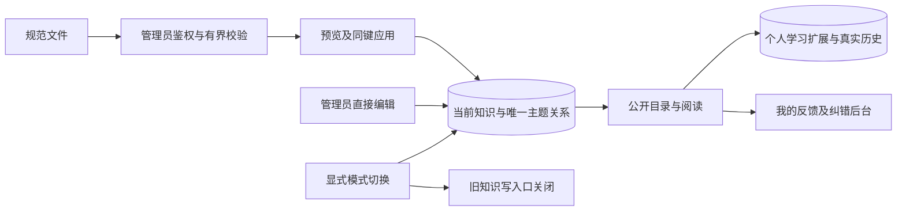

# 管理员知识上传与直接发布实施计划

> **For agentic workers:** REQUIRED SUB-SKILL: 使用 superpowers:executing-plans，由当前会话逐任务实施；结束后做一次独立代码审查。步骤使用 `- [ ]` 跟踪。

**Goal:** 管理员上传 dot 规范文件后即可发布、修正知识，以数据中的 ID 与主题唯一归属，学习者继续按主题学习、记笔记和查看历史。

**Architecture:** 新增当前知识存储，保存原始数据 ID、当前正文及唯一主题关系。公开阅读和新知识的个人学习使用明确的 managed 内容引用；保留原审核事实及旧学习表，切换后关闭旧知识写通道。通过显式维护操作启用模式、准确清理原 30 个知识点，服务启动不修改业务数据。

**Tech Stack:** Go 1.27.1（CGO_ENABLED=0）、PostgreSQL、pgx/v5 5.11.0、goose/v3 3.28.0、jsonschema/v6 6.0.3；Next.js 16.3.8、React 19.3.0、TypeScript 5.9.3、Zod 4.6.5、Node 24.17.0。

**Source contract:** 已交付目录 `/Users/wiw/.codex/visualizations/2026/10/06/01a11073-c676-7413-8c14-8ca76c85e4a2/knowledge-format-v1` 中的源/manifest schema、MSC代码、SHA256SUMS 和校验金样。任务1复制准确规范字节并保留目录来源许可说明，不修改原交付文件。

**Spec:** [已确认设计](../specs/2026-10-09-admin-knowledge-direct-design.md)。设计在 2026-10-09 经用户“确认”；实施计划已由用户确认，当前按任务实施；上线及生产清理尚未执行。

## 全局约束

- 基线 `6bb2f7693274af3957bce1bebeaa8b28dc637a61`；已从最新 origin/master 建立 `codex/admin-knowledge-direct`，复用当前隔离工作树。编码前再 fetch，若 master 推进则先合入并重新检查接口。
- ID 为 `knowledge_points[].id` 原始值；不拼 source_id，不按标题、来源版本或语义去重。同 ID 同主题一次，同 ID 多主题共用一实体。
- 八种主类型：concept、definition、axiom、theorem、corollary、method、mathematical-thinking、other；难度 1–5。正式记录没有未知占位；other 必须有理由。
- 上传符合已交付 `math-master-knowledge-source 1.0`，每文件最多 100 条、64 MiB，批量逐文件处理。一个进程最多一个源验证工作槽，不加数据库连接池或后台导入服务。
- 新上传专用截止 60 秒；应用事务 8 秒、锁等待 1 秒。原账户与普通请求时限保持；列表默认 20、最大 100；管理员列表返回 KnowledgeSummary（标题、类型、难度、主题、状态和隐藏令牌），正文仅详情获取。
- admin 单角色可以管理；每次写事务重验会话、CSRF、停用、强制改密和当前角色，提交前重验。来源中的作者或评估人员不能变成平台身份。
- 只显示未发布、已发布；不提供审核、业务版本管理。已发布编辑即刻生效，私人学习状态、笔记与时间保持。
- 新迁移 `00013`；原 `00001–00012` 字节不变。新知识不得伪造旧批准、publication_id 或 version=1。
- 启用后旧知识读接口也不能继续泄露已下架正文；旧知识写入口停用。反馈、账户和人员管理原职责保留。
- 数据库测试必须设置隔离测试库的 TEST_DATABASE_URL，确认没有因缺配置而 skip；浏览器使用真实 e2e-harness 与本地 Next.js，不把 mocked 接口当发布验证。
- 所有测试批次小于 10 分钟，Go 指定 `-timeout 5m`。长套件按已有分批入口执行；不为低影响文案写镜像测试。
- 使用 Git MR；代码审查、回归、最新备份与隔离恢复后执行已授权上线和准确旧数据清理。不扩大删除范围，不再次索取已经给出的删除或部署许可。

## 审查重点（Review Focus）

1. 管理员修正文或移除主题后重传旧文件：跳过旧输入，不恢复正文、难度或移除的主题（任务 2）。
2. 上传开始后角色撤销，或 editor 通过旧 API 写入：事务拒绝，知识和操作记录均不落库（任务 2、4）。
3. 不同 source_id、多文件及并发请求包含同一数据 ID：同主题仅一个关系，多个主题共用实体，未接收的新正文冲突（任务 2、3）。
4. 编辑或下架同时学习者保存笔记、反馈：保留私有数据和原时间，明确内容变化或不可用，不泄露私有正文或他人笔记（任务 5、6）。
5. 上传响应丢失、应用超时或慢速大文件：同键重试返回准确回执，超限失败；普通账户时限不延长（任务 3、4、6）。

## 架构与接口决策

### 固定数据模型

- `knowledgeadmin.Access` 复用 auth 的 TokenHash、CSRF，携带 IdempotencyKey、RequestID；不接受客户端 actor/role。
- `KnowledgeID(externalID string) string`：`k-` + SHA256(原始 ID UTF-8 字节)前 56 位小写十六进制；长度 58。保持原始 ID，不 trim、大小写转换或 Unicode 归一化。若摘要 ID 已属于不同 external_id，拒绝冲突。
- `Ref{ID string, ContentSHA256 string, SourceKind string}`：JSON `id/contentSha256/sourceKind`，sourceKind 固定 `managed`；没有 version。CurrentSHA 对规范的当前公开知识投影作 JCS 摘要，含主题、难度、正文和公开来源说明，不含操作者、私有来源绑定或发布状态。
- `SourceDocument`、`SourcePoint` 逐字段对应源 schema；extensions 保留 JSON 值且递归禁止未知占位。`CurrentInput{ExternalID string, Point SourcePoint, Sources []PublicSource, TopicKeys []string}` 供创建和编辑；ExternalID 创建后不可改。TopicKeys 可省略，此时按 Point 分类；提供时为明确当前主题关联，逐个验证正式代码或 project:other。Knowledge/PublicKnowledge 显式返回 topicKeys，不把项目其他键伪装成源格式 MSC 代码。编辑原始证据说明不冒充已经核验原书字节。
- `PublicSource{SourceID, Title, Citation string; URL *string}` 只包含允许公开的来源说明。`Knowledge{ID,ExternalID string; Point SourcePoint; Sources []PublicSource; Ref Ref; Published bool; EditToken string; UpdatedAt time.Time}` 为管理员响应；公开 DTO 移除 EditToken、私有 provenance/original_binding、操作者和上传文件信息。`PublicKnowledge{ID,ExternalID string; Point PublicPoint; Sources []PublicSource; Ref Ref; UpdatedAt time.Time}`；PublicPoint 只允许标题、类型及理由、数学正文/条件/范围/体系/目标/证明/方程/解释/示例/反例/误区、难度及理由、分类和证据、公开关系/标签字段，不暴露任意 extensions。`CurrentTopic{TopicKey,Title,Kind string; KnowledgeCount int; Items Page[PublicKnowledge]}`。
- `Query{TopicKey,Q,Type,Status string; Difficulty,Limit,Offset int}`；`Page[T]{Items []T; Total,Limit,Offset int}`。
- `Preview{ImportID,InputSHA256,PreviewToken string; Items []PreviewItem; Counts ImportCounts}`；item 用 `index/externalId/action/topicKeys/errorCode/errorPath` 定位。action 固定 create/link/skip/conflict/invalid；所有计数按实体和关系分别统计。
- `ImportCounts{CreatedKnowledge,LinkedTopics,SkippedItems,Conflicts,InvalidItems int}`；`ImportStatus{Preview Preview; Receipt *Receipt}`；ItemReceipt 采用 index/externalId/action/knowledgeId/topicKeys/errorCode 字段；未选择的合法项 action=not-selected，不能报告已创建。
- `ApplyInput{SelectedIndexes []int; Publish bool; PreviewToken string}`；`Receipt{OperationID string; Counts ImportCounts; Items []ItemReceipt}`。只应用 create/link 项，冲突/非法项不计成功；一次选择事务原子成功或失败。
- 编辑/发布/下架/删除使用 If-Match 隐藏令牌；写入成功换令牌，同输入同键返回原回执，令牌过期返回 409。幂等键最长 128、请求指纹包含 action、ID、正文、选择和 publish。
- `SourceCoreSHA` 是原点 JCS 的摘要，删除顶层 `id/version/original_binding/content_origin/original_type/provenance/relations/msc_codes/classification_status/classification_evidence/classification_mode/project_other/extensions`，不加入 source/dataset 元数据；其余字段全部参与。来源、主题、关系单独验证和保存。重复导入不修改已存在关系或来源说明的管理员修正。
- 规范中 relations 的 target_id 引用原始数据 ID，target_version 仅保存来源声明；公开只链接当前已发布的稳定 ID。目标尚未导入时显示文本、不创建占位知识。
- MSC topic_key 直接用正式代码；项目其他固定 `project:other`，理由留在每条知识。官方 63/534/4,969 计数保持，板块其他及项目其他单列。现有 taxonomy 表作为目录，不制造新的正式 MSC 代码。

### 数据表与引用兼容

迁移 00013 创建设计的六张管理表及五张个人学习扩展表：

| 表 | 关键约束 |
| --- | --- |
| knowledge_admin_state | singleton；content_mode=legacy/managed；enabled_once 永久；激活后不允许退回 legacy。goose_db_version 增加永久 managed_knowledge_enabled 能力标记 |
| managed_knowledge | internal_id PK，external_id UNIQUE，组合 UNIQUE(internal_id,external_id)；当前 JSON、sha、published、deleted_at、edit_token、操作者与时间 |
| managed_knowledge_topics | PK(external_id,topic_key)，组合 FK(internal_id,external_id)，active、manual_override；移除保留 inactive 墓碑 |
| managed_knowledge_sources | PK(internal_id,source_id,source_core_sha)；原文件 SHA、源点、原始绑定声明、实际字节核验布尔值；无原字节时 false |
| managed_knowledge_imports | import_id PK；owner、源文件、SHA、预览、输入指纹、应用回执；UNIQUE(owner,action,key)，明确 preview/applied 状态；不是业务知识版本 |
| managed_knowledge_events | event_id、actor、knowledge_id、action、发生时间、前后 SHA/主题；只追加，无 approve；保存编辑证据而非可切换版本 |
| managed_study_records | PK(owner_user_id,knowledge_id)，FK 当前知识；四状态、sequence、真实时间、completed_ref/last_review_ref；不复制旧记录 |
| managed_study_notes | 相同 owner/id PK/FK，正文上限沿用 64 KiB/16,000 字符、revision、managed ref；私有隔离和 CAS |
| managed_study_events | owner/id FK，发生时 Ref 和 topic_keys、真实事件时间；沿用六种事件及 review_id/note_revision 约束；不可改写 |
| managed_study_idempotency | owner/action/knowledge_id/key 唯一，输入 SHA 与无笔记正文回执；不能恢复已清理记录 |
| managed_study_content_changes | 当前知识修改/下架事件引用；用于内容变化提示，无旧 publication_id |

学习扩展复用现有 study 状态转换规则和 owner 所有权规则，不修改旧冻结引用类型或旧事件。新 `/api/v3/study` 显式返回 managed 引用；原 `/api/v2/study/history` 的真实旧数据保留只读。新历史页面统一展示两类来源，保留 sourceKind，切换后写入只走 v3。日常下架/软删除保留新知识身份和学习数据；不重新导入复活软删除项，先由管理员明确恢复。

反馈沿用原票据、讨论及人员权限。`feedback.Target` 增加可选 `managedRef`；managed 分支 kind=`managed-knowledge`、identity=null，managedRef 为 Ref；Source kind=`managed`，旧 publicationId/attemptId/position=null。迁移新增这一严格 shape/proof 分支，原分支字节意义保持；提交时要求当前已发布且 SHA 一致，之后下架仅影响可用标记，不改原票据上下文。已处理反馈可用原普通完成处理，不强制填写旧 replacement 版本引用。

### 固定 HTTP 契约

| 接口 | 行为 |
| --- | --- |
| GET `/api/v3/content-mode` | `{mode:legacy/managed,capability:boolean}`，独立于原 experience-mode |
| GET `/api/v3/admin/knowledge`、`/{id}` | admin 列表/详情；列表不含整库正文 |
| POST `/api/v3/admin/knowledge/imports` | 原始 source JSON，查询 publish 不参与预览；返回 Preview，64 MiB、60 秒 |
| GET `/api/v3/admin/knowledge/imports/{importId}` | 仅本次管理员/授权 admin 获取预览与确定回执，不返回源全文 |
| POST `/api/v3/admin/knowledge/imports/{importId}/apply` | ApplyInput、CSRF、幂等键；预览不新建知识，应用才落库 |
| POST `/api/v3/admin/knowledge` | CurrentInput 创建，初始未发布；不另造未分类格式 |
| PUT `/api/v3/admin/knowledge/{id}` | CurrentInput、If-Match；已发布内容立即更新 |
| POST `/{id}/publish`、`/{id}/unpublish`、`/{id}/restore`（上述 admin 前缀） | 当前记录操作，必须匹配令牌；restore 明确恢复 soft-delete 为未发布 |
| DELETE `/api/v3/admin/knowledge/{id}` | 软删除、撤销公开，身份保留 |
| GET `/api/v3/knowledge`、`/{id}` | 当前公开摘要分页/详情；未发布或删除返回 404，Cache-Control:no-store |
| GET `/api/v3/topics`、`/{topicKey}` | 正式目录加其他组、distinct 当前发布量、搜索/分页 |
| GET `/api/v3/study/overview`、`/topics`、`/knowledge`、`/knowledge/{id}`、`/history` | 当前学习汇总/主题进度/知识/时间线；private,no-store |
| POST `/api/v3/study/knowledge/{id}/{begin,complete,start-review,finish-review}` | `{knowledge:Ref,expectedSequence,reviewId?}`，CSRF/幂等； stale SHA 返回 409 |
| GET/PUT/DELETE `/api/v3/study/knowledge/{id}/note` | 写入 `{knowledge:Ref,expectedRevision,body}`，删除无 body；下架允许本人读取旧笔记，新的正文请求拒绝 |
| 原反馈 `/api/v1/feedback` | 扩展 managed-knowledge 输入与上下文；旧输入 shape 不变 |

接口错误统一使用项目原 problem 响应：401/403，409 `CONTENT_STALE/ID_CONTENT_CONFLICT/IDEMPOTENCY_CONFLICT`，413 `INPUT_TOO_LARGE`，422 `INVALID_FIELD` 带路径，429 `UPLOAD_BUSY`，503 `CONTENT_NOT_READY`，旧写 410 `KNOWLEDGE_WORKFLOW_RETIRED`。60 秒只用于 imports POST；应用和普通管理请求仍有独立短截止。校验超时没有“发布成功”回执。

## 文件地图与任务

以下是精确责任名单；新增其他路径须先补计划和兼容登记，不能用整个目录放行。各任务的 Test 文件均属于该任务新增范围；已存在测试可追加用例。前端路径中方括号在 shell 中必须引用。

### Task 1:源契约、当前模型与数据库基础

**Files — Create:** `schemas/knowledge-source.schema.json`、`schemas/knowledge-manifest.schema.json`、`schemas/msc2020-classification-codes.json`；`backend/internal/knowledgeadmin/model.go`、`backend/internal/knowledgeadmin/decode.go`、`backend/internal/knowledgeadmin/digest.go`、`backend/internal/knowledgeadmin/validate.go`、`backend/internal/knowledgeadmin/repository.go`；`db/migrations/00013_admin_knowledge.sql`。
**Modify:** `schemas/embed.go`、`backend/go.mod`、`backend/go.sum`。
**Test — Create:** `backend/internal/knowledgeadmin/testdata/valid-source.json`、`backend/internal/knowledgeadmin/decode_test.go`、`backend/internal/knowledgeadmin/digest_test.go`、`backend/internal/knowledgeadmin/validate_test.go`；`backend/internal/store/knowledge_admin_schema_test.go`、`backend/internal/store/knowledge_admin_fixture_test.go`。

**Interfaces:**
- `DecodeSource(io.Reader) (SourceDocument,error)`、`ValidatePoint(SourcePoint,ClassificationIndex) error`、`KnowledgeID(string) string`、`SourceCoreSHA(SourcePoint) (string,error)`、`CurrentSHA(CurrentInput,[]string) (string,error)`。
- `Repository` 在本任务声明任务 2、3 的全部方法；返回上述 DTO，不依赖 http 包。`ClassificationIndex` 从嵌入目录初始化、检查正式目录 SHA 和代码层级。
- JCS 使用 `github.com/cyberphone/json-canonicalization v0.0.0-20241213102144-19d51d7fe467` 的 Go 包；schema 正则使用 jsonschema.UseRegexpEngine + `github.com/dlclark/regexp2 v1.11.5` ECMAScript，单次匹配截止 50ms，任何匹配错误均校验失败。按[官方 regex 适配示例](https://github.com/santhosh-tekuri/jsonschema/blob/v6.0.3/example_regexp_test.go)及 [JCS 实现](https://github.com/cyberphone/json-canonicalization/tree/19d51d7fe467/go)调用；不修改交付 schema 的语义。

- [x] 写 `TestDecodeSourceStrictParity`：两条示例成功；重复键、非法 UTF-8/孤立 surrogate、未知占位、难度 0/6、other 缺理由、无效 MSC、负向前瞻边界、危险 Markdown 均失败且定位字段。以交付 Python 校验的 49 项作为同一输入金样；不读取原书路径。
- [x] 写 `TestSourceCoreAndCurrentDigest`：对象字段顺序/Unicode/浮点 JCS 与金样一致；source/version 改动不制造新 core；正文或难度改变 core；主题改变 CurrentSHA。写数据库测试：跨 source 的 external_id 仍唯一，关系组合 FK 拒绝错配；旧 12 个迁移 SHA 保持。
- [x] RED：`cd backend && CGO_ENABLED=0 go test ./internal/knowledgeadmin ./internal/store -run 'Test(DecodeSourceStrictParity|SourceCoreAndCurrentDigest|ManagedKnowledgeSchema)' -count=1 -timeout 5m`；应因缺少模型/迁移或规则失败。
- [x] 实现列出的函数、严格解码、schema/代码嵌入和迁移；用无 I/O 的 decoder，不 fetch 外部 schema。创建旧约束完整保留的反馈 managed 分支及新学习扩展结构；永不自动启用或删除。
- [x] GREEN：重跑 RED 命令，全部 PASS；在临时 PostgreSQL 上应用全部迁移并检查结构，不能对生产执行 down。
- [x] 提交本任务精确文件，commit：`feat: 建立管理员当前知识与规范源契约`。

### Task 2:管理员当前写入、去重与操作回执

**Create:** `backend/internal/store/knowledge_admin_tx.go`、`backend/internal/store/knowledge_admin_mode.go`、`backend/internal/store/knowledge_admin_write.go`、`backend/internal/store/knowledge_admin_read.go`、`backend/internal/store/knowledge_admin_import.go`、`backend/internal/store/knowledge_admin_mode.go`；`backend/internal/knowledgeadmin/service.go`。
**Test — Create:** `backend/internal/store/knowledge_admin_write_test.go`、`backend/internal/store/knowledge_admin_import_test.go`、`backend/internal/store/knowledge_admin_permissions_test.go`。

**Consumes:** 任务 1 的模型、校验、摘要及结构。
**Produces — Repository/store 方法:** `KnowledgePreflight(context.Context,Access) (auth.User,error)`；`ListManagedKnowledge(context.Context,Access,Query) (Page[Knowledge],error)`；`ReadManagedKnowledge(context.Context,Access,string) (Knowledge,error)`；`CreateManagedKnowledge(context.Context,Access,CurrentInput) (Knowledge,error)`；`UpdateManagedKnowledge(context.Context,Access,string,string,CurrentInput) (Knowledge,error)`；`SetManagedKnowledgeState(context.Context,Access,string,string,string) (Knowledge,error)`，末参数 publish/unpublish/delete/restore；`PreviewManagedImport(context.Context,Access,SourceDocument,string) (Preview,error)`；`ApplyManagedImport(context.Context,Access,string,ApplyInput) (Receipt,error)`；`ReadManagedImport(context.Context,Access,string) (Preview,*Receipt,error)`。

- [x] 写 `TestManagedReplayPreservesCorrection`：先导入、修正文/难度、移除主题，再重传旧源，当前修正和 inactive 关系不变；真正新主题只创建关系，不创建第二知识。写 `TestManagedCrossSourceConcurrentImport`：同 raw id 两来源/两个管理员并发，实体 1、同主题关系 1、无多余创建事件；同标题不同 id 实体 2，未见新正文 conflict。
- [x] 写 `TestManagedAdminRevocation`：admin-only 成功；匿名/普通/editor/reviewer/强制改密/停用失败；写提交前撤销角色，无正文及事件落库；同键异输入 409。`TestManagedEditCAS`：旧令牌编辑失败，重复幂等请求只记一次。
- [x] RED：`cd backend && CGO_ENABLED=0 go test ./internal/store -run 'TestManaged(Replay|CrossSource|Admin|Edit)' -count=1 -timeout 5m`；预期缺少存储或断言失败。
- [x] 实现接口：稳定锁顺序、8 秒事务/1 秒锁，SELECT 当前角色并保护到提交；数据库唯一约束作最后防线。源摘要、关系墓碑、原输入和回执同事务落库；导入永不覆盖当前修正；删除保留学习 FK。创建/编辑复用任务 1 校验，不接受缺难度或未分类。
- [x] GREEN：重跑上述测试，并检查公开查询只能 published 且 deleted_at 为空，所有响应分页。
- [x] 提交本任务文件，commit：`feat: 管理员直接维护知识并按数据ID去重`。

### Task 3:规范上传的有界服务与确定重试

**Create:** `backend/internal/knowledgeadmin/import.go`、`backend/internal/knowledgeadmin/import_test.go`；`tools/topic-ingest/import-managed.mjs`、`tools/topic-ingest/import-managed.test.mjs`。
**Modify:** `backend/internal/knowledgeadmin/decode.go`、`backend/internal/store/knowledge_admin_import.go`、`backend/internal/store/knowledge_admin_import_test.go`；`tools/topic-ingest/json.mjs`（仅共用严格 JSON 辅助，旧入口行为不变）。

**Consumes:** Repository.PreviewManagedImport/ApplyManagedImport/ReadManagedImport、DecodeSource。
**Produces:** `(*Service).Preview(context.Context,Access,io.Reader) (Preview,error)`、`(*Service).Apply(context.Context,Access,string,ApplyInput) (Receipt,error)`；`importManagedFiles({files,manifest,client,publish,onProgress}) -> Promise<Receipt[]>`，client 只发送管理员 API，不操纵数据库。

- [x] 写 `TestManagedImportBoundsAndRetry`：100 条/64 MiB 边界；第 101 条和超过大小失败；验证槽繁忙 429；取消释放槽；合法重复项统计；同键超时重试返回原预览/回执，不产生双事件。写 `TestManagedManifestChecks`：实际文件 SHA 或 RFC8785 记录摘要不符失败，没原字节只能记录声明。
- [x] 写工具测试：多个文件串行、一个文件重复 id/主题、不安全 manifest 相对路径、源文件变更、部分冲突、失去网络后用原键查结果；不同 source_id 不加前缀。文件/路径不写日志中的敏感源内容。
- [x] RED：Go `go test ./internal/knowledgeadmin -run 'TestManaged(Import|Manifest)' -count=1 -timeout 5m`（CGO_ENABLED=0）；Node `node --test tools/topic-ingest/import-managed.test.mjs`；应失败。
- [x] 实现一工作槽、先鉴权再读取、64 MiB 流式上限、严格结构与摘要；预览保留准确源输入，响应只给定位和计数。工具支持可选 manifest 对本次上传文件核验，失败暂停当前文件，不改变 dot 原资料。
- [x] GREEN：上述两个独立批次 PASS；验证导入含 unknown 的文件无应用入口，conflict 不能加入 SelectedIndexes。
- [x] 提交，commit：`feat: 支持规范知识上传预览与幂等应用`。

### Task 4:HTTP、当前公开读取、旧通道关闭

**Create:** `backend/internal/httpapi/knowledge_admin_routes.go`、`backend/internal/httpapi/knowledge_admin_json.go`、`backend/internal/httpapi/knowledge_current_routes.go`；`backend/internal/store/knowledge_admin_public.go`。
**Modify:** `backend/internal/knowledgeadmin/model.go`、`backend/internal/knowledgeadmin/repository.go`、`backend/internal/store/knowledge_admin_read.go`、`backend/internal/httpapi/application.go`、`backend/internal/httpapi/health.go`、`backend/cmd/server/main.go`、`api/openapi.yaml`、`frontend/src/lib/api/generated.d.ts`。
**Test — Create:** `backend/internal/httpapi/knowledge_admin_test.go`、`backend/internal/httpapi/knowledge_current_test.go`；`backend/internal/store/knowledge_admin_public_test.go`。

**Consumes:** Service、任务 2 存储、任务 1 DTO。
**Produces:** `KnowledgeHandler(service *knowledgeadmin.Service) http.Handler`；`ListCurrentKnowledge(context.Context,Query) (Page[PublicKnowledge],error)`、`ReadCurrentKnowledge(context.Context,string) (PublicKnowledge,error)`、`ListCurrentTopics(context.Context,Query) (Page[CurrentTopic],error)`、`ReadCurrentTopic(context.Context,string,Query) (CurrentTopic,error)`；`ReadContentMode(context.Context) (ContentMode,error)`。

- [x] 写 `TestManagedRoutesPermissionsAndRetirement`：管理 API 所有非 admin 拒绝；managed 模式旧知识 workspace/update/submit/review/activate/topic-assignment/withdraw 写入 410，不能靠 editor 绕过；精确匹配知识路由，不阻断反馈、纠错讨论和人员管理。
- [x] 写 `TestManagedReadNoStaleDisclosure`：修改后 GET/SSR 当前正文；下架后新旧公开 API、源文件/资产衍生端点、搜索和链接都无正文，管理源绑定不泄露；祖先 distinct、other 单列。匿名 GET 没学习写入。
- [x] 写 `TestManagedUploadDeadlineIsolation`：真 HTTP 连接慢速 imports 超过原 15s 可继续到专用 60s，超过 60s 终止；无授权大正文提前 401/403；普通账户原时限不变，代理取消上传可释放资源。
- [x] RED：`cd backend && CGO_ENABLED=0 go test ./internal/httpapi ./internal/store -run 'TestManaged(Routes|Read|Upload|Public)' -count=1 -timeout 5m`。
- [x] 实现固定契约、ResponseController 对指定上传请求设置读/写截止；不改全局 ReadTimeout/WriteTimeout。旧知识读在 managed 模式改取当前或明确停用，禁止回落旧发布正文；未激活保持原合同。公共接口无缓存，路由注册不启用模式。
- [x] GREEN：上述 PASS；`cd frontend && npm run api:generate && npm run typecheck`；OpenAPI 生成无隐式 version 参数。
- [x] 提交，commit：`feat: 提供当前知识接口并关闭旧知识写流程`。

### Task 5:私人学习、历史与反馈完整适配

**Create:** `backend/internal/knowledgeadmin/study.go`、`backend/internal/knowledgeadmin/study_test.go`；`backend/internal/store/knowledge_admin_study.go`、`backend/internal/store/knowledge_admin_notes.go`、`backend/internal/store/knowledge_admin_history.go`；`backend/internal/httpapi/knowledge_study_routes.go`。
**Modify:** `frontend/src/lib/feedback/types.ts`、`frontend/src/lib/feedback/schemas.ts`、`frontend/src/lib/feedback/schemas.test.ts`、`frontend/src/features/feedback/review-panel.tsx`；`backend/internal/study/state.go`、`backend/internal/study/state_test.go`、`backend/internal/feedback/model.go`、`backend/internal/feedback/validation.go`、`backend/internal/store/feedback_write.go`、`backend/internal/httpapi/feedback_routes.go`、`db/migrations/00013_admin_knowledge.sql`、`backend/internal/store/feedback_targets.go`、`backend/internal/store/feedback_read.go`、`backend/internal/store/feedback_resolution.go`、`backend/internal/httpapi/feedback_json.go`、`api/openapi.yaml`、`frontend/src/lib/api/generated.d.ts`。
**Test — Create:** `backend/internal/store/knowledge_admin_study_test.go`、`backend/internal/store/knowledge_admin_notes_test.go`、`backend/internal/store/knowledge_admin_feedback_test.go`；`backend/internal/httpapi/knowledge_study_test.go`。

**Consumes:** Ref、CurrentTopic、当前公开读取、原 study 状态规则与笔记格式限制；提取 `study.TransitionState(State,Action) (State,error)` 供新旧业务共用，原 ApplyState 签名和冻结引用比较不变。
**Produces:** `ManagedStudyInput{Knowledge Ref; ExpectedSequence int64; ReviewID *string}`、`ManagedNoteInput{Knowledge Ref; ExpectedRevision int64; Body string}`；`StudyRepository` 方法 `ReadManagedOverview(ctx,access) (ManagedOverview,error)`、`ListManagedStudyTopics(ctx,access,query) (Page[ManagedProgress],error)`、`ListManagedStudyKnowledge(ctx,access,query) (Page[ManagedDetail],error)`、`ReadManagedStudy(ctx,access,id) (ManagedDetail,error)`、`ApplyManagedStudy(ctx,access,id,action,input) (ManagedDetail,error)`、`ReadManagedNote(ctx,access,id) (ManagedNote,error)`、`SaveManagedNote(ctx,access,id,input) (ManagedNote,error)`、`DeleteManagedNote(ctx,access,id,input) (ManagedNote,error)`、`ListManagedHistory(ctx,access,study.HistoryQuery) (ManagedHistoryPage,error)`；ctx=context.Context，access=Access，query=Query，id/action=string。
`ManagedDetail` 沿用状态/时间字段、Ref、Available/MaterialChanged；history 的事件保存 managed Ref、当时 topicKeys/时间，cursor 使用时间+ID；overview 包括不可用/未分类/内容变更统计。

- [x] 写 `TestManagedStudyEditAndMove`：完成及笔记后编辑/移动主题，状态、owner、首次/末次完成时间、笔记 revision 不变；当前进度随主题改变，历史仍是当时 SHA/主题；重新阅读不生成完成。复习沿用合法四状态转换。
- [x] 写 `TestManagedPrivateNotesDuringUnpublish`：两用户互不可读、admin 也不可读他人笔记；下架与保存竞争返回明确 stale/unavailable，无丢失旧笔记；本人仍可查看历史及旧笔记，不能读下架正文。CAS、同键重试及危险笔记拒绝。
- [x] 写 `TestManagedFeedbackWithoutApproval`：已发布知识可提交 managed 反馈，正文变更时旧 SHA 拒绝；票据保留当时引用且不需要批准记录，后续下架可继续原讨论；原反馈分支通过原测试。
- [x] RED：`cd backend && CGO_ENABLED=0 go test ./internal/knowledgeadmin ./internal/store ./internal/httpapi -run 'TestManaged(Study|Private|Feedback)' -count=1 -timeout 5m`。
- [x] 实现接口和事务、事件/提醒/个人幂等；引用比较用当前 SHA，原状态规则用 TransitionState，不伪造 version。旧 v2 历史原样只读；新写全部 v3，旧学习写 managed 模式 410。反馈 proof 对 managed 分支验证真实当前知识，其余分支保持原语义；managedRef 在旧分支必须 omitempty，不能多出 null 字段破坏原严格 shape。
- [x] GREEN：重跑上述；独立批次运行原 study 与 feedback 相关测试，确认旧事件、原账户权限不受影响；再次生成 API。
- [x] 提交，commit：`feat: 保留当前知识的私人学习历史与反馈`。

### Task 6:简化管理界面与学习者页面

**Create:** `frontend/src/lib/knowledge-admin/types.ts`、`frontend/src/lib/knowledge-admin/schemas.ts`、`frontend/src/lib/knowledge-admin/client.ts`、`frontend/src/lib/knowledge-admin/server-client.ts`、`frontend/src/lib/knowledge-admin/mode.ts`；`frontend/src/lib/api/knowledge-admin-proxy.ts`；`frontend/src/app/api/v3/[[...segments]]/route.ts`；`frontend/src/features/knowledge-admin/list.tsx`、`frontend/src/features/knowledge-admin/upload.tsx`、`frontend/src/features/knowledge-admin/edit.tsx`；`frontend/src/app/admin/knowledge/page.tsx`、`frontend/src/app/admin/knowledge/[id]/page.tsx`；`frontend/src/features/reading/current-knowledge-view.tsx`；`frontend/src/features/study/managed-pages.tsx`、`frontend/src/features/study/managed-controls.tsx`、`frontend/src/features/study/managed-note-editor.tsx`、`frontend/src/features/study/managed-history.tsx`；`frontend/src/features/catalogue/current-catalogue.tsx`。
**Modify:** `frontend/src/components/auth-status.tsx`、`frontend/src/features/feedback/page-data.ts`、`frontend/src/components/ui-nav.tsx`、`frontend/src/components/site-header.tsx`；`frontend/src/app/page.tsx`、`frontend/src/app/knowledge/page.tsx`、`frontend/src/app/knowledge/[id]/page.tsx`、`frontend/src/app/topics/[id]/page.tsx`、`frontend/src/app/domains/[id]/page.tsx`、`frontend/src/app/learn/page.tsx`、`frontend/src/app/learning-history/page.tsx`；旧 `frontend/src/app/editor/page.tsx`、`frontend/src/app/editor/drafts/[id]/page.tsx`、`frontend/src/app/editor/drafts/[id]/preview/page.tsx`、`frontend/src/app/review/page.tsx`、`frontend/src/app/review/[id]/page.tsx`、`frontend/src/app/admin/publications/page.tsx`、`frontend/src/app/admin/publications/[id]/page.tsx`、`frontend/src/app/admin/withdrawals/page.tsx`；`frontend/src/lib/feedback/types.ts`、`frontend/src/lib/feedback/schemas.ts`；`frontend/src/features/feedback/new-form.tsx`、`frontend/src/features/feedback/report-link.tsx`、`frontend/src/features/feedback/topic-location.ts`；`frontend/src/lib/i18n/messages/zh-CN.ts`、`frontend/src/lib/i18n/messages/en.ts`。
**E2E — Create:** `backend/internal/e2etest/knowledge_admin_fixture.go`、`backend/internal/e2etest/knowledge_admin_control.go`、`backend/internal/e2etest/knowledge_admin_fixture_test.go`；Modify: `backend/internal/e2etest/harness.go`、`backend/internal/e2etest/auth_fixture.go`。fixture 使用真实存储/HTTP，提供 admin-only、普通用户和 managed 模式，不构造旧批准支持新知识。
**Test — Create:** `frontend/src/lib/knowledge-admin/client.test.ts`、`frontend/src/lib/knowledge-admin/schemas.test.ts`、`frontend/src/lib/knowledge-admin/mode.test.ts`；`frontend/src/lib/api/knowledge-admin-proxy.test.ts`；`frontend/src/features/knowledge-admin/knowledge-admin.test.tsx`；`frontend/src/features/study/managed-pages.test.tsx`；`tests/e2e/admin-knowledge-direct.spec.ts`、`tests/e2e/managed-knowledge-study.spec.ts`。

**Consumes:** 任务 4/5 OpenAPI DTO；旧 content-mode 与 experience-mode 是两个独立合同。
**Produces:** `getContentMode():Promise<ContentMode>`；客户端 `previewSource(file:File,key:string):Promise<Preview>`、`applyImport(id:string,input:ApplyInput,key:string):Promise<Receipt>`、`readImport(id:string):Promise<ImportStatus>`；管理 CRUD、公开和私人学习方法一一对应固定 HTTP 表，不以猜测 version 组装参数。

- [x] 写 `admin uploads and corrects current knowledge` 浏览器用例：admin-only 上传预览后发布，八类型/难度/分类显示，修改保存立即生效，无审核/版本控件；重复 ID 跳过，冲突定位，原公开页面不回显源路径。
- [x] 写 `uncertain upload continues with same key`：丢响应后保存准确文件与键、查询回执再继续，按钮防双点但后端仍负责幂等；刷新不能假报成功，不把 64 MiB 源内容存在 localStorage。新代理只 imports 上传 60s，原代理期限断言保持。
- [x] 写 `learner keeps notes and timeline across edits`：新 Ref 的四状态、笔记、旧只读历史合并、内容变化提示、下架不可读；主题移动汇总正确；登录默认 /learn 原行为回归；非 admin 旧管理页拒绝。
- [x] RED：`cd frontend && npm test -- src/lib/knowledge-admin src/lib/api/knowledge-admin-proxy.test.ts src/features/knowledge-admin src/features/study/managed-pages.test.tsx`；应失败。单批设置运行上限 9 分钟。
- [x] 实现当前入口及 mode 分支；有 capability=true 或 mode=managed 却读取失败时显示服务不可用，不能回退旧正文。旧知识管理页 admin 转 /admin/knowledge，其他角色无权限；不改 review/feedback、review/corrections。公开/个人页面用当前组件，没有知识版本标签；源声明只显示公开说明。
- [x] GREEN：上述单元批次；`npm run typecheck`、`npm run build` 分别限 9 分钟；两份新 Playwright spec 分开运行，每批限 9 分钟并核验截图/实际交互。
- [x] 提交，commit：`feat: 简化管理员知识管理与当前知识学习界面`。

### Task 7:能力检查、明确启用与准确旧数据清理

**Create:** `backend/internal/cli/knowledge.go`、`backend/internal/cli/knowledge_test.go`、`backend/internal/store/knowledge_admin_health_export_test.go`；`backend/cmd/knowledge-maintenance/main.go`、`backend/internal/store/knowledge_admin_maintenance.go`、`backend/internal/store/knowledge_admin_maintenance_test.go`；`ops/knowledge-cutover.py`、`ops/tests/test_knowledge_cutover.py`。
**Modify:** `backend/Dockerfile`；`backend/internal/store/knowledge_admin_tx.go`、`backend/internal/store/knowledge_admin_mode.go`、`backend/internal/store/study_migration.go`、`backend/internal/knowledgeadmin/model.go`、`backend/internal/cli/topic_backup.go`；`backend/internal/httpapi/health.go`、`backend/internal/httpapi/health_test.go`；`ops/deploy.py`、`ops/verify-deployment.py`、`ops/tests/test_deploy.py`、`ops/tests/test_verify.py`。

**Consumes:** 当前结构/模式、永久 capability、已有备份/隔离恢复工具；清理输入固定精确旧 30 IDs 及期望关联数量/指纹。
**Produces:** `ReadManagedSchemaHealth(context.Context) (ManagedSchemaHealth,error)`，安全布尔字段 capability/schemaReady/managedMode；`PlanKnowledgeCutover(context.Context,CutoverInput) (CutoverPlan,error)`、`ApplyKnowledgeCutover(context.Context,CutoverPlan) (CutoverReceipt,error)`，输入含准确清单、备份标识、预期指纹，无任意 SQL；`knowledge-maintenance plan|activate|clean-old` 固定子命令。维护连接来自受保护配置，不接受日志明文口令。

- [x] 写 `TestManagedCapabilityFailClosed`：缺表、约束/触发器缺失、永久标记存在但当前模式结构丢失 => readyz503；新代码未激活保留原 topic5字段；旧代码回退在迁移13/永久标记下被部署工具拒绝，不能通过 down/删标记绕过。
- [x] 写 `TestExactOldThirtyCleanup`：准确30和授权学习关联被清理，旧迁入/幂等不能复活；账户、角色、6603分类目录及无关工作区指纹不变。新关联出现、31个ID、缺备份、旧清单SHA改变 => 整次拒绝。旧审核真实记录保留。
- [x] RED：Go `CGO_ENABLED=0 go test ./internal/store ./internal/httpapi -run 'Test(ManagedCapability|ExactOldThirty)' -count=1 -timeout 5m`；Python `python3 -m unittest discover -s ops/tests -p 'test_knowledge_cutover.py'`，独立批次。
- [x] 实现健康新 top-level content 字段，保留原 topic shape；部署兼容检查支持13及永久标记。维护先预览后一次事务应用、记录真实事件；旧不可变学习事件只允许维护专用精准清理路径，不开放给普通 API；备份必须最新、隔离恢复+异地副本验证。激活本身不删除，重复执行返回准确结果。
- [x] GREEN：上述及部署/验证原测试各一批 PASS；在隔离恢复库演练，比较受保护数据指纹，验证中断无半次清理。
- [x] 提交，commit：`feat: 安全启用当前知识模式与精确旧数据清理`。

### Task 8:兼容登记、审查、MR 与已授权上线

**Modify:** `api/topic-learning-compatibility-baseline.json`、`tools/verify/topic-learning-compatibility.mjs`、`tools/verify/topic-learning-compatibility.test.mjs`、`tools/verify/topic-learning-ci.test.mjs`；`.github/workflows/backend.yml`、`.github/workflows/frontend.yml`、`.github/workflows/deployment.yml`。
**Create:** `tools/verify/admin-knowledge-acceptance.mjs`、`tools/verify/admin-knowledge-acceptance.test.mjs`；`docs/superpowers/reports/2026-10-09-admin-knowledge-direct-verification.md`。
**Modify documents:** 本计划与已确认设计的进度/完成状态；精准登记二者及上述验收报告路径。

**Consumes:** 所有前置产物；approved path 名单为任务 1–8 精确文件，不自动从工作树批量批准。
**Produces:** managed 第四阶段兼容登记，批准每个实际旧文件目标 SHA/API节摘要，保存旧快照；验收报告包含实际命令、结果、独立审查、MR/CI精确HEAD、部署和数据验证证据。

- [ ] 写 `managed compatibility refuses unlisted and changed bytes`：新阶段精准路径通过；增加未列文件、改旧迁移、未批准 API 分支或修改目标 SHA 均失败。原 taxonomy/study/cutover 基线继续通过；不放行整个目录或删除门禁。
- [ ] RED：`node --test tools/verify/admin-knowledge-acceptance.test.mjs tools/verify/topic-learning-compatibility.test.mjs`；应因缺新阶段失败。
- [ ] 实现 exact SHA/新路径登记、新阶段逆向比较和 CI 单批执行；旧原测试保留，在 legacy/topics 场景跑原写合同，在 managed 场景断言410。确认所有规范依赖已锁定、源码无演示知识自动上线逻辑。
- [ ] GREEN：运行新验收门禁；Go 原有批次每批5分钟、前端/tool/Python各批9分钟、浏览器按 spec 分批9分钟。失败先诊断修复，不重复无关长套件。记录端到端证据及每个审查重点对应测试。
- [ ] 做一次独立代码审查，重点为 raw id/主题唯一、权限撤销、旧读泄露、私人数据、模式回退；修复所有阻塞/P1问题，相关回归通过再创建 Git MR，并 attach_artifact。MR 描述中文，针对最终行为及实际验证，不宣称尚未部署的结果。
- [ ] 精确 MR HEAD 的 CI 全绿后合入 master，按既有授权部署固定合入提交；创建最新备份、完成恢复/异地验证，再显式启用 managed。准备与迁入分开：每步最多5分钟、有独立回执和恢复点，超时暂停该步，禁止自动扩大清理。
- [ ] 用正式规范源文件执行上传并发布；只取 dot 当前正式快照，通过同一管理员接口和自动检查，不替 dot 随意映射类型，不把格式示例当正式内容。若标准文件尚未到位，完成模块上线，报告实际数据缺口和数量，保留原30直到有效替代批次与清理演练满足，不能假报导入。
- [ ] 按准确旧30清单和新备份回执执行授权清理；逐项校验发布数量、external_id+topic唯一、难度/类型、学习/反馈/管理、未登录公开访问与保护数据指纹。生产失败只回退到兼容代码，保留库和证据。
- [ ] 提交验收报告和勾选进度，commit：`docs: 记录当前知识管理验收与上线证据`；向用户报告链接、实际导入/跳过/冲突/清理数量及尚存问题。

## 自审结论

- 设计覆盖：源格式和证据→1/3；数据身份/重传/编辑→1/2；权限和旧退出→2/4；公开读取→4/6；学习/历史/笔记/反馈→5/6；能力、备份、清理及上线→7/8。没有将学习或反馈适配留为上线后补项。
- 五个审查重点均有具名失败测试；类型、接口、主题键、内容引用及幂等键统一。预览和应用不生成审核实体，来源版本不参与身份。
- 可行性：依赖现有数据库及框架；新扩展避免改写旧不可变学习/批准事实。新增两个锁定的 Go 库解决 schema 正则和 JCS 一致性；没有人工审查前置、额外服务或外部原书访问前置。
- 原30清理只在正式替代批次可用、恢复验证完成后执行。普通管理软删除不删除私人学习数据。源文件尚未按标准重整只影响实际内容迁入，不阻塞模块代码和上线准备。
- 执行中新增兼容范围、破坏性清理范围或格式语义变化需先更新方案并审查；常规实现、修复、已授权上线按此计划继续。每任务以测试和可审查提交收尾。
