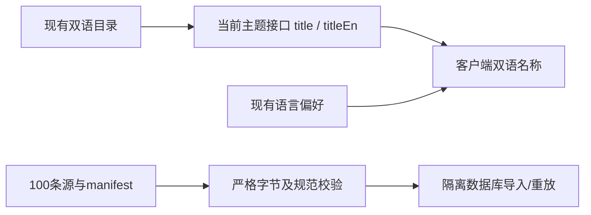

# 知识地图双语修复与100条真实文件导入验证

目标：地图一级、二级、具体主题及项目其他随现有语言按钮立即切换；对用户下载的100条执行真实规范导入、分类、防重复和人工修正保护验证。现有双语界面设计及管理员直接管理方案为约束，正式源不改写。

## 可行性与兼容性

已查明目录持有name/nameZh，但当前接口在SQL中只选中文，前端直接输出title。保留title含义，新增可选titleEn，缺字段时旧响应仍可读取；严格解析继续拒绝未知字段。无需数据库迁移、编号/链接变更、目录重新发布或知识正文翻译。同步部署前后端，针对新增字段独立审查。正式文件及原始绑定不改写；缺少原Knowledge_JSON时不宣称绑定本地复核。测试数据只进入随机隔离库，生产只部署显示修复。

## Task 1: 严格校验与真实导入

- [x] 使用现有DecodeSource/VerifyManifestFile及工具导入器核验964549字节、100条、105条关系、身份与清单；记录原绑定缺失。
- [x] 在受保护的本地测试数据库中真实预览、导入100条、逐条分类与当前阅读验证、重放100条不重复、人工修正后不覆盖；保留收据，清除隔离库。

## Task 2: 地图双语与上线

修改 backend/internal/knowledgeadmin/model.go、backend/internal/store/knowledge_admin_public.go、api/openapi.yaml、frontend/src/lib/api/generated.d.ts、frontend/src/lib/knowledge-admin/schemas.ts、frontend/src/features/catalogue/current-catalogue.tsx；新增 frontend/src/lib/i18n/localized-name.tsx。测试修改 backend/internal/store/knowledge_admin_public_test.go、frontend/src/lib/knowledge-admin/schemas.test.ts、frontend/src/features/catalogue/current-catalogue.test.tsx、tests/e2e/managed-knowledge-study.spec.ts、tests/e2e/ui-language-managed.spec.ts。按兼容门禁精确登记变更文件和摘要，新增中文验收记录。

- [x] 编写并观察接口双语字段、实时切换、稳定链接与输入保留测试失败。
- [x] 实现最小修复，按语言显示主题名称和知识列表已有双语标题；原数学正文不翻译。
- [x] 前后端针对性测试、类型检查、构建和桌面/手机浏览器回归；单次测试<=9分钟，Go CGO_ENABLED=0。
- [x] 独立兼容审查，修复阻塞项，创建Git MR并核验最新HEAD CI；按既有授权合入部署。
- [x] 线上双视口三级目录语言切换与严格HTTPS验收，记录真实结果。

## 已定位的完整名称缺口与补充范围

生产只读核验6603节点中仅63一级有中文名，6037个二级/具体/其他缺中文。完整双语需求需补可核对译名。保持目录不可变与编号/链接不变，优先使用已有许可且可核对英文/代码的译名数据作为只读展示层。翻译来源、快照摘要及许可随数据保留；非官方中文不得声称官方译名。未满足完整数据核对前不部署部分翻译。

CI原浏览器门禁禁止skip，真实文件验收移至显式独立source-import-acceptance.ts及独立config，缺文件时报错；原默认浏览器用例全部执行，门禁规则不改。

补充文件：schemas/topic-labels.zh-CN.json 保存固定来源、许可和精确英文/中文展示映射；schemas/embed.go 将只读译名字典嵌入二进制；backend/internal/knowledgeadmin/topic_names.go/test.go 负责完整性、准确英文匹配和中文检索候选；backend/internal/store/knowledge_admin_public.go 仅对匹配的目录名称投影，不修改taxonomy_nodes。前端messages/en.ts、zh-CN.ts及地图组件补中英来源署名说明。旧fixture同码不同英文时不套用真实译名；显式英文不匹配回退原文，避免把相同编号的未知版本套错主题。中文主题检索通过字典候选编号并入原SQL，保留参数化查询和原分页。

新增数据展示层需要单独兼容审查；译名75项存在公式/音译/原名称尾注差异，将在来源编号完整对照之外单独核对并记录。当前schema与目录不新增业务版本。

最终状态：两项任务及追加完整译名、兼容修复均完成，MR47已合入，58c77ec已上线。验收详见同日期报告。
