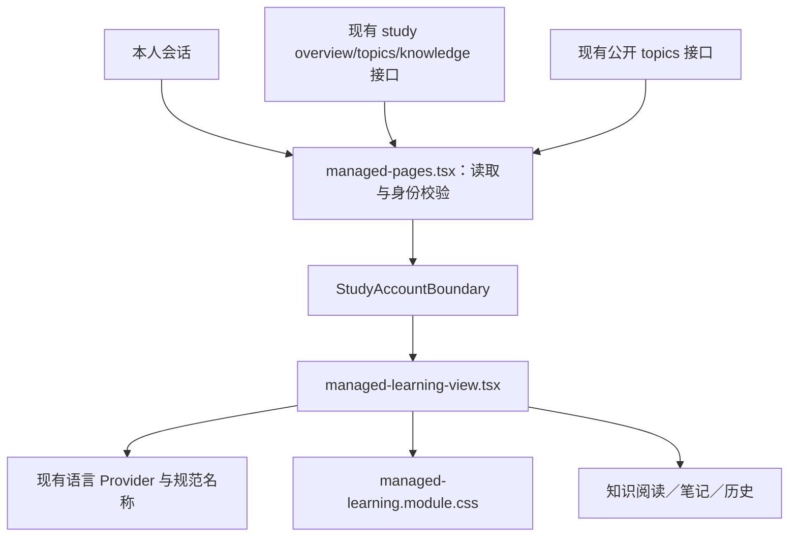

# 我的学习页面修正方案与执行记录

## 范围和问题

依据用户已确认的按主题管理学习、中英文切换要求，修正截图所示现有 `/learn`。原页面直接展示 `65-XX` 等分类编号，`0/4` 没有解释；主题、知识点都使用大卡片且缺少分区。搜索表单把学习状态标成发布状态；主题跳转丢弃搜索与状态，翻页丢失复习模式。

## 布局与文件

顶部呈现全库的未学习、学习中、已完成、复习中数量及完成进度；桌面下方左侧为紧凑主题导航，右侧为有标题、数量、筛选的知识列表。手机改为上下排列，主题导航可滚动。仅展示有公开知识的一级主题；知识条目显示标题、学习状态、一级主题名称、类型、难度及阅读入口。知识地图继续承担完整三级目录浏览。

- 修改 `frontend/src/features/study/managed-pages.tsx`：组合当前规范目录名称，保留身份边界；新增 `managed-learning-view.tsx` 和专用 CSS module。
- 修改两种语言消息及覆盖清单；新增页面单元测试，并扩展 `ui-language-managed.spec.ts`。
- 兼容性清单仅登记本次准确文件和散列；数据库、学习 API 和历史记录结构不变。

## 可行性与兼容性

当前一级主题共 63 个，加项目其他为 64 个；现有两个分页接口的 100 条容量能够覆盖。公共目录的名称包含已有中文和经过核实的回退名称，无须创建新词典或按分类编号猜译。非一级主题筛选仍通过现有单条主题接口读取名称。所有私有数据保持原来的会话身份校验和客户端账户边界。

主题链接、翻页、复习切换统一保留 `q/topicKey/state/mode`，切换主题重置分页；状态表单明确标注为学习状态。语言切换仅更新名称/文案，不改变草稿输入、筛选值或知识正文。进度包含已完成与复习中的知识，四种状态数量互斥，页面提供进度计算说明。仅阅读页面不产生学习记录。

## 执行与验证

1. 从最新 master 新建 `codex/my-learning-layout`（起点 `58c77ecf59a4fa0c3ea6a7cd8605a9790f77bbb8`）。
2. 先执行失败测试：主题名称与分区、切换语言、保留筛选和可恢复空状态；原实现四例失败，另一个身份保护例通过。
3. 实现布局并执行单元、类型、构建和实际浏览器桌面/手机回归，包括完成与复习后的进度自动更新。
4. 独立代码审查及兼容性审查；通过必需 CI 后通过 Git MR 合并。
5. 沿用现有部署工具上线并核验 HTTPS 和实际页面，保留已导入的 100 个知识点及学习、笔记、历史数据。

单次验证按既有预算执行，不超过 10 分钟。以上流程没有新的技术阻塞，也不需要新权限、数据迁移或重新导入。

## 本地完成证据

- 页面回归 14 例，含 7 例主题前缀、MSC 别名及大小写：先失败后通过；全量前端 117 文件、519 例通过。
- TypeScript 检查与生产构建通过；验证工具 87 例通过，当前精确兼容性门禁通过，12 个原数据库迁移未改变。
- 桌面 1280、手机 390：原管理知识学习场景 10 例通过；最终管理界面语言场景 6 例通过，含完成/复习进度、主题别名和输入保持。
- 独立审查发现主题前缀详情查找与选择框规范值不一致的 P2，已统一请求前归一化并补回归；最终审查无剩余 P1/P2。
- 本地证据保存在 `/private/tmp/math-master-my-learning-layout-20261010-dd57/`；截图的搜索框按测试统一隐私规则遮罩。
- 合并、CI 及生产部署结果须以实际执行结果另行核验；本段不表示已上线。
