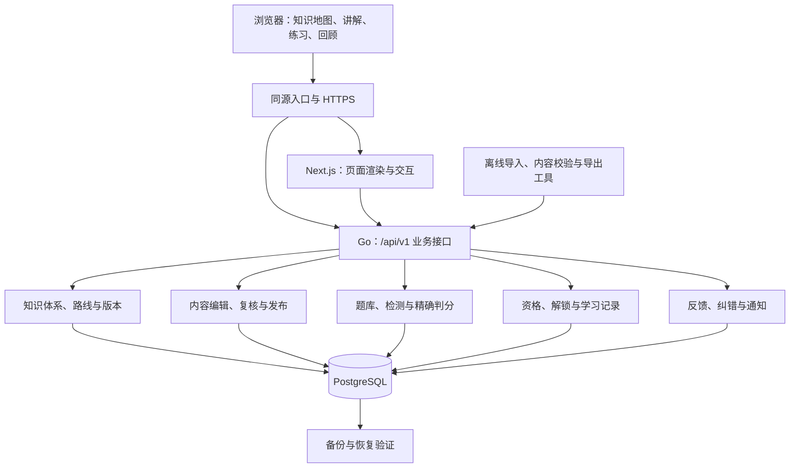

# 数学学习成长平台：总体方向与首版设计

日期：2026-09-30

阶段：会话方案已确认，已编写 [开发路线图](../plans/2026-09-30-development-roadmap.md)及 [P1 执行计划](../plans/2026-09-30-content-foundation.md)，P1 内容基础层已完成独立审查及回归，于 2026-10-01 通过 [PR #5](https://github.com/yyl1212/math_master/pull/5) 合并到 master；[P2 英文只读网站执行计划](../plans/2026-10-01-english-readonly-frontend.md)已按用户确认的计划实现五页面，本机回归通过，独立审查问题已修复，最新 CI 结果见 PR；账户、审核发布和学习记录尚未实现。

首个子项目：知识数据与可信内容底座，以及初等数学学习闭环。

## 1. 目标与设计原则

建设贯通零基础学习、基础巩固、高等数学进阶、研究与学术分享的数学学习成长平台。开发优先级为：内容正确性、内容覆盖与数量、丰富的学习路径、页面美观与学习兴趣。

服务六类学习目标：

1. 从零学习初级数学，开展数学思维训练。
2. 巩固已有初级知识。
3. 从扎实的初级基础进阶到高等数学。
4. 在已有高等数学基础上继续深造。
5. 进入具体研究方向，理解学术前沿。
6. 分享前沿知识、学习材料与研究经验。

这六类目标不是用户的固定等级。同一个人在不同数学板块可以处于不同阶段。掌握情况按知识点和板块展示，不设置“已经掌握全部数学”或“前沿完成百分比”。

已确认的方向：先建立贯通六类人群的知识地图，首批做扎实初等数学，再逐板块扩展；知识点可展示解锁与学习状态，并可点击回顾；完成前置学习并通过简短检测后解锁，已有基础者可通过诊断测评跳过前置节点。

## 2. 范围与分期

### 2.1 总体知识地图

知识地图以以下 16 个学习板块作为目录入口。这是方便学习的分组，不是另一套官方学科数量；板块之间允许交叉。入门、巩固、进阶、研究与贡献是学习目标和使用场景，不另列为学科板块。

| 序号 | 板块（英文页面名称 / 中文对照） | 主要范围 |
| --- | --- | --- |
| 1 | Foundations & Logic / 数学基础与逻辑 | 集合、命题、证明、数理逻辑 |
| 2 | Elementary Mathematics / 初等数学 | 算术、初等代数、函数、三角学 |
| 3 | Linear Algebra / 线性代数 | 矩阵、向量空间、线性映射 |
| 4 | Abstract Algebra / 抽象代数 | 群、环、域、表示论 |
| 5 | Number Theory / 数论 | 整除、素数、同余、代数数论、解析数论 |
| 6 | Mathematical Analysis / 数学分析 | 微积分、实分析、测度与积分 |
| 7 | Complex Analysis / 复分析 | 复变函数、多复变函数 |
| 8 | Functional Analysis / 泛函分析 | 赋范空间、算子、谱理论 |
| 9 | Geometry / 几何 | 欧氏几何、微分几何、代数几何 |
| 10 | Topology / 拓扑 | 点集拓扑、代数拓扑、微分拓扑 |
| 11 | Discrete Mathematics & Combinatorics / 离散数学与组合 | 计数、图论、组合设计 |
| 12 | Probability & Stochastic Processes / 概率与随机过程 | 随机变量、马尔可夫链、随机分析 |
| 13 | Statistics / 统计学 | 估计、检验、回归、贝叶斯方法 |
| 14 | Differential Equations & Dynamical Systems / 微分方程与动力系统 | 常微分方程、偏微分方程、混沌 |
| 15 | Numerical Computing & Optimization / 数值计算与优化 | 数值分析、科学计算、运筹学、最优控制 |
| 16 | Applied & Interdisciplinary Mathematics / 应用与交叉数学 | 数学物理、信息论、密码学、数学生物学、金融数学 |

页面采用“板块 → 学习路线 → 知识点”的导航层级：板块总览展示范围与建设状态；路线展示知识点及经过审核的前置关系；点击已学知识点进入回顾。相关板块链接用于探索，不自动成为解锁条件。学科分组、内容建设情况与用户学习状态分别记录。

面向学习者的页面以英文为主，包括导航、按钮、提示、讲解与状态名称；板块及关键数学术语保留中文对照。首版不增加语言切换功能。项目设计与开发文档使用中文。

研究方向标签参考 MSC2020。研究分类提供检索与组织信息；具体学习前置关系由平台维护，不能直接把分类树作为学习顺序。

路线引用知识点，不复制知识点内容。一个知识点可以被基础巩固、系统学习和进阶准备等不同路线复用。

当前 `design/` 中的 16 板块数据、10 节点分数路线、讲解及学习记录均用于设计预览，不属于已发布内容或首批验收数量。数据名称与页面层级可直接供后续实施计划参考；生产数据仍需遵循内容版本、来源和独立复核流程。

### 2.2 首版包含

- 账户注册、登录、退出，以及学习者、编辑者、复核者、管理员权限。
- 知识地图、板块与路线目录、知识点详情、按状态筛选与点击回顾。
- 经过审核的讲解、例题、原创配图、练习和解析。
- 选择题与精确数值题判分、节点检测、诊断测评、解锁、进度与掌握情况。
- 绑定内容版本的纠错与意见收集、处理状态及站内结果通知。
- 管理后台的内容编辑、批量导入、复核、发布、撤回与修订。
- 数据导入导出、备份、恢复验证、必要的审计与运行日志。

首批完整路线按“数的认识与表示 → 四则运算 → 分数与小数 → 比例与百分数”组织，并穿插估算、分类、比较、反例和问题分解训练。几何、初等代数、概率统计等板块在地图中标明建设情况，分别进入后续内容批次。

首批内容验收基线：至少 30 个已发布知识点、20 个已审核题型模板、300 个有效练习实例。每个首批路线知识点至少关联 10 个有效练习实例，其中至少 5 个可用于检测。模板数、原创固定题数、参数实例数分别统计，不把换数字后的实例数当成独立题型数。未通过审核的数据不计入发布数量。

### 2.3 后续子项目

1. 初等数学剩余板块与更多学习路线。
2. 高等数学基础与系统化证明训练。
3. 进阶专题、研究方向入口与文献导读。
4. 开放投稿、专业复核、学术分享与讨论。

首版不承诺自动判定开放式证明，不提供论文全文批量收集、社交信息流、付费体系、视频课程或在线 AI 对话。后续子项目分别完成设计、审查和实现计划，不并入首版实现任务。

## 3. 知识点与关系模型

知识点类型为概念、定义、公理、定理、推论、方法、数学思维。每个知识点包含稳定编号、所属板块、类型、标题、准确陈述、适用范围、学习目标、讲解、例子与反例、关联练习、来源与使用条件、版本及审核记录。

公理注明所属数学体系；定理与推论注明成立条件和证明；教学方法注明适用问题及容易误用的情况。讲解至少提供两种有助于理解的角度，例如直观解释与形式表达、数值例子与图形解释，不通过重复措辞凑数量。

关系分为：

| 关系 | 用途 | 约束 |
| --- | --- | --- |
| 学习前置 | 决定路线和解锁条件 | 首版采用全部前置满足；必须无环，发布时检查完整依赖图 |
| 证明或推导 | 展示结果的依据 | 记录引用的具体版本，不作为默认解锁条件 |
| 相关知识 | 支持联想、比较和跨板块回顾 | 可双向关联，不参与前置无环约束 |

首版不支持用任意布尔表达式配置前置条件。已有基础者通过诊断通路取得相应知识点资格，后续如需增加替代前置组合，单独评审其兼容性。

稳定编号与版本分开。修订创建新版本，不覆盖旧版本；学习、题目、测评和反馈记录能追溯到实际使用的版本。内容包及前置关系作为同一发布快照校验和激活，避免并发修改分别通过检查后形成循环依赖。

## 4. 解锁、学习与回顾

### 4.1 三个独立维度

| 维度 | 状态 | 说明 |
| --- | --- | --- |
| 内容建设 | 规划中、草稿、待复核、已发布、已撤回 | 表示平台是否已经提供有效内容 |
| 个人解锁 | 未解锁、已解锁 | 表示路线中的学习与检测资格 |
| 个人学习 | 未学、学习中、已学、待巩固、已掌握 | 根据学习动作、检测证据和复习结果派生 |

已发布内容允许浏览；个人解锁用于路线推进与普通节点检测，不作为收费或内容阅读权限。未解锁节点显示概要、用途和前置条件，也可进入已发布详情自行阅读。阅读不自动获得测评资格或掌握记录。规划中内容只展示方向与建设状态，不显示成个人“未解锁”。

“学习中”要求用户主动开始学习；“已学”要求用户明确完成该单元；“已掌握”表示达到当前节点检测标准或通过诊断，必须显示证据时间和版本。“待巩固”用于后续复习未通过，或内容纠错使原资格证据不足的情况。页面同时展示学习完成情况与检测结果，诊断通过不能伪造“已经读过讲解”的记录。

状态派生优先级为待巩固、已掌握、已学、学习中、未学；学习完成时间与检测结果分别保留。复习检测沿用节点检测规则，不在首版引入额外的自动遗忘预测。

### 4.2 解锁规则

- 无学习前置的已发布节点默认解锁。
- 普通通路要求所有前置知识点均满足“已完成学习且检测通过”；通过诊断获得的节点资格可替代这项要求。
- 首版每次节点检测使用 5 道已审核题，至少答对 4 道通过。测评覆盖该节点发布时定义的核心目标；创建前 30 分钟内已展示答案的实例，以及最近一次已提交检测的实例，不进入本次检测。
- 诊断不要求已解锁，但需要登录，使用同等通过标准和受控抽题。通过后记录该节点的诊断资格，解锁该节点，并重新计算其后继节点；不批量授予无关知识点资格。
- 失败反馈指向对应知识点和练习，允许重新学习、重试；同一组已公开答案的实例不立即重复作为检测题。
- 解锁计算和资格写入由 Go 后端完成。提交使用尝试编号和幂等约束，重复点击不会多次授予资格。

普通检测资格与选题在创建测评时检查。若没有足够的有效题目，返回明确的内容准备不足状态，不用低质量题补足，也不直接视为通过。

创建测评、提交判分与授予资格均检查所引用内容版本及资格证据的当前有效性；涉及撤回或修正时，在事务中进行一致性校验。已受影响且尚未完成重评的证据不能授予新资格或触发后继解锁。

已有解锁记录的节点允许学习和复测；新增后继节点的解锁只检查当前有效资格。选题优先使用未见实例，可在已批准模板范围内生成并校验新实例；不能组成有效测评时提示补题或可重试时间，保留既有学习记录。

### 4.3 修订与回顾

一经取得的解锁记录保留，内容修订不突然锁回已学节点。纠错可使掌握状态变为待巩固，并提示补测；后续尚未解锁节点只依据有效资格证据计算。历史资格事件与当下有效资格分别保存。

点击知识点可回顾当前有效讲解、例题、练习和个人记录。影响理解或判分的修订显示说明；旧版本保留审计链接和“已修订”标记，不继续当作有效练习来源。路线进度仅统计该路线已发布节点，分母随路线版本保存，不因新增规划方向把已有进度直接稀释。

## 5. 内容与题库质量

### 5.1 内容生产与发布

以原创内容和用途明确获准的资料为基础。每个外部来源记录地址、获取日期、作者或机构、版本、许可及署名要求；无法确认使用条件的材料不直接复制入库。AI 可以参与原创草稿和检查建议，但不能替代发布复核或提供最终判分依据。

知识点整理优先使用用户指定的空间目录 `math_master/Knowledge_JSON`；参考资料沿用 wiw 整理的 math_master 资料入口，父目录共享链接见 [资料来源清单](../../content/source-inventory.md)。先核对实际文件格式与字段，记录原文件摘要与路径；若为 ZIP，先检查包内目录并离线整理。将知识点及原始出处映射到 16 个板块和候选前置关系，保留条件差异和矛盾项，再编写原创英文讲解并复核。收藏记录和目录名称不代替项目 Schema 校验或内容发布审核；来源数据转换后才成为正式内容包。本地目录已读取，较早批次检查见资料报告；本次 P1 固定快照含 905 个文件、35 包。源目录仍持续更新，原字节按批次私有冻结，新增、修改、缺失分别核验后再编写正式内容。

配图优先使用可重现的 SVG、绘图代码或交互图形，记录坐标、单位、范围和知识点版本。图片与视频如后续加入，按项目要求自行制作。学习界面不展示实现内部信息。

发布流程：

作者与复核者在同一发布记录上必须为不同账户；审核事件保存操作者、时间和结论。初等数值题由精确计算校验与独立内容复核共同把关，概念、例子、反例、题意和解析仍需复核。缺少独立复核者时，内容可以保存为草稿，但不能上线。这是内容发布的运营条件。

### 5.2 数值判分与模板

选择题按选项稳定编号判分。数值题首版支持十进制整数、有限小数、分数和题面明确说明的百分数；用 Go `math/big.Rat` 归一化比较，避免先转换为浮点数。

答案格式和单位按题目版本固定。百分数输入明确显示 `%`，后端按该题约定转换为有理数；不能让用户猜测“50”代表 50 还是 50%。分母必须非零；输入长度上限为 128 个字符，拒绝未支持的表达式或代码。首版不执行用户提交的计算程序，不将字符串直接交给动态求值器。

每个题型模板声明参数范围、定义域、生成约束、独立答案校验规则及解析规则。发布前校验参数边界、除零、选项重复、答案存在性、题面与图形一致性，以及同义答案的判分。答案公式与校验规则不能只是同一实现重复调用。

实例保存模板版本、参数和可重现生成信息。检测题答案在提交前不返回浏览器；提交后展示经审核的解析。初期未启用的符号求解、证明判定和单位换算不能伪装为已支持能力。

模板的独立复核批准其明确的参数范围与题意、答案及解析规则。在此范围内生成、且结构检查和独立数学校验通过的实例继承模板审核记录；超出范围或校验失败的实例禁止出题。原创固定题逐题复核，不能用模板批准记录覆盖未经复核的自由生成题目。

### 5.3 纠错影响处理

反馈绑定知识点、题目或解析的具体版本，可说明错误位置与建议。处理状态为新建、处理中、等待补充、已解决、已关闭；关闭或解决必须附理由，提交者可以查看。

确认存在数学或判分错误后，先撤回问题版本，使其不再进入新练习；正在进行的测评如包含撤回题目，标为受影响，提供重新测评，不直接按旧答案发放资格。

撤回事务同步激活证据限制：所有包含问题版本、尚未完成重评的测评证据立即不能用于新的资格授予或后继解锁。可以通过版本限制标记和查询关联实现，不要求先遍历全部用户才生效；版本有效性检查与资格授予必须采用同一事务一致性约束。后台任务负责完整影响分析、重算、审计与通知，不承担首次阻断。此前已取得的解锁仍按第 4 节保留，其他有效测评证据不受影响。

已提交结果按以下固定规则处理：

- 答案或判分规则可确定修正、题意不变、5 道题仍有效且核心目标覆盖完整时，按原“5 题至少 4 题正确”标准重算；通过可恢复该次资格，未通过则取消该次有效资格。
- 题意或有效性改变时，该题成为无效证据。测评不足 5 道有效题或核心目标覆盖不足时，该次尝试不能作为资格依据，不缩减分母，不把其他题的正确率直接当作通过；提供新的一套 5 题测评。
- 同一知识点若还有其他不受影响的有效通过记录，继续依据这些记录判断资格；只有没有有效替代证据时才将该知识点掌握状态调整为待巩固。

全过程保留原始答案、旧结果、修订依据、重算记录，使用幂等修正任务，不能静默删除用户历史或简单扣减分数。

## 6. 技术架构与数据边界

采用 Next.js / React + TypeScript 前端、Go 模块化单体业务 API、PostgreSQL 数据库。保留 Next.js 服务端页面渲染；生产环境因此包含 Node.js 页面服务，Go 服务承担全部业务规则，不能在两端分别实现判分或解锁逻辑。

Go 模块按账户、知识、内容、题库、学习、反馈划分，模块通过明确的服务方法访问各自数据。首版使用同一数据库和发布事务，不拆成微服务。

数据库保存草稿、发布版本、审核和学习记录，是运行时正式内容的唯一来源。JSON 包用于种子、导入、导出及离线校验，不与后台同时维护另一套正式内容。导入按稳定编号和版本幂等执行，校验失败的包不部分激活。种子包在 Git 中审查；后台后续修订通过内容审核发布，不要求拥有 GitHub 写入凭证。

主要数据实体：知识点与版本、类型化关系、学习单元与版本、路线与发布快照、题型模板与版本、题目实例、测评与作答、资格事件与有效证据、学习记录、审核事件、反馈工单、修正任务、站内通知。题目实例、作答和反馈均指向固定版本，当前有效版本通过发布指针选择。

学习记录唯一约束为用户与知识点；测评尝试固定题目版本和通过标准；资格证据指向尝试。发布、判分与资格授予使用事务和幂等约束，避免并发提交或修正造成重复解锁。

有效资格是历史事件与当前有效证据共同派生的结果，不能只读取永久解锁标记或缓存中的旧通过结果。题目撤回与授予资格发生竞争时，事务必须按一致的版本状态决定是否授予，冲突重试或明确拒绝，不能在撤回生效后继续采用未重评证据。

首版使用 PostgreSQL 索引、递归查询及按需加载，不引入专用图数据库、搜索集群或消息中间件。地图按板块或当前路线加载，不一次向浏览器发送全量知识图；列表每页最多 100 条。纠错重算等后台任务采用数据库任务记录、有限并发、重试和失败状态。

业务入口为 `/api/v1`。错误统一返回稳定错误代码、可显示的英文消息和请求编号，与英文页面一致；不返回内部异常或凭据。匿名可以浏览已发布内容；学习记录、诊断、检测及反馈要求登录；内容编辑、复核和发布按角色授权。未发布内容只对相应管理角色开放。

## 7. 安全、维护与部署

- Go 服务负责会话和授权；前端仅展示业务状态。会话使用随机令牌和 HttpOnly Cookie，生产环境启用 Secure、SameSite 与写请求 CSRF 检查；SSR 请求只向受信任的 Go 服务转发必要的会话信息。
- 首版使用用户名与密码账户，不依赖短信、第三方登录或邮件供应商；密码使用 Argon2id 哈希和独立随机盐，参数随哈希保存。登录、注册及诊断设限流，管理权限不通过公开注册取得。
- 首位管理员由一次性初始化工具创建，不提供默认生产密码；编辑与复核权限由管理员明确授予。首版账户恢复采用人工核验后的管理员重置，不提供未经所有权核验的找回入口；重置后撤销原会话并留下审计记录。
- 数学内容使用受限 Markdown 与 LaTeX，禁用可执行内容与任意原始 HTML。公式渲染限制不受信任命令、宏展开和尺寸；SVG 与其他生成输出按白名单处理。错误页面不能原样拼接用户输入。
- 数据库参数化查询，限制输入、导入包和分页规模；CPU 密集校验在有限并发的任务中运行，避免阻塞学习请求。
- 日志记录请求编号、耗时、错误和审核事件，不记录密码、会话令牌或完整认证信息；学习数据只允许本人及履行职责的授权人员访问。
- 使用 Compose 编排同源入口、Next.js、Go 和 PostgreSQL。Go 调试、构建及测试使用 `CGO_ENABLED=0`；工具链及依赖在实现计划中选用受支持的稳定版本，并通过项目配置与锁文件固定。
- 服务器密码与数据库凭据使用被 Git 忽略的环境配置，不进入浏览器、镜像层、文档或日志。现有本机服务器配置保持私有。
- 上线前核验实际 Ubuntu 版本、CPU、内存、磁盘、网络、域名及 HTTPS 条件，完成恢复演练和真实负载测试。目前未测量服务器容量，不宣称已满足线上吞吐量或可用性目标。
- 上线后每日备份，发布或数据迁移前增加备份；保留最近 7 日每日副本及最近 4 周每周副本。备份执行结果、恢复演练和保存在服务器之外的副本需要验证；不能仅以同盘存在备份文件作为恢复保障。

## 8. 文件范围

P1 已新增 schemas、正式目录和未审核草稿、Go 服务/命令/验证器、PostgreSQL 迁移及只读 API、持续资料快照工具和 CI。操作说明记录启动、导入、恢复和测试。P2 已实现英文只读前端、安全数学阅读及真实 API 联调；账户、审核发布、学习记录和部署仍按 P3—P7 分阶段实施。

实现阶段的预计文件范围如下；实现计划再按交付单元列出具体文件和验证命令：

| 文件或目录 | 责任 |
| --- | --- |
| `schemas/catalogue.schema.json`、`schemas/content-package.schema.json` | 正式目录、知识点、学习单元与内容包约束 |
| `content/catalogue/`、`content/packages/`、`content/assets/`、`content/questions/` | 版本化目录、内容包、原创素材与题库；审核前仅为草稿 |
| `backend/go.mod`、`backend/cmd/server/`、`backend/internal/` | Go 服务、业务模块与数据访问 |
| `backend/cmd/content-check/`、`tools/content-validation/` | 结构、依赖及数学内容校验与导入导出工具 |
| `frontend/package.json`、`frontend/src/app/`、`frontend/src/components/` | Next.js 页面、管理后台与交互组件 |
| `db/migrations/` | 可追踪的数据结构变更 |
| `backend/internal/**/` 测试、`frontend/` 测试及 `tests/e2e/` | 有意义的判分、状态与浏览器回归验证 |
| `compose.yaml`、`.env.example`、`.github/workflows/` | 部署配置、无凭据环境模板与持续验证 |
| `docs/operations/` | 内容操作、纠错、部署、备份与恢复说明 |
| `docs/content/source-inventory.md` | wiw 收集的 Library 资料目录、原始出处、使用条件与知识点映射 |

具体阶段文件和验证步骤已列入执行计划。停止 Figma 同步不影响架构，前端以项目内英文预览和正式数据契约为实现依据。

## 9. 验收标准

1. 全层次目录存在，清楚区分已发布内容、建设中方向、解锁与学习状态；首批数据达到第 2 节基线，来源与版本可追溯。
2. 首批每个知识点有准确陈述、适用范围、学习目标、至少两种讲解角度、例子及配套练习；需要图形帮助理解的单元提供原创且经过核验的配图。
3. 根节点、全部前置满足、未满足前置、诊断通过、检测失败、重复提交和历史回顾均符合第 4 节规则；诊断不伪造阅读记录。
4. 整数、有限小数、分数及百分数按题目约定正确判分，覆盖同义数值、除零、负数、边界参数、单位提示与过长输入；浮点误差不能造成误判。
5. 缺失引用、循环前置、未审核内容、无效答案和不满足参数约束的题目不能发布；导入失败不留下部分启用的内容。
6. 用户能按知识点回顾、查看学习与检测证据；路线更新不无说明改变旧版本完成记录。
7. 反馈绑定版本并显示处理结果；撤回题不会进入新测评；撤回到异步重算完成的窗口内，受影响旧证据不能触发新资格或后继解锁；不足 5 道有效题不能按缩减分母视为通过；受影响作答、资格和通知能被幂等处理并保留审计记录。
8. 通过未登录、角色越权、答案提前泄露、恶意表达式、公式与 HTML 注入、批量导入和并发提交检查。
9. 在约定测试环境记录知识地图、题库查询、判分和后台校验的响应时间、资源使用与数据库查询计划；上线容量依据实际服务器负载测试决定，不使用未经测量的语言性能倍率作为结论。
10. 备份恢复能重建内容版本、用户学习记录和审核历史；部署前预检条件满足，秘密信息不进入提交、客户端或日志。

每次测试执行不超过 10 分钟；较长验证分成可独立重试的批次并汇总结果。开发前更新远程 `master` 并新建分支；遵循已审阅的方案和计划，开发后完成代码审查与回归，通过 Git 创建 PR（即 MR）。兼容性变化需要审核。

## 10. 可行性审查与处理

| 问题 | 设计处理 | 验证要求 |
| --- | --- | --- |
| 一次覆盖入门到前沿导致范围过大 | 首版提供总体方向地图，完整内容聚焦初等数学首批路线；其他板块分别立项 | 检查首版数据和页面是否误称高阶内容已完成 |
| 数据量增长掩盖内容错误 | 分别统计模板与实例，使用精确校验和独立复核，未审核不发布 | 校验器反例、发布权限与数据抽查 |
| 关系变更形成循环或冲突 | 发布快照整体校验并事务激活，类型化关系分开管理 | 故意循环、批次引用及并发发布验证 |
| 浏览、解锁和掌握混淆 | 分离三个维度，资格由后端依据版本化测评证据生成 | 地图与详情状态、诊断及重复提交验证 |
| 错误题导致进度失真 | 撤回时同步限制受影响证据，完整有效测评按原标准重算，无效题导致不足 5 题时重测；历史保留与补测通知 | 已完成、进行中测评及异步修正窗口的纠错回归 |
| 内容文件与数据库互相覆盖 | 数据库为唯一运行时来源，JSON 仅承担导入导出，按版本幂等 | 导入复跑、内容修订和导出恢复验证 |
| 自动计算被误认为完整数学证明 | 首版限定精确数值判分；条件、解析和证明独立复核 | 定义域、计算边界及不支持类型检查 |
| 页面服务和业务后端规则重复 | Next.js 负责页面，Go 负责判分、授权与解锁 | API 权限和前端端到端验证 |
| 未知服务器条件造成部署失败 | 将资源、网络、域名、HTTPS 与恢复演练设为上线前硬条件 | 部署预检和真实环境记录 |

功能与数据架构没有必须先引入第三方付费服务或专家社区才能开发的依赖；首批内容发布需要落实独立复核角色。服务器容量、域名与 HTTPS、站外备份位置是上线前条件，尚未在本次设计阶段验证，不将其视为已完成。

## 11. 设计依据

- [MSC2020 数学分类](https://mathscinet.ams.org/msc/msc2020.html)：研究方向标签参考，不等同于教学顺序。
- [Go FAQ](https://go.dev/doc/faq)：编译模型与 goroutine 并发机制；具体项目性能仍需测量。
- [Go math/big](https://pkg.go.dev/math/big#Rat)：首版精确有理数运算。
- [Go Argon2 包](https://pkg.go.dev/golang.org/x/crypto/argon2)：密码哈希方案依据。
- [TypeScript 类型擦除](https://www.typescriptlang.org/docs/handbook/2/basic-types.html#erased-types)：类型标注不增加运行时检查开销。
- [Next.js 服务端与客户端组件](https://nextjs.org/docs/app/getting-started/server-and-client-components)：页面渲染与交互分工。
- [PostgreSQL 递归查询与循环检测](https://www.postgresql.org/docs/current/queries-with.html#QUERIES-WITH-CYCLE)：前置关系查询和校验参考。
- [KaTeX 安全说明](https://katex.org/docs/security)：不受信任数学内容的渲染边界。
- [SymPy 等式与化简注意事项](https://docs.sympy.org/latest/explanation/gotchas.html)、[解析器说明](https://docs.sympy.org/latest/modules/parsing.html)：高阶符号校验的限制，首版不将这些解析器作为用户输入执行入口。
- [OpenStax 内容使用说明示例](https://openstax.org/books/contemporary-mathematics/pages/1-introduction)：外部学习资料需要逐项检查实际使用条件，不以“可免费阅读”推定可任意复用。

以上资料在本次方案讨论中通过官方页面核验。本文提出的平台规则、首批数量及技术组织方式是本项目的设计决定，不是上述资料的结论。
