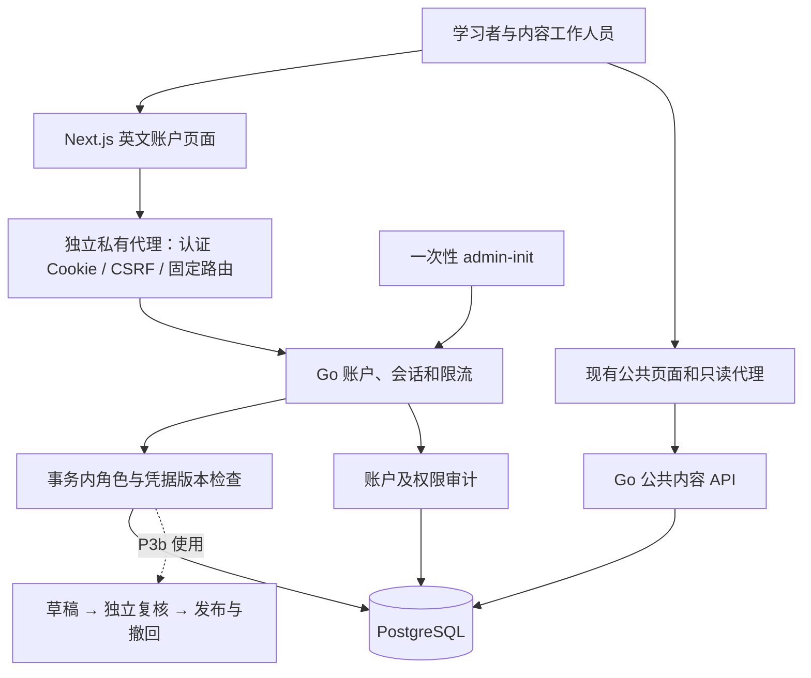

# P3a：账户与权限基础设计

日期：2026-10-01。状态：用户已于 2026-10-01 确认，通过 [PR #8](https://github.com/yyl1212/math_master/pull/8) 合并；[执行计划](../plans/2026-10-01-account-foundation.md)已确认通过 PR #9 合并；P3a 已实现，整分支验收与独立审查进行中，结果见 [验收记录](../../operations/2026-10-01-p3a-acceptance.md)。基线：master `52d4ffc`，P2 已通过 [PR #7](https://github.com/yyl1212/math_master/pull/7) 合并。

依据：[总体方案](2026-09-30-math-learning-platform-design.md)和[开发路线图](../plans/2026-09-30-development-roadmap.md)。用户优先级保持为内容正确性、数量与覆盖、学习路径、页面美观；文档使用中文，网站使用英文并保留中文数学术语。Knowledge_JSON 持续更新，但运行页面不直接读取资料目录。

## 1. 目标与拆分

P3 建立可以追责的内容生产流程，最终让作者提交、另一名复核者审阅、管理员按审核结果发布，匿名用户读取有效版本。先建立稳定账户和可撤销权限，再实现内容审核，避免把账户、草稿、发布三套新状态机混在一张实现计划中。

- **P3a（本方案）**：注册、登录、退出、修改密码、可撤销会话、四种角色、管理员初始化、授权与人工核验后的密码重置，交付真实英文账户页面及角色管理页面。
- **P3b（后续独立方案）**：草稿编写/导入、固定版本送审、独立复核、不可变发布快照、事务激活与基础撤回。依赖 P3a 的账户和事务内权限校验。

账户成功登录不生成学习完成、检测、解锁或掌握记录。P4 接入这些数据。公开数学内容保持当前状态，不为账户演示发布草稿。没有独立数学复核者时，P3b 可以完成技术联调，正式数学内容仍不能发布。

## 2. 方案选择

推荐沿用总体方案：Go 管理用户名/密码与 PostgreSQL 会话，Next.js 提供同源页面和严格的私有接口代理。撤销登录、改变角色和密码重置能够立即在数据库生效；与现有模块化单体、备份和事务边界一致。

备选一是签名令牌：客户端读取方便，但需要额外处理撤销清单、权限过时及密钥轮换，首版没有收益。备选二是第三方身份平台：可获得更多登录方式，但引入供应商、网络和账户恢复依赖，与已确认的无短信/邮箱供应商方案不符。

本次选择数据库会话，不增加第三方认证服务。角色是明确能力集合，管理员不会自动成为内容作者或数学复核者。

## 3. 架构与数据流

现有公共代理继续剥离 Cookie、Authorization 和用户认证信息。新增 `/api/v1/auth/*`、`/api/v1/admin/*` 的固定路由代理只向 `GO_API_INTERNAL_URL` 转发白名单字段；禁止任意上游、重定向、用户提供的转发链和跨源 CORS。服务端页面只向该固定 Go origin 转发选定会话 Cookie，不把内网地址或秘密写入浏览器数据。

认证、角色和密码变更以 PostgreSQL 为准，浏览器显示不构成授权。请求编号、统一英文错误及 no-store 行为沿用现有约定。

## 4. 账户与密码

- 用户 ID 使用随机 UUID；用户名允许 ASCII 字母、数字和下划线，长度 3—32，保存为小写且唯一。输入的前后空白不自动修正，避免两个入口采用不同规则。
- 密码为合法 UTF-8，15—128 个 Unicode 码点且最多 512 字节；允许空格和中文，不裁剪、不做 Unicode 归一化、不强制大小写/符号组合，不定期强制改密。界面支持密码管理器和粘贴；服务端为最终校验方。无 MFA 首版的长度选择依据 [OWASP Authentication](https://cheatsheetseries.owasp.org/cheatsheets/Authentication_Cheat_Sheet.html)。
- Argon2id 参数固定为版本 19、内存 19456 KiB、迭代 2、并行度 1、随机盐 16 字节、输出 32 字节，按 PHC 格式保存。使用常量时间比较。参数依据 [OWASP Password Storage](https://cheatsheetseries.owasp.org/cheatsheets/Password_Storage_Cheat_Sheet.html)及 [Go Argon2 包](https://pkg.go.dev/golang.org/x/crypto/argon2)。
- 每进程最多同时进行 4 次密码计算；没有空位立即返回 429，不创建无限等待队列。执行计划包含本机单次耗时/并发内存验证；生产资源实测属于 P7，不宣称已验证服务器容量。
- 未知用户名也执行相同参数的固定假哈希验证；用户名不存在、密码错误均返回相同 401 和 `INVALID_CREDENTIALS`，不返回数据库或哈希错误细节。
- PHC 解析仅接受受支持算法/版本、严格字段、16 字节盐、32 字节结果及受限参数。损坏或超出范围的数据库哈希不能触发任意内存分配。首版只写上述参数；后续增强参数须通过兼容性 PR。
- 注册只创建 `learner`，请求中出现角色、用户 ID、状态等额外字段返回 400。重复用户名返回 `USERNAME_UNAVAILABLE`；这是本地用户名产品选择，不伪称注册接口完全隐藏用户名占用情况。注册后进入登录页，不自动创建会话。

## 5. 会话、CSRF 与限流

### 5.1 会话

会话和匿名 Cookie 令牌都由 crypto/rand 生成 32 字节，编码为 base64url；数据库只保存令牌 SHA-256，不保存原始 Cookie 令牌。登录成功生成全新会话，消耗登录前上下文，不能沿用来访者提供的 Cookie。每用户最多 5 个有效会话，新增时在用户行锁内撤销最早创建的会话。

会话空闲期限 30 分钟，绝对期限 7 日；每次私有请求用数据库时间检查期限、撤销标记及 `credential_version`，最多每 60 秒更新一次活动时间。公共内容读取不维持会话活动。退出撤销当前会话，全部退出撤销所有会话；两者均为 POST。

生产 Cookie 名为 `__Host-mm_session` 和 `__Host-mm_preauth`，设置 Secure、HttpOnly、SameSite=Lax、Path=/，不设置 Domain。仅本机 HTTP 开发使用独立的 `mm_session_dev` / `mm_preauth_dev` 名称；生产不接受开发 Cookie。重复的期望 Cookie、错误长度或非法编码一律拒绝。此选择遵循 [OWASP Session Management](https://cheatsheetseries.owasp.org/cheatsheets/Session_Management_Cheat_Sheet.html)。

所有私有响应使用 `Cache-Control: private, no-store`；SSR 页面动态读取，会话和 CSRF 不进入公共缓存、URL、日志、测试报告或 localStorage。

### 5.2 登录前与登录后 CSRF

`GET /auth/context` 为浏览器提供账户状态和 CSRF 令牌。匿名上下文包含独立随机 Cookie 和同步令牌，10 分钟到期；有效上下文复用，成功注册/登录后消费。会话中的同步令牌与 Cookie 分开生成，数据库保存 CSRF 随机值供本次会话读取，不能用它代替会话身份。

浏览器获取 context 必须发送 `X-Requested-With: MathMaster`；存在 `Sec-Fetch-Site: cross-site` 或不匹配的 Origin 时拒绝，不开放 CORS。所有写请求，包括注册、登录、退出、改密、重新验证和角色操作，都要求准确匹配配置 origin 的 Origin 头及 `X-CSRF-Token`，使用常量时间比较，不以 SameSite 代替令牌检查。参考 [OWASP CSRF Prevention](https://cheatsheetseries.owasp.org/cheatsheets/Cross-Site_Request_Forgery_Prevention_Cheat_Sheet.html)。

context 对过期/撤销/未知认证 Cookie 先清除，再建立匿名上下文；Go 查询失败时只返回 503，不能清除有效登录或伪装为匿名。重复/畸形 Cookie 返回 400 并清除对应 Cookie，不把它当作有效会话。

SSR 使用无建 Cookie 副作用的 `GET /auth/session`，返回当前用户或 null；数据库不可用时返回 503，不能伪装为匿名。浏览器 context 与写请求经过私有代理，代理逐个传递允许的 Set-Cookie，不合并多个 Cookie。

### 5.3 有界限流

限流使用 PostgreSQL UTC 固定窗口与原子计数，跨服务重启有效，不依赖来自浏览器的 IP 或 X-Forwarded-For。经过 Next.js 时实际客户端 IP 尚无可信链，P7 如需 IP 限流，另行设计可信代理边界。

| 请求 | 共享窗口 | 附加限制 |
| --- | --- | --- |
| context 读取 | 全服务 600/分钟 | 新匿名上下文最多 120/分钟 |
| 登录 | 全服务 120/分钟 | 标准化用户名 10/分钟、前置上下文 10/分钟 |
| 注册 | 全服务 30/分钟 | 前置上下文 3/10 分钟 |
| 改密与重新验证 | 全服务 120/分钟 | 当前会话 10/分钟 |
| 管理写操作 | 全服务 60/分钟 | 当前管理员 10/分钟 |

多个限制必须都满足；请求前计数，成功也占额度。超限统一 429 与 Retry-After，不永久锁定账户。未知用户名也计入相同窗口。有效新键增长受全局额度限制；限流记录保留 24 小时，过期上下文/会话保留最多 24 小时用于排错，每分钟分批清理最多 2000 条，审计单独保留。清理失败不影响过期校验，记录错误并由运维处理。全局预算会让攻击影响其他用户，这是首版成本；P7 根据流量测量调整，不能绕过密码计算并发上限。

## 6. 角色、管理与并发规则

角色为 `learner`、`editor`、`reviewer`、`admin` 的集合，每个账户始终包含 learner。P3a 只提供账户和角色操作，editor/reviewer 的内容能力由 P3b 消费。

公开注册不能授予管理能力。admin 可以搜索账户、替换目标账户角色、在人工核验后重置密码；角色授予填写 10—1000 个码点的理由。授予 reviewer 时管理员需要核对人员身份及独立性并在理由中记录；系统只能证明不同账户，不能自动证明两个账户属于不同自然人。

管理写操作要求 5 分钟内重新输入当前密码验证。授权更新与密码重置在同一事务中重新检查操作者会话、角色和近期验证时间，再锁定涉及的用户行。角色变更或密码变更都增加目标 `credential_version` 并撤销全部旧会话；刚验证完又被改密的登录不能创建有效旧会话。

所有管理写操作使用统一事务锁，再按 UUID 排序锁定操作者/目标用户，然后处理会话，保持锁顺序；至少保留一名管理员。两个管理员同时尝试移除最后权限时，只允许一个合法结果，另一个返回 409 `LAST_ADMIN_REQUIRED`。P3a 不提供账户删除/停用，避免引入另一套账户生命周期。

人工重置必须填写所有权核验说明和处理理由，并由管理员输入符合密码规则的临时密码；不通过 API 响应返回密码。事务撤销旧会话、增加凭据版本并标记必须改密。重置后的登录只能读取账户状态、修改密码或退出，完成改密后重新登录才能使用管理能力。普通改密要求当前密码，完成后同样撤销全部会话。密码验证可在事务外计算，但创建会话或执行变更前必须在用户行锁内重读 credential_version 并匹配计算时的版本；不匹配时拒绝本次操作。前端不保存已提交密码。

首名管理员由一次性 `admin-init` 建立，读取隐藏的终端输入或显式 `--password-stdin`，不接受密码命令行参数、默认密码或公开 bootstrap 接口。一次性初始化状态和用户创建在统一事务锁内提交；并发运行只成功一次，失败不留下半个管理员，重复运行不能补建第二个管理员。之后通过正常管理页面授予其他账户权限。

审计保存操作者/目标 ID、动作、角色前后值、理由、时间和请求编号；登录失败事件仅保存规范化用户名摘要，不存请求体、密码、Cookie、会话令牌或 CSRF。首版不提供审计编辑/删除接口，触发器禁止修改已有事件；身份删除和保留期变更另行设计。

## 7. API 与页面边界

新 API 统一在现有 `/api/v1` 下，OpenAPI 新增 PrivateError 和账户数据组件，不扩大公共 Error 的既有语义。写请求严格 JSON、拒绝未知/重复字段，认证及管理请求体上限 8 KiB，管理读取响应上限 1 MiB，固定上游超时 5 秒。

| 方法与路径 | 用途/权限 |
| --- | --- |
| GET /auth/session | SSR 读取账户或 null，不返回 CSRF、不建立上下文 |
| GET /auth/context | 浏览器获取当前账户、CSRF 和必要的匿名 Cookie |
| POST /auth/register、/auth/login | 有效匿名上下文；已登录用户返回冲突，不悄悄替换身份 |
| POST /auth/logout、/auth/logout-all | 撤销当前/全部会话；登录态及 CSRF |
| POST /auth/password | 旧密码和新密码；允许必须改密会话 |
| POST /auth/reauth | 当前密码；记录 5 分钟的近期验证时间 |
| GET /admin/users?q=&limit=&offset= | admin，用户名按字面搜索；limit 1—100 默认 20，offset >=0，q 最多 128 字节 |
| PUT /admin/users/{uuid}/roles | admin、近期验证、CSRF；roles 必含 learner、去重、理由必填 |
| POST /admin/users/{uuid}/password-reset | admin、近期验证、CSRF、人工所有权核验说明 |

会话用户响应只含 id、username、roles、mustChangePassword；不含密码哈希、凭据版本、令牌或内部地址。角色列表固定顺序。私有错误仍为 `{error:{code,message,requestId}}`，消息英文，含 400/401/403/409/428/429/503；HTTP 状态和错误代码在执行计划及 OpenAPI 逐项锁定。428 表示管理操作需要重新验证，403 的 PASSWORD_CHANGE_REQUIRED 表示本账户须先改密。

新增 `/register`、`/login`、`/account`、`/admin/users`。登录后进入 account，注册后进入 login，退出后回到首页；本次不接受任意 returnTo 参数。account 显示真实身份、角色和密码/退出操作，不显示虚构学习数据。admin/users 包含搜索、分页、角色变更理由和重置说明。无权限用户看到英文拒绝提示，后端再次校验；页面隐藏按钮不能代替授权。

沿用 P2 原创视觉和系统字体，不添加外部图片。支持 1280/390 像素、Tab 操作、清晰标签、错误焦点和密码管理器 autocomplete；密码字段和错误不回显秘密。网站导航按真实会话显示 Sign in 或 Account，Go 故障显示暂时不可用。

## 8. 预计新增/修改文件

具体函数签名及每项测试见独立执行计划，计划待用户审阅；文档分支不添加产品代码。

| 文件/目录 | 责任 |
| --- | --- |
| db/migrations/00003_accounts.sql | users、roles、sessions、preauth、rate_limits、audit、一次性初始化状态，约束/索引/审计不可修改触发器 |
| backend/internal/auth/{model,password,session,policy,service,rate_limit}.go 及对应 _test.go | 密码、账户能力、会话、CSRF、有限资源与业务编排 |
| backend/internal/store/{accounts,sessions,roles,auth_rate_limit,auth_audit}.go 及对应 _test.go | 使用现有数据库连接，事务内权限复查、行锁及数据访问 |
| backend/internal/httpapi/{application,auth,admin,private_error}.go 及对应 _test.go | 注册固定私有路由、JSON/Origin/CSRF/Cookie 边界；保留现有 NewHandler 公共测试入口 |
| backend/internal/config/{config.go,config_test.go}、backend/cmd/server/main.go | 显式认证 origin/环境及服务组装 |
| backend/cmd/admin-init/main.go、backend/internal/cli/admin.go 及测试 | 受保护的一次性初始化和密码输入 |
| backend/go.mod、backend/go.sum | 精确锁定 x/crypto v0.57.0、x/term v0.46.0 及必要传递依赖 |
| api/openapi.yaml、frontend/src/lib/api/generated.d.ts | 新增账户契约并可复验生成类型，旧公共响应不改 |
| frontend/src/lib/auth/、frontend/src/lib/api/private-proxy.ts 及测试 | 私有响应校验、SSR 会话、固定路由/方法/头和 Cookie 白名单 |
| frontend/src/app/api/v1/auth/[...segments]/route.ts、admin/[...segments]/route.ts | 静态前缀匹配私有代理，现有公共 catch-all 白名单不扩大 |
| frontend/src/app/{register,login,account}/page.tsx、admin/users/page.tsx、frontend/src/features/auth/ | 真实英文账户与管理页面、表单和拒绝/故障状态 |
| frontend/src/components/site-header.tsx | 真实账户入口，不改变知识/学习数据 |
| backend/internal/e2etest/、tests/e2e/、.github/workflows/ | 随机隔离账户场景、权限/撤销/CSRF/真实浏览器验证，报告不泄露秘密 |
| .env.example、frontend/.env.example、docs/operations/account-foundation.md、README.md | 本机认证启用、初始化、重置和验证操作说明 |

新增表名固定为 auth_users、auth_user_roles、auth_sessions、auth_preauth、auth_rate_limits、auth_audit_events、auth_bootstrap。auth_user_roles 以用户 ID/角色为联合主键，会话与审计引用稳定用户 ID，凭据版本为正整数；密码哈希/CSRF/会话数据不进入内容导出。数据库只新增账户表；content、package、publication 表及内容包 schemaVersion=1 均不修改。账户与内容数据一起备份，P3b 的作者与复核者外键将指向稳定 user ID。

## 9. 可行性与兼容性审查

| 检查项 | 决定与成本 |
| --- | --- |
| 依赖与 Go 版本 | 已只读核验官方模块：x/crypto v0.57.0 与 x/term v0.46.0 均要求 Go 1.26.0，兼容当前 Go 1.27.1；其 x/sys v0.48.0、x/text v0.42.0 等传递依赖须由锁文件和整包回归审查。本次没有安装依赖。 |
| 既有本机配置 | 新增 APP_ENV（默认 development）与 AUTH_PUBLIC_ORIGIN。origin 缺省时保留 P2 只读启动，新认证接口返回明确 503 AUTH_NOT_CONFIGURED；production 必须配置 HTTPS origin，否则拒绝启动。development 的 HTTP 只允许 localhost/loopback origin 且 Go HTTP_ADDR 必须 loopback，Next 启动也绑定 loopback。 |
| origin 与代理 | origin 是单一 HTTP(S) origin，不含凭据/路径/查询/片段；严格检查，不从 Host/X-Forwarded-* 推导可信地址。公网入口/可信客户端 IP 在 P7 另审。 |
| 既有 API/页面 | 不改公共字段、匿名阅读与 404/no-store；私有路由单独实现。旧只读配置/测试仍可使用，无认证库时不回退虚构账户。 |
| 数据库迁移与回退 | 增量迁移不改既有内容，迁移前备份。带真实账户的回退只回滚应用、保留新增表；禁止直接 down 删除账户/审计。P3a 初始化不关联或发布数学草稿。 |
| 管理权限竞争 | 事务锁、确定行锁顺序、凭据版本与会话撤销一起检查；测试必须使用真实 PostgreSQL 同步屏障，不能以顺序请求冒充并发。 |
| 作者与复核者独立性 | 技术能阻止同一账户自审；自然人独立性由授予 reviewer 时人工核验，作为 P3b 正式发布的运营条件。 |
| 现有内容校验器 | ValidateAndSeal 对所有知识点追加 REVIEW_REQUIRED，表示 P1 草稿尚未人工审核；P3b 必须拆分机器完整性问题与独立复核证据，并从数据库素材字节验证，不能要求现有 ReviewItems 直接为零。该改造属于 P3b，不阻塞账户开发。 |
| 服务器和服务依赖 | 不依赖邮箱/短信/第三方身份服务，无新增付费资源。实际服务器容量、HTTPS、备份及公网试运行仍在 P7 验证。 |

审查结论：P3a 技术范围没有发现必须等待外部服务的阻塞项；详细计划已定义接口和测试，等待审阅。本方案不宣称账户实现、生产容量或数学复核已经完成。兼容性变化通过本方案文档 PR 审阅后才能进入开发。

## 10. 验收与执行约束

1. 正常注册只产生 learner；重复用户名、超长输入、Unicode 密码和未知字段处理一致，密码不进入 DB 明文、客户端响应或日志。
2. Cookie 固定、未知会话、重复 Cookie、空闲/绝对过期、全部退出、5 个会话上限、注册/登录身份切换均经回归。
3. 匿名与 learner 不能读取管理数据或更改角色，editor/reviewer 不因角色名获得 admin 权限；私有请求不能借公共代理转发认证信息。
4. 正常与恶意 Origin、缺失/错误/跨会话 CSRF、登录 CSRF、代理多 Cookie/重定向/畸形错误体、超时/限流均有失败测试；请求失败不能被展示成成功或匿名。
5. 两个并发初始化、最后管理员并发降权、改密与登录交错、角色撤销与管理写入交错均使用真实事务验证，失败整体回滚，审计与写入一致。
6. 人工重置撤销旧会话且强制改密，临时会话不能访问管理能力；近期验证超过 5 分钟被拒绝。
7. 真实 Go/PostgreSQL 与 Next.js 生产构建的桌面/手机浏览器验证完整注册、登录、退出、改密、角色授予/撤销和故障路径；沿用随机隔离数据库，测试账户和内容不能污染开发库。
8. Go 全程 CGO_ENABLED=0 GOTOOLCHAIN=go1.27.1；单次验证经 tools/verify/run.mjs 最多 540 秒。回归较长时拆批，不提高到 10 分钟以上。
9. 新实现从最新 master 新建 codex/ 分支。实现完成后进行独立代码审查、回归和 CI，通过 Git 创建 PR；不自行部署。

当前文档已自查范围、歧义、兼容性及状态一致性；P3a 与 P3b 分开计划，后续 P3b 的权限/审核/发布设计另行审阅。本次仅交付可审阅的方案。

## 11. 版本核验来源

- [Go x/crypto v0.57.0](https://pkg.go.dev/golang.org/x/crypto@v0.57.0)与[官方 go.mod](https://proxy.golang.org/golang.org/x/crypto/@v/v0.57.0.mod)。
- [Go x/term v0.46.0](https://pkg.go.dev/golang.org/x/term@v0.46.0)与[官方 go.mod](https://proxy.golang.org/golang.org/x/term/@v/v0.46.0.mod)。

核验日期为 2026-10-01；锁定已核验版本，不使用 @latest，也不宣称它们永远为最新版本。
