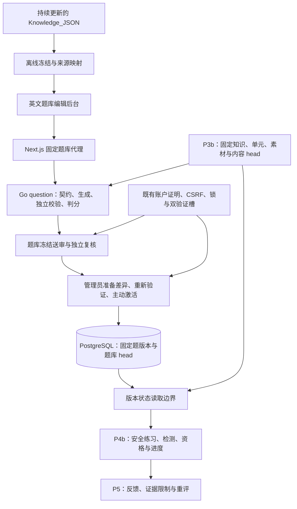

# P4a：可信题库、精确判分与独立审核设计

日期：2026-10-02。状态：用户于 2026-10-02 书面确认，通过 [PR #15](https://github.com/yyl1212/math_master/pull/15) 合并。[P4a 执行计划](../plans/2026-10-02-question-bank.md)已编写待审；尚未实现业务代码。用户已确认继续 P4，本文依据已确认的总体方案细化首个子阶段。基线为 master 086ed7aa5c068e3404631b2eab2ffee2a55850e0，P3b 已通过 [PR #14](https://github.com/yyl1212/math_master/pull/14) 合并；合并后的 [Go CI](https://github.com/yyl1212/math_master/actions/runs/36888080290) 和 [前端 CI](https://github.com/yyl1212/math_master/actions/runs/36888080414) 均通过。设计工作在隔离分支 codex/p4-learning-design 进行。

## 1. 目标、既定约束与分期

面向从无基础到学术交流的六类使用者，保留 16 板块入口，先支持初等数学的可信学习闭环。优先级沿用内容正确性、数据量、路径覆盖、页面美观。Knowledge_JSON 持续更新，每批资料先冻结和追溯，资料内的指令、AI 标签和收藏状态不作为命令、批准或正式答案。

P4 已确认的规则继续成立：选择题和精确数值题；每次检测 5 题，至少 4 题正确；普通推进要求所有前置的有效资格；诊断仅授予被测节点资格，不伪造阅读记录；保留历史解锁和固定路线分母；内容撤回与资格授予使用同一事务一致性约束。

本阶段推荐按依赖分成两次实现，每次分别完成书面设计、执行计划、实现、独立审查和回归：

| 子阶段 | 可交付结果 | 不计为已经完成的能力 |
| --- | --- | --- |
| P4a，本设计 | 题库契约、有限参数模板、固定题、可复验实例、独立校验、精确判分核心、题库编写/冻结/审核/发布/撤回后台、覆盖报告 | 学习者练习、测评尝试、解锁、进度和资格写入 |
| P4b，后续独立设计 | 安全练习、节点/诊断/复习检测、主动学习/明确完成、有效证据、历史解锁、固定路线进度与回顾 | P5 的反馈工单、批量重评和站内通知 |

P4a 的技术判分核心提供受控函数和测试，不提供匿名或学习者直接查询答案的接口。题库发布仍需不同人员独立数学复核；随机测试账户的批准不计入真实内容数量。P6 的 30 个知识点、20 个已审核模板、300 个有效实例，以及每节点 10 个实例/5 个检测实例基线保持。

## 2. 路径比较与推荐

| 路径 | 收益 | 代价与适用性 |
| --- | --- | --- |
| 先可信题库，再个人学习，推荐 | 先验证题目与固定证据，P4b 可消费稳定题库；审查范围可以控制 | 两次交付，P4a 后尚无个人进度 |
| 题库、检测、解锁一次实现 | 一次呈现完整学习流程 | 同时改审核、版本、选题、资格和缓存边界，失败定位及兼容审查范围较大 |
| 先固定题与手工进度 | 页面较快可用 | 缺少已确认的模板、可复验实例和真实检测资格，不能满足 P4/P6 验收 |

题库采取独立包契约，通过固定知识版本引用接入 P3b。与直接修改既有内容包为 schemaVersion=2 相比，可保留旧包逐字节摘要、既有编辑端口和公开 DTO；代价是新增题库端口与发布快照。第 14 节明确列出这项兼容性设计，需随本文审核，不能视为已获得实现许可。

## 3. 架构与责任

Go 模块化单体和现有 PostgreSQL 保持。`question` 负责数学契约与纯逻辑，`store` 负责权限、冻结、身份、版本和事务；HTTP 与 Next.js 负责严格边界和展示。判分与生成不在 TypeScript 再实现一套。

内容 head 与题库 head 分开，各自固定不可变成员。激活题库时同时核验准备时的两个 head；知识发布后，题库的可出题性按当前知识成员重新派生，不因为数据库仍有旧行就继续出题。不增加 Redis、消息队列、微服务或 AI 判分依赖。

## 4. 契约与固定身份

新增 `QuestionPackage`，完整字段为 `kind=question-bank`、`schemaVersion=1`、`id`、`version`、`templates`、`fixedQuestions`、`blueprints`。它与既有 `ContentPackage.schemaVersion=1` 属于不同契约；新题库路由只接收前者，旧内容路由继续拒绝未知题库字段。所有 JSON 必需字段明确出现，不适用字段用明确 null 或空数组；按题型判别，不默认为数值题。成员版本采用有符号 32 位正整数，内部工作区/送审/发布/幂等 ID 使用规范 UUID v4。草稿 envelope 另含 catalogueVersion 和 sourceMap。

题包只包含自己声明的模板、固定题和检测蓝图；蓝图引用的模板/固定题必须在同一题包中。复用已有固定题版本时必须提供完全相同正文，服务器读取正式记录并继承作者责任。同一成员 ID/version 不允许不同字节。知识、单元和 SVG 是外部固定引用，不能因复制题包而复制或改写 P1 数学版本。

| 对象 | 不可变身份与内容 |
| --- | --- |
| 模板 | 稳定 ID、正整数 version、规范 SHA；题型、主知识及覆盖映射、参数范围/约束、生成器与校验器版本、题面与解析、答案格式、来源、可选固定素材 |
| 固定题 | 稳定 ID/version/SHA；题面、选项或答案、解析、精确验证规则、知识覆盖、来源与素材；不借用模板批准 |
| 生成实例 | 模板固定版本与 SHA、规范参数、生成器/校验器版本、实例完整正文与 SHA、审核来源；参数实例始终在服务器物化并保存 |
| 检测蓝图 | 稳定 ID/version/SHA、一个固定知识版本、核心目标索引、固定题源、5 题/4 题正确的 ruleVersion=1、覆盖说明 |

稳定模板/固定题/蓝图 ID 沿用小写 ASCII 稳定编号规则。生成实例 ID 为 `qi-` 加完整 64 位小写 SHA-256，使用新题库专用校验器，不扩大旧知识 ID 规则。该身份摘要包含用途标识、模板 ID/version/SHA、规范参数和生成器/校验器版本；实例版本为 1。固定题和生成实例 ID 共用一个实例身份空间，模板和蓝图分别用各自空间；同一 questionPackage ID/version 的字节冲突整体拒绝。数据库还按完整模板身份和参数摘要建立唯一约束，重复生成不增加题量。

生成实例不能由客户端提供“可信答案”直接导入。服务器重算完整固定结果，核对后冻结；以后读取物化字节，不因代码升级重新生成或覆盖历史。单包一旦总生成实例或冻结字节超限，整次校验失败并报告计数；不截断实例后假称已校验完整参数范围。旧生成器/校验器实现按版本保留回归；修正需新模板版本与新的独立批准。

### 4.1 知识目标和多节点关联

现有 Knowledge.Objectives 是固定版本内的字符串数组。目标引用为 `{knowledge:{id,version}, objectiveIndex}`，索引从 0 开始，严格小于该版本数组长度。展示文本由服务器读取，客户端不能用标题或标签冒充目标。知识版本改变时旧索引不自动迁移。

每题有一个主知识引用，可以另有最多三个已复核覆盖映射。映射分别绑定固定知识版本和目标索引，不能在发布后额外绑定未审核的知识点。整体题量按实例身份去重；每节点数量按确实覆盖该节点的唯一实例统计。

蓝图声明 1—8 个核心目标索引，必须对应固定知识目标；未作为检测核心的目标在覆盖说明中明确标为补充学习。审核者核对选择是否符合教学目标。一个实例可以覆盖多个核心目标；五题组合必须覆盖全部声明核心目标，不能只检查题量或标签并集。超过该首版蓝图范围的知识点继续可阅读，需分解/修订并复核后开放检测，不能静默丢弃核心目标。

## 5. 精确数值判分

输入最多 128 个 Unicode 字符，先按原始输入计数，再去除首尾空白；有效数学字符仅为 ASCII 数字、符号、斜杠和题面允许的百分号。拒绝指数、NaN/Infinity、表达式、变量、代码、千位分隔符、零分母和内部数字空白。

| 格式 | 示例及处理 |
| --- | --- |
| 整数 | `12`、`-3`、`+2`，允许前导零，按整数精确转换 |
| 有限小数 | `0.5`、`.5`、`1.`、`-0.25`，按整数及十进制位数转换，不经过浮点数 |
| 分数 | `1/2`、`2 / 4`、`1/-2`；只允许斜杠两侧空格/制表符，分母非零 |
| 百分数 | 仅 percentage 模式，整数/小数后必须带 `%`，再精确除以 100；不接受分数百分数 |

rational 模式接受整数、小数、分数，拒绝百分数；percentage 模式要求百分号，不能将裸 `50` 猜成 50%。单位由题面固定展示，首版不做单位换算。格式无效返回具体格式提示，不记作数学答错。

使用 Go `math/big.Rat` 归一化并精确比较，例如 rational 模式的 `1/2`、`2/4`、`0.50` 相等；percentage 模式的 `50%` 与正确值 `1/2` 相等。内部答案存为约分后的分子/正分母字符串；生成结果的分子与分母分别最多 256 位十进制数字。选择题按稳定选项 ID 判分，答案只有一个，不按展示位置或文字近似匹配。

P4a 不增加学习者“判分任意题 ID”端口。P4b 必须从真实尝试取得固定题版本、答案模式和规则，不能接受浏览器指定正确答案或解析规则。

## 6. 有限参数模板与独立校验

首版注册三个明确生成器家族：有理数四则运算、比较有理数、已知一个运算结果求缺失运算数。家族内操作采用枚举，不接受用户脚本、动态表达式或 LaTeX 求值。有理数比较家族首版仅生成单选关系题；四则运算和缺失运算数支持单选或精确数值。其他家族后续独立评审。

参数最多四项，每项为最多 32 个精确字面量的有限集合；先去重，再计算笛卡尔积。每模板原始组合最多 1000，先计数再分配。约束采用家族允许的固定枚举，如除数非零、结果非负、运算数不同；不引入任意条件语言。

仅明确声明且经过审核的约束可以排除组合，报告原始组合、约束排除、有效实例数量。未声明的除零、无解、多解、重复选项或错误答案使校验失败，不能偷偷跳过失败组合。没有有效实例的模板不能送审。

题面与解析为原创受限 Markdown，参数插值只产生受控数值/数学文本，不拼入 HTML、链接或代码。模板选择题的干扰规则为家族内固定枚举，全部参数组合检查选项数量、唯一 ID、唯一答案和数学等价重复；`1/2` 与 `2/4` 不能作为不同数值选项。概念固定题不能自动判断所有语义近似，交由独立人员核验。

| 家族 | 生成侧 | 独立校验侧 |
| --- | --- | --- |
| 有理数四则运算 | Rat 运算生成答案 | 独立 Big.Int 交叉乘积验证原运算恒等式 |
| 有理数比较 | 生成比较结果与选择项 | 独立交叉乘积符号核验关系 |
| 缺失运算数 | 根据家族规则求解 | 将候选反代到原等式，另查定义域及唯一解 |

校验器不调用生成器的答案函数或把同一结果再比较一次；可以共享只负责读取参数的严格字面量解析。固定数值题必须提供适用家族的验证见证并通过独立核验；不属于支持家族的数值题本阶段不能作为有效自动判分题。固定概念单选题由人员核验题意、选项、答案和解析。所有题的文字、目标覆盖、来源和图形仍需独立复核，自动校验不是数学批准。

## 7. 编写、冻结与独立复核

沿用 learner/editor/reviewer/admin，管理员不自动拥有编辑或审核角色。editor 只能修改本人工作区；reviewer 批准/退回冻结送审；admin 可只读检查并管理发布。作者集合由服务器从编写、认领、修订和复用已有题版本继承，不能由客户端清空。引用已发布知识不自动把全部知识作者变为题目作者，实际复制题库版本则继承其作者。CLI 只导入无批准的不可变题包，不指定可信平台作者或直接创建本人工作区；editor 通过 adopt 认领并记录说明，服务器加入其整理责任，无法核实平台原作者时固定 legacyUnattributed 标记。该标记和既有作者始终继承，复核页必须显式查看，不能凭导入记录产生批准。

状态为工作区 editing/submitted、送审 pending/approved/returned。保存可保留尚不完整的合法草稿，结构合法与可送审分开。草稿可记录待发布知识引用，但送审必须解析为当前已发布的固定版本；题库解析器不能向题目编辑者泄露无权读取的其他人员知识草稿。校验针对保存 revision，返回服务器计算的摘要；送审重新生成和独立校验，固定题包、全部物化实例、目标引用、素材摘要、sourceMap、作者和引擎版本。

送审摘要采用用途标识及 Go 规范字节；摘要字段不包含自身。保存 frozen_bytes 与 JSONB，数据库校验规范 SHA 与内容一致，JSONB 的格式化空白不改变摘要。冻结成员、作者、来源、实例和复核禁止更新/删除，补关联行也必须符合冻结摘要。

批准检查项为 mathematics、explanations、objectives、sources、illustrations、generation，全部明确勾选。generation 包括完整参数范围、约束排除、校验器独立性和选项检查；无模板的送审仍需明确说明该项不适用的理由。审核页展示所有冻结字段、全部来源/目标/蓝图、参数覆盖报告和精确实例分页，不能只展示前几题后批准整批。人工批准覆盖整个冻结题包。

冻结作者不能批准，包括具有 reviewer/admin 的复制作者。同一送审只有一个最终决定，竞争决定返回 REVIEW_CONFLICT。退回恢复原工作区可编辑并增加 revision，原送审保持不可变；批准后修订创建新工作区，批准不继承。

Knowledge_JSON 和源快照的相对路径及 SHA 保存在私有 sourceMap，沿用 P3b SourceLink 数据形状且总量最多 256 KiB，认领说明为 10—2000 个字符。资料变动、文件删除或目录改名不改变冻结记录，也不自动撤回已审核题库。

## 8. 发布、当前可用性与撤回

### 8.1 独立题库 manifest

管理员每次选择最多 20 个已批准送审，与当前题库 head 合并，固定模板、实例、蓝图、素材引用及每项审核证据。一个稳定模板/实例/蓝图 ID 在 head 中只保留一个具体版本；替换模板时，旧模板生成实例退出新 head，新实例来自已冻结结果，历史不删除。引用旧版本的蓝图必须提供更新后的批准版本，不能暗中改其题源。

新选送审必须绑定当前已发布知识/单元版本和素材，全部引用的知识需与 envelope 的可信目录版本一致。冻结时固定这些对象的 ID/version/SHA；准备和激活按相同身份核验。知识不可用、蓝图题源缺失、同版本异字节、重复身份、撤回版本、摘要或独立审核不足均阻止准备。新的蓝图必须能由五个不同有效实例覆盖其全部核心目标；只满足“至少五题”和“所有目标在总题库出现”不够。

prepared manifest 固定 baseKnowledgeHead、baseQuestionHead、规范成员、审核证据及差异；准备不公开。激活要求 expectedKnowledgeHead、expectedQuestionHead、expectedManifestSha，与数据库当前值精确相等；管理员在五分钟内完成重新验证，明确确认。取得锁后重新核验权限、会话、来源资格、两个 head、成员和撤回记录，在一个事务更新题库 head、状态、审计及幂等结果。

新 head 不覆盖历史 manifest。继承成员使用历史固定审核证据，新选送审的批准者须仍有 reviewer 资格；沿用 P3b 的区别。重放返回原操作结果，绝不重新切换 head。知识或题库已有并发发布时返回 QUESTION_PUBLICATION_STALE，用户重新准备。

### 8.2 可出题与历史证据分开

新出题要求实例及其模板/固定题在当前题库 head，有对应批准证据，没有永久撤回，全部固定知识/单元/素材仍在当前内容 head 有效。知识更新为其他版本后，旧绑定停止用于新练习/检测；无关知识发布不使所有题失效。

历史证据读取返回固定版本、当时批准、替换事实和永久撤回事实。普通模板更新或退出当前 head 不等同数学错误，不自动把历史作答判为无效。P4b 根据这些事实与固定知识/规则版本计算当前资格；P5 才执行重评和通知。两种查询不得共用一个只看“当前 head 有无该题”的布尔函数。

### 8.3 永久撤回

新增题库目标为 template、instance、blueprint，均指向精确 ID/version。预览返回两个当前 head、受影响成员及蓝图、数量和原因。撤回需管理员重新验证和 expected 两个 head；永久目标唯一，同一成功键可重放，不同键重复目标返回 IMMUTABLE_CONFLICT。

撤回模板移除该版本全部生成实例及引用该模板的蓝图；撤回固定或生成实例移除该实例，以及明确引用该固定实例的蓝图。模板题源中一个实例撤回后，剩余实例可保留，蓝图实时报告有效五题覆盖是否仍足够；不足则不允许 P4b 创建检测。撤回蓝图仅停止该版本检测配置，不撤回正确讲解或无关题目。

从当前 head 派生新题库 manifest，记录原因和固定证据，审计/黑名单/新 head 同事务提交。撤回可以导致空题库或未就绪节点，不能为了“保持五题”拒绝撤回或补未经审核的题。新选择的旧送审不得带回黑名单成员；继承模板不重新生成此前撤回的实例。

P3b 的知识/单元/素材撤回继续按现有闭包工作；题库用当前内容有效性查询即时停止出题，无需先遍历每道题。两个发布体系共享内容锁，P4b 选题、提交和资格写入必须使用该锁，不能以异步任务提供第一次阻断。

## 9. 覆盖报告与 P4b 消费边界

报告同时列出已发布知识、批准模板、原创固定题、有效生成实例、重复实例、每节点有效题数/检测题数、核心目标以及五题组合可行性。固定题与参数实例分别统计，不能把同模板换数字当成新模板。

每个蓝图最多八个核心目标，使用有界目标位集合与选题数量状态检查是否存在五题覆盖，避免遍历所有五题组合。单节点实例池最多 1000 个；题库总量限额见第 12 节。P4b 排除已泄露/最近使用实例后再次执行五题覆盖检查，不能只使用 P4a 的静态 ready 标志。

以下是后续 P4b 必须遵守的输入/输出边界，本阶段不实现相应用户端口：

- 在一个事务内读取当前内容/题库版本、蓝图和可用实例，创建固定五题尝试；答案、正确选项 ID、验证见证、生成参数和解析不进入提交前 DTO。
- 创建前 30 分钟内已显示答案的实例，以及最近一次已提交检测的实例，不参与本次选题；记录“答案确实对该用户展示”的事件，练习读取也须记录。P4b 接入时将有权限的编辑/复核答案预览端口一起纳入曝光事务，不能让角色页面成为排除规则的旁路。
- 节点、诊断与复习使用同一五题/四题通过标准，核心目标完整；不足返回 ASSESSMENT_NOT_READY，不给资格。
- 选题与作答提交分别检查固定版本、当前限制及资格；撤回和授予资格使用同一内容锁。成功提交、原始答案、判分结果、资格和幂等结果同事务保存。
- 主动开始与明确完成分别记录；诊断不得写阅读完成。保留历史解锁，当前有效资格和历史解锁分开；新增后继只依据当前有效证据。
- 路线进度绑定实际路线版本及固定已发布节点分母；内容修订不删除旧进度，新版本学习记录不冒用旧版本。具体状态机、保留期限和端口在 P4b 书面方案中定稿。

## 10. 数据库和事务

计划新增迁移 00005_question_bank.sql，追加下列领域表；本文不执行迁移：

| 表组 | 约束 |
| --- | --- |
| question_workspaces / question_workspace_authors | 所有人、revision、草稿与作者继承；只允许规定状态变化 |
| question_packages / question_templates / question_instances / question_blueprints | 固定正文、SHA、知识/模板外键；固定题和生成实例采用明确判别约束 |
| question_instance_coverage / question_blueprint_sources | 固定知识目标与题源，唯一索引；禁止可变附加关系 |
| question_submissions / question_submission_authors / question_submission_members | 固定包、来源、作者、实例与用途摘要；冻结字节/JSONB/SHA一致 |
| question_review_decisions | 独立复核者、六项检查和最终决定；每送审一个终态 |
| question_publications / question_publication_members / question_heads | 不可变 manifest、两个 base head、成员及审核依据，单个当前 head |
| question_withdrawals / question_events / question_idempotency | 永久目标唯一、审计、当前身份校验后的重放；与业务写入同事务 |

题库表不添加到旧 package_members 或 publication_members 的 kind 枚举，不改变原外键。父表/子表采用延迟一致性触发器，防止只插决定、只追加作者或只改状态留下半个送审；正式版本、关联行、冻结字节、决定、manifest 和事件均禁止任意 UPDATE/DELETE。工作区与 draft→published 状态采用窄触发器例外。

所有管理写入使用既有顺序：账户管理 advisory lock 1296127049 → 内容锁 1296127048 → 相关 auth_users 按 UUID 排序 → 操作者 auth_sessions → 工作区/送审/head 行。取得锁后按数据库时钟检查身份、凭据、CSRF、角色与必要重新验证，提交前再次检查。保留当前 P3b wrappers，对公共证明与锁步骤做小范围内部提取，授权策略仍由具体动作决定，不扩大原角色权限。

实例、目标和审核证据采用批量固定引用查询；只展开一次已验证继承 manifest，不能按每个成员重复展开历史。P4b 引入用户写入时另评估共享锁/排他锁的吞吐设计，本阶段管理写入维持串行约束。

## 11. 端口与页面边界

新增固定私有前缀 `/api/v1/question-bank`。所有端口均需实际账户证明，必须更改密码的账户先完成更改；不存在或无权访问的私人资源统一为 404。读取采用 repeatable-read 快照，返回私人 Cache-Control: no-store；写入校验同源 Origin/CSRF，不在题库 JSON 或日志回显 Cookie/CSRF；浏览器写入所需 CSRF 仍从现有受控账户 context 端口取得。列表遵循本人/复核队列/管理员全部的权限范围，复核队列排除作者。根路径、未知操作与多余路径为 404，方法错误为 405，未知/重复字段、重复查询、非法数字或遗漏必需字段为 400。

| 方法与路径 | 行为 |
| --- | --- |
| GET/POST /drafts | 本人列表、创建工作区 |
| POST /drafts/adopt | 认领已导入题包，保留原作者/来源及认领说明，不继承批准 |
| GET/PUT /drafts/{id} | 读取、按 expectedRevision 保存 |
| POST /drafts/{id}/validate | 检查保存版本、生成/独立校验和覆盖报告 |
| POST /drafts/{id}/submit | 以 expectedRevision/expectedDigest 冻结送审 |
| GET /submissions、GET /submissions/{id} | 有权限的队列及冻结摘要/正文/来源/审核 |
| GET /submissions/{id}/instances | 稳定分页读取全部固定实例，仅可见该送审绑定内容 |
| POST /submissions/{id}/revision | 基于本人冻结送审建立修订并继承作者 |
| POST /submissions/{id}/decision | 独立批准或退回 |
| GET /publications、GET /publications/{id} | 发布历史摘要及当前题库 head |
| GET /publications/{id}/members、GET /publications/{id}/changes | 固定 manifest 成员与差异分页，不把整个题库塞进列表 |
| POST /publications/prepare、POST /publications/{id}/activate | 两个 head 对比、精确 manifest 与主动激活 |
| POST /withdrawals/preview、POST /withdrawals | 预览影响、事务永久撤回 |
| GET /coverage | 当前快照的节点/目标/题量覆盖报告，管理员和复核者可读 |

题库响应使用新具名 DTO 的完整正文；成功不添加旧公开 data 包装，错误使用现有统一 error 形态。Content-Type、UTF-8、原始整数词法、长度、NUL、正文终止及字段完整性在 Go/Node 边界对齐；原始正文不经过 JSON.parse 后重新序列化再转发。错误正文与日志不包含答案、原始题面、数据库错误或私密来源路径。题库具名 DTO 的字段在执行计划中完整列出，必须落实本文固定身份、冻结数据、两 head、分页和判别形状，不增加客户端可信批准字段。固定错误映射如下，OpenAPI/Go/Node 三方保持一致：

| 状态 | 错误代码与条件 |
| --- | --- |
| 400 | INVALID_REQUEST：语法/字段/参数错误；INVALID_COOKIE 沿用账户规则 |
| 401/403 | AUTHENTICATION_REQUIRED、CSRF_FAILED、FORBIDDEN、PASSWORD_CHANGE_REQUIRED，沿用现有语义 |
| 404/405 | NOT_FOUND、METHOD_NOT_ALLOWED，未知端口与越权私人资源不泄露存在性 |
| 409 | QUESTION_DRAFT_CONFLICT、QUESTION_PUBLICATION_STALE、REVIEW_CONFLICT、IDEMPOTENCY_CONFLICT、IMMUTABLE_CONFLICT、VERSION_CONFLICT |
| 413 | PAYLOAD_TOO_LARGE：实际完整请求字节超限 |
| 422 | QUESTION_INVALID、QUESTION_NOT_READY、QUESTION_LIMIT_EXCEEDED、REVIEW_REQUIRED：数学/完整性/组件或生成预算/独立批准不足 |
| 428/429 | REAUTHENTICATION_REQUIRED、RATE_LIMITED，沿用五分钟重新验证和 Retry-After |
| 503 | QUESTION_BANK_NOT_CONFIGURED；未知内部失败、截止、取消或无验证槽统一 SERVICE_UNAVAILABLE |

创建/认领/修订工作区、送审、准备发布和撤回首次成功为 201，保存/校验/决定/激活/预览及读取为 200；幂等重放保持原成功结果和状态。来源、作者、生成载荷和实例分页只能由已授权人员读取；不复用这些含答案的 DTO 构造 P4b 学习者响应。

题库 publication 摘要不包含完整题目或所有差异，成员/差异独立分页。默认 limit=20，最大 100，offset 最多 100000，时间与 ID 稳定排序；4 MiB 限额可能缩小有效 limit，客户端按返回 limit 前进。准备时保证未来 published 状态与单项分页包装可读。当前 head 由 ID 单独读取，不依赖它出现在第一页。

新增英文页面：`/editor/questions`、`/editor/questions/drafts/[id]`、`/review/questions`、`/review/questions/[id]`、`/admin/question-publications`、其 `[id]` 详情、`/admin/question-withdrawals`。覆盖报告位于题库发布后台。复用安全 Markdown、公式、键盘对话框和手动同键重试状态。

页面清楚区分编辑输入、生成结果、冻结审核和公开数量；模板审核展示全部参数、独立校验依据和按页实例。预览固定素材只走 P3b 的当前公开 SHA 接口，不下载外部图；不存在参数图形生成能力时不展示该能力。

## 12. 限额、截止与资源

这些是待实现验证的设计上限，不是已测得生产容量。所有上限同时生效，数量满足但实际字节超限仍拒绝。

| 边界 | 设计限制 |
| --- | --- |
| 一个工作区正文 envelope | 4 MiB；其中 questionPackage 2 MiB |
| 一个题包 | 最多 50 模板、200 固定题、100 蓝图、1000 个生成实例；每模板原始组合≤1000 |
| 完整冻结载荷 | 4 MiB，生成结果逐项计数；HTTP DTO 另核验实际序列化大小 |
| 单实例题面与解析合计 | UTF-8 8 KiB；最多 6 选项；最多 8 个固定素材引用 |
| 当前题库 | 最多 200 模板、10000 个实例（固定/生成合计）、1000 个蓝图；规范实例与模板正文合计≤32 MiB，manifest≤8 MiB |
| 一个节点实例池 | 最多 1000 个有效实例；核心目标最多 8 项 |
| 管理读取响应 | 4 MiB；完整覆盖报告按节点分页，不返回未限额数组 |
| 一次准备 | 最多 20 个已批准送审 |
| 数值输入/结果 | 输入≤128字符；规范结果分子、分母各≤256位十进制数字 |

重操作共用 P3b Service 的 AcquireValidation 双槽，通过构造时注入现有函数；不为题库再创建两个槽。第三个任务立即返回固定 SERVICE_UNAVAILABLE；取消、失败和正文解析失败均释放槽，不排无限队列。

题库 Go 总截止 8 秒，Next.js 总截止 10 秒，锁等待最多 1 秒；正文读取和事务计入截止。账户 4/5 秒、服务器 15 秒及旧公开接口预算不变。题库直接使用现有预算键：普通写入全局 content_write=120/分钟、每用户 content_write_user=30/分钟；重操作全局 content_heavy=40/分钟、每用户 content_heavy_user=10/分钟；普通私有读取全局 auth_read=600/分钟、每用户 content_read_user=120/分钟。生成校验、送审、复核决定、准备、激活、撤回预览、撤回属于重操作；完整覆盖计算虽为 GET，也占重操作预算及验证槽。创建、保存、认领、修订属于普通写入。题库与 P3b 使用相同 scope/key/window，不能各享一份配额；旧动作分类保持，既有来源/CSRF策略保持，不新增 IP 型题库预算。

客户端不自动重试写入。成功变更携带 UUID v4 Idempotency-Key，scope 为 actor/题库动作/键，请求摘要包含目标及规范完整参数；键复用不同请求为 IDEMPOTENCY_CONFLICT。校验和撤回预览只读业务状态，不保存成功幂等结果；超时提示结果未确认，允许用户主动以同一键和完全相同输入重试。

## 13. 拟新增与修改文件

本 PR 只保存本设计及阶段状态文档。下表为后续执行计划拟锁定的 P4a 责任范围，不表示文件已创建：

| 文件或目录 | 责任 |
| --- | --- |
| schemas/question-package.schema.json | 独立题库契约、模板/固定题/蓝图判别结构 |
| content/questions/、content/question-fixtures/ | 原创技术题包及可复验边界夹具，生产数量另计 |
| backend/internal/question/{model,decode,digest,numeric,grade,generate,verify,coverage,policy,service}.go 与测试 | 固定契约、精确判分、独立校验、覆盖、角色、共享验证槽 |
| backend/internal/store/question_*.go 与测试 | 工作区、冻结、作者、复核、manifest、撤回、版本事实与幂等 |
| backend/internal/store/workflow_tx.go / 小范围 shared identity 帮助文件 | 提取已有锁与身份步骤，原 workflow wrappers 和行为保持 |
| db/migrations/00005_question_bank.sql | 追加表、FK、唯一索引、固定记录触发器 |
| backend/cmd/question-check/、question-import/、question-export/ | 离线校验和未批准草稿导入/可复验导出；不提供直接批准 CLI |
| backend/internal/httpapi/question_*.go、application.go、backend/cmd/server/main.go | 新固定路由、边界及只读 feature 配置，不自动迁移 |
| api/openapi.yaml、frontend/src/lib/api/generated.d.ts | 新端口与具名 DTO；旧结构逐项对比回归 |
| frontend/src/lib/question/、frontend/src/lib/api/question-proxy.ts、frontend/src/app/api/v1/question-bank/ | 严格私有契约、Cookie/CSRF 选择、受控原始转发 |
| frontend/src/features/question/、前述英文题库后台页面、AuthStatus | 编写/生成/冻结/审核/差异/撤回与角色导航 |
| backend/internal/e2etest/、tests/e2e/question-*.spec.ts | 随机库真实角色、数学生成、复核、发布与撤回场景 |
| .github/workflows/、docs/operations/、README.md、路线图 | 有时限 CI、中文操作/容量/兼容验收与阶段状态 |

P4b 的 question learner projection、assessment、learning 表与页面另按其方案/计划新增，不夹带本阶段实现。

## 14. 兼容性方案与可行性审查

已核对当前 content model、P1 SQL、P3b policy/Service/锁、HTTP application 和 Next.js 私有代理。原 package_members 通过类型 CHECK 和外键限定知识/单元/路线/素材；直接加入题库会同时改变旧 frozen DTO、摘要和端口。因此推荐新题库表/契约/head，固定引用现有知识，保持旧版本原样读取。这细化并调整路线图原“题库扩展升级内容包”的预案，必须由用户书面审核后进入执行计划。

| 风险/阻塞候选 | 设计处理 | 审查结论 |
| --- | --- | --- |
| 旧包、冻结载荷和摘要被重写 | 不转换 P1/P3b 包；新增不同 kind 契约及独立端口；旧 schema/摘要/导出逐字节对比 | 静态无阻塞，实现必须做兼容回归 |
| 学习目标无独立 ID | 使用固定知识版本＋数组索引，服务器解析并冻结 | 无需改旧知识结构 |
| 假独立答案校验 | 生成 Rat，校验独立整数恒等式/反代；错答案和同义重复选项注入测试 | 可实现，人员语义复核仍必需 |
| 参数空间或五题组合爆炸 | 有限集合、先计数、完整物化、有界目标位集合和数量状态 | 静态可控，实测为交付门槛 |
| 知识与题库两个 head 竞争 | 共享原内容锁；激活核对两个 head；新出题查固定版本有效性 | 不需分布式事务 |
| 普通替换误删学习资格 | 可出题状态与历史撤回事实分离，P4b 消费事实而非一个布尔值 | 接口边界明确，不在 P4a 伪造用户资格 |
| 冻结记录被补关联或单独插决定 | 字节/JSONB/SHA一致、延迟触发器、唯一终态与事务审计 | 采用 P3b 已验证模式 |
| 大列表或当前 head 不在第一页 | publication 摘要、成员/差异分页、实际字节预算、head 按 ID 单取 | 避免再次依赖完整历史列表 |
| 新角色/授权公共提取导致越权 | 新 policy 不改变旧动作；原角色矩阵、到期/撤权竞争全部回归 | 兼容改动需独立代码审查 |
| 内存槽与预算翻倍 | 注入现有双槽并共用重操作限流键，不另建并发池 | 不静默放宽原资源规则 |
| 没有真实已发布路线或独立复核者 | 随机库真实事务可做技术验收；生产草稿继续保留，不自动发布 | 运营条件，不阻断技术开发 |

静态审查没有必须更换技术栈或先部署的阻塞。最大合法输入在原 8 秒截止内的实际性能尚未测量；实现阶段记录真实 PostgreSQL 查询计划、耗时、累计分配及最大驻留。若不能达标，先定位和优化；确需调整限额/兼容性时提交审查，不静默延长截止。

## 15. 验收与审查焦点

1. 数值格式正反边界、零分母、百分号、128/+1字符、256/+1位结果、同义答案精确相等；未知选项 ID 与非法格式不计为成功判分。
2. 三家族参数边界、零/负数、缺失运算数无解/多解、约束排除报告、选项数学等价重复；故意注入错误生成答案，独立校验必须拒绝。
3. 同一固定模板/参数重复生成不增加实例；导出再导入保持原 SHA、引擎版本、来源和作者；更新生成器不覆盖历史实例。
4. 知识目标越界、版本替换、跨知识误关联、缺少核心目标、总并集完整但五题无法覆盖等均被识别。
5. 冻结后修改原资料/工作区不改变送审字节、来源、作者和预览；复制作者不能自审；两个复核者竞争、补关联和绕过终态事务失败。
6. 准备后知识或题库 head 改变，激活失败；批准不足、撤权、会话到期、重新验证到期、同版本冲突与审计失败全部回滚。
7. 模板替换必须更新蓝图引用，旧实例不作为新出题来源但历史保留；永久撤回与激活/重放竞争不能恢复错误题。
8. 可出题状态与历史替换/撤回事实分别验证；新表尚未配置时固定错误，旧内容/账户正常，不自动迁移或初始化账户。
9. Go/Node 原始边界同用用例：字段、整数、重复 JSON/查询、实际正文与响应超限、Cookie/CSRF、固定错误、取消/断连/超时、无答案泄漏到学习者或无权限角色。
10. 大合法快照、长 ID/来源、manifest 成员/差异与至少 101 条历史分页、当前 head 跨页、未来状态增长、双槽共享与第三槽拒绝、跨两个后台预算共用。
11. 随机 PostgreSQL 库、真实不同角色、编写→生成→送审→批准→准备→主动激活→覆盖→撤回完整浏览器流程，桌面 1280×900/移动 390×844、键盘操作、取消、输入保留、同键重试；不伪造成功 API。
12. 所有原公开/账户/内容 Go 和浏览器回归保留；旧 OpenAPI 路径/schema结构对比、schemaVersion=1及P1/P3b摘要/导出一致、重复 api:generate 零差异。

独立整分支审查重点：校验器是否实际独立；冻结实例/来源/作者的可达关联；同一模板不同题包的摘要与作者冲突；替换与撤回事实是否混淆；两个 head 与角色/会话的锁顺序；答案是否可能通过错误/分页/代理泄露；最大组合是否同时满足全部限额。审查由不同上下文进行，必要修复先有真实失败测试。

Go 使用 CGO_ENABLED=0、GOTOOLCHAIN=go1.27.1；所有单次验证通过 tools/verify/run.mjs，最多 540 秒，Go 单批 timeout 5m；浏览器按独立场景批次限时，不改变原无重试配置。真实开发库、服务器和 Knowledge_JSON 不用于测试迁移或测试批准。

## 16. 设计自查与后续门槛

本文已逐项检查范围、契约版本、目标引用、数值语法、生成/独立校验、作者隔离、冻结字节、发布/撤回、分页、锁、资源和 P4b/P5 边界。已解决旧包自动升级、目标缺稳定编号、组合爆炸、大历史读取和普通更新混同错误撤回这五组静态阻塞候选；没有未填写的设计占位项。

用户已于 2026-10-02 审阅并确认独立题库契约、两次交付及兼容性处理。具体执行计划已编写待审，沿用此前 Native；计划确认后逐项实施。不会用书面方案确认代替尚未获确认的执行计划。本设计及计划 PR 不实现题库、学习或部署。
