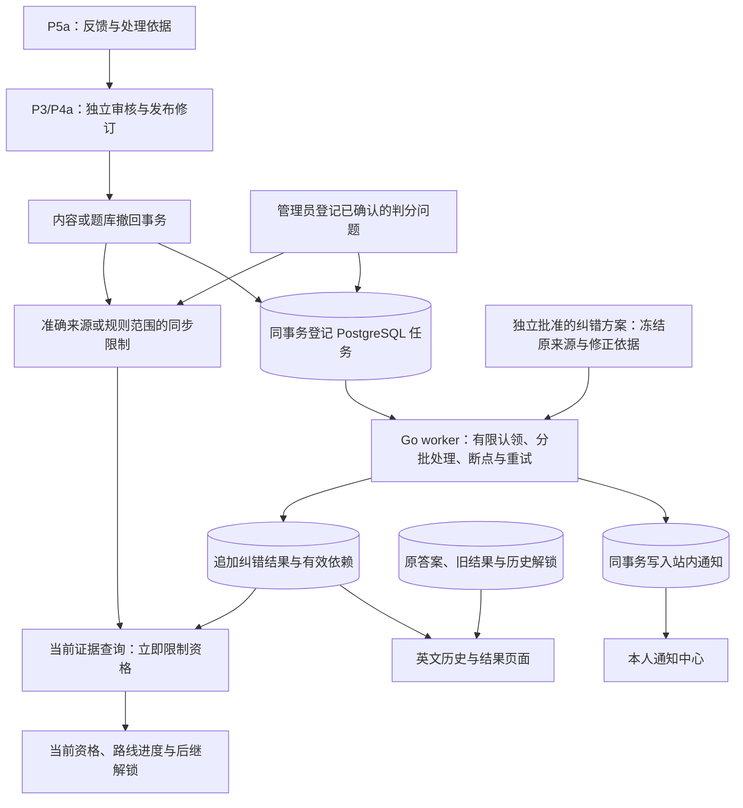

# P5b：纠错影响、独立重算与站内通知方案

日期：2026-10-03。状态：用户已书面确认本方案及第十一节兼容性变化；[16 项 / 80 步实施计划](../plans/2026-10-03-correction-impact.md)已确认，沿用Native从文档PR #22合并后的最新master `dad438d13b37d1053e3bf42e7c32e3829e4518a6` 实施。Task1—15已提交；Task16的一次独立审查及同一次必要修复已完成，修复后完整矩阵已通过：350前端/146双视口浏览器/44Node及全部Go/五项容量；SSH draft产品PR最新head四项CI仍待远端验收，不预记最终验收通过。

基线：[P5a PR #21](https://github.com/yyl1212/math_master/pull/21)已合并，master `0f2e11ab688300439c1d1ad7b6d908647be50187`。其产品完整 head `f46a9a07057ba6d100b2d83cd0ba5e12567430fb` 的四项 CI 全部通过。合并后 master 的[Go 检查](https://github.com/yyl1212/math_master/actions/runs/37092889861)与[前端检查](https://github.com/yyl1212/math_master/actions/runs/37092889897)均已通过，不用产品分支检查替代。

依据：[总体方案](2026-09-30-math-learning-platform-design.md)、[P4b 方案](2026-10-02-learning-assessment-design.md)、[P5a 方案](2026-10-03-feedback-workflow-design.md)。P5a 已交付版本化反馈、处理回执和来源保护；本阶段完成撤回之后的影响分析、可审计重算及站内通知。数学内容正确性、数据量和学习路径仍高于页面装饰优先级。

## 一、目标与边界

用户需要知道哪些学习证据受到错误内容影响、结果是否能够确定修正，以及下一步是继续学习、重新阅读还是重新检测。处理者需要可重跑的任务和明确的修正依据，不能靠编辑原分数掩盖错误。

验收目标：

1. 撤回或已确认判分问题登记后，受影响证据立即不能产生新的资格或后继解锁，后台是否运行不影响首次阻断。
2. 原答案、旧结果、原提交回执、资格事件和历史解锁保留。纠错结果追加保存，当前资格综合原有效证据与有效纠错证据判断。
3. 题意不变、五题全部有效、核心覆盖完整且答案或判分可确定修正时，继续按五题至少四题正确判断。有效题不足五题或覆盖改变时提供重测，不缩减分母。
4. 同一任务重跑、进程中断、并行 worker 或通知重复写入均不能重复授予资格、重复解锁或重复通知。
5. 英文界面让用户区分 Original result、Corrected result、Retake required 和 Review material；只展示本人的私有记录。

本轮不修改 Knowledge_JSON，不把技术夹具计入 P6 正式数学内容，不部署生产，不引入 AI 判分、新题型、判分容差、邮件或推送渠道。已明确的独立数学复核和 P7 上线门槛继续保留。

## 二、实现方式选择

| 方式 | 优点 | 成本与取舍 |
| --- | --- | --- |
| PostgreSQL 任务记录 + Go 应用内 worker，推荐 | 复用运行时唯一数据库；撤回、任务登记和处理结果具有明确事务边界；多实例可安全认领 | 必须实现租约、断点、重试及任务监测，并限制后台连接占用 |
| 撤回请求内遍历所有用户 | 小数据量下流程直观 | 用户数增长后无法维持现有八秒请求截止，不能作为首版方案 |
| 外部消息队列及独立任务服务 | 适合更大规模的独立扩容 | 增加组件和一致性维护，超出已确认的首版架构 |

选用推荐方式。生产常驻 worker 属于现有 Go 进程中的模块，保留已规划的同源入口、前端、Go、数据库四服务；另提供有限批次的维护 CLI，供受控补扫和测试使用。

## 三、架构与事务边界

已有 `content_withdrawals`、`question_withdrawals` 和 `learning_evidence_dependencies` 继续承担内容撤回的首次阻断。P5b 启用后，新增撤回事实与对应影响任务同事务写入；历史撤回和旧二进制运行期间留下的撤回通过有限批次、幂等补扫登记任务。

判分问题不伪造内容撤回。管理员登记规则范围时，在同事务中写入纠错案件的有效限制和任务；当前资格、检测提交、诊断、练习结果与后继授予必须统一读取该限制。首版仅支持已存在的规则版本 1，范围为准确知识版本或该规则版本全部尝试，并冻结数据库时间 cutoff，原范围包含 cutoff 前已封存的尝试。未经独立确认已部署并验证的修复依据，新的该范围练习判分/检测暂不开放；批准已注册的纠错判分算法后允许新尝试，原范围仍须逐项重判。旧进行中尝试不能通过晚提交移出原范围。不支持的规则版本保持限制并要求重测。

反馈 resolved 状态或 revision_published 链接都不自动批准纠错方案，不自行取消限制。未完成、失败或缺少审核依据的任务不会恢复资格。

## 四、纠错依据与独立审批

纠错案件指向真实撤回事件，或明确的判分规则版本及作用范围。编辑者或管理员提交纠错方案，复核者或管理员独立批准；方案创建者，以及涉及数学来源的作者不能自审。沿用当前账户、角色撤销、作者集合和事务末尾重新核验规则。

方案冻结案件、原来源、替代来源、对应发布及审核事实、五题规则版本、纠错判分算法版本、理由和摘要。送审后不能修改；需要调整时创建新的方案版本，旧批准记录和处理结果长期保留。自由文字说明不能代替机器可核验的来源。

题目修订允许实例 ID 改变。等价检查对比原题与已审核发布的替代题：知识点准确身份、题型、题面、选项 ID 与文本、答案输入格式、素材 SHA 及目标覆盖必须一致；只允许正确答案或解析依据修正。生成题还需固定参数与实际实例，不能只凭模板 ID 相同认定等价。机器条件通过后仍需独立数学复核，不能把文本相同当作数学证明。

判分重判可引用同一有效题目，使用既有精确数值或单选判分重新评价原答案，并保存独立纠错依据和算法版本；五题四题阈值保持规则版本 1。若需要改变输入解释、阈值或引入新算法，作为新的兼容性设计另审，本轮不静默改变规则。

知识点、讲解、素材、题意、核心目标或蓝图发生实质改变时默认要求重新阅读或重测。只有本节定义的题目等价修正及既有精确判分重判能够产生纠错通过证据；不自动把旧知识版本的资格迁移到新版本。

## 五、影响处理与当前资格

影响分析同时查询原学习依赖与纠错结果的有效依赖，覆盖完成学习事件、练习、已提交检测和诊断；固定路线受撤回影响时保留原成员与历史进度并通知对应用户，不直接改写数学成绩。进行中检测继续由 P4b 的实时来源检查限制，worker 不代替用户提交或创建新检测。

没有获批依据且不能确定是否必须重测时，影响结果为 awaiting_review，通知说明检查中，不能提前宣称已修正或必须重测。每次检测都使用原封存五个位置和原始答案。内部纠错绑定同时保存原实例和替代实例；用于判分的新身份不写回原作答。跳过题仍计错误，数值继续使用精确有理数。五题均有效且原核心覆盖保持时追加 corrected_passed 或 corrected_failed；否则追加 retake_required，并保留明确原因。

学习完成依据失效时追加 review_material 通知；不自动创建阅读完成记录。练习纠错仅修正解释与单题反馈，不产生检测资格。不存在错误影响的条目记为 checked_unaffected，不能伪称为已修正成绩。

纠错结果的当前有效依赖为未替换的原依赖加获批准的替代依赖。被明确替换的旧依赖继续保存在审计依据中，但不能把一次批准解释为忽略所有旧撤回。知识身份、普通资格所需完成记录、当前题意、覆盖和新增依赖再次撤回时，纠错证据立即失效；必须继续检查新的问题限制，不能缓存任务完成时的有效性。结果记录明确列出本次已核验处理的案件 ID，仅这些案件可以被其批准依据覆盖；其他匹配案件继续限制。再次修订时固定父纠错记录及其有效来源，累积准确依据仍从原答案重判。多个批准映射有冲突或前一依据无法核验时保持 awaiting_review 或重测，不能按最新时间任意覆盖。

每次资格读取及后继授予仍在现有内容共享锁和账户锁下完成，原有效通过证据与有效纠错通过证据统一判断。另一条有效通过证据可以继续提供资格；取消单次纠错资格不删除其他证据。历史解锁不回收，新解锁只在当前前置全部满足时追加，复用唯一性约束。现有数据库禁止把原失败检测插入为原通过资格，因此纠错资格事件追加在 correction_events，引用封存 correction_results；旧资格表及其守卫不变。后继解锁保留原 assessment 来源与原 attempt ID，准确纠错关联保存在新审计事件中。

原提交幂等回执保持原字节和历史含义；用户主动读取纠错接口查看最新记录。原结果页保留原结果及其当前限制状态，通过独立纠错区域显示新结果，不能把旧结果字段改写为重算值。

## 六、任务执行与恢复

任务类型为撤回影响、规则问题影响、已批准方案重算，以及原尝试终结后的重新检查。案件或方案版本、任务类型和准确证据 ID（根扫描任务无此 ID）构成唯一键。状态 queued → running → succeeded；临时错误进入 retry_wait，重复失败进入 failed。管理员可按原任务手动重新排队，不删除原错误历史。任务成功只表示规定范围已处理，不保证所有用户恢复资格。

worker 默认一个并发处理器，最多占用两条数据库连接。用数据库时钟、`FOR UPDATE SKIP LOCKED` 和递增认领令牌领取任务；租约 30 秒。认领先在短事务中提交，不能把认领锁持有到内容、账户及正文处理阶段。结果事务沿用内容锁、账户锁顺序，并在提交前核对令牌与租约，旧 worker 晚到不能写结果。

影响扫描使用稳定键序和每批最多 50 个条目，不把全量用户或正文装入内存。每条的结果、资格事件、通知、唯一键及断点推进同事务提交；失败不会推进该条断点。单事务截止八秒、锁等待一秒；批次共享 30 秒截止，每条事务使用八秒与批次剩余时间的较小值。及时续租并在剩余时间不足时停止领取新条目，未处理部分重新排队继续。进程退出取消处理，等待当前事务结束后再关闭数据库。

自动总尝试最多八次（一次初次执行加七次重试），七次退避依次为 5、10、20、40、80、160、300 秒；第八次失败进入 failed，仍保持证据限制。手动重试追加新的重试轮次，不清原错误或已完成断点。记录错误分类与请求关联标识，不在任务摘要或日志写用户答案、令牌和完整报告正文。

每分钟补扫历史内容/题库撤回及已生效的规则问题、批准方案，每轮最多登记 50 个缺失任务；以来源唯一键保证可重跑。启动后执行一轮补扫，维护 CLI 支持有限批次运行和清晰的退出结果。原尝试终结事务登记需要的证据重新检查；补扫还按准确唯一键检查已终结证据是否缺此任务，覆盖晚提交、旧二进制和已成功根任务之后的终结，不仅检查根任务存在。案件轮流分批扫描，不能依赖一次全局高水位跳过晚提交。重放成功撤回回执不伪造新任务事件，补扫负责检查缺口。

## 七、数据安排

新增 `00008_correction_notifications.sql`，旧 00001—00007 保持字节不变。十张新表的职责如下：

| 表 | 职责 |
| --- | --- |
| correction_cases | 固定案件、撤回来源或规则范围；规则案件生效事实作为同步限制 |
| correction_plans | 不可变方案版本、准确映射、来源摘要与当前审核状态 |
| correction_events | 案件、方案送审/独立审批、手动重试等追加审计事件 |
| correction_jobs | 唯一来源任务、状态、租约令牌、断点、重试与错误分类 |
| correction_results | 原证据、获批方案版本、独立重算值、处置原因与新依据摘要 |
| correction_dependencies | 纠错结果的审计依赖及当前有效依赖，区分作用 |
| correction_idempotency | 按账户、操作和 key 保存成功命令回执；纠错与通知操作使用各自摘要域 |
| correction_rate_limits | 成功写入的独立滑动窗口，重放不重复消费 |
| notifications | 本人、类型、准确关联记录、创建时间；来源唯一键防止重复通知 |
| notification_reads | 本人主动标记已读的首次回执，不改通知正文或任务结果 |

原学习依赖表增加必要的来源/摘要索引及规则尝试查询索引，均由新迁移管理，不修改旧迁移或原摘要算法。纠错方案、结果和有效依据分别使用新增摘要用途，原内容、模板、尝试封存及反馈摘要用途保持。

没有长期保存的私有浏览器草稿。案件状态不能由直接 SQL 修改跳过审核；已提交结果及原来源采用外键与不可变约束保护。通知不复制报告正文或题目答案。

## 八、接口与英文页面

新增写入统一限制 64 KiB 请求，响应上限 2 MiB。创建案件/方案每账户最多 20 次/小时，其他处理命令 120 次/小时，管理员手动重试 20 次/小时，通知标记已读 300 次/小时；采用独立作用域、数据库时钟的 (now-window,now] 成功滑动窗口，同键重放不重复消费，失败不扣额度。系统任务只受批次和连接预算控制，不借用人员身份或消费人员配额。

新增 `/api/v1/corrections` 管理案件、版本化方案、送审、独立决策、任务状态和受控手动重试；使用具名请求/响应与严格参数解析。普通用户只能读取本人证据的纠错列表及详情，不能进入处理队列或查看其他用户作答。具体路径和完整 DTO 在获批后的实施计划中逐项锁定，本方案锁定职责和权限。

新增 `/api/v1/notifications` 提供本人分页、未读统计和主动标记已读。每页默认 20、最多 50；游标只形成边界，账户 WHERE 始终先于分页。标记已读必须重新核验当前账户、CSRF，并保留原命令手动同键重试。

列表、任务摘要和通知只包含安全元数据、静态提示类型及本人结果入口。带题面、正确答案、解析或自由说明的纠错详情采用已有固定原实例/模板的进行中检测重合检查，并在交付前同事务记录答案曝光。需要检查原来源及实际替代来源，不能因实例 ID 改变绕过模板重合保护。宽范围规则说明无法绑定有限实例时，范围内任一未到期检测阻断正文读取；交付后记录范围曝光，并遵守原 30 分钟选题冷却，避免自由说明绕过答案保护。具体字段与负测由实施计划锁定。

英文页面新增 `/notifications`、纠错处理队列与独立审核页面；既有检测结果、学习历史和当前进度增加纠错摘要与回顾入口。通知中心可在页面内显示未读数量，首版不增加实时推送。单个受影响结果区分检查中、已修正、需要重测和资料需要重新阅读，失败时显示可重试状态，不显示虚构分数。

全部私有页面沿用 SSR actor 隔离、当前身份重验、手动 retry、十秒总截止和晚到响应失效规则；成功写入后刷新失败保留已确认的原 key，刷新元数据不清用户编辑。账户切换原子卸载旧私有子树。布局回归覆盖 1280×900 与 390×844。

## 九、新增及修改文件范围

本次设计 MR 只新增本方案、更新路线图；未来产品文件范围为：

| 文件或目录 | 改动目的 |
| --- | --- |
| backend/internal/correction/、backend/internal/notification/ | 新增领域契约、纯重判/等价检查、权限、服务与 worker 调度接口 |
| backend/internal/store/correction_*.go、notification_*.go | 准确来源、限制、任务、结果、通知及命令回执的事务实现 |
| backend/internal/store/workflow_withdrawal.go、question_withdrawal.go | 新撤回与任务登记同事务，保留原 API 回执 |
| backend/internal/store/learning_qualification.go、learning_read.go、learning_history.go、学习结果/授予实现 | 当前限制与纠错证据判断，原结果保留及新入口 |
| backend/cmd/server/main.go、backend/internal/config/、backend/cmd/correction-maintenance/ | 有限并发 runner、受控批次维护、退出和连接预算 |
| db/migrations/00008_correction_notifications.sql | 十张新表、约束、索引及安全回滚保护 |
| backend/internal/httpapi/correction_*.go、notification_*.go、api/openapi.yaml | 新接口、当前资格纠错关联与兼容性声明 |
| frontend/src/lib/correction/、notification/、api/及 api/generated.d.ts | 严格客户端、同源代理、生成契约 |
| frontend/src/features/correction/、notification/、相关 app 页面和学习展示 | 英文处理队列、独立审核、通知与结果入口 |
| backend/internal/e2etest/、tests/e2e/、tools/verify/、.github/workflows/ | 原共享夹具安全重置、新联调、原回归与保护检查 |
| docs/operations/correction-workflow.md 及验收记录 | 处理、恢复、限制、回退与可复验证据 |

不在文档阶段生成业务代码、更新依赖、导入正式资料、执行数据库迁移或连接生产服务器。

## 十、验证与设计可行性审查

| 已核对的现有实现 | 设计决定 |
| --- | --- |
| learningCleanEvidenceSQL 已即时关联永久撤回，learningTx 持有内容/账户锁 | 复用同步保护，新增规则案件和纠错有效依据统一加入相同事务判断 |
| 原 assessment Seal 保存五个位置、来源、目标覆盖和规则版本，原答案单独保存 | 使用原封存与原答案重判，不再选新题、不写回新实例身份 |
| 原 GradeFive 固定五题和四题阈值，数值精确判分独立于 store | 新纯纠错函数复用精确判分，原请求与原算法调用保持 |
| 题目实例 ID 可随生成修订变化，已有来源和独立发布事实 | 按实际题面、参数、覆盖与批准来源判断等价，不依赖 ID 相等 |
| 当前原资格与原结果接口分离 | 当前资格采用新证据，原提交与历史结果保留，新增明确纠错关联 |
| Go 当前连接池为十条且已有受控后台清理 | worker 限制至最多两条连接，退出等待事务；不用用户请求执行全量处理 |
| P5a 已复现并修复五种私有 UI 恢复问题 | 新页面直接列入同类负测，不能只做静态呈现 |

上述结论是基于本地源码的设计判断，不宣称后台性能、数学等价或生产负载已经验收。实现时必须验证：

- worker 未启动、任务失败或人工重试期间，原/新受影响证据均不能授予资格；撤回、审批、提交、后台与后继解锁并发仍一致。
- 五题 4/5 与 3/5 重判、原 skipped、题意/选项/格式/素材/覆盖改变、少于五题、知识版本变化均得到准确处置；只有有效的等价修正能恢复该次资格。
- 别的有效证据继续可用；历史答案、旧结果、原回执、历史解锁逐字节保持；新依据再次撤回即时限制。
- worker 崩溃、租约过期、两个 worker 争用、旧令牌晚到、部分批次失败、八次失败与管理员重试；结果、通知、资格及断点原子且无重复。
- 账户停用/角色撤销、作者自审、跨账户通知/结果、活跃检测答案重合、原/替代模板曝光、SSR 静默换账户、服务恢复、总截止后晚到响应。
- 缺失迁移、部分迁移、空表 Down、非空 Down 拒绝、任务补扫、晚提交补扫、多个案件/多次修订、规则 cutoff 与修复前后新尝试、旧二进制限制，以及旧完整测试矩阵保持。
- 容量至少覆盖 1000 个撤回/规则案件、1000 个批准方案、10000 个受影响证据、10000 条通知和 10000 条同源重跑；分批与分页证明连续不漏、不重复、不装入全量。

新增容量不代替原两项学习容量及反馈容量，原数量、共享/独占锁检查和所有旧浏览器批次均保留。Go 运行加 `CGO_ENABLED=0`，测试每批五分钟，浏览器每批八分钟，统一包装器九分钟；不扩大 CI 原截止来掩盖失败。完成后一次独立整分支审查、重要问题修复和完整回归，SSH MR 精确最新 head 的 Go/前端 push/PR 四个 workflow runs 及其全部 jobs 作为交付门槛；新增容量使用独立 job，原 job 的批次和 30 分钟截止保留。

## 十一、已获用户批准的兼容性变化

1. **当前资格的行为**：加入有效纠错通过证据及规则问题限制；普通资格仍要求当前有效完成记录，诊断不伪造阅读。原通过证据、其他有效证据、历史解锁继续保留。
2. **学习读取契约**：原结果和提交回执不重写；当前资格及学习展示需要新增可空纠错关联，以原 attempt ID 与 correction ID 区分原结果和最新依据。新增字段、严格解析器、SSR 与浏览器调用一并更新，不静默改变旧 score/outcome 的意义。
3. **新增撤回事务副作用**：P5b 启用后，同事务登记影响任务；未启用时保留原撤回及动态限制，后续补扫。曾启用却缺表或部分迁移时，相关写入和个人资格判断明确拒绝，不能退回忽略新限制的判断。
4. **新增迁移**：旧七个迁移及旧摘要用途保持，十张新表和索引由 00008 管理；只要有案件、任务、修正或通知事实即禁止 Down。启用标记跨回退保留，不能通过删除版本行绕过曾启用判断。
5. **二进制回退**：P5a 不认识新增规则限制和纠错依据，不能直接回退后继续开放个人学习、检测或资格功能。有 P5b 数据时保留数据库并修复/恢复 P5b 二进制；紧急使用旧版本须进入维护模式并关闭全部个人学习相关入口，P7 验证入口隔离和恢复，不把旧读取结果视为正确当前资格。
6. **后台及维护命令**：引入持久任务与应用内有限 worker；关闭 worker 不解除证据限制。配置、启动、关闭、诊断和日志有明确规则，不改生产部署或新增常驻服务。
7. **私有访问与曝光**：通知仅安全元数据；纠错自由文本/答案读取沿用权限及原、替代来源曝光规则。新增接口、独立成功配额与同键回执不能扩大旧角色或旧作用域。

## 十二、审批与下一步

用户已确认本方案及第十一节兼容性变化。[实施计划](../plans/2026-10-03-correction-impact.md)锁定 16 项 / 80 步、16 路径 / 19 操作、十表及启用标记、当前资格投影、批次命令、失败恢复和精确兼容白名单，完成可行性自审后供用户审阅。沿用 Native，不重复选择执行方式；计划确认后再从当时最新 master 新建产品分支，依次进行基线验证、逐项实现、一次独立整分支审查、回归及 SSH MR 交付。

## 独立审查后的必要补充

Task16一次整分支审查复现批准链无中间结果拒绝提交、纠错配图旧题源404，以及编辑者管理员入口导致草稿丢失；在同一次修复轮处理。[修复设计与兼容性审查](../../operations/2026-10-03-p5b-review-fixes.md)增加本人准确有效纠错结果绑定的私有SVG只读路径（共17路径/20操作），保留旧契约完整保护、原attempt撤回权限和双侧曝光。批准链由有界无环准确独立事实证明，不以worker时序作为可处理前提；无额外数学内容批准或生产迁移。
