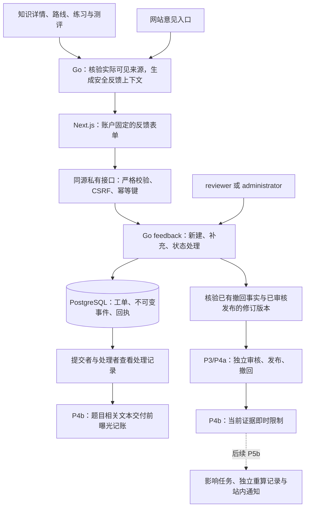
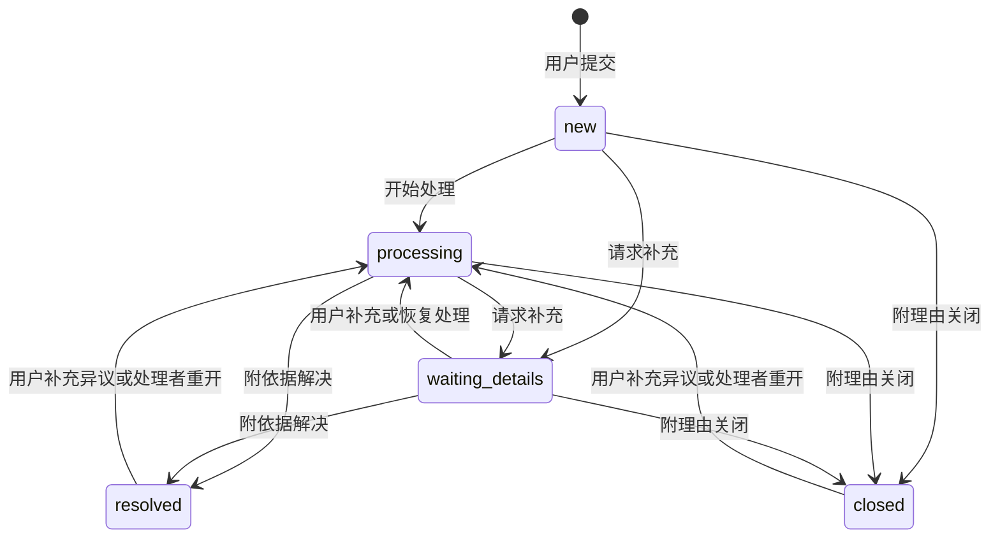

# P5a：版本化反馈与处理结果方案

日期：2026-10-03。状态：书面方案供用户审阅；本阶段交付设计文档，实施计划在书面方案及兼容性审查确认后制定。

依据：[总体方案](2026-09-30-math-learning-platform-design.md)、[开发路线](../plans/2026-09-30-development-roadmap.md)、[P4b 方案](2026-10-02-learning-assessment-design.md)。用户已确认继续 P5，优先保证内容正确性、反馈可追溯和快速迭代；英文界面保留中文数学术语，Go 负责权限和数据一致性。

## 1. 目标、分段与选择

P5 完成“发现问题 → 指向实际版本 → 独立处理 → 修订或撤回 → 重算影响 → 通知用户”。为使每段独立验收，先实施 P5a 反馈工单和处理回执，再为 P5b 纠错影响、重算任务和站内通知单独编写方案、计划并审查兼容性。

| 选择 | 收益 | 代价 |
| --- | --- | --- |
| **分两段交付，推荐** | 先交付真实反馈入口、处理状态和可查结果；复用现有审核、发布和即时撤回 | 重算和统一通知在 P5b 验收，反馈回执先在工单中查看 |
| 一次实现全部 P5 | 反馈、影响分析和通知一起可用 | 需要同时验证新任务运行机制、修正证据与 UI，单次审查范围过大 |
| 使用外部工单服务 | 可快速搭建管理界面 | 版本身份、权限、曝光及资格一致性需跨系统维护，增加外部服务依赖 |

P5a 的交付是用户可提交、补充、追踪问题，处理者可给出有依据的回复或结案结果。数学内容的实际修改继续经过 P3/P4a 独立审核与发布；确认错误时使用现有撤回入口，P4b 已提供同步证据限制。反馈状态本身不授予数学审批权或学习资格。

P5b 承接总体方案的完整规则：另存有审查依据的重算记录；答案或判分可以确定修正、题意不变、五题仍有效且核心覆盖完整时，按原 4/5 标准重算并据此判断资格；题意或有效性改变、少于五个有效题或覆盖改变时重测；保留原答案、旧结果、历史解锁和其他有效通过证据。P5a 不提前决定 P5b 的数据库任务、修正映射及资格读取契约。

## 2. 架构与数据流

沿用 Go 模块化单体、Next.js 和同一 PostgreSQL。feedback 纯业务模块依赖 auth/question 的基础类型；仓储层组织权限、来源校验、事件和曝光事务。反馈模块不反向调用未来 correction 模块，避免循环依赖。复用已有严格 JSON 读取、认证上下文、数据库时钟和内容锁，不新增第三方服务或运行时依赖。

## 3. 反馈对象与来源

### 3.1 数学反馈

数学反馈必须绑定准确身份，由 Go 根据用户实际可见的来源解析，前端不能指定其他用户的题目或任意私有版本。

| 入口 | 根目标 | 来源依据 | 可选错误位置 |
| --- | --- | --- | --- |
| 当前知识详情 | knowledge 的 ID/version/SHA | 当前 published 知识快照及其批准证据 | 与该版本关联的准确 unit 身份或 asset ID/SHA |
| 当前路线 | path 的 ID/version/SHA | 当前 published 知识快照及其批准证据 | 路线节点说明，使用文字位置 |
| 自己的练习 | instance 的 ID/version/SHA | 自己的 practice 记录及固定唯一 item | 题干、作答格式、解析或其准确素材 |
| 自己的测评题 | instance 的 ID/version/SHA | 自己的 assessment 记录、position 1—5 和固定 item | 题干、作答格式、解析或其准确素材 |

素材沿用现有无整数版本的 ID/SHA 身份，不捏造 version；讲解使用准确 ID/version/SHA。可选部位必须是根目标在该固定来源中的真实依赖。生成实例允许原 `qi-` 加 64 位摘要身份，沿用 `question.ValidInstanceID`。

上下文接口只返回准确目标、来源编号及安全标签，题目正确答案、解析、生成参数和审核私有正文不进入反馈 DTO。题目来源可以处于进行中；提交反馈只返回元数据回执，仍可完成或离开原测评。

创建时核验当前公开目标及 expected publication head；页面停留期间发布头变化返回明确冲突，保留输入，让用户刷新目标后主动提交。已成功创建的工单始终绑定原版本，后续撤回或发布不会迁移其目标。题目来源从本人固定记录核验，可引用当时实际出现的旧版本，不要求它仍是当前题库成员。

### 3.2 网站意见

通用入口允许 `site` 目标，area 为 home、knowledge_map、learning_center、account、review、other。网站意见记录发生时间和区域；它不是数学版本引用。math_error 和 unclear_explanation 必须选择数学目标，避免无版本的数学纠错。网站技术问题、无障碍问题和产品建议可以选择 site。

分类固定为 math_error、unclear_explanation、typo、accessibility、technical_issue、suggestion。首版每个工单只有一个根目标，关联其他问题通过处理者记录重复关系，不把任意多目标组合放进一次提交。

## 4. 状态与处理规则

状态保持总体方案的五种：new（新建）、processing（处理中）、waiting_details（等待补充）、resolved（已解决）、closed（已关闭）。

处理者可在原状态下追加回复。提交者在 new/processing 追加补充保持原状态；在 waiting_details/resolved/closed 补充非空说明时恢复 processing。所有状态处理均附非空回复，解决/关闭另附结构化 resolution；旧结案事件完整保留。

resolved 的 resolution kind：clarified（经解释澄清）、withdrawn（问题版本已撤回）、revision_published（已发布修订）、service_fixed（网站问题已修复，仅 site）。closed 的 kind：duplicate、not_reproducible、out_of_scope、suggestion_recorded。

withdrawn 必须引用数据库中真实、准确匹配所报告根目标或可选部位的撤回事件。revision_published 还需引用当前已独立审核并发布的替代内容；知识/路线保持稳定 ID，讲解保持对应知识，素材按实际新 SHA，题目按实际新实例及对应知识核验，不要求生成实例的新 ID 与旧 ID 相等。这些链接只说明处理结果，不能证明题意不变或用于恢复资格；等价修正和重算资格由 P5b 独立审查。

clarified 可用于数学内容经核查无需修改的情况，保留处理理由；它不产生内容批准记录。duplicate 需关联不同工单的同一准确目标、同一分类；提交者只看到重复处理说明，其他人的工单编号、文本和身份不进入其 DTO。

提交者不能处理自己提出的工单，即使兼具 reviewer/administrator 角色也需另一位处理者；实际内容修订继续遵守原作者不能自审的规则。反馈处理不会绕过现有发布/撤回权限或重新认证要求。

## 5. 权限、私有文本与曝光

- 匿名用户可看已发布内容，反馈提交与处理结果要求有效登录；提交者读取和补充自己的工单。reviewer/administrator 可查看处理队列、回复和变更状态；editor 身份单独不获得全体用户反馈权限。
- 每个新请求及同键重放均重新核验会话、当前角色和工单权限；事务提交前复查会话。其他用户的不存在/无权工单统一返回 NOT_FOUND。
- 列表和元数据详情只返回服务端生成的目标标签、分类、状态、序号及时间，不返回用户自填标题、位置、原文或回复预览。题目标题也可能包含答案，所有此类自由文本统一进入受保护的讨论接口。
- 讨论文本使用纯文本显示，保留换行；不执行原始 HTML、图片或链接内容。首版采用文字及已存在的素材引用，不增加上传入口。工单标题 1—120 个 Unicode 标量值，正文/回复 1—4000，位置 0—400；拒绝全空白、NUL、非法 UTF-8、孤立代理项及额外字段。
- 题目讨论的每次读取，在同一事务中按固定 item 解析准确 instance 和其原 template；若读者自己的 active assessment 与这些身份重合，返回 FEEDBACK_ANSWER_OVERLAP，只显示元数据，待完成或离开检测后再查看。对所有读者（包括处理者）在实际准备文本交付时调用原 `learningRecordExposure`，使用数据库时钟和当前曝光水位；记录失败则不交付文本。
- 新建、补充、处理及同键重放都仅返回元数据回执，因此不会在提交后的自动跳转中返回讨论文本。讨论 GET 从不被公共缓存或浏览器持久化；元数据同样 private/no-store。日志只记请求编号、状态与安全标识，不记录文本、答案或凭据。
- 页面固定初始 actor；命令从点击起十秒内包含实时身份核验与发送。跨标签页换账户立即清理旧草稿并刷新，禁止旧页向新账户提交。冻结输入与幂等键用于手动重试，不自动重发或保存私有草稿到 localStorage。

## 6. 数据、事务和接口

新增 `00007_feedback_workflow.sql`，仅增加四类表：

| 表 | 责任 |
| --- | --- |
| feedback_tickets | 不可变提交者、目标、来源、原标题、分类；可变的当前状态、序号和结案摘要作为事件投影 |
| feedback_events | 只追加的创建、补充、回复及状态事件；记录操作者、原文、from/to 状态、resolution、数据库时间和请求编号 |
| feedback_idempotency | 用户/动作/资源/键唯一的规范请求摘要与原元数据回执 |
| feedback_rate_limits | 按账户、作用域和数据库时间限制新建及追加频率 |

数据库约束校验目标与真实来源一致、本人题目来源、准确 SHA、合法状态迁移、事件不可变、序号连续、最新事件与工单投影一致。创建必须同时存在第一条事件；修改状态必须同时追加相应事件，失败整体回滚。关联 source 只保存服务器解析的固定依据，不存前端自称的批准状态。

修改命令带 expectedSequence，锁定工单后进行比较，过期版本返回 FEEDBACK_CONFLICT；并发处理只允许一个成功。先认证并核验回放权限，再检查同键原请求；同键同输入返回原回执，不新增事件或重复计费，同键不同输入返回 IDEMPOTENCY_CONFLICT。新动作随后检查当前序号和频率。客户端成功或重放后另读最新元数据；原回执确认当时成功的序号，不代表工单当前状态。删除/改写既有事件、原报告或原回执被数据库拒绝。

新建每账户最多 5 次/15 分钟及 20 次/24 小时；提交者补充最多 30 次/小时；处理者回复/状态处理最多 120 次/小时。采用数据库时钟的滑动窗口，只计算 (now-window, now] 内成功消费；等于左边界的记录不计入，失败事务不消费，过期消费记录可清理。拒绝响应提供 retryAt；同键成功重放不消耗新额度。限制使用新的作用域，现有账户和题库限流保持原值。没有单工单总事件数的硬上限，讨论用分页支持长期问题，避免到达上限后无法结案。

所有反馈事务使用原内容锁的共享模式及稳定的账户行锁顺序；处理状态锁在账户之后取得，不为工单回复占用管理排他锁。处理动作只核验现有撤回/发布事实，不在持有反馈锁时调用另一个嵌套发布事务。记录曝光沿用原学习/管理的锁顺序。数据库时刻取 `clock_timestamp()`，不由客户端提供。

新接口统一位于 `/api/v1/feedback`：

| 接口组 | 行为 |
| --- | --- |
| GET `/contexts/site`、`/contexts/knowledge/{id}`、`/contexts/path/{id}` | 安全来源上下文；知识可选择实际关联的讲解/素材部位 |
| GET `/contexts/practice/{id}`、`/contexts/assessment/{id}` | 本人固定题目上下文；测评 position 必须为 1—5 |
| GET/POST `/tickets` | 列出本人元数据 / 创建工单 |
| GET `/tickets/{id}`、`/tickets/{id}/events` | 本人元数据 / 受保护的讨论分页 |
| POST `/tickets/{id}/reply` | 本人补充或重开，带 expectedSequence |
| GET `/review/tickets`、`/review/tickets/{id}`、`/review/tickets/{id}/events` | 处理队列、元数据和受保护讨论 |
| POST `/review/tickets/{id}/transition` | 带 expectedSequence、回复及必要 resolution 的处理动作 |

列表和事件默认每页 20，最多 50，使用 created_at/ID 或事件序号的稳定游标；数据库先限制账户/角色再分页，伪造游标不会扩大权限。处理队列可筛选五种状态及六种分类；分页不能接受重复参数、未知参数或非法数字。原文接口明确区分 metadata 与 discussion DTO，避免列表意外复用完整正文。

全部写接口沿用同源 Origin、CSRF、唯一 Idempotency-Key、严格 JSON 和稳定英文错误。Go 事务八秒，Next 代理与客户端整个命令十秒；原学习动作和限时保持。请求体最多 64 KiB，响应最多 2 MiB，覆盖合法中文极限和最大单页。新增 FEEDBACK_NOT_CONFIGURED（503）、FEEDBACK_CONFLICT（409）、FEEDBACK_TARGET_STALE（409）、FEEDBACK_ANSWER_OVERLAP（409），沿用原 NOT_FOUND（404）、INVALID_REQUEST（400）、FORBIDDEN（403）、RATE_LIMITED（429）、SERVICE_UNAVAILABLE（503）等基础错误；正文超限按 INVALID_REQUEST 拒绝。接口具体字段及 Go/Node 共享边界用例由批准后的计划锁定。

## 7. 页面与拟新增/修改文件

用户侧增加 `/feedback/new`、`/feedback`、`/feedback/[id]`；知识详情、路线、练习与测评提供 Report a problem。处理中队列为 `/review/feedback`、`/review/feedback/[id]`。英文状态显示 New、In progress、Waiting for details、Resolved、Closed；可同时显示原数学名称的中文术语。

页面包含目标版本、报告正文、状态时间线、补充入口和处理结果；当前目标已撤回时显示准确状态。题目讨论与 active 检测重合时显示需完成/离开检测的提示及返回入口。空队列、未登录、角色不足、服务未配置、冲突、限流和请求超时都有可恢复状态。知识/路线公开 SSR 保持可浏览；反馈交互只在认证后打开，服务未配置不使公共正文渲染失败。

| 文件范围 | 责任 |
| --- | --- |
| 新增 `backend/internal/feedback/{model,policy,validation,service,repository}.go` 及相应测试 | 目标、状态、权限和业务契约 |
| 新增 `backend/internal/store/feedback_{tx,targets,write,read,idempotency}.go` 及数据库/并发测试 | 准确来源、事件、回执、曝光与限流 |
| 新增 `db/migrations/00007_feedback_workflow.sql` | 四类表、索引、不可变及一致性约束 |
| 新增 `backend/internal/httpapi/feedback_{routes,json,dispatch,error}.go` 及集成测试 | 新的私有接口命名空间 |
| 修改 `backend/internal/httpapi/application.go`、`backend/cmd/server/main.go` | 注入反馈服务与分派；保留原路由 |
| 修改 `api/openapi.yaml`；新增 `api/feedback-boundary-cases.json` | 新 DTO、错误与共享 Go/Node 边界用例 |
| 新增 `frontend/src/lib/feedback/`、`frontend/src/lib/api/feedback-proxy.ts` 及相应测试 | 严格客户端、代理和安全响应投影 |
| 新增 `frontend/src/app/api/v1/feedback/route.ts` 与 `[...segments]/route.ts` | 同源入口 |
| 新增 `frontend/src/features/feedback/` 及上述五个页面 | 固定账户表单、列表、讨论及处理面板 |
| 修改 `frontend/src/app/knowledge/[id]/page.tsx`、`frontend/src/app/paths/[id]/page.tsx`、`frontend/src/features/assessment/result-panel.tsx`、`assessment-panel.tsx` 与练习页面 | 传递真实来源的反馈入口 |
| 更新 `frontend/src/lib/api/generated.d.ts` | 由批准后的 OpenAPI 生成，不手写 |
| 新增 `tests/e2e/feedback-{user,review,security}.spec.ts` 与真实 Go 联调夹具；扩充两项 CI 和 `tools/verify/` | 双视口、旧功能及兼容回归 |
| 新增 `docs/operations/feedback-workflow.md` 与验收记录 | 处理规则、时限、恢复、限制及证据 |

本次方案文档只新增本文并更新路线图链接；实施时精确文件和接口签名由执行计划逐项规定，不提前创建业务空壳。

## 8. 兼容性审核清单

本节须随书面方案明确审阅。

| 变化 | 旧行为与审核依据 |
| --- | --- |
| 新 API/DTO/页面 | 采用独立 feedback 命名空间；旧公开/管理/学习 DTO 逐值保持 |
| 数据库新增 00007 | 旧迁移 00001—00006、正式内容 schema、题库 schema 和数学摘要保持；不回写原学习记录 |
| 新读取引发曝光 | 只影响读取本人或授权管理的题目讨论；元数据无自由文本，不触发曝光；其余 P4b 曝光规则保持 |
| 全角色可反馈，reviewer/admin 可处理 | 沿用原角色集合；editor 单独没有全体反馈权限，反馈不能自结案 |
| 旧来源与修订链接 | 原版本长期保留；新版本必须实际批准发布，生成实例新 ID 可以变化；不将链接当作等价重算证明 |
| P5a 撤回与资格 | 沿用已通过的 P4b 即时限制和其他有效证据；重算资格及任务原子性在 P5b 单独审核 |
| 未迁移或反馈服务未配置 | 反馈入口显示明确不可用，旧内容、账户、题库和学习继续按原契约工作 |
| 迁移回退 | 00007 Down 仅允许四类表均无业务数据时删除；已有记录时拒绝删除。应用可回退并保留新增表，处理记录不静默销毁 |

## 9. 可行性检查与前置条件

2026-10-03 已通过 SSH fetch 核对 master 为 `1b002b8608aa87f0dfb73a442a75d14f24302400`；P4b [PR #19](https://github.com/yyl1212/math_master/pull/19) 仍 OPEN/MERGEABLE，head 为 `f919c5aa780f166fbadb718bb55830b82d4c175d`。该完整 SHA 的 Go/前端 push/PR 四项检查全部成功，包含 100 浏览器及 135 前端单元；这些是 P4b 证据，不能算作 P5 已实现或验证。

当前设计分支从最新 master 建立，为 `codex/p5-feedback-correction-design`。P5a 产品实现开始前必须先获得 P4b 合并授权并使其进入 master，再 SSH 拉取最新 master、建立新的 P5a 实施分支；不会复制未合入的学习代码到另一产品分支。

| 已核对条件/问题 | 方案处理与结论 |
| --- | --- |
| 原公开页面 DTO 不一定提供全部 SHA | 通过新的安全上下文接口解析目标；不扩充原 DTO 或相信客户端猜测 |
| 未合入的 P4b 提供固定题目来源、曝光与即时限制 | 原实现已验证，待授权合并作为实施前置；书面设计可独立审阅 |
| 自由标题或回复含答案 | 列表/回执只含安全元数据；所有自由文本经讨论权限、active 重合拒绝和交付前记账 |
| 反馈目标长期保留，但发布头变化 | 创建时检查实际来源；成功后原来源不可变，状态处理核验固定依据与当前修订 |
| 管理处理不能接管发布事务 | 只校验已有事实，实际发布/撤回由原入口执行，反馈更新不嵌套另一事务 |
| 生成实例的修订可能改变 ID | 校验实际新实例及对应知识，等价重算另审；不套用普通内容同 ID 升版规则 |
| 无限线程或高频提交 | 分页、单条文本上限、账户限流及真实容量查询验证；长期工单仍能追加结案 |
| P5b 修正需要改变当前资格读取 | 单独方案和兼容性审核；P5a 的回执不会直接恢复失效证据 |

方案在模块与事务边界上没有要求新增外部服务的阻塞；书面审核、兼容性确认和 P4b 合入是明确的实施门槛，不把尚未完成的门槛描述成已通过。

## 10. 验收与回归要求

1. 从真实独立审核并发布的知识/路线，以及真实 Go 练习/五题测评创建反馈；数据库验证准确目标、部位、来源、本人归属与冻结身份。包含生成实例长 ID、site 意见、旧题来源及撤回后仍可查反馈元数据。
2. 五状态、原状态回复、等待补充后恢复、结案后重开都符合规则；空理由、不合法迁移、自己结案、错误撤回依据、未发布修订及错误重复关系被拒绝。生成实例真实修订新 ID 场景通过。
3. 原报告和事件不可变；并发同键只产生一条创建/补充事件；同键改输入冲突；两个处理者持相同 expectedSequence 只有一个成功；不同用户没有跨工单读取、补充或游标越权。
4. 列表、元数据、所有成功写回执及重放均无自由标题/正文/解析/答案；完整讨论读取对每个读者执行准确 instance/template 曝光，active 重合无文本交付；记账失败无泄露。撤回和读取竞争使用真实事务屏障验证。
5. 角色撤销、会话过期、CSRF 错误、跨标签页换账户、旧输入重试和 stalled identity 均可复现并安全结束；十秒覆盖身份核验及请求，不伪称超时会回滚已完成的服务器操作。
6. Go/Node 共用边界输入：Unicode 极限、非法编码/代理项、超限、重复 JSON 键、额外字段、错误身份/素材形状、非法序号、重复查询参数、截断流和两种来源分支；合法最大中文正文可完整保存及显示。
7. 每账户频率边界使用数据库时间验证，同键重放不重复计额；列表/事件默认及最大分页可复验，只有安全元数据支持处理队列筛选。
8. 使用来源真实、约束合法的历史容量夹具测量 1000 工单、10000 事件下的本人列表、队列、单页讨论与状态竞争；填充旧历史只用于查询容量，不冒充突破新建限流的实际 HTTP 成功。请求保持八秒门槛，记录 SQL 计划与实际时延。
9. 00007 Up/空库 Down/再次 Up、非空 Down 拒绝、缺迁移安全状态和原约束回归通过；旧学习、题库、内容及公开接口兼容检查逐值保持。P4b 的最大题源和路线容量仍需回归。
10. 双视口真实浏览器覆盖用户提交→补充→处理→结果、网站建议、数学修订/撤回依据、active 讨论阻断、跨账户与越权。最终运行旧 100 浏览器、135 前端单元及新增用例，Go/前端 push 与 PR 四项 CI 以 P5a 最新完整 SHA 为准。

开发用 `CGO_ENABLED=0`；每个 Go 批次最多五分钟，其他测试批次最多八分钟、外层九分钟终止，单次测试不超过十分钟。按计划先失败回归再实现，完成后执行整分支独立审查和回归。部署与生产 SLA 仍由 P7 验收。

## 11. 下一步

用户审阅本文，确认反馈流程、P5a/P5b 分段和第八节兼容性变化；另明确是否授权合并已通过 CI 的 P4b PR #19。书面方案通过后为 P5a 编写逐项执行计划，保留此前 Native 执行方式，计划审阅通过后再开始业务实现。
