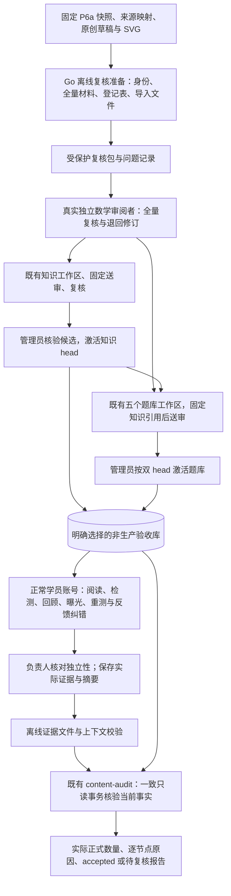

# P6b：首批数学内容独立复核、发布与正式验收方案

日期：2026-10-04。状态：用户已确认上一轮推荐方向及合并 PR #25，本书面方案待审阅；实施计划尚未编写，产品实现和真实发布尚未开始。P6a [PR #25](https://github.com/yyl1212/math_master/pull/25)已于 2026-10-04T08:51:16Z 合并，master 基线为 b78108d3dd363eae237dae59f76a7be774b9de85；合并前完整 head f47294951ecf8566aefe5c4f36484609ede06886 的四次 workflow、六个 job 均成功。新 master 的两次 push workflow 已实际启动，结果独立核验。本次通过 SSH 获取最新 master，复用已附属的隔离工作树，新建 codex/p6b-content-review-design。

## 一、已确认的目的与边界

为从零基础到研究分享的六类学习者建设数学学习成长网站，继续以数据正确性、知识覆盖和学习路径优先。首批聚焦初等数学完整路线，英文正文与页面保留中文术语。P6b 把 P6a 的原创草稿变成经过真实独立数学复核、正常审核工作流批准、可追溯发布和实际学习验收的材料。资料收藏状态、AI 审查、机器结构校验和测试账户批准均不能代替这一步。

沿用[P6 总体方案](2026-10-04-first-content-acceptance-design.md)的 30 个已发布知识点、20 个当前有效且已审核的不同模板、300 个不同有效实例门槛；逐节点至少 10 个有效实例、5 个检测实例，具备覆盖全部核心目标的五题组合及一次练习曝光后的五题见证。正式报告仍按准确路线和当前版本统计；最低门槛不作为删减已准备材料或免除复核的理由。

本方案交付可复核材料、有限离线工具和操作流程。正式执行需要真实审阅者、明确的非生产验收库与实际负责人；这些资源目前没有在会话中落实，不虚构身份或连接配置。准备工作可先完成，P6b 完成仍以真实批准、发布和 accepted 报告为准。P7 承担生产部署、服务器迁移、域名、HTTPS、负载与站外备份恢复。

## 二、固定基线与实际复核量

P6a 实施、审查及旧回归证据见[归档记录](../../operations/evidence/p6a/implementation.md)，其正式数量为零。本阶段保留原报告，不追改其时间、代码 SHA 或技术夹具性质。

| 材料 | 已准备基线 | P6b 复核责任 |
| --- | --- | --- |
| 固定来源 | 2214 文件、127 索引包、325 主入口；所选 corpus 205 条 | 保留快照；对 205 条建立出处/版本/条件核对登记，区分被使用及未使用记录 |
| 来源映射 | 64 条来源映射，574 个原创对象，205492 字节 | 逐一核对被实际引用的来源用途、条件与原创对象身份；共同出处的许可证据可共享，数学结论不可批量替代 |
| 知识与正文 | 30 个不同知识 ID、30 单元、1 条完整路线；8 个既有 ID 的 v2、22 个新 v1 | 全部陈述、适用条件、前置、两角度讲解、例题、误区/反例及 5 项证明逐项复核 |
| 题库 | 5 包、24 模板、450 固定题、384 参数实例，共 834 个不同实例 | 全部题意、选项、唯一答案、解析、目标、模板参数域及所有有限组合复核，不能用抽样代替 |
| 测评 | 30 个 blueprint，每节点两个核心目标 | 准确主知识版本与语义目标匹配、首次及一次曝光后五题覆盖、既有 4/5 与冷却规则 |
| 图片 | 9 张原创 SVG | 标签、单位整体、比例、面积、刻度、无障碍说明与正文一致；安全校验和双视口检查 |

固定 snapshotId 为 eebca0e9f8cbe8ce9afbed5f1f872f382f54e42b8004fcb57d23d05b99ff879a，source-report SHA 为 7bd7c12118b915bc0a0ae4398b8018f1ba76e305736703a0617802677c7874ad。用户的 Knowledge_JSON 继续更新，本批不跟随可变目录自动替换。八项高级资料摘要差异继续隔离；若新发现问题依赖所选来源，相应材料停止送审并记录原因。

## 三、交付方式与分段条件

| 方式 | 取舍 | 选择 |
| --- | --- | --- |
| 固定复核材料 + 既有工作流 | 小范围增加离线准备与证据校验，真实作者/审阅者继续使用现有页面和权限；适合分包复核、按准确版本归档 | 推荐，延续已确认方向 |
| 全部人工整理与逐页复核 | 产品代码增量最少，但 834 实例、版本和证据摘要容易遗漏；可用于少量补充核对 | 不作为首批主流程 |
| 新建独立审核平台 | 可以另做协作体验，但引入账户、状态、接口与迁移，需要再设计与迁移 | 当前范围不采用 |

实施计划将明确区分两个交付段。准备段负责离线复核包、导入格式、登记表、证据校验与操作手册，机器只给出准备/校验结论。正式段由实际负责人落实人员与验收环境，实施正常审核、发布和学习验收。人员尚未落实时准备段仍可验收，整体 P6b 状态保持 awaiting_review，不把两个交付段当作同一完成条件。

知识按一个完整包送审，保留三十节点前置闭包与固定路线；审阅者可按五个主题批次阅读。题库保持 numbers、operations、fractions、decimals、ratios 五个既有包，分别复核并在知识发布后固定题库引用。任一包未批准时报告实际缺口，不挪用其他路线或历史版本撑高数量。

## 四、架构与职责

新增离线工具处理材料及文件证据，不调用写 API、初始化人员、授予资格或批准数学内容；现有 Go 服务、Next.js 页面和 PostgreSQL 继续承担唯一运行时事实。正式验收不使用 e2e-harness 的控制接口、随机能力令牌、场景重置或虚构角色。测试 harness 继续用于隔离技术回归，其输出明确不计正式数量。

## 五、离线复核包与导入契约

新增 Go 运维入口 content-review，分为 prepare 与 verify-evidence 两个有限子命令。复用 contentaudit.LoadSources/CheckDraft、content.Digest 和既有 question.ValidateAndSeal；不另写生成器、答案算法或 canonical SHA 规则。现有 LoadDraft 固定读取 v1 文件布局，行为保留。新增同包有界输入适配器接受明确的输入清单，解码器、普通文件读取和路径规则沿用原实现；修订后的 v2 或混合包版本不得仍读取旧 v1 默认文件。参数显式选择仓库、input-manifest、固定批次、来源报告/映射、完整运行代码 SHA 及全新输出目录；prepare 无数据库参数或网络写入。输入清单 schemaVersion=1 固定 catalogue 文件、一个内容包、恰好五个不重复逻辑题包路径与素材根，全部为仓库根内安全相对路径；记录清单原字节 SHA，不按 glob、mtime 或最高文件名猜测版本。CLI 参数详情、错误码、精确测试与预算写入后续实施计划。

prepare 生成 schemaVersion=1 的 review-manifest、按主题拆分的复核正文、全部固定与参数实例、模板参数表、blueprint 目标矩阵、SVG 索引、来源登记空结果及既有导入格式。manifest 记录实际代码 SHA、catalogue 身份、路线 ID/版本/SHA、snapshotId、source-report 与 source-map 原字节 SHA；每对象固定 kind、ID、数学版本（素材为 null）、正文 SHA 及各复核文件原字节 SHA。所有必需项从固定输入推导，缺项、重复身份、摘要冲突和非法版本失败关闭。

材料保留原英文数学正文、解答和图片；操作及复核说明使用中文。私有目录保留来源相对定位和人员登记，不公开原始 corpus 或完整资料正文。目录 0700、文件 0600，全新原子创建，不覆盖旧包；拒绝输入符号链接、设备和 FIFO，并沿用有界普通文件读取。整个导出受九分钟包装截止约束，任何单项测试仍不超过十分钟；逐个已有验证调用的八秒限制不延长。输出文件分主题，以明确项目数/字节上限验证最大合法输入，不依赖无限 Markdown 拼接。

知识导入采用现有 publication.DraftInput：catalogueVersion、package、assetBytes（已有安全 SVG 的 Base64）和现有 SourceLink[]。题库采用 question.DraftInput：catalogueVersion、questionPackage、现有 SourceLink[]。P6a 的 SourceMap 版本化来源对象不是这两个数组，须明确转换并保留原始映射的摘要关联；未知字段不送入现有接口。导入不包含 authorIds、reviewer、approval、qualified 或发布 head，由服务器记录真实账户作者。

初次离线准备不生成 submissionId、decisionId 或 frozenDigest。导入到真实工作区后，以服务器 Export JSON/固定送审结果核对每个对象与素材身份，再记录服务器产生的 revision、submissionId、frozenDigest 与真实作者集合。题库发布引用的实际知识 head 与离线准备时的无 head 引用分开处理；送审摘要以真实工作流为准，不用文件 SHA 冒充 frozenDigest。

## 六、真实数学复核与出处检查

实际负责人在授予 reviewer 前核验数学能力、真实自然人及作者独立性，按既有后台流程保存理由与审计。editor、reviewer、admin 职责分开；管理员不会自动拥有编辑或复核资格。AI 辅助写作可记录在作者说明，不能作为独立审阅者或借第二账户冒充另一自然人。审阅者独立完成既有知识五项/题库六项复核及说明。

来源登记覆盖 205 个所选记录：原始公开出处、作者、版本/章节、实际适用条件、用途、被引用对象与处置。对 64 条被引用映射和 574 个对象核对 fact_check/background/original_derivation 是否准确。书中没有直接对应命题的原创推导不能写成引用命题。共同公开出处允许引用同一份许可核验记录，但每个相关对象仍保留用途及条件结论。

P6a 中 Manes 的 CC-BY-SA-4.0 与原创素材 CC0-1.0 标注仍需按实际公开来源、作者声明和使用方式复核；本方案不将这些标签提升为已核验权利结论。许可不明或条件不相容时停止相关复制/发布，补充可用公开依据并原创改写；本地收藏不构成公开原文或图形的授权。原图、原正文不因批量导出而上网。

每项登记记录完整对象身份、检查项目、独立复算/证明/图示核对依据、问题位置与结论（未检查、通过、退回）。所有项初始为未检查，工具禁止自动勾选通过。模板每个参数组合与固定题都在登记中可定位；“程序通过”“抽样若干题正确”不能替代全量复核。批次批准仅在全部必需项通过且阻塞问题已处理后进行，批准绑定真实固定送审。

发现错误时保留问题和旧审阅记录。已入库或固定送审的对象变更新版本/新工作区，重新核验相关知识、单元、素材、题目和 blueprint；源码草稿修订也保留 P6a Git 历史。更新固定路线及来源映射，重新准备复核材料。旧对象批准不自动传播到新 SHA。

## 七、真实验收环境与发布顺序

正式段开始前，负责人明确非生产库名称/归属、私有连接环境变量、正常服务入口、已有目录与迁移版本、备份位置、实际管理员/作者/独立审阅者及操作范围。验收库不得是 math_master_test_*，且其真实用途必须登记；更换名字不能把技术夹具变成正式材料。没有环境时不得默认使用 DATABASE_URL、生产服务器或历史测试库。

现有 00001—00008 迁移保持不变。若环境尚未初始化，在正式执行范围得到明确确认后按既有操作手册做备份、迁移与真实管理员初始化；不是本次设计 MR 的动作。使用正常应用和账户，凭据只在受保护配置/终端或本人浏览器输入，不由代理冒用真实审阅者作出数学批准。

顺序为：导入/送审完整知识包 → 真实独立复核 → 管理员检查候选差异并激活知识 head → 五个题库分别固定当前知识引用、送审及真实独立复核 → 管理员检查题库候选并按双 head 激活。每次激活沿用 expectedHead、manifest SHA、五分钟重新认证、当前审核者资格和永久撤回规则。头冲突重新准备候选，不能自动合并旧候选。

允许分批审核和发布，但初等路线未闭合或题库不足时如实展示建设中/检测未就绪。既有旧版本、历史作答、成绩与解锁保留；不会将用户原学习自动迁移到新版本。审核权限被撤销、素材退出当前 head、来源出现阻塞问题时按实际有效状态重新验收。

## 八、学习、曝光与纠错验收

正式验收使用正常学员账户和实际发布数据。建立逐节点阅读及目标覆盖记录，双视口核对整条路线、九图和英文正文。八个 learningChecks 名称沿用 reading、pass、fail、prerequisites、review、practice_exposure、retake、feedback_correction，分别指向脱敏真实执行记录；失败预期场景验证预期拒绝/未通过行为，其检查结果可以 passed，不把学员“答错”误写成工具失败。

全新学员的首次检测、4/5 通过及未通过、前置不足、已学回顾、一次练习后的模板/实例曝光排除和手动重测均使用现有规则。已有诊断、曝光冷却和最近提交排除保留。候选不足必须 ASSESSMENT_NOT_READY，不减五题、不放宽 4/5、不清空学习记录凑验收。

反馈纠错先在隔离技术环境回归全部破坏性边界。正式验收段在已明确的非生产库中，使用实际案件或负责人确认的受控演练；演练明确标记用途，参加人员知情，不能把演练撤回理由写成未经证实的数学错误。检查学员反馈、独立处理、准确来源/通过证据、立即限制、影响处理、通知及按现有条件进行重算/重测。生产用户和生产库不参与演练。

永久撤回可能使 elementary-foundations/v1 不能再完整发布。恢复须使用新知识/单元/题目或素材身份、新准确 blueprint、必要的新路线版本，以及重新批准的来源映射；不解除永久黑名单，也不回写旧版本。最终报告的路线参数显式选择实际恢复后的版本，仍覆盖同一首批三十个知识 ID，不能以无关路线替代。

全部发布与纠错影响处理稳定后，重新执行八类当前状态检查并固定最终代码 G、路线摘要和两侧 head。feedback_correction 的最终检查实际读取案件完成、正确重测/资格和通知结果；附受控操作的前后因果记录，但不能仅把旧 passed 换一个新 head。任意新的 head/代码/路线变化使最终绑定失效，须重新执行受影响验收；不能通过改 JSON 标签复用过期结论。

## 九、证据校验与只读正式报告

复核包的对象范围与修订后实际冻结对象逐项匹配。最终私有 AcceptanceEvidence 使用既有 schemaVersion=1：codeSHA、routeSHA、knowledgeHead、questionHead、fixtureOnly、reviewAttestations、learningChecks。每个 decisionId 和检查名称唯一，只有上述八个名称；result 仅 passed/failed/not_run，每项 evidenceSHA256 必须与保存的实际证据原字节一致。

verify-evidence 在离线侧增加文件层核验：受保护 release-context 绑定实际运行代码 G、当前 catalogue、路线、两个 head 与复核材料摘要；review-register 将实际冻结对象、作者/审阅者核验结果和真实 decisionId 关联；八份学习证据含同一最终上下文、实际步骤/预期/观察及脱敏附件摘要。拒绝缺文件、内容变动、重复键/身份、路径穿越、不同上下文、未检查项冒充通过及超预算输入。源码 SHA 与实际构建的对应由负责人保留构建记录；工具不凭手工字符串断言人员身份或运行代码。

verify-evidence 输出与现有 AcceptanceEvidence 兼容的文件、文件校验结果和 SHA 清单。它不自行授予独立性、不把登记未检查改成通过、不调用正常审核写入，也不读取/输出作答或凭据。没有真实审批信息时只生成材料准备结果；不生成供正式验收使用的通过承诺。程序能够检查承诺与文件/上下文的一致性，真实性仍由签署的实际负责人负责。

最终 content-audit 沿用显式 published、database-env、route/version、固定快照/报告/映射、G 和 evidence。数据库读取仍为单个 RepeatableRead/ReadOnly 事务，核对当前两 head、frozen 作者/审核者、批准、素材、撤回、题源资格和准确范围；外部材料不能覆盖这些事实。正式结论及正式数量仅由此报告产生。

任一八类检查 failed 为 not_ready；缺项或真实独立性未落实为 awaiting_review；身份冲突、输入错误或预算超出失败关闭；fixtureOnly 永远不能 accepted。最终 accepted 必须满足总体 30/20/300、所有节点十实例/五检测/核心五题覆盖、真实全部对象批准及八类检查，同时保留实际排除原因与计数。原 P6a 报告、旧 head 和旧审核证据均原样归档。

正式报告记录实际运行 G；后续文档提交可以另有 Git SHA，归档说明两者关系，不改写已有报告。部署执行代码变化时重新验收。公共仓库只存脱敏报告、数学身份与摘要、操作结论/CI链接；原始来源、含答案复核包、人员身份材料、连接配置和自由私有案件正文留在受保护目录。

## 十、文件范围与兼容性审查

本次方案 MR 只新增本方案和可行性元数据，更新路线图与 content-acceptance 操作手册。产品代码、数据正文、依赖、API 和数据库不在本次改动内。

| 后续新增/修改位置 | 职责 |
| --- | --- |
| backend/internal/contentreview/model.go、prepare.go、evidence.go 及对应测试 | 固定材料/登记契约、复核包、文件证据验证，复用既有数学验证 |
| backend/internal/contentaudit/draft_selection.go 及测试 | 显式输入清单对应的有界草稿加载，支持修订包选择，保留旧 LoadDraft 的 v1 默认行为 |
| backend/internal/cli/content_review.go、backend/cmd/content-review/main.go 及 CLI 测试 | 明确输入、普通文件/预算/新目录、两个离线子命令与安全失败 |
| docs/content/p6b-review-checklist.md、docs/operations/content-review.md | 中文逐项审阅清单、正常工作流导入/发布/验收手册与人员/库门槛 |
| docs/operations/evidence/p6b/ | 脱敏准备、实际复核/发布/学习与正式报告；技术与正式结果分开 |
| docs/superpowers/plans/2026-10-04-first-content-review.md | 本书面方案获确认后编写实施步骤与完整验证矩阵 |
| content/packages/、content/questions/、content/assets/、content/source-maps/ | 仅在真实复核发现问题时追加准确版本和相关映射；不预设数学修订 |
| tools/verify/ 与 .github/workflows/ | 追加新离线工具保护及独立检查，保留原全部入口/测试与截止 |
| docs/operations/content-acceptance.md、docs/superpowers/plans/2026-09-30-development-roadmap.md | 各交付段状态、准确报告上下文和后续 P7 交接 |

兼容边界：新增离线 CLI 和复核文件 schemaVersion，不扩展既有 HTTP、DraftInput、AcceptanceEvidence 或 content-audit 参数/报告 schemaVersion；原 CLI 行为与 JSON 保留。现有 OpenAPI/生成类型、00001—00008、题型、生成器/校验器、权限、判分、曝光、资格及两个发布 head 的事务规则不改。新增私有登记不作运行时数据源。

P6a 两项延期小问题继续单独记录：发布纯层的 blueprint SHA 回退、中文摘要未展示双 head/逐节点原因。本阶段从完整 JSON 与真实 Store 路径取得事实，不把非阻塞改进偷偷纳入兼容契约。如果未来需要改变回退或报告格式，应另给出可审核改动；本书面方案不宣称它们已修复。

上述兼容设计待用户随本书面方案审核。实施发现现有导入格式或只读事实不足时先提出精确兼容方案，不能通过新写 API、绕过作者隔离或改计数规则解决。

## 十一、可行性审查与验证

[可行性元数据](../../operations/evidence/p6b-design/feasibility.json)来自本轮读取的已合并代码与实际 JSON。知识包源文件 114373 字节、30 知识/30 单元/1 路线/9 素材，来源映射 205492 字节；题库五包均在既有 2 MiB 逻辑/4 MiB 封存预算内，五个送审可进入现有最多二十个的候选。所需固定原字节批次已保留。素材 Base64 和来源数组的实际导入大小仍需实施阶段真实验证，不能只据原包大小推断所有请求均通过。

| 审查问题 | 已确定的处理与验证 |
| --- | --- |
| v2 修订仍读取固定 v1 布局 | 新入口显式 input-manifest 与原字节 SHA、有界适配器；测试 v1、v2/混合版本和不存在/重复包，旧 LoadDraft 及 content-audit 参数不改 |
| 离线 SHA 与服务端 canonical SHA 不一致 | 复用现有 Go 类型/验证与 Digest，真实导入/固定送审后逐身份核对，不复制 Node 摘要算法 |
| P6a SourceMap 误当 DraftInput.sourceMap | 单独转换既有 SourceLink[]，保留原摘要链；导入不得携带作者/批准字段 |
| 资料更新或原始标签造成虚假许可/复核 | 冻结本批、公开出处实际核验、逐项条件/用途登记；未检查项不自动通过 |
| 全量实例、图形与证明遗漏 | 根据实际对象生成必需登记集合；验证重复/漏项、模板全组合、唯一答案/干扰项、九图和目标语义 |
| 只填 passed 与随机 SHA | 打开实际证据文件复算摘要、上下文/步骤与完整性校验；实际负责人签署真实性，程序不证明自然人 |
| 修改/撤回后仍沿用旧审批、旧验收 | 新版本及来源映射、真实重新送审，最终稳定上下文后新执行八检查；永久撤回不恢复原版本 |
| 技术夹具被正式化 | 正常库/实际用途登记，fixtureOnly 与现有测试库识别保留；不复制 harness 批准或学习证据 |
| 真实人员/库尚未落实 | 准备段可交付；正式段有可检查前置条件，未齐保持 awaiting_review，不宣布 P6 完成 |
| 输出包含答案/人员材料或读取无限 | 受保护全新输出，普通文件与字节/项目预算、脱敏归档、严格 JSON/安全路径负测 |
| 顺便修旧边界或扩大容量 | 本阶段不纳入延期小问题/无关重构；容量、接口和兼容变化另审核 |

自审迭代已补齐来源格式转换、真实 frozenDigest 的产生时点、纠错撤回后路线版本恢复，最终八检查不能只重标旧 head，以及修订包不能落回固定 v1 输入五处歧义。设计未发现必须改变现有数学、权限、发布或判分规则的阻塞问题。真实数学结论、许可核对、人员/环境和实际 accepted 仍是未达到的执行门槛。

准备段验证覆盖材料身份/摘要、全量与遗漏、错误/重复 JSON、符号链接/FIFO/路径逃逸、采集中变化、尺寸预算、原子输出失败清理、无网络/数据库写入、无审批伪造，以及实际既有导入/导出一致性。证据侧覆盖同/异 head、旧代码、伪造文件摘要、缺/重复检查、未复核登记、真实 frozen 关联和脱敏。正式段另实际运行正常审核与双视口学习链；相关受控纠错不用于生产。

保留 Node 72 项、前端 350 项、浏览器 22 批/162 项及全部旧 Go/数据库/容量回归。新增测试只验证新契约与必要失败边界；Go 使用 CGO_ENABLED=0 和既定 go1.27.1、单批五分钟，浏览器八分钟，包装九分钟，单次不超过十分钟。实现结束按确认计划做一次独立整分支代码审查、必要修复、完整回归与 SSH MR；核验准确最终完整 SHA 的四次 workflow/六 job，不能用历史 P6a 绿色替代。

## 十二、下一步审阅门槛

本轮已执行确认的 PR #25 合并，并完成可审阅的 P6b 书面设计与兼容边界。请先审阅本方案及第十节兼容性范围；通过后编写逐项实施计划，沿用会话现有 Native 偏好，计划审阅确认后再开始准备段开发。正式段在实际人员、验收环境和操作范围落实后推进，不把方案/计划确认写成真实数学批准或生产部署授权。
