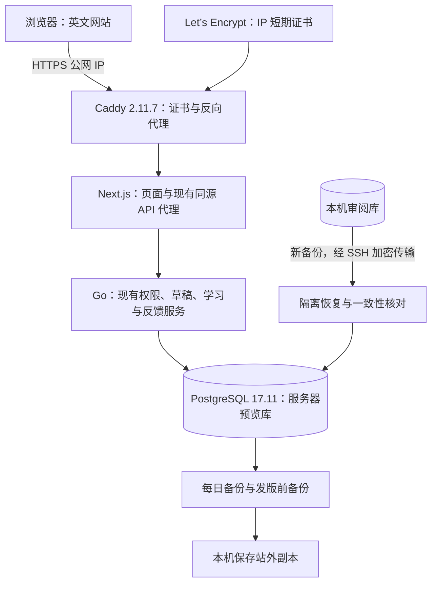

# P7a：提前部署服务器预览版

日期：2026-10-05。状态：方案待用户审阅；服务器只读预检已完成，应用部署尚未执行。

用户已将近期目标调整为“尽快上线服务器，然后再慢慢优化”，并确认暂无域名。本方案把服务器预览部署提前；题库草稿阅读页和其他新增功能延后。P6b 的实际数学复核、正式发布与完整学习验收继续推进，预览部署不要求提前完成这些内容工作。

## 1. 首次交付

推荐先用公网 IP 的可信 HTTPS 提供服务器预览版，目标入口为 `https://43.135.142.53`。部署当前已合并的功能，保持英文主界面、正常注册登录、后台权限、反馈和私有知识草稿阅读。

建议将本机专用非生产库的现有账号和六个草稿工作区复制到新的服务器预览库：管理员 `yyl1212` 保留当前密码以及 learner/editor/admin 角色，重新登录后可在线阅读已有草稿。知识工作区已有 30 个知识点、30 个单元和 9 张原创 SVG；五个题库工作区合计 450 道固定题、24 个模板和 30 个蓝图。迁移时以新备份为准，重新核对实际版本、数量和权限，不覆盖本机数据库。

这些内容保持草稿状态和现有访问权限；匿名访客不会获得草稿，预览部署不增加 reviewer 角色，也不执行内容送审或发布。公开已审阅内容目前为零，因此首次上线主要用于本人在线预览和反馈，公开学习路线待内容复核后逐步开放。现有草稿页的未审阅标识继续展示。

方案比较：

| 路径 | 结果与取舍 |
| --- | --- |
| 公网 IP + HTTPS + 四服务 Compose（推荐） | 无需先购买域名，保留生产认证要求；必须验证 IP 证书签发和自动续期 |
| 域名 + HTTPS | 适合作为长期入口，需要先取得域名并设置 DNS；后续可由配置迁移到这一路径 |
| SSH 隧道预览 | 外部入站受阻时可先验证服务器应用，仅供具有 SSH 访问条件的用户使用 |

## 2. 架构与运行边界

四个常驻服务为 Caddy、Next.js、Go 和 PostgreSQL。仅 Caddy 映射公网 TCP 80/443；数据库、Go 和 Next.js 使用容器内部网络。所有网站和业务 API 请求均经 Next.js 现有接口进入 Go，保持其固定同源代理和 Cookie 校验。Caddy 管理入口不映射宿主机，测试 harness 与控制端口不进入生产镜像。

Go 与 Next.js 同时设置 `APP_ENV=production`、`AUTH_PUBLIC_ORIGIN=https://43.135.142.53`；Next.js 的内部 API 地址指向 Go 容器。继续使用 HTTPS 的 `__Host-` 认证 Cookie。容器内监听地址通过部署环境配置，不放宽现有开发模式仅 loopback 的限制。

采用当前稳定版 Caddy 2.11.7，显式指定 Let’s Encrypt ACME issuer 和 `shortlived` profile，避免 IP 地址默认采用本地自签名证书。Docker 官方镜像尚未同步 2.11.7，因此使用官方已发布的 Linux amd64 程序包和固定 SHA-256 构建精简网关镜像，不依赖不存在的镜像标签。官方发布配置为 `CGO_ENABLED=0`，运行基础为已核验的 Alpine 3.24。证书存储使用独立持久卷；先完成 ACME 测试环境挑战，再签发可信证书。IP 证书有效期约 160 小时，必须验证自动续期配置及续期所需网络，上线后记录证书到期时间和检查方式。

服务器目录分为 `/opt/math_master/releases/<提交号>/`、`/opt/math_master/shared/` 和 `/opt/math_master/backups/`。实际环境文件与备份受限保存，不进入 Git、构建上下文或日志。通过本机 SSH 传输 Git 归档和数据，不在服务器保存 GitHub token 或本机服务器密码。

首次试运行的容器内存上限建议为 Next.js 768MiB、Go 512MiB、PostgreSQL 512MiB、Caddy 128MiB；构建按服务顺序执行，前端构建限制 Node 堆内存。实际启动后检查峰值内存、健康状态和重启情况，再调整资源；不据此宣称未经测量的并发能力。

## 3. 文件范围与兼容性审查

| 新增或修改文件 | 用途 |
| --- | --- |
| 新增 `compose.yaml`、`.dockerignore` | 四服务编排、健康检查、持久卷、资源限制和构建秘密排除 |
| 新增 `backend/Dockerfile` | `CGO_ENABLED=0` 构建 server 及明确列出的迁移/维护 CLI；排除测试控制程序 |
| 新增 `frontend/Dockerfile`，修改 `frontend/next.config.ts` | Linux 生产构建、standalone 运行产物；保留现有页面和业务接口 |
| 新增 `ops/caddy.Dockerfile`、`ops/Caddyfile`、`ops/.env.example` | 校验官方 2.11.7 程序包摘要并构建网关、公网 IP ACME HTTPS 入口及无秘密部署配置示例 |
| 新增 `ops/deploy.sh`、`ops/backup.sh`、`ops/restore-drill.sh` | 固定版本部署、备份与隔离恢复演练；显式迁移、保留既有数据卷 |
| 新增 `ops/verify-deployment.py` | 检查 HTTPS、HTTP 跳转、公开入口和匿名访问权限，不记录凭据 |
| 新增 `ops/math-master-backup.service`、`ops/math-master-backup.timer` | 每日服务器备份；发版前另外备份 |
| 新增 `docs/operations/server-preview.md`、实施证据 | 中文部署、恢复、回退、证书续期与检查说明 |
| 修改开发路线图 | 将服务器预览提前，保留正式内容验收与后续优化顺序 |

本次方案的兼容性变化是生产运行方式、HTTPS origin 和 Next.js standalone 构建；数据库迁移、业务 API、角色规则、数学审核及发布规则均沿用当前实现。验收必须覆盖生产 Cookie、代理 origin、动态页面读取、静态 CSS/公式资源、私有 SVG 与既有阅读组件，不能只验证首页返回 200。

PostgreSQL 使用与本机一致的 17.11 常规镜像，避免本次迁移同时切换到 Alpine 的数据库区域设置。恢复前核对源库的编码、LC_COLLATE 与 LC_CTYPE，按相同设置建立目标库；恢复使用 `--no-owner --no-acl`。数据库连接配置采用新的服务器专用凭据，不复制本机数据库密码。账号密码、角色及工作区作者关系由应用数据保留；管理员不重新初始化，不使用旧的临时管理员密码。

既有 CI 工作流和其兼容性基线保持原内容。部署检查另行安排在新文件中，不降低原有测试门槛。单次检查使用现有验证包装器，最长 9 分钟；Go 测试设置 `CGO_ENABLED=0` 和 5 分钟截止，较长矩阵分批运行。

## 4. 实施顺序和上线验收

1. 在方案批准后编写精确实施计划，沿用此前已选择的 Native 执行方式。实现前再次通过 SSH 拉取 master，在最新 master 上新建开发分支，完成 Docker、代理和运维文件；审查与回归后通过 SSH 提交 PR，最终记录确切部署提交及基础镜像摘要。
2. 安装服务器 Docker/Compose，创建独立目录、凭据和持久卷；不升级无关系统软件，不变更既有服务或 SSH 防护规则。
3. 为本机数据库创建新备份，记录 SHA-256、源码版本、迁移版本和内容/账号数量。经 SSH 传输后，在隔离容器执行真实恢复，核对知识版本、工作区、素材摘要、账号角色和审核/学习/反馈记录。仅清理本次演练创建的容器和临时卷。
4. 恢复服务器预览库，显式运行现有向上迁移；启动 Go 和 Next.js，核对数据库及应用健康。在启动公网入口前完成一次代码审查和相关回归。
5. 检查实际外部 80/443 可达性，完成 ACME 测试挑战及可信证书签发，启动 HTTPS 入口。若云侧入站规则阻断，定位到具体规则后处理；不通过关闭整个防火墙排障。
6. 验证普通客户端无需忽略证书错误即可访问，HTTP 跳转到 HTTPS，登录/注册页和静态资源正常，匿名读取私有草稿被拒绝、内部服务端口不暴露。使用正常网页登录核对 `yyl1212` 的角色和私有知识草稿，不提取用户会话或重置密码。
7. 进行有界只读负载检查并记录延迟、内存和数据库连接；部署备份 timer，保存首个服务器备份到本机作为站外副本，完成恢复演练和重启检查后交付实际入口。

每日服务器备份保留最近 7 日，每周副本保留最近 4 周，发版/迁移前另留快照。首次上线及每次发版将备份复制到本机，实际报告记录站外副本位置和复制时间。本阶段不宣称已有每日自动站外备份；后续独立存储接入列入 P7b。

回退按已记录的上一应用镜像及配置执行，保留数据库卷。禁止对真实库运行迁移 down 或 `compose down -v`。迁移失败时停止应用写入、保留现场和备份；涉及不兼容结构时，按已完成恢复演练的流程处理，不能把覆盖真实数据当作自动回滚。

本次“服务器预览已上线”要求可信 HTTPS、应用健康、正常登录与私有阅读、未授权访问拦截、备份恢复及基本负载检查实际通过。它不等于 P6b 数学验收完成或公开题库达标；后续顺序为题库草稿阅读、资料增量更新与数学复核、公开学习路线及功能优化、长期域名和独立站外存储。

## 5. 可行性审查与当前证据

基线为最新 master `9f71cf4f2b29c5101cc87a4511c0b32d786ddeb0`，即已合并 PR #29。其文件与合并前六项 CI 全通过的 PR 最终版本一致；本次再次查询确认 master 的两项 workflow、三个 job 全部成功：Go `verify`、`correction_verify` 和前端 `verify`，实际 head 均与基线相同。

已通过 SSH 只读核验服务器：Ubuntu 26.04 LTS、x86_64、2 核、3654MiB 内存、2GiB swap、49GiB 可用磁盘；80/443 未监听，sudo 非交互访问可用。软件包查询确认 Docker、Caddy 未安装，PATH 未发现 Node 或 Go；Ubuntu 软件源提供 Docker 29.1.3 和 Compose 2.40.3，Caddy 仅为 2.6.2，因此本方案改用已核验的 Caddy 2.11.7 官方程序包构建网关。现有主机防护链的目标端口规则仅为 22，未修改规则。

服务器可访问 Let’s Encrypt、Docker Registry、npm 和 Go 模块代理；Go 1.27.1、Node 24.17.0、PostgreSQL 17.11 和 Alpine 3.24 的 linux/amd64 镜像清单已核验。Caddy 当前稳定版为 2.11.7，发布于 2026-10-03；其官方源码使用 CertMagic 0.25.6，ACME 检查允许 Let’s Encrypt 的 IP 证书。官方 Docker 定义仍为 2.11.6，服务器请求 2.11.7/2.11.7-alpine 标签实际返回 404；已改用官方程序包路径，从服务器 HEAD 检查返回 200，并记录官方发布元数据中的摘要，实施时必须实际下载并验证摘要。早期核验过的 2.11.4 镜像仅保留为预检历史，不作为部署版本。暂无域名及镜像同步延迟均不构成当前方案的设计阻塞。

自审已处理旧 Caddy 不支持、最新镜像同步延迟、开发认证不能对公网使用 HTTP、本机/服务器数据与凭据分离、草稿对外泄露、测试控制端口、Next.js 内部监听、真实恢复和回退保留数据等问题。当前没有已发现的方案阻塞；外部入站、证书签发、构建资源和实际登录仍须在实施时取得运行证据，不能由只读预检替代。

本次仅完成预检与书面方案，尚未安装服务器依赖、开放新端口、复制实际数据、变更角色或部署应用。无秘密预检摘要见 [预检证据](../../operations/evidence/server-preview/preflight.json)。

参考：[Let’s Encrypt 公网 IP 证书](https://letsencrypt.org/2026/01/15/6day-and-ip-general-availability)、[Caddy ACME profile 配置](https://caddyserver.com/docs/caddyfile/directives/tls)、[Caddy 2.11.7](https://github.com/caddyserver/caddy/releases/tag/v2.11.7)、[CertMagic 0.25.6 IP 检查](https://github.com/caddyserver/certmagic/blob/v0.25.6/acmeissuer.go)、[官方静态构建配置](https://github.com/caddyserver/caddy/blob/v2.11.7/.goreleaser.yml)。
