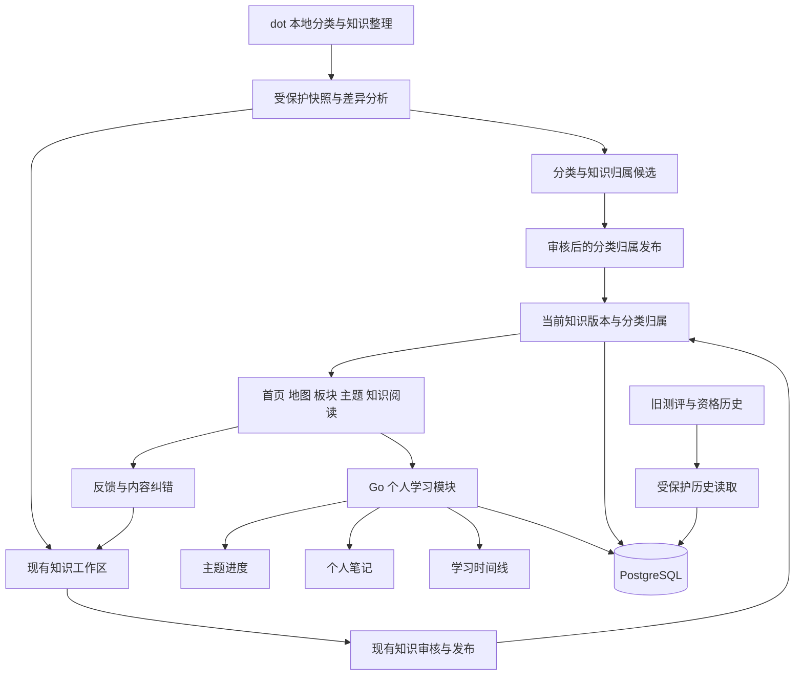

# 主题学习重构设计

日期：2026-10-06。分类基线及本正式设计已获用户书面确认；[总实施计划](../plans/2026-10-06-topic-learning-refactor.md)及三个分计划现供审查。网站以主题和知识点学习为主，提供个人笔记、进度、时间线和检索复习。旧学习路线、练习、检测、判分和解锁要求由本设计取代，既有内容版本、账户、审核和历史数据继续保留。

## 用户目标与范围

用户希望知识地图跟随 dot 持续整理的分类，按主题直接学习知识点，自动汇总主题进度，在知识点上记笔记，并通过时间线回顾学习过程。复习以检索和阅读为主，不再使用题库和测评资格控制学习。

分类采用 63 个一级主题、534 个二级主题、4,969 个具体主题。知识点关联具体主题，允许跨主题引用同一知识点。个人状态、笔记和历史绑定稳定知识点 ID，不绑定资料文件夹、标题或某条学习路线。

保留学习首页、知识地图、板块详情、知识阅读、我的学习、学习历史、我的反馈、账户、内容工作区、内容审核、发布管理、反馈与内容纠错后台、人员管理。复习和回顾提醒纳入我的学习，不新增独立测评入口。中英文功能界面及安全数学渲染继续保留。

退出新产品流程的功能包括路线加入、个人前置解锁、资格授予、单题练习、五题检测、诊断、判分、答案冷却，以及题库工作区、题库审核和题库发布。旧版本记录在兼容期内保持受保护的历史读取，不用于新的主题进度。

本设计不包含服务器部署、真实内容批量批准、公开原始资料、扩大发布容量、付费服务、间隔重复算法、学习时长计分、笔记分享或附件上传。

## 分类依据与接入规则

分类依据位于本地 Materials/Collection_Metadata/MSC2020：

- MSC2020_Complete_Taxonomy.json 保存代码、名称、父子关系、节点类型和导航建议。
- MSC2020_SOURCE_KNOWLEDGE_MAPPINGS.json 保存具体分类与知识记录、作品及章节页码的映射。
- MSC2020_DUAL_SOURCE_COVERAGE_MATRIX.json 保存来源覆盖规则与已接受批次状态。
- INDEPENDENT_SOURCE_REGISTRY_CURRENT.json 区分来源身份、作品家族和独立性。

[分类基线记录](../../content/2026-10-06-topic-taxonomy-baseline.json)绑定本次读取的文件摘要与数量。原始资料继续保存在本机，不复制完整资料库到 Git，不上传到 Page 或 Library。

正常主题的三级数量分别为 63、534、4,969。另有 503 个辅助分类和534 个其他兜底节点，保留原代码及类型，单独展示，不计入正常三级数量，也不与个人完成状态混用。完整分类节点共6,603 个，不把它们都称为独立数学分支。

网站存储官方代码及父子关系，保留英文标签、署名和分类许可。已有中文说明明确标为非官方对照；缺少中文对照时显示原文，不用自动翻译覆盖源标签。一级主题使用网站板块入口，二级和具体主题使用同一主题页按需展开，不将15 个磁盘文件夹或教材名称当作正式分类层级。

内部 ID 使用稳定的小写前缀，例如 msc-13、msc-13c、msc-13c60，原 MSC 代码分别保留13-XX、13Cxx、13C60。展示名称变更不改变 ID；新分类版本通过明确映射处理改名、合并和拆分，不根据名称猜测迁移关系。

分类与知识采用多对多关系。同一知识点在一个主题及其祖先聚合中只计一次。多个主题各自包含同一知识点时，各主题分别计入，但全站知识总量去重，不能把主题计数相加当作全站总量。具体主题只关联有真实知识记录依据的内容，辅助语义映射不冒充具体主题覆盖。

来源覆盖达标与网站公开发布分开。dot 的双来源要求按不同作品家族和实质章节证据判断，镜像、格式副本和同源版本不算不同作品。已收集、已抽取、已复核、双来源达标均不直接转换为网站的审核批准或用户的学习完成。覆盖说明保持实际复核范围，不将局部教学证据称为整个主题已经穷尽。

## 持续更新和资料适配

接入工具只读取资料，按一个被接受的批次捕获分类、映射、覆盖矩阵、来源登记及涉及的主文件，记录大小和 SHA-256。检查读取前后文件身份和时间、关联摘要及批次一致性。遇到未接受候选、暂存批次或读取期间变化，停止该批次接入，保留上一有效批次。

差异报告区分分类变更、知识新增、正文修订、主题归属变化、来源变化和文件缺失。删除源文件不自动删除公开知识；主题移动不重置笔记和学习状态。新增接入批次采用新目录，已有快照不覆盖。

当前知识主文件有 knowledge_points、records 和 capabilities 等不同结构。为数学记录分别提供明确适配器，保留作品、主文件、原记录 ID、原始摘要、条件、证明范围与出处映射。软件能力保留为辅助资料，不自动计入数学知识点。索引指定的主文件优先；章节副本、合并副本按原记录标识去重，同名概念不自动合并，疑似语义重复进入编辑核对清单。

本次来源检查的8 个索引摘要差异涉及 Howell 复分析和 Gathmann 代数几何。它们进入隔离清单，接入其他一致资料不受影响。既有 source-report 只适配少数 dataset_id 与 knowledge_points 结构，不扩宽原严格入口来放行其他记录，新增接入模块负责归一化并逐批形成现有工作区可接受的草稿。

新知识送审要求有至少一个经过核对的具体主题归属。旧已发布知识尚未完成精确归类时仍可阅读，在我的学习显示待归类，不虚构 MSC 归属，也不计入某一具体主题分母。

## 页面行为与登录入口

| 页面 | 新行为 |
| --- | --- |
| 学习首页 / | 展示一级主题、可用内容和学习入口；登录用户可继续最近学习 |
| 知识地图 /knowledge | 搜索分类代码、名称和知识标题；逐层展开；显示可用知识量和建设状态 |
| 板块详情 /domains/{id} | 对应一级主题，列出二级主题及其具体主题入口 |
| 主题详情 /topics/{id} | 展示子主题或知识列表、筛选状态、继续学习和个人进度 |
| 知识阅读 /knowledge/{id} | 保留正文、公式、条件、证明、来源、配图和关系；增加状态、笔记及当前知识时间线 |
| 我的学习 /learn | 汇总有学习记录的主题、继续学习、已完成内容、复习中内容及待归类知识 |
| 复习 /learn?mode=review | 检索本人学过的知识，查看笔记并开始或结束复习 |
| 学习历史 /learning-history | 按知识点、主题、日期及事件类型查看时间线 |
| 反馈、账户和知识后台 | 保留现有职责，按新分类及退出规则调整入口 |

地图可浏览完整分类，主题默认先展示有公开内容的子主题，用户可选择查看全部。分类节点和知识列表分页读取，不在首次请求中展开全部6,603 个节点及全部正文。搜索结果带完整祖先路径，清楚区分分类节点和知识点。

登录成功后默认进入 /learn。注册后仍进入登录页；强制改密账户先进入 /account，改密后重新登录再进入我的学习。已经登录的正常账户再次访问登录页时进入我的学习。

匿名用户继续阅读已发布正文。匿名阅读、SSR、列表查询、链接预加载和草稿预览都不写个人记录。管理员或编辑者的草稿阅读保持私有，不产生普通学习进度。

## 学习状态和主题进度

状态规则随本正式设计获得确认，实施时按以下状态转换执行。

| 状态代码 | 中文 | 状态转换 |
| --- | --- | --- |
| unlearned | 未学习 | 无个人学习记录 |
| learning | 学习中 | 登录用户实际打开可用知识阅读页后，通过客户端写命令记录开始 |
| completed | 已完成 | 用户主动点击完成学习 |
| reviewing | 复习中 | 已完成的知识主动点击开始复习；结束复习后回到已完成 |

已经学习中的知识再次打开，仅更新最近阅读时间，不重复创建开始事件。已完成知识普通阅读不自动变为复习中。未完成知识通过复习检索打开后继续学习，完成前不进入复习状态。每个知识点至多有一轮进行中的复习；重复请求返回同一结果。

首次开始、首次完成、最近完成、最近阅读、最近复习和完成时的准确知识版本分别保存。再次明确完成新版材料会新增一个完成事件，保留第一次完成时间。用户状态表示学习行为，不宣称通过数学能力检测。

主题完成率为当前公开可用知识点中曾明确完成的去重知识点数除以当前公开可用知识点数。总数为零时显示暂无内容，不显示100%。复习中知识保留完成事实，不降低完成率。新增内容后分母增加，页面显示新增数量；撤回或移出主题后按当前集合计算，同时提示数量变化，历史进度与记录保留。

正文升级显示内容已更新、可回顾的独立标记，不静默清除完成或笔记。撤回显示内容不可用，不能继续读取被撤回正文；笔记和历史仍属于用户。个人学习不再受前置知识完成或测评资格限制，但发布时的引用完整性、数学依赖和撤回影响校验继续生效。

## 个人笔记与学习时间线

每位用户每个稳定知识点保留一份当前笔记，支持查看、保存、修改和删除。笔记记录关联知识版本、修订号和更新时间，分类移动或正文升级不丢失笔记。笔记支持受限 Markdown 和数学公式，不接受原始 HTML、外部图片、附件或可执行内容。

采用明确的保存按钮，不添加后台自动提交。未保存文本留在当前页面内存，离开时提示未保存变更；保存失败保留输入。保存和删除使用 expectedRevision 与幂等键，冲突时先读取服务器笔记再决定修改，不自动覆盖另一标签页的写入。删除当前笔记后不返回原正文，时间线保留笔记删除事件，不保存已删除文本副本。

笔记仅本人可读写，管理员和审核者不会因角色默认获得笔记正文权限。正文不进入日志、公开内容包、反馈列表或分类导出。

时间线记录学习开始、明确完成、每轮复习开始与结束、笔记保存或删除、旧记录迁入及内容更新提醒。时间使用数据库时间，按时间与事件 ID 稳定排序。普通重读的最近访问更新时间不制造重复状态事件，不把页面停留或后台挂机算作学习时长。

时间线可以按知识、主题、日期、事件类型筛选。历史事件保留当时的准确知识版本和分类版本；主题过滤明确采用当前归属，已移出主题的记录仍能按知识或全部历史找到。笔记事件只含动作和修订元数据，不在列表复制正文。

## 架构与数据职责

继续使用 Next.js、Go 和 PostgreSQL。新增 taxonomy 管理分类与归属，新增 study 管理个人学习、笔记和时间线。旧 learning、assessment、question 和判分纠错模块进入兼容历史职责，新学习请求不经过旧资格或答案曝光逻辑。

新增数据职责：

| 实体 | 责任 |
| --- | --- |
| taxonomy_versions / taxonomy_nodes | 不可变分类版本、代码、父子关系、节点类型和署名 |
| taxonomy_assignments / taxonomy_releases | 准确知识版本与主题的多对多归属、冻结来源、审核依据及当前发布 |
| study_records | 用户与稳定知识点的当前状态、完成事实、最近活动、准确版本和序号 |
| study_events | 只追加的学习与笔记元数据事件，以及旧事件追溯 |
| study_notes | 当前私人笔记、修订与归属 |
| study_idempotency | 用户命令与准确输入的回执，避免重复事件 |
| study_content_changes | 全站内容修订或撤回的去重事件，供本人记录查询生成提醒 |

表名为责任设计，最终迁移结构和索引由实施计划固定；用户可见的状态、归属、幂等和隐私规则不随表名变化。

分类归属独立于历史数学正文管理，不原地改写旧知识的 domainIds、topicIds、摘要或批准记录。已有 schemaVersion=1 内容包继续可读，新的主题选择、归属候选及其冻结依据通过独立契约处理。编辑者选择主题，送审冻结准确归属，审核页核对归属，发布页展示分类差异。

首次分类发布允许保留待归类的旧知识。此后知识与分类归属发布采用同一事务切换匹配的发布指针，知识候选准备时也准备归属候选。激活核验预期知识发布、预期分类发布、准确版本和冻结摘要；任一变化则重新准备。只调整分类时仍绑定当前准确知识发布。读取使用同一数据库快照，不返回一半旧分类、一半新知识。旧激活入口在新流程启用后拒绝独立切换知识指针，防止绕过配对检查。

## 接口与资源边界

新分类及学习使用 /api/v2，避免把旧检测合同改名后继续使用：

| 接口组 | 责任 |
| --- | --- |
| /api/v2/topics | 分类搜索、分层分页、主题详情及知识列表 |
| /api/v2/study/overview | 我的学习与主题聚合 |
| /api/v2/study/knowledge/{id} | 本人状态及准确公开知识引用 |
| /api/v2/study/knowledge/{id}/begin、complete | 开始与明确完成 |
| /api/v2/study/knowledge/{id}/review/start、finish | 一轮复习的开始与结束 |
| /api/v2/study/knowledge/{id}/note | 私人笔记读取、保存与删除 |
| /api/v2/study/history | 本人时间线 |
| /api/v2/content/topic-assignments | 工作区分类选择及冻结候选 |
| /api/v2/admin/publications | 知识与分类归属的候选、差异和配对激活 |

具体请求和响应由实施计划及 OpenAPI 固定。写入要求当前会话、CSRF、UUID 幂等键和相关版本或序号。客户端实际阅读后的 begin 使用 POST；GET 和 SSR 保持只读。开始记录失败时正文仍可阅读，显示记录未保存，进度不伪报成功。

控制请求上限8 KiB；笔记正文最多16,000 个 Unicode 标量且64 KiB，笔记请求上限128 KiB。私有完整响应上限2 MiB；列表默认20、最多100，历史默认20、最多50。只加载当前主题层级或一页知识，不返回整库正文。

新请求沿用 Go 8 秒、锁等待1 秒、Next.js 与客户端10 秒总截止；既有账户时限保持。普通读写沿用个人及全局预算，后台重操作共用已有工作槽，不新增常驻导入线程、搜索集群或数据库连接池。超时后显示结果待确认，用户主动重试同一请求；不自动重复保存笔记或提交完成。

## 反馈和内容纠错的调整

网站及知识反馈保留现有工单状态、作者补充、独立处理权限、准确版本、来源和追加事件。主题问题通过网站反馈附带当前分类代码与版本；知识、讲解和素材问题继续绑定准确数学对象。

feedbackConfigured 当前无条件要求完整旧 learning 和 question 表，必须拆为来源所需能力检查。网站和知识反馈只依赖账户、内容和反馈结构；旧题目讨论仍走旧所有权、曝光和活动检测重合保护，不能把保护整体移除。

新纠错聚焦内容修订、永久撤回、替代版本及回顾提醒。公开数学修订仍经过编辑、审核和发布；反馈已解决不替代批准。管理员自审知识的现有规则保留，来源独立复核统计仍按真实作者关系判断。

发布与撤回只登记准确内容的全站变化事件，不在同一事务逐用户写提醒。我的学习和时间线把这些事件与本人的已学习版本关联，只读生成内容更新或不可用提示；明确回顾当前版本后，按最近回顾依据更新提示。没有个人记录的用户不生成个人提醒，GET 不写已读、完成或事件。分类归属变化只更新目录和进度集合，不伪造正文变更。

旧判分纠错案件、结果及任务保留为历史兼容流程，不创建新的题目映射或资格恢复业务。新学习不会读取旧纠错资格；旧后台任务即使补完历史结果，也不会改变新的主题学习状态。新的修订提醒去重显示在我的学习，查看提醒不自动完成复习。

## 迁移与旧模块退出

采用新增结构和渐进式切换，不删除旧表、不修改00001—00009 历史迁移。服务启动不自动迁移。正式环境先备份、记录旧代码和迁移版本，再按维护流程显式启用新迁移与配对发布能力。

新记录以用户与稳定知识点 ID 唯一。迁入旧开始和明确完成事件时保留源 ID、准确版本、时间和迁入批次，重复执行不新增记录。旧 mastered、passed、diagnostic 和解锁字段不能直接映射为 completed；只有真实完成事件支撑新完成事实。已撤回旧知识保留在个人历史，当前主题分母不包含它。

旧课程链接按明确映射提供主题导航；无法准确映射时显示路线已停用并提供知识检索，不随机跳转某个主题。旧练习和检测新建、作答、揭示及新资格操作在切换后返回明确的410 MODULE_RETIRED；这是需要书面审查的接口行为变更。旧响应体、原成绩和冻结依据不改写。旧非终态尝试不伪造分数、不自动重写为用户放弃；受保护历史页展示功能已停用，旧答案读取继续按原到期及撤回规则限制。

切换期间旧题目讨论与旧纠错保持严格保护；新网站和知识反馈通过新能力检查独立可用。新 UI 不再提供题库、练习、检测或路线入口。旧表与代码暂留历史兼容职责，物理清理另行立项并审查，不能作为本次重构完成条件。

部署工具目前按准确迁移版本判断兼容性。新增迁移后，不承诺能直接回退旧二进制；回退优先使用同时识别新旧结构的兼容版本，保留个人数据。若缺失新结构或配对发布不一致，停用相关写入并保留现场，不能执行真实库 down、删除标记或删事件来恢复界面。

## 文件范围与交付顺序

| 范围 | 新增或修改 |
| --- | --- |
| tools/content-ingest/、新增 topic-ingest 工具 | 保留旧快照入口；新增分类批次核验、异构主文件适配、差异与归属草稿 |
| schemas/、content/catalogue/ | 新分类和归属契约及精简目录；保留旧目录与内容包历史 |
| backend/internal/taxonomy/、backend/internal/study/ | 新分类查询、归属版本、个人状态、笔记和事件 |
| backend/internal/store/、backend/internal/httpapi/ | 新表访问、事务、API、能力检查及旧模块退出 |
| backend/internal/publication/、content 工作流 | 冻结主题归属、审核展示、配对发布和撤回投影 |
| frontend/src/app/、features/catalogue、reading、auth | 三级目录、主题页、阅读控件和登录跳转 |
| 新 features/study、lib/study、lib/taxonomy | 我的学习、笔记、复习、时间线及客户端契约 |
| feedback、correction、notification 相关目录 | 内容反馈解耦、历史保护和回顾提醒 |
| db/migrations/、api/openapi.yaml | 新迁移、新契约、明确退出响应及兼容映射 |
| tests/e2e/、各模块测试、ops/、docs/operations/ | 学习与权限回归、迁移验证、部署兼容和中文手册 |

按三个可审查交付推进：先建立分类树、批次接入和知识归属；再交付主题学习、笔记、时间线、复习与登录跳转；最后完成反馈解耦、旧模块退出和迁移切换。各交付先通过本机审查及回归，再通过 Git 创建 MR。最终切换须在依赖全部就绪后整体启用，不能把中间交付称为完整重构。

开始代码开发前更新 master 并新建开发分支，严格按照已审查的实施计划执行。Go 调试和验证设置 CGO_ENABLED=0。每批测试不超过10 分钟，较长回归分批执行。新实施计划要明确默认 inline 执行方式或用户选择的其他方式，不因分类确认直接开始产品开发。

## 可行性审查与验收

| 已识别问题 | 设计处理 | 验证 |
| --- | --- | --- |
| 6,603 分类节点与旧两层目录不兼容 | 独立版本化分类契约，三级正常主题与辅助类型分开，旧目录历史保留 | 数量、唯一代码、父节点、节点类型与样例祖先路径 |
| 资料含多种根结构和局部复核范围 | 新显式适配器、主文件选择、原 ID 追溯、差异隔离，不继承公开批准 | 主结构、重复、副本、缺引用、摘要不符和批次变化 |
| 分类改动可能重写不可变数学正文 | 独立归属版本，冻结审核依据，配对激活 | 旧正文摘要不变、并发发布拒绝、旧入口不能绕过 |
| 新学习仍被旧测评就绪检查阻断 | study 独立能力检查，反馈按来源拆分，旧答案路径保留守卫 | 无题库发布时可学习和反馈，旧历史仍受保护 |
| 内容更新逐用户推送可能超过发布事务预算 | 登记全站变化事件，按本人记录只读生成提醒，不进行用户规模的发布写入 | 发布写入量与知识变化数量相关；GET 不追加个人事件，回顾依据不串账户 |
| 浏览器刷新、预加载导致重复状态 | SSR 只读，实际阅读 POST，幂等及状态事件去重 | 匿名、预加载、刷新、重复请求和换账户 |
| 复习、新版本或分类移动导致进度丢失 | 完成事实与复习状态分开，稳定知识 ID，版本变化单独提示 | 复习不降进度、跨主题去重、移动和内容升级 |
| 笔记被覆盖或跨账户读取 | 本人授权、修订冲突和幂等，换账户清除私有页面状态 | 双标签页冲突、超时同键、删除、越权和强制改密 |
| 候选知识数量远超当前发布容量 | 分批草稿和审核，保留每工作区100 知识、当前快照1,000 知识等已验证上限 | 分类节点不占知识名额；超量明确拒绝，不承诺36,087 条一次上线 |
| 旧记录迁入伪造完成或丢历史 | 仅迁入真实开始和完成事件，源 ID 去重，旧成绩不进入新完成率 | 诊断、通过、撤回、重复迁入和来源版本核对 |
| 新迁移使旧二进制不可回退 | 兼容版本回退、数据保留、维护隔离与准确 schema 核验 | 部署版本不匹配拒绝及恢复检查 |

既有账户权限、知识审核、发布、撤回、严格 JSON、Markdown、公式和原创 SVG 安全回归继续执行。旧练习和检测用例按明确退役行为改写，未退役的历史读取与曝光保护不能删除。新回归覆盖完整用户流程及桌面、手机界面、中英文切换和未保存输入。

本设计不需要新增外部服务，已识别的结构和依赖问题均有明确处理方式。真实内容批准、对不一致来源的核验、部署和超出既有容量的扩展仍是各自交付条件，不计作已完成。书面审查通过后，实施计划需要把以上规则拆为准确文件、接口、迁移和每批验收命令。
