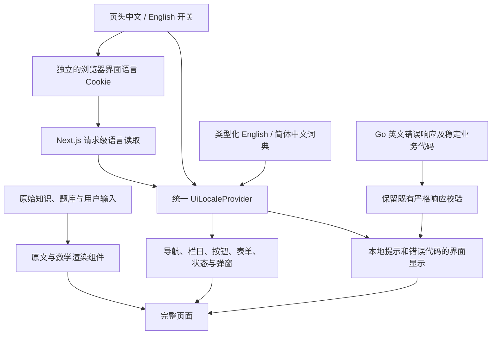

# 网站功能界面中英文切换设计

日期：2026-10-06。状态：用户已确认总体方向；本书面设计待审核，尚未编写执行计划或实施功能。

设计基线：master `610aefff8da3358194a6ec8693f168c0f0cb5a39`。管理员审核例外已在 [PR #34](https://github.com/yyl1212/math_master/pull/34) 交付，设计时该 PR 尚未合并；其管理员自审、责任说明和发布提示也属于本设计的界面文案范围。实施计划须核对届时最新 master 与 PR #34 的集成顺序，保留该权限改动，不在语言任务中代为合并或部署。

## 1. 用户目标与成功标准

用户要求：增加网站中英文语言切换，只切换功能模块的语言，不涉及知识点等数据。已确认推荐方向：支持 English 与简体中文，保留英文默认；页头提供“中文 / English”，当前浏览器记住选择；覆盖前台及后台功能界面。

成功标准是：用户能在任何功能页切换界面语言，刷新和站内导航后保留偏好；功能导航、按钮、表单标签、弹窗、状态、提示及错误信息完整切换；知识和题库仍展示原文；未保存输入、测评答案、审核检查项、登录及待重试操作不因切换而丢失。切换本身不提交表单、不授予权限、不请求重新导入或发布内容。

## 2. 范围与数据边界

| 类别 | 切换规则 |
| --- | --- |
| 页头导航、页脚、固定宣传语、页面功能标题 | 按中英文词典显示；Math Master 品牌名保留 |
| 登录、注册、账户及权限界面 | 标签、帮助、按钮、验证提示切换；用户名、密码及原始角色代码保持 |
| 学习界面 | 功能按钮、解锁/掌握状态标签、空状态和操作提示切换；路线名称、知识标题、题干、选项、答案、解析保持 |
| 知识阅读页面 | “核心陈述、证明、讲解、例题、来源”等固定栏目名称切换；栏目中的正文、来源名称与配图内容保持 |
| 编辑、审核、发布、撤回、题库、反馈、纠错和通知界面 | 模块文案与枚举的显示标签切换；业务枚举值、ID、版本、摘要与实际权限保持 |
| 知识地图的板块和主题名称 | 视作目录数据，沿用现有英文名称与中文对照，不通过界面词典改写 |
| 反馈正文、审核说明、发布理由、通知中引用的用户文字 | 原文显示，不因其恰好与某条界面文案相同而翻译 |
| 公式、SVG、来源、许可、原始 JSON、代码及调试数据 | 原内容保持；外层功能标题可切换 |

已有 `titleZh`、`nameZh` 等字段继续按原有双语展示方式呈现，不将页面语言作为选择或改写数据字段的条件。原始数据、不可变版本、冻结字节、SHA、数值格式及已有日期显示方式保持；本期不做知识翻译、语言版本课程、账号跨设备语言同步或多语言 URL。

允许翻译业务枚举的显示标签，例如 `pending` 显示“待审核”、`reviewer` 显示“审核者”；请求和判分仍使用原代码，不把中文标签写回业务数据。

## 3. 方案选择与架构

采用前端内置类型化词典、统一语言上下文和浏览器偏好 Cookie。当前约 39 个页面路由、79 个界面组件，文案分布在 JSX、状态组件和操作控制器中；只修改页头无法满足完整功能范围。

备选“账号语言偏好”能跨设备同步，但需要后端接口、数据迁移和账号状态同步，超过本次范围。只用 localStorage 无法为服务端首屏提供已选语言，容易在刷新时先出现英文。本方案使用 Cookie，为服务端和浏览器提供同一初始选择，不增加翻译服务或新的运行依赖。

服务端继续处理鉴权与数据获取，不能为了使用语言 Hook 把服务端代码、Go 内网配置或私有请求逻辑放入浏览器。服务端页面的固定标签通过小型 `UiText` 客户端边界使用语言上下文；原数据组件仍按原架构获取和渲染数据。

## 4. 语言偏好与首次渲染

语言代码固定为 `en`、`zh-CN`。无偏好、非法值、重复语言 Cookie 或读取失败时使用英文；不根据 IP、用户身份或浏览器语言自动覆盖用户选择。

偏好 Cookie 名称为 `math_master_ui_locale`，仅存语言代码，`Path=/`、`SameSite=Lax`、有效期一年，HTTPS 下设置 Secure。它不是登录凭据，不使用身份 Cookie 的名称，也不写入 Go 的认证响应。前端独立读写此 Cookie；现有 `selectAuthCookies` 只转发认证 Cookie，Go 的 `privateCookies` 忽略其他名称，认证边界保持。

本期不主动同步其他已打开标签页的界面状态；每个已打开应用保持本页当前选择。新开页面或完整重新加载读取浏览器最近保存的偏好。

Root layout 在请求级读取偏好，并将同一初始值提供给服务端渲染和 Provider，避免水合不一致及已保存中文偏好首屏先出现英文。词典为静态模块，不通过接口下载。禁止全局可变的服务端 locale，避免不同请求之间串语言。

按钮切换仅更新 Provider 和偏好，不调用整页 reload、导航、router.refresh、登录恢复或业务提交。关闭或限制 Cookie 时，当前已打开应用中的选择仍生效；无法持久保存的情况下，下次完整加载按默认英文处理，不影响正常操作。

## 5. 切换时的状态与页面行为

语言 Provider 放在稳定的根位置；语言不得成为表单、单元、工作区、测评、消息列表或认证组件的 React key。切换不重新挂载业务组件，不替换输入值，不触发数据加载 Effect，不改变当前 pathname、查询参数、滚动位置和焦点。

保留密码框中的当前输入、草稿脏状态、题目参数、已选答案、检测尝试 ID、审核检查项、反馈内容、未确认请求的原输入及 Idempotency-Key。现有密码验证弹窗可以随语言更新标题和按钮，但不因切换而验证、关闭或清空；既有真正取消/提交动作的清空规则保持。

语言开关使用原生、可键盘操作的按钮，显示语言自身名称，标明当前选择，并置于表单之外。手机页头可换行但不遮挡导航或账号入口；切换后布局不横向溢出。

`html.lang`、按钮辅助名称和跳转内容链接随界面语言更新；知识数据区保留原语言标记，不能因为界面是中文而把原英文正文假装成中文。来源、原始 JSON 和代码不经过翻译器。

浏览器标签页的固定功能标题也纳入界面词典。每个页面声明稳定的功能标题 key；服务端 metadata 使用同一请求语言，客户端的专用标题组件随 Provider 更新当前功能标题。该组件只管理页面标题，不扫描或替换内容 DOM；知识标题等数据不交给此组件。品牌后缀保持，完整加载及站内导航的标题均需验证。

## 6. 文案、插值与消息状态

采用按模块分组的稳定语义 key，例如 `nav.knowledgeMap`、`content.saveDraft`、`review.administratorSelfReview`。英文词典决定 key 和插值参数类型，中文词典必须完整对应；代码中的动态行号、数量、版本与对象引用使用受控参数，禁止拼接已翻译的半句话。

文本插值按普通 React 文本渲染，不使用 HTML 翻译模板、`dangerouslySetInnerHTML` 或自动遍历 DOM 替换。用户文字不作为 key，不使用“看到英文字符串就替换”的全局机制。

已有成功、失败、确认和重试提示必须随着语言即时更新。操作状态保存 `{key, values}` 或 `{namespace, code, values}`，而不是保存当前语言的翻译结果。用户文字则通过明确的原文显示类型传递，不自动套用系统文案词典。处理边界错误和字典错误时显示当前语言的安全通用提示，不暴露服务器异常。

知识/题库编辑的默认示例文本属于数据，保持原文；“新增知识点”“知识点 1 标题”等控件标签属于界面词典。选择框中的中文标签与其原 value 分离，例如显示“定义”，仍提交 `definition`。

## 7. API 与业务兼容性

Go 错误代码、英文 message、HTTP 状态、认证 Cookie、权限、请求/响应 DTO、来源映射、生成规则、判分和发布事务保持。现有前端错误解析对英文 message 有严格匹配，不改变这层校验，也不要求 Go 因 Cookie 改变响应语言。

已通过验证的错误在展示层按“模块 namespace + code”选择词条。相同 code 在不同模块具有不同说明时保留模块语境；requestId、重试时间及实际对象引用作为原值传递，不拼接未经校验的服务器正文。已有失败结果的英文 message 仍可供契约判断，不用中文覆盖它。

界面语言只是一项外观偏好，不参与身份、角色、审核资格、数学校验、内容筛选或发布状态计算。语言切换不发起业务 POST，不修改持久草稿，也不更新检测或学习记录。

与 PR #34 的兼容检查包括管理员默认全部送审、管理员自审、普通审核者不可自审、责任说明与密码确认提示的双语显示。实施时基于最新 master 整合并回归，不能回退或覆盖已经交付的审核例外。

## 8. 文件与模块职责

| 新增或修改 | 文件/目录 | 职责 |
| --- | --- | --- |
| 新增 | `frontend/src/lib/i18n/config.ts` | 语言类型、Cookie 名称及纯读取/回退规则 |
| 新增 | `frontend/src/lib/i18n/messages/en.ts`、`zh-CN.ts` | 模块词典、参数及键一致性 |
| 新增 | `frontend/src/lib/i18n/server.ts` | server-only 请求语言和 metadata 帮助函数 |
| 新增 | `frontend/src/lib/i18n/provider.tsx`、`ui-text.tsx` | 客户端语言上下文、受控标签及消息渲染 |
| 新增 | `frontend/src/components/language-switch.tsx`、功能标题组件 | 开关、持久偏好和界面语言标记/标题同步 |
| 修改 | `frontend/src/app/layout.tsx`、`site-header.tsx`、`auth-status.tsx` | 首屏、页头、页脚和账号导航 |
| 修改 | `frontend/src/app/` 下功能 metadata；`components/`、`features/` | 覆盖公共阅读、学习、账户、编辑、审核、发布、题库、反馈、纠错及通知的界面文案 |
| 修改 | 现有状态、表单和 command-controls 组件 | 消息 key/错误 code 显示，保留输入和操作状态 |
| 修改 | `frontend/src/styles/` 中页头相关样式 | 中英文长度、键盘焦点及手机布局 |
| 新增/修改 | i18n 单元测试、状态与组件测试、`tests/e2e/` | 覆盖词典、首屏、切换、业务状态、数据不变与权限 |
| 修改 | 总体设计、路线图及操作说明 | 替代旧“首版不增加语言切换”范围约定，记录新规则 |

Go、数据库迁移、知识 JSON、题库包、素材与业务数据 Schema 不在修改范围。实施计划细化实际文件清单及文案登记，不把暂未迁移的模块算作功能完成。

## 9. 覆盖清单与验收

| 检查 | 必须观察的行为 |
| --- | --- |
| 默认与持久选择 | 默认英文；选择中文后刷新、站内导航及新开同站页面保留；非法/重复 Cookie 安全回退 |
| SSR 与水合 | 已保存中文偏好的首屏即中文；无水合差异；不同浏览器请求不串语言 |
| 全模块文案 | 公共页、账户、学习/历史、练习/检测、编辑/草稿阅读、审核/发布/撤回、题库、权限、反馈、纠错、通知的功能词条覆盖完整 |
| 成功/失败/弹窗 | 在成功提示、错误提示及密码验证弹窗打开时切换，文字即时更新，业务状态不变 |
| 未保存输入 | 草稿、题库参数、答案、反馈、审核说明、检查项及待重试请求均保留；切换不调用业务写入 |
| 数据原文 | 以实际冻结阅读/题库夹具，比较标题、正文、证明、例题、选项、解析、来源与 SVG；切换前后 API 字节和内容身份保持 |
| 角色与版本 | 原角色边界、作者规则、CSRF、近期密码验证、expectedRevision/head、摘要及幂等规则仍生效 |
| 无障碍与手机 | 1280×900 与 390×844；键盘开关、辅助名称、html/lang/数据语言标记、功能 title 正确，无横向溢出 |
| 工程回归 | 默认英文保留既有回归；增加中文和双向切换场景；类型检查、生产构建、接口/数据字节保护和相关浏览器回归通过 |

建立“页面/组件 → 词条 → 已验证场景”的覆盖登记：静态 JSX、动态标签、默认消息、空状态、校验帮助、对话框和 metadata 都在范围。用户数据中保留的英文不算漏翻；系统消息遗漏或正文误译都算失败。

每批测试遵循仓库验证器，单次不超过十分钟；Go 验证若作为兼容回归运行，使用 `CGO_ENABLED=0`。仅改设计文档时不重跑产品测试，不以此宣称语言功能已实现。

## 10. 可行性检查与自审结论

| 发现 | 已明确的处理 | 设计结论 |
| --- | --- | --- |
| 服务端与客户端混合渲染 | 请求级 locale + 稳定 Provider + 小型 UiText 边界，鉴权与数据模块留在服务端 | 可落地，不需改 API 或将私有配置客户端化 |
| 认证 Cookie 严格校验 | 偏好用独立名称和前端写入，原选择器只转发身份 Cookie | 已核对现有读取边界，需回归验证其保持 |
| 错误英文 message 严格匹配 | 保留原解析，在显示层用 namespace/code 翻译 | 解决兼容矛盾 |
| 已保存提示可能不随语言变化 | 消息状态存语义 key/错误 code 与参数 | 不产生旧语言消息残留 |
| 页面刷新会丢未保存内容 | 切换只改上下文，不 reload/navigation/refresh，不以 locale 作 key | 有明确保留状态方案 |
| 数据与功能标签交织 | 显式分开 UiText 与原文数据，枚举仅映射显示标签 | 可验证“不涉及数据” |
| 文案覆盖大量页面 | 全模块清单和双语场景覆盖后整体验收 | 一个实施计划分任务完成，不能只交付开关 |
| PR #34 尚未合并 | 实施前核对最新 master 和文案整合顺序，回归管理员自审通路 | 设计可继续；集成顺序在执行计划落实 |

自审已核对占位、范围、内部一致性及歧义：无未确定的语言代码、默认值、保存方式、数据边界或审核权限变更。没有发现需重建数据库、翻译知识数据或新增外部服务才能完成的技术阻塞。后续应在本设计获审核后编写具体执行计划，并选择实施方式，再开发、审查、回归和提交 PR。
