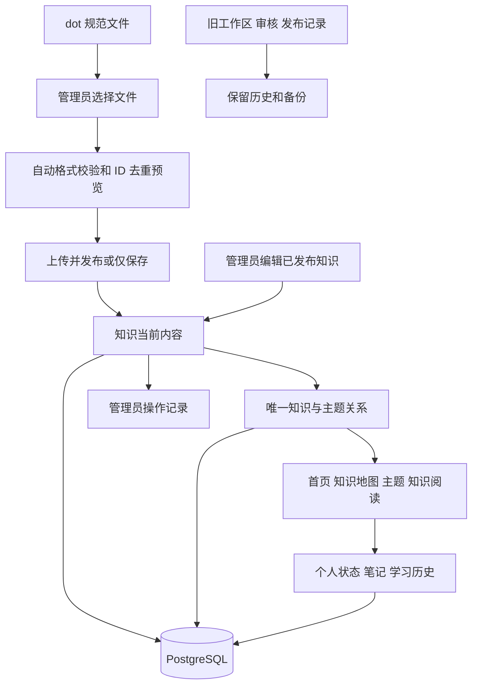

# 管理员知识上传与直接发布重构设计

日期：2026-10-09。状态：本书面设计已于 2026-10-09 经用户确认；实施计划已确认，当前实施中；生产数据尚未修改。

## 用户目标和已确认规则

知识管理只由管理员操作。管理员可以上传 dot 的规范知识文件，直接发布知识，随时手动修正已发布内容；不送审、不复核、不等待第三方批准，不要求管理员管理、选择或发布知识版本。

同一个知识 ID 在同一个主题中只能出现一次，重复导入不创建副份。用户明确这里的 ID 是知识点数据 knowledge_points[].id 的原始值。该规则不按网站生成的内部 ID、来源 ID、标题或推测的数学语义判断。同名但不同数据 ID 的知识可以存在，同一数据 ID 可以关联多个主题；每个主题及其祖先汇总中仅计一次。

源格式采用已交付的 math-master-knowledge-source 1.0：八种主类型、明确的 1–5 级学习难度、具体 MSC 或有理由的其他分类、可追溯来源、无未知占位值。保留源文件中的格式和记录版本属性作为自动处理的来源元数据，它们不成为网站上的版本操作，不参与制造新的知识身份。

此前已经授权移除原 30 个知识点及其学习记录、学习事件和时间。该授权继续有效，执行时使用准确原 ID 清单和最新备份；不清空账户、角色、分类目录或整个数据库。

## 现状和架构选择

master 基线为 6bb2f7693274af3957bce1bebeaa8b28dc637a61。当前发布依赖工作区、送审冻结、复核决定、知识与分类候选以及配对激活。公开阅读和个人学习又依赖准确的旧发布引用。仅删除审核按钮会留下权限、数据和读取方面的依赖。

采用新的管理员当前知识模块，存储一条知识的当前内容、发布状态和主题关系。旧审核、批准和发布记录保留为真实历史，不通过伪造审核决定让新内容穿过旧流程。新业务读取当前知识库，旧知识审核写入口在切换后停用。

继续使用 Next.js、Go 和 PostgreSQL，不引入新的搜索服务、常驻导入集群或业务审批队列。自动格式检查、请求幂等和数据库去重属于上传处理，不产生“待审核”状态。

## 知识身份与去重

规范文件 knowledge_points[].id 是导入知识标识。它原样保存为 external_id，来源 source_id、文件路径、dataset_version 和 version 都不参与判重键。内部知识 ID 只用于网站链接和学习记录，不改变这个原始数据 ID 的唯一性。

每条 external_id 对应一个知识实体。知识和主题采用多对多关系，数据库直接对 external_id + topic_key 建立唯一约束，并通过外键保持它与内部知识实体一一对应。主题代码、项目其他分组使用稳定 topic_key；具体 MSC、板块其他、项目其他不得混淆。祖先和全站统计使用 distinct knowledge_id。

例如数据 id=manes-p4-k007 已在 97F40 中出现，重复上传相同 id 到 97F40 会跳过或报告冲突，绝不新增第二条；关联到另一个合法主题时仍共用同一知识实体。不添加知识语义键，不按标题合并，也不将来源前缀拼入数据 ID 制造副份。

| 输入情况 | 行为 |
| --- | --- |
| 新 ID、合法内容和主题 | 创建一条知识及去重后的主题关系 |
| 同 ID、同主题、已经接收过的内容 | 返回跳过，当前内容和个人记录保持 |
| 同 ID、新主题、内容与当前或已接收的输入一致 | 预览为新增主题关联，不新建知识实体；管理员应用后增加缺失关联 |
| 同 ID、不同来源 | 仍使用同一知识身份；内容一致时保留实际来源信息，不创建副份 |
| 同 ID、从未接收过的不同内容 | 报告 ID 内容冲突；通过编辑已有知识处理，不自动覆盖或改 ID |
| 同文件或跨文件同 ID、同主题重复 | 预览与数据库均去重，不多计知识量 |
| 同标题、不同 ID | 不按标题合并；本次不引入语义去重 |

保存接收过的源内容摘要，用于识别旧文件重传。摘要比较排除纯来源记录版本和数据集版本，主题关系单独处理。管理员手工修正后重新上传旧内容，只跳过旧输入，不恢复旧正文或旧难度。管理员手动移除的主题不能因同一旧输入重放而复活；新的主题关联在预览中单独展示并由本次操作应用。

同 ID 不同内容即使来自不同书，也不能自动加来源前缀创建新知识来绕过冲突。确属不同知识而源 ID 冲突时，由源整理端按明确迁移对照处理，网站不擅自重新编号。

## 管理员页面和操作

统一入口为 /admin/knowledge。合并内容工作区和发布管理，知识审核菜单退出新流程。页面提供知识列表、搜索、主题、难度、发布状态筛选及批量文件上传。

主操作为“上传并发布”；另提供“仅保存”，生成未发布内容。知识状态只有未发布和已发布。管理员可在列表发布未发布知识、下架已发布知识，以及编辑任一当前知识。

上传预览显示新增知识、新主题关联、重复跳过和 ID 冲突的准确数量及定位。合法记录可以按管理员所选范围应用，失败或冲突项不得计入成功。不得把普通错误处理改名为审核流程。

编辑已发布知识时，保存成功后当前内容立即生效，不产生待审副本，不要求重新选择发布版本。编辑未发布知识可以保存或保存并发布。可修改标题、类型、分类、难度、正文、条件、范围、体系、证明、解释、示例和来源说明。

稳定知识身份不随标题、主题或正文修正变化。编辑页面隐藏内部冲突令牌；两位管理员并发编辑时拒绝覆盖较新的内容，并提示刷新后保存。页面不出现版本号、发布候选、冻结摘要、送审编号或分类版本选择。

下架保留知识身份和私人笔记、历史，公开正文不可继续访问。删除操作可移除管理列表中的内容并保留必要操作记录；旧测试数据的学习清理按既有准确范围另行执行，不能作为日常知识编辑的副作用。

## 上传与源格式处理

支持规范 JSON 单文件和浏览器选择多个规范文件；导出 manifest 可用来校验文件字节和记录摘要。每份规范文件最多 100 条、64 MiB；批量文件按文件顺序处理并显示进度，不一次将整个资料库展开到页面。

服务器按固定源规范检查字段类型、重复 JSON 键、无效 Unicode、未知占位、类型、难度范围、证明范围、分类证据与官方代码。接受八种主类型，包括有理由的 other；接受正式目录的板块其他主题和项目其他分组，并分别统计。

没有人工知识审核，没有新增“版权批准”或“数学批准”点击步骤。来源字段必须完整且来自实际资料；源作者或 dot 的评估标记不产生网站用户身份或权限。没有原始资料字节时，服务器保存原始绑定声明，不宣称已重新验证原书或原文件；有证据附件时才可记录实际字节核验结果。本机原资料路径不因上传 JSON 而允许服务器任意读取文件。

新上传接口允许专用的 60 秒上传截止，数据库应用事务使用 8 秒、锁等待 1 秒；普通读取和既有账户请求保留原时限。前端和后端先鉴权再读取大正文，复用有界验证工作槽，不扩数据库连接池。细节由实施计划固定，旧 4/5 秒请求合同不因大文件上传整体放宽。

来源文件中的 version、dataset_version、关联 target_version 是来源证据，不是网站管理员的业务参数。重复判定不按这些数字生成副本。用户操作只面对当前内容，关系链接采用稳定知识 ID。

上传和写入采用当前会话、CSRF 与幂等键。同键同输入重试返回原结果；同键不同输入拒绝。结果不确定时保留准确输入和原键，允许确认或继续导入，不重复创建数据，不假报成功。文件删除、版本目录更新或 dot 的未正式工作稿不自动改变网站内容。

## 数据职责

新增结构由迁移 00013 引入，不修改既有 00001—00012 文件。

| 数据职责 | 结构和约束 |
| --- | --- |
| knowledge_admin_state | 单例的新知识模式与永久能力标记，用于明确切换和回退检查 |
| managed_knowledge | internal_id、全局唯一 external_id、当前内容、发布状态、操作者、创建与更新时间、隐藏写入令牌 |
| managed_knowledge_topics | 知识与稳定主题关系，唯一 external_id + topic_key，并绑定对应内部知识实体；记录主题关联的管理来源 |
| managed_knowledge_sources | 原来源标识、原始绑定、规范输入及已接收摘要，不冒充当前手工修正后的原书文本 |
| managed_knowledge_imports | 管理员导入操作、准确输入、结果及幂等回执；不作为用户版本库 |
| managed_knowledge_events | 真实上传、发布、修正、下架和清理操作记录；无审核决定 |
| 个人学习兼容扩展 | 复用既有用户与知识 ID 所有权；为新知识来源记录明确的内容摘要及事件发生时的主题上下文 |

managed_knowledge 维护当前内容，不建立用户可操作的知识版本表。必要的操作前后证据属于管理员操作记录和备份，不提供版本切换、版本发布或多版本知识选择。

## 权限和旧入口退出

管理员角色直接拥有所有新知识管理操作，不要求同时拥有 editor 或 reviewer。未登录、普通学习者、仅 editor、仅 reviewer 都不能上传、发布、修正、下架或删除知识；后端路由和数据库事务都检查当前身份，不能只隐藏按钮。停用账户、失效会话、强制改密和角色撤销规则继续有效。

原 /editor、知识 /review、/admin/publications 等入口在新模式中引导管理员到知识管理；非管理员拒绝进入管理页面。切换后，旧知识编辑、送审、批准及激活写 API 返回明确的停用结果，防止保留 editor 写通道绕过管理员限制。

本次不撤销普通用户提交反馈、学习和私人笔记的能力；也不向管理员开放他人的私人笔记。人员管理、账户安全和反馈讨论权限按原职责保留。知识反馈所指内容可由管理员直接修正，回复和标记反馈处理结果继续使用反馈功能，不要求知识修正走旧复核计划。

## 公开阅读与个人学习

公开读取只取当前已发布内容。首页、知识地图、主题、知识阅读和检索复习同步采用新知识源，不显示用户版本概念。未发布知识、上传源文件及私有原始绑定不向普通用户或匿名者暴露。

编辑知识保持稳定 ID，学习状态、私人笔记和时间线继续关联。完成状态不会因为修正而自动清空，打开修正内容也不会伪造新的完成事件。已学习者可看到简短的内容已修正提示，并自行复习。

调整主题后，当前主题进度按最新归属自动计算；知识在一个主题或祖先集合中只计一次。历史保存事件发生时的真实上下文和时间，不把旧学习事件改成新正文摘要。新增 managed 内容引用必须与旧冻结引用明确区分；不得用虚构旧版本或旧批准记录表达新内容。

新读取适配需覆盖学习状态、笔记、历史、知识反馈和来源显示，而非只改知识列表。个人数据仍按 owner_user_id 隔离；匿名 GET、SSR 和预加载不写学习记录。

## 接口边界

新增 /api/v3/admin/knowledge 接口组，包含列表、读取、源上传预览、应用导入、创建、当前编辑、发布、下架和删除。预览与应用属于一次管理员操作，不形成审核或发布候选业务实体。

新增当前知识公开读取与管理来源上下文契约，供原页面适配。具体路径和 DTO 在实施计划固定。列表默认 20、最多 100；公开列表不返回整库正文；私人管理完整响应按知识分页，不把大上传内容原样作为响应返回。

旧接口在旧模式中保留原意义；新模式的旧写 API 明确退出。旧合同、既有批准事实、成绩及原资料字节不改写。兼容门禁按本次实际变更精确登记路径和目标摘要，不关闭门禁或自动放行整个目录。

## 文件范围

| 文件或目录 | 变更职责 |
| --- | --- |
| db/migrations/00013_admin_knowledge.sql | 当前知识、唯一关系、幂等与操作记录，以及明确的学习引用兼容扩展 |
| backend/internal/knowledgeadmin/ | 新管理模型、权限、输入校验与服务 |
| backend/internal/store/knowledge_admin_*.go | 当前知识事务、导入、主题、公开读取和操作记录 |
| backend/internal/httpapi/knowledge_admin_*.go | 新接口、鉴权、大小与超时边界 |
| backend/cmd/server/main.go | 注册新路由和模式能力 |
| backend/internal/store/study_*.go、feedback_*.go | 新知识源的状态、笔记、历史和反馈读取适配 |
| api/openapi.yaml | 新管理及当前知识契约；旧合同保持历史语义 |
| frontend/src/app/admin/knowledge/ | 列表、上传、编辑和直接发布页面 |
| frontend/src/features/knowledge-admin/、src/lib/knowledge-admin/ | 界面、客户端、输入与结果协议 |
| frontend/src/features/reading/、catalogue/、study/及导航 | 当前内容、难度与主题展示，退出审核和版本 UI |
| 原 editor、review、publications 页面及代理 | 新模式引导、旧写入口退出 |
| tools/topic-ingest/ | 读取正式规范文件及 ID 去重结果，不改 dot 原资料 |
| ops/deploy.py、verify-deployment.py 及维护入口 | 新能力兼容检查、备份、模式切换和准确旧数据清理 |
| 对应 Go、前端和真实浏览器测试 | 权限、去重、编辑、学习和上线回归 |

表名和目录为本设计的责任划分；实施计划需逐个固定实际文件、签名、DTO 和必要索引，不以通配符作为放行名单。

## 验证要求

- admin-only 账户可完成上传和发布；所有非管理员以及伪造客户端角色均失败。撤销权限后未提交写入不能生效。
- 同 ID 同主题重传、同文件重复、多文件重复、来源变化、源版本变化和并发导入都不创建副份；重复反馈数量准确。
- 同 ID 多主题共用一实体；祖先和全站计数不重复。同标题不同 ID 可存在。同 ID 新正文报告冲突，不自动覆盖人工修正。
- 保存已发布内容即刻被阅读、搜索和主题页面看到；未发布内容不能被普通用户访问。
- 手工修正保留 ID、笔记和学习时间，分类移动不重置状态，管理员不能读取其他用户笔记。
- 标准源八种类型、1–5 难度、具体与其他分类均可用；未知占位、无效代码、错误摘要、无效 Unicode、重复键和危险 Markdown 不能发布。
- 超时结果确认和同键重试不重复知识、主题关系或操作事件；旧文件重放不会撤销人工修正或恢复已手工移除的主题。
- 大文件及网络中断处理有界；上传专用时限不放宽普通账户请求。每批验证不超过 10 分钟，Go 使用 CGO_ENABLED=0。
- 旧审核写通道退出，新公开读取和反馈不依赖伪造批准；原迁移、旧真实批准、账户、角色和无关资料保持。

## 上线与旧 30 个知识点清理

先在本工作区最新 master 的新分支实施，经代码审查、精确兼容检查、回归和 MR 合入，再按已授权网站上线流程部署。生产运行前创建最新一致备份，进行隔离恢复并保留异地副本。

切换管理能力与内容来源必须是明确的维护步骤，不能服务启动即删除数据。知识管理和公开读取准备好后，按已经授权的准确旧 30 个 ID 移除其公开内容和对应测试学习状态、事件、时间及迁入链接；保留账户、角色、正式分类和无关数据。发现超出清单的新知识或关联数据时停止扩大删除范围。

备份和操作记录保留实际旧内容及时间，清理后不得通过旧幂等回执或旧迁入任务自动恢复学习记录。旧审核历史不被伪造或改写。dot 的正式标准数据到位后由管理员上传并直接发布，不自动将本次格式示例作为真实上线内容。

新模式激活后只允许兼容此模式和数据结构的代码回退。健康检查需报告安全的模式和能力状态，缺失结构时停写并保留现场；不通过真实库 down、删除能力标记或清空整库恢复旧界面。

## 可行性审查结论

管理员单角色直接写、稳定 ID、关系唯一约束和当前内容表可在现有技术栈实现。新存储隔离旧冻结审核事实，减少发布操作，同时保留个人数据职责。学习和反馈的引用适配、旧写入口关闭、新模式回退限制已纳入范围，不能作为上线后补项。

当前没有需要新服务、外部数学语义模型或额外人员身份的前置依赖。后续实施计划需将本设计全部边界落实到文件、接口和真实测试；本结论不代表产品代码已实现、测试通过或生产数据已清理。

## 最新上线范围（用户追加要求）

用户在实施中说明正式0013（1,209条）位于Dot云端电脑，并明确下载不到时暂不使用真实数据测试。本次允许以空当前知识库上线新功能，正式数据迁入暂缓；不得以格式示例作为生产内容。原30测试知识的公开移除及其授权学习清理仍按准确清单、最新一致备份、恢复和异地验证执行。永久模式、角色、分类目录和无关数据保护规则不变。

生产验收补充：旧内容前端代理须严格转发 managed 停用的410响应；仅接受 KNOWLEDGE_WORKFLOW_RETIRED 固定错误结构和安全响应头，未知/扩展响应继续失败关闭。新增准确改动范围为 frontend/src/lib/api/content-proxy.ts 及对应测试；原内容正常契约不变。
